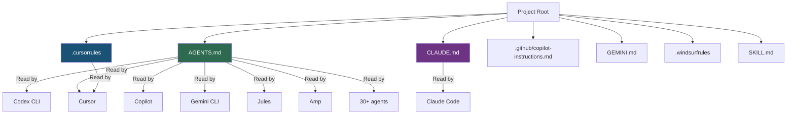
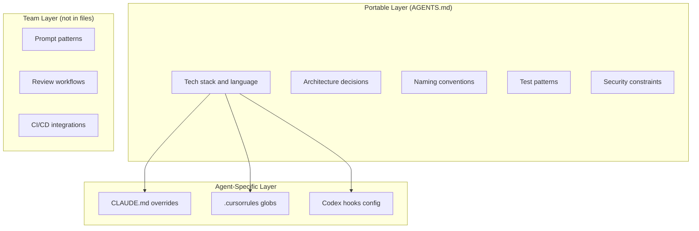

# Project Config Files as Invisible Vendor Lock-In: AGENTS.md, CLAUDE.md, .cursorrules, and the Switching Costs Nobody Talks About


---

Every coding agent now reads a project configuration file. Codex CLI reads `AGENTS.md`. Claude Code reads `CLAUDE.md`. Cursor reads `.cursorrules` (and `.cursor/rules/*.mdc`). Copilot reads `.github/copilot-instructions.md`. Gemini CLI reads `GEMINI.md`. Windsurf reads `.windsurfrules`[^1]. These files are the new `.vscode/settings.json` — except the switching costs they create are far less visible and far more corrosive.

## The Accumulation Problem

A freshly created `AGENTS.md` or `CLAUDE.md` takes minutes to write. A battle-tested one represents months of hard-won institutional knowledge: architecture decisions, naming conventions, test patterns, deployment constraints, and — critically — agent-specific behavioural directives that only make sense in the context of a particular tool's harness[^2].

Research by Gloaguen et al. (2026) across 138 real-world repositories found that developer-written instruction files improve agent task success rates by approximately 4% and reduce agent-generated bugs by 35–55%[^3]. That improvement doesn't come from the file format. It comes from the *content* — and content written for one agent's idiosyncrasies doesn't transfer cleanly to another.

A separate study of 7,310 rules across AI IDE configurations found that the most effective rules encode project-specific constraints rather than generic instructions[^4]. The more specific and effective your rules become, the more tightly they couple to a single agent's behaviour model.

## The Configuration Landscape in Mid-2026



The asymmetry is stark. AGENTS.md, now governed by the Linux Foundation's Agentic AI Foundation (AAIF) since December 2025[^5], has the broadest reach — over 30 agents read it, and more than 60,000 open-source repositories have adopted it[^6]. Claude Code, however, does not read `AGENTS.md` natively. It reads `CLAUDE.md`, full stop[^7]. If your repository only contains `AGENTS.md`, Claude Code ignores it unless you explicitly bridge the gap.

## Three Layers of Invisible Lock-In

### 1. Format Lock-In: The Obvious Layer

This is the layer teams notice first. Different agents expect different filenames. Cursor's `.mdc` files support glob-scoped rules — a capability `AGENTS.md` cannot express[^8]. Claude Code's `CLAUDE.md` supports `@path/to/file` imports for composing instruction chains[^9]. Codex CLI's `AGENTS.md` supports an override hierarchy with `AGENTS.override.md` and configurable `project_doc_max_bytes`[^10]. These are format-level differences, and they're the easiest to bridge.

### 2. Semantic Lock-In: The Dangerous Layer

Agent-specific instructions accumulate naturally. A `CLAUDE.md` that says "use ultrathink for complex refactoring" or "prefer TodoWrite for tracking" encodes Claude Code-specific features. An `AGENTS.md` that sets `approval_policy = "unless-allow-listed"` or references `PreToolUse` hooks encodes Codex CLI-specific governance. Over months, these agent-specific directives become load-bearing walls in your project's knowledge base.

The rule taxonomy study found that 23% of all configuration rules are tool-specific behavioural directives that have no equivalent in competing agents[^4]. Delete them during migration and you lose proven guardrails. Keep them and they become dead weight that confuses the new agent.

### 3. Institutional Lock-In: The Invisible Layer

The deepest lock-in lives not in files but in team habits. Developers learn which prompts work well with their configured agent. Code review workflows assume specific agent behaviours. CI/CD pipelines integrate with agent-specific hooks and approval policies. Switching agents means retraining the team, not just rewriting a markdown file.

## The Bridge Strategies

### Strategy 1: AGENTS.md as Single Source of Truth

The AAIF-recommended approach: maintain one `AGENTS.md` with all cross-tool instructions, and create thin bridge files for agent-specific tools[^11].

For Claude Code, a minimal `CLAUDE.md`:

```markdown
@AGENTS.md

# Claude-Specific Overrides
- Use extended thinking for architectural decisions
- Prefer compact output format
```

For Codex CLI, no bridge is needed — it reads `AGENTS.md` natively. For Cursor, both `AGENTS.md` and `.cursorrules` are read, so tool-specific glob rules go in `.mdc` files whilst shared conventions live in `AGENTS.md`[^12].

### Strategy 2: Codex CLI Fallback Configuration

Codex CLI exposes `project_doc_fallback_filenames` in `~/.codex/config.toml`[^13]:

```toml
# Read CLAUDE.md where no AGENTS.md exists
project_doc_fallback_filenames = ["CLAUDE.md", "COPILOT.md"]
```

The lookup order becomes `AGENTS.override.md` → `AGENTS.md` → fallback names, walked from the Git root down to the working directory. At most one file is picked per directory. The caveat: this setting lives in a per-user file, not in the repository — every team member must configure it independently[^13].

### Strategy 3: The Layered Architecture

For teams committed to multi-agent workflows, a layered approach separates portable from proprietary:



The rule of thumb: if a directive makes sense to a human reading the file without knowing which agent will consume it, it belongs in `AGENTS.md`. If it references a specific agent feature — hooks, approval modes, thinking modes — it belongs in the agent-specific layer.

## Quantifying the Switching Cost

Consider a mature project with 200 lines of `CLAUDE.md` accumulated over six months. Based on the rule taxonomy research[^4], roughly:

- **55%** (110 lines) encode portable project knowledge — architecture, conventions, constraints
- **22%** (44 lines) encode agent-specific behavioural directives — thinking modes, tool preferences, output formatting
- **23%** (46 lines) encode tool-specific features — hook configurations, approval policies, MCP server references

Migrating from Claude Code to Codex CLI means 110 lines transfer directly, 44 lines need rewriting to equivalent Codex concepts, and 46 lines need complete replacement with Codex-native alternatives. That is not a trivial migration, and the 44 rewritten lines will take weeks of iteration to reach the same effectiveness as the originals.

## The AAIF v1.0 Specification: Will It Help?

The AAIF's 2026-2027 roadmap includes AGENTS.md v1.0 — the first stable behavioural specification with goose-based validation tooling[^14]. If adopted broadly, this could reduce format lock-in by standardising how agents discover and parse instruction files. But it won't eliminate semantic or institutional lock-in. A standardised file format doesn't prevent teams from filling it with agent-specific instructions.

The real test will be whether AAIF v1.0 defines *capability namespaces* — a way to mark sections as agent-specific so that other agents can safely ignore them without losing the portable core. Without namespaces, the standard risks becoming the lowest common denominator whilst agent-specific files continue to accumulate switching costs.

## Practical Recommendations for Codex CLI Users

**1. Start with AGENTS.md, always.** Even if you only use Codex CLI today, `AGENTS.md` is the portable default. Your future self — or your successor who prefers a different agent — will thank you.

**2. Isolate agent-specific directives.** Keep Codex-specific configuration in `config.toml`, hooks in the hooks directory, and `requirements.toml` for fleet governance. Reserve `AGENTS.md` for project knowledge that any agent — or any human — would benefit from[^10].

**3. Audit for semantic drift.** Quarterly, review your `AGENTS.md` for directives that have become Codex-specific. Lines like "set reasoning effort to medium for test generation" are Codex idioms, not project knowledge.

**4. Configure fallbacks defensively.** If your team uses multiple agents, set `project_doc_fallback_filenames` in `config.toml` so that Codex CLI can consume `CLAUDE.md` repositories without manual conversion[^13].

**5. Document the switching cost.** Treat your configuration files like technical debt. Track which lines are portable and which are agent-specific. When evaluating a tool switch, the migration cost is proportional to the agent-specific lines, not the total line count.

## The Broader Pattern

Project configuration files are following the same trajectory as IDE settings, CI configurations, and container orchestration files before them. Early fragmentation gives way to a dominant standard (AGENTS.md is clearly winning the format war), but semantic lock-in persists long after format convergence. The `.vscode/settings.json` of 2016 gave way to `.editorconfig`, but teams still accumulate VS Code-specific workspace settings alongside the portable file.

The winning strategy is the same one that worked for those earlier waves: treat the portable layer as the source of truth, keep agent-specific configuration minimal and clearly separated, and accept that some switching cost is the price of using any tool effectively. The teams that treat their `AGENTS.md` as living documentation — and resist the temptation to encode every agent trick they discover — will retain the most optionality in a market that is still consolidating rapidly[^15].

---

## Citations

[^1]: Deploy HQ, "CLAUDE.md, AGENTS.md & Copilot Instructions: Configure Every AI Coding Assistant," 2026. [https://www.deployhq.com/blog/ai-coding-config-files-guide](https://www.deployhq.com/blog/ai-coding-config-files-guide)

[^2]: Morphllm, "AGENTS.md Spec (2026): Recommended Sections + AGENTS.md vs CLAUDE.md vs .cursorrules," 2026. [https://www.morphllm.com/agents-md-guide](https://www.morphllm.com/agents-md-guide)

[^3]: Gloaguen et al., "On the Impact of AGENTS.md Files on the Efficiency of AI Coding Agents," arXiv:2601.20404, 2026. [https://arxiv.org/abs/2601.20404](https://arxiv.org/abs/2601.20404)

[^4]: "Rule Taxonomy and Evolution in AI IDEs: A Mining and Survey Study," arXiv:2606.12231, 2026. [https://arxiv.org/abs/2606.12231](https://arxiv.org/abs/2606.12231)

[^5]: Linux Foundation, "Linux Foundation Announces the Formation of the Agentic AI Foundation (AAIF)," December 2025. [https://www.linuxfoundation.org/press/linux-foundation-announces-the-formation-of-the-agentic-ai-foundation](https://www.linuxfoundation.org/press/linux-foundation-announces-the-formation-of-the-agentic-ai-foundation)

[^6]: OpenAI, "OpenAI co-founds the Agentic AI Foundation under the Linux Foundation," 2025. [https://openai.com/index/agentic-ai-foundation/](https://openai.com/index/agentic-ai-foundation/)

[^7]: Agyn.io, "AGENTS.md vs CLAUDE.md: Does Claude Code or Codex Read Both?" 2026. [https://agyn.io/blog/claude-md-agents-md-compatibility](https://agyn.io/blog/claude-md-agents-md-compatibility)

[^8]: Codersera, "AGENTS.md vs CLAUDE.md vs Cursor Rules vs Copilot (2026)," 2026. [https://codersera.com/blog/agents-md-vs-claude-md-vs-cursor-rules-comparison-2026/](https://codersera.com/blog/agents-md-vs-claude-md-vs-cursor-rules-comparison-2026/)

[^9]: Yurukusa, "Does Claude Code read AGENTS.md? — Import and symlink methods," GitHub Gist, 2026. [https://gist.github.com/yurukusa/d36197848911f025add142abefcde685](https://gist.github.com/yurukusa/d36197848911f025add142abefcde685)

[^10]: OpenAI, "Custom instructions with AGENTS.md," Codex documentation, 2026. [https://developers.openai.com/codex/guides/agents-md](https://developers.openai.com/codex/guides/agents-md)

[^11]: Agentic AI Foundation, AAIF public roadmap, 2026. [https://www.linuxfoundation.org/press/linux-foundation-announces-the-formation-of-the-agentic-ai-foundation](https://www.linuxfoundation.org/press/linux-foundation-announces-the-formation-of-the-agentic-ai-foundation)

[^12]: The Prompt Shelf, "AGENTS.md vs CLAUDE.md: 5 Key Differences You Need to Know (2026)," 2026. [https://thepromptshelf.dev/blog/agents-md-vs-claude-md/](https://thepromptshelf.dev/blog/agents-md-vs-claude-md/)

[^13]: Ofox.ai, "Codex CLI config.toml: Every Key Explained," 2026. [https://ofox.ai/blog/codex-cli-config-toml-deep-dive/](https://ofox.ai/blog/codex-cli-config-toml-deep-dive/)

[^14]: AAIF, "2026-2027 Roadmap: AGENTS.md v1.0 specification," 2026. [https://www.linuxfoundation.org/press/linux-foundation-announces-the-formation-of-the-agentic-ai-foundation](https://www.linuxfoundation.org/press/linux-foundation-announces-the-formation-of-the-agentic-ai-foundation)

[^15]: arcbjorn, "State of CLI Coding Agents, Mid-2026," 2026. [https://blog.arcbjorn.com/state-of-cli-coding-agents-2026](https://blog.arcbjorn.com/state-of-cli-coding-agents-2026)
