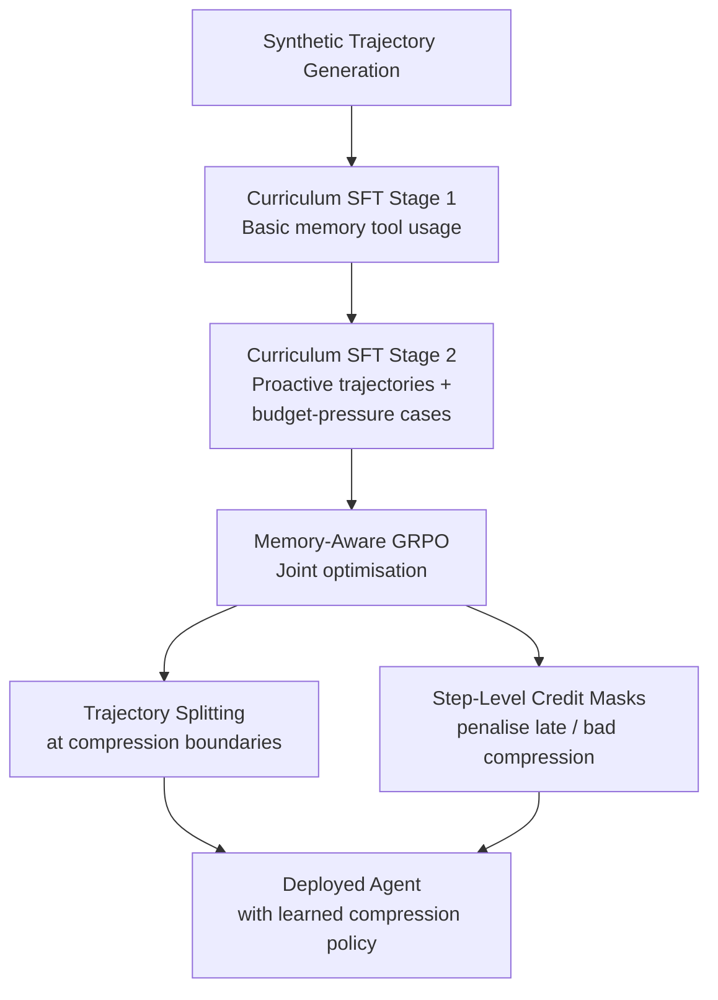
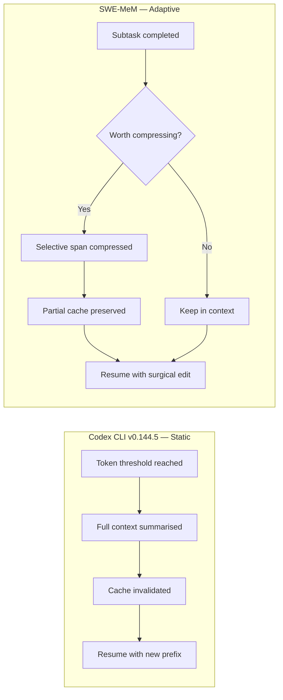

# SWE-MeM and the Case for Learned Compaction: What Adaptive Memory Management Means for Codex CLI Sessions


---

Every long-running Codex CLI session faces the same cliff: the context window fills up, compaction fires, the prefix cache invalidates, and costs spike. The current state of the art — a fixed token threshold that triggers a single summarisation pass — is effective but blunt. A new training framework called **SWE-MeM** demonstrates that agents can learn *when, what, and how much* to compress, achieving higher resolve rates with lower total token consumption than any static compression strategy tested [^1]. This article examines SWE-MeM's architecture, benchmarks it against existing approaches, and maps its insights onto Codex CLI's compaction configuration.

## The Compaction Problem in Practice

Codex CLI's auto-compaction is threshold-based. When accumulated tokens exceed `model_auto_compact_token_limit` (default: 200,000 tokens), the runtime calls the `/responses/compact` endpoint, which summarises the conversation into a shorter prefix [^2]. The new prefix replaces the old one, and the session continues.

This works, but it has three well-documented costs:

1. **Cache invalidation.** Compaction changes the prefix, destroying the prompt cache. At an 85% cache hit rate, a single compaction on a 125,000-token context costs roughly \$0.40 — equivalent to 21 follow-up turns at cached rates [^3].
2. **Information loss.** Static summarisation treats all trajectory steps equally. Lengthy execution logs and irrelevant file reads receive the same compression weight as critical code inspections performed early in the session [^1].
3. **Cascading compaction.** If the threshold is set too low relative to essential context, the summary itself can exceed the threshold, triggering an immediate second compaction [^2].

The TraceLab workload study of 350,000 LLM steps confirmed the scale of the problem: compaction occurs in 18.4% of Codex sessions, prefix tokens account for 59.5% of total cost despite a 10× cache discount, and the average prefill amplification factor is 5.3× [^4].

## SWE-MeM: Training Agents to Manage Their Own Memory

SWE-MeM, published by Gao, Zeng, Yu, Wangni, Wang, Cai, He, and Lyu on 30 June 2026 [^1], replaces the fixed threshold with a **learned compression policy**. The agent receives a memory tool with the following signature:

```python
compress(analysis, start_step, end_step, content, remaining_work)
```

The agent selects a span `[start_step, end_step]` of its own trajectory, replaces it with a summary, and appends a note of remaining work. This preserves temporal ordering whilst reducing context length. Crucially, the agent decides *when* to invoke the tool — it can compress proactively after completing a subtask, not just reactively when budget runs out.

### Memory-Aware GRPO

The training pipeline has two stages:

1. **Curriculum supervised fine-tuning (SFT).** Synthetic trajectories with proactive memory actions teach the model basic tool usage. A context monitor triggers compression via budget pressure (remaining budget < 20%), subtask completion, low-information density, or focus degradation assessed by an LLM judge [^1].
2. **Memory-aware Group Relative Policy Optimisation (GRPO).** This reinforcement learning phase jointly optimises memory management and issue resolution through two mechanisms:

   - **Trajectory splitting:** Rollouts are split at compression points. Each sub-trajectory starts from the exact compressed prefix the agent would observe at inference, maintaining training-inference consistency [^1].
   - **Step-level credit masks:** Rather than using only final outcomes, masks identify problematic steps — memory actions with inappropriate compression ratios, late compression in otherwise successful trajectories, and overflow failures [^1].



### Benchmark Results

On SWE-Bench Verified with a 32K context budget [^1]:

| Method | Model | Resolve Rate | Token Usage (vs ReAct) |
|--------|-------|-------------|----------------------|
| ReAct (no compression) | Qwen3-30B | Baseline | 100% |
| Threshold-Compression | Qwen2.5-32B | 53.8% | 203.9% |
| Context Folding | Seed-OSS-36B | 58.0% | Not reported |
| **SWE-MeM (RL)** | **Qwen3-30B** | **60.2%** | **94.7%** |
| **SWE-MeM (RL)** | **Qwen3-4B** | **43.4%** | — |

Two findings stand out. First, threshold-based compression doubles total token usage despite reducing peak context — compacted summaries are expensive to generate and then re-read. Second, SWE-MeM achieves the highest resolve rate whilst using *fewer* total tokens than the uncompressed baseline.

The ablation studies confirm that both proactive triggering and selective span compression contribute independently: removing proactive triggers drops performance from 60.2% to 57.4%, and replacing selective spans with full-trajectory compression drops it to 57.6% [^1].

## Complementary Research: Self-GC and the Proprioceptive Dashboard

SWE-MeM is not the only recent work challenging static compaction. **Self-GC** (Self-Governing Context), published in July 2026 by Hao, Meng, Yin, Zhu, and Cao, treats context objects as garbage-collectible entities with lifecycle semantics [^5]. On a 33-session hard set, Self-GC prunes 43.95% of prefix tokens whilst leaving 84.85% of future continuations unaffected — and on a 332-session production-derived suite, three planner backbones reach no-impact rates of 91–95%, against 78–87% for heuristic baselines [^5].

The **Proprioceptive Dashboard** approach (arXiv:2606.30005) takes a different tack entirely, providing agents with a real-time token budget display that elicits self-managed context decisions without any additional training [^6]. These three approaches — learned policy (SWE-MeM), structured lifecycle (Self-GC), and emergent self-management (Proprioceptive Dashboard) — represent converging evidence that heuristic compaction is a solved problem waiting for better tooling.

## Mapping SWE-MeM Insights to Codex CLI Configuration

Codex CLI v0.144.5 does not yet ship a learned compression policy, but its configuration surface already supports several of SWE-MeM's core principles.

### 1. Raise the Threshold, Compact Less

SWE-MeM's key finding is that *avoiding* unnecessary compaction matters more than reducing peak context. In Codex CLI terms, this means setting `model_auto_compact_token_limit` as high as your model's context window allows (up to 90% of `model_context_window`) [^2]:

```toml
# config.toml — maximise cache-friendly headroom
model_context_window = 200000
model_auto_compact_token_limit = 180000  # 90% ceiling
```

### 2. Scope the Threshold to Body Growth

The `model_auto_compact_token_limit_scope` parameter controls whether the threshold counts the full context (`total`, the default) or only growth after the compaction prefix (`body_after_prefix`) [^7]. The latter mirrors SWE-MeM's selective span compression — it lets the system prompt and tool definitions persist without counting against the compaction budget:

```toml
model_auto_compact_token_limit_scope = "body_after_prefix"
```

### 3. Cap Tool Output to Reduce Compression Pressure

SWE-MeM's analysis shows that lengthy execution logs are prime compression targets. Rather than compressing them after the fact, `tool_output_token_limit` caps them at source [^4]:

```toml
tool_output_token_limit = 16000  # prevent log floods
```

### 4. Use Named Profiles for Session-Type Routing

Short, exploratory sessions rarely need compaction; long refactoring sessions almost always do. Named profiles let you tune compaction strategy per workflow [^8]:

```toml
[profile.explore]
model_auto_compact_token_limit = 180000

[profile.refactor]
model_auto_compact_token_limit = 120000
model_auto_compact_token_limit_scope = "body_after_prefix"
tool_output_token_limit = 8000
```

### 5. Stack with Cache-Friendly Service Tiers

Compaction's biggest cost is cache invalidation. The `service_tier = "flex"` option trades latency for a 90% cached-input discount, partially offsetting the cache reset [^3]:

```toml
service_tier = "flex"
```



## What Would a SWE-MeM Integration Look Like?

A practical path from research to Codex CLI integration might include:

- **A `compress` tool in the Responses API** that accepts span boundaries rather than summarising the entire context. This would let the model make surgical compression decisions mid-session.
- **Proactive compression hooks** — a `PreCompaction` event in the hook lifecycle, analogous to `PreToolUse`, letting AGENTS.md encode domain-specific compression policies (e.g. "never compress database schema inspections").
- **Compression-aware cache management** — if the runtime knows which spans are being compressed, it can preserve the stable prefix and only invalidate the replaced segment, maintaining partial cache hits.

None of these require changes to the underlying model. SWE-MeM's curriculum SFT and Memory-aware GRPO train compression behaviour into the agent itself — the runtime only needs to expose the right tool surface.

## Practical Takeaways

1. **Total token cost matters more than peak context.** Threshold-based compression can double total token usage (203.9% of baseline) whilst *reducing* resolve rates [^1]. Tune `model_auto_compact_token_limit` as high as feasible.
2. **Proactive compression outperforms reactive.** Compressing after subtask completion, when the agent knows what's expendable, beats waiting for budget exhaustion. Structure AGENTS.md to encourage agents to break work into clearly bounded subtasks.
3. **Selective span compression preserves critical context.** Early code inspections often remain relevant throughout a session. The `body_after_prefix` scope in Codex CLI is a step in this direction — use it for sessions with large, stable system contexts.
4. **Cache invalidation is the hidden compaction tax.** Every compaction resets the prefix cache. For long sessions, fewer, larger compressions are cheaper than frequent small ones.
5. **The research consensus is converging.** SWE-MeM, Self-GC, and the Proprioceptive Dashboard all point the same way: agents should manage their own context, not rely on fixed thresholds. Expect Codex CLI's compaction to evolve accordingly.

## Citations

[^1]: Gao, S., Zeng, W., Yu, Z., Wangni, J., Wang, C., Cai, K., He, S., & Lyu, M.R. (2026). "SWE-MeM: Learning Adaptive Memory Management for Long-Horizon Coding Agents." arXiv:2606.28434. [https://arxiv.org/abs/2606.28434](https://arxiv.org/abs/2606.28434)

[^2]: OpenAI. (2026). "Codex CLI Configuration Reference — model_auto_compact_token_limit." [https://developers.openai.com/codex/config-reference](https://developers.openai.com/codex/config-reference)

[^3]: Vaughan, D. (2026). "Prompt Caching in Codex CLI: How the Agent Loop Stays Linear and How to Maximise Cache Hits." Codex Knowledge Base. [https://codex.danielvaughan.com/2026/04/21/codex-cli-prompt-caching-maximise-cache-hits-cost-reduction/](https://codex.danielvaughan.com/2026/04/21/codex-cli-prompt-caching-maximise-cache-hits-cost-reduction/)

[^4]: Zhu, Z., Jacob, A., Ma, X., Pan, H., Wang, W., Krishnamurthy, A., & Kasikci, B. (2026). "TraceLab: Characterizing and Optimizing LLM Coding Agent Workloads." arXiv:2606.30560. [https://arxiv.org/abs/2606.30560](https://arxiv.org/abs/2606.30560)

[^5]: Hao, X., Meng, H., Yin, X., Zhu, J., & Cao, C. (2026). "Self-GC: Self-Governing Context for Long-Horizon LLM Agents." arXiv:2607.00692. [https://arxiv.org/abs/2607.00692](https://arxiv.org/abs/2607.00692)

[^6]: (2026). "LLM Agents Are Latent Context Managers: Eliciting Self-Managed Context via a Proprioceptive Dashboard." arXiv:2606.30005. [https://arxiv.org/abs/2606.30005](https://arxiv.org/abs/2606.30005)

[^7]: OpenAI. (2026). "Codex CLI Advanced Configuration — model_auto_compact_token_limit_scope." [https://developers.openai.com/codex/config-advanced](https://developers.openai.com/codex/config-advanced)

[^8]: OpenAI. (2026). "Codex CLI Sample Configuration." [https://developers.openai.com/codex/config-sample](https://developers.openai.com/codex/config-sample)
