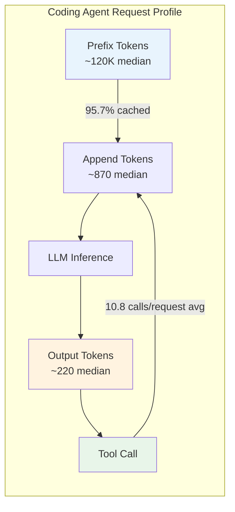
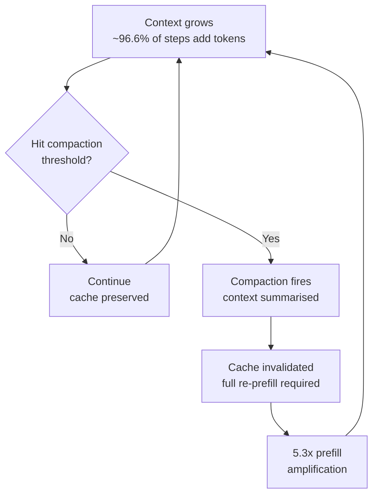

# TraceLab and the Anatomy of a Coding Agent Workload: What 350,000 LLM Steps Reveal About Prefix Caching, Compaction, and Token Budgets — and How to Tune Your Codex CLI Accordingly


---

Every time you run a Codex CLI session, your terminal becomes one node in a remarkably specific class of LLM workload — one that looks nothing like chatbot traffic. Zhu, Jacob, Ma, Pan, Wang, Krishnamurthy, and Kasikci have now quantified exactly how different it is. Their paper, *TraceLab: Characterizing Coding Agent Workloads for LLM Serving* (arXiv:2606.30560, June 2026), releases a trace of approximately 4,265 sessions from 43 developers using Claude Code and Codex across 23 model versions over nine months [^1]. The dataset contains roughly 350,000 LLM steps and 432,510 tool calls — the first public corpus of real, day-to-day coding agent usage suitable for serving-system analysis [^1].

This article unpacks TraceLab's key findings, explains what they mean for the infrastructure underneath your Codex CLI sessions, and maps each finding to configuration knobs you can turn today.

## The Shape of a Coding Agent Workload

TraceLab identifies four defining characteristics that separate coding agent traffic from conversational LLM traffic [^1]:

1. **Long autonomous loops** — agents execute multi-step tool chains before returning to the user
2. **Long context, short output** — median prefix tokens exceed 116K whilst median output tokens sit at 184–252 [^1]
3. **Diverse, heavily-tailed tool calls** — the top three tools account for over 80% of invocations, but the long tail matters [^1]
4. **High but imperfect prefix cache hit rates** — 95.7% token-weighted overall, but only 84.4% on user-initiated steps [^1]



The two-orders-of-magnitude asymmetry between prefix and append tokens is the single most important insight. It means that in a well-cached session, the serving system is not re-computing 120K tokens of attention — it is retrieving cached KV state and computing only the ~870 fresh append tokens per step [^1].

## The Cost Breakdown You Should Know

TraceLab's cost analysis reveals a counterintuitive distribution [^1]:

| Category | Share of Total Cost |
|---|---|
| Prefix tokens (cached) | 59.5% |
| Append tokens (fresh input) | 29.2% |
| Output tokens | 11.2% |

Despite a 10× price discount on cached input tokens versus fresh input, prefix tokens still dominate spend because the sheer volume is so large [^1]. This inverts the common assumption that output tokens drive cost. For Codex CLI users, the implication is clear: **controlling context growth is the highest-leverage cost reduction available**.

## Prefix Cache Hit Rates: Where the 5% Miss Hurts

The overall 95.7% token-weighted cache hit rate sounds excellent. But TraceLab exposes a critical gap: user-initiated steps — the turns where you type a new prompt — hit only 84.4%, compared with 97.5% for tool-result steps [^1]. The difference is human thinking time. When you pause for more than a few minutes, the prefix cache on the server side may evict your session's KV state.

TraceLab calculates that retaining prefix cache entries across 5-minute human thinking gaps would reduce costs by 12.8% and cut append tokens by 45.9% [^1]. This is a serving-system optimisation that OpenAI controls, not the end user — but understanding it explains why rapid, focused sessions are cheaper than intermittent ones.

### Prefill Amplification

TraceLab introduces the concept of *prefill amplification*: the ratio of total tokens prefilled to the fresh tokens that actually needed computing. The measured value is 5.3× [^1], meaning that even with caching, the system processes over five times more token volume than the genuinely new content. This amplification is driven by the 3.4–9.6% of steps where a cache miss forces a full re-prefill of the entire context [^1].

## Compaction Events Under the Microscope

Context compaction — where Codex CLI summarises the conversation history to fit within the context window — occurs in 9.7% of sessions overall [^1]. But the rate differs significantly between agents:

- **Codex:** 18.4% of sessions undergo at least one major compaction (>64K token reduction) [^1]
- **Claude Code:** 4.5% of sessions [^1]

Each compaction event destroys the prefix cache because the summarised content has different token sequences from the original. Post-compaction, the next step must re-prefill from scratch [^1].



## Tool Call Patterns

The top three tools by frequency reveal the core loop [^1]:

**Codex CLI:** `exec_command`, `write_stdin`, `apply_patch`
**Claude Code:** `Bash`, `Read`, `Edit`

Tool latency is heavily tailed: calls exceeding one minute represent just 4% of invocations but consume 85% of total tool time [^1]. This means a single slow build command or test suite execution dominates the wall-clock time of a request.

TraceLab also identifies an 18.6% overhead gap in Codex between end-to-end request time and internal execution time [^1], suggesting that LLM-tool switching itself has non-trivial cost.

## Session Dynamics

The temporal profile of a coding session is dominated by human thinking time:

- **Human thinking time:** 92.3% of elapsed session time [^1]
- **Mean session duration:** 8.2 hours (but median only 5.1 minutes) [^1]
- **Average request response time:** 4.3 minutes (median 38.3 seconds) [^1]

The enormous gap between mean and median session duration reveals a bimodal pattern: most sessions are brief investigatory interactions, but a long tail of extended sessions — likely goal-mode or complex refactoring tasks — drives the mean up.

## Mapping Findings to Codex CLI Configuration

TraceLab's findings translate directly into actionable Codex CLI tuning. Here is a configuration template informed by the paper's data:

```toml
# ~/.codex/config.toml — TraceLab-informed tuning

# 1. Compaction threshold: avoid premature compaction
#    TraceLab shows compaction destroys cache and triggers 5.3x prefill amplification.
#    Set high enough to avoid unnecessary compaction, but low enough to prevent
#    context window exhaustion.
model_auto_compact_token_limit = 120000

# 2. Compaction scope: count only growth after prefix
#    Reduces false-trigger compactions when the stable prefix is large.
model_auto_compact_token_limit_scope = "body_after_prefix"

# 3. Tool output budget: cap the long-tail token bloat
#    TraceLab shows 85% of tool time comes from 4% of calls — these also
#    produce the largest outputs. Capping prevents context blowout.
tool_output_token_limit = 12000

# 4. Service tier: use flex for cache-friendly batch workloads
#    TraceLab's 95.7% cache hit rate means most compute is cheap retrieval.
#    Flex tier stacks a further discount on cached tokens.
service_tier = "flex"
```

### Profile-Based Routing

TraceLab's finding that short investigatory sessions differ fundamentally from long autonomous loops suggests routing by session type:

```toml
# ~/.codex/profiles/investigate.config.toml
# Short, cache-friendly exploration sessions
model = "o4-mini"
service_tier = "flex"
model_auto_compact_token_limit = 80000

# ~/.codex/profiles/build.config.toml
# Long autonomous sessions where compaction is likely
model = "o3"
service_tier = "flex"
model_auto_compact_token_limit = 160000
tool_output_token_limit = 8000  # tighter cap to delay compaction
```

Switch at the command line:

```bash
# Quick investigation — optimised for cache hits
codex --profile investigate "explain what this function does"

# Long build task — optimised for compaction avoidance
codex --profile build "refactor the authentication module to use OAuth 2.1"
```

## The Serving-Side Frontier

TraceLab proposes four serving-system optimisations that sit below the application layer [^1]:

1. **Denser tool calling** — batching multiple tool calls into a single LLM step to amortise switching overhead
2. **Append-length-aware prefill routing** — 90%+ of steps append fewer than 1K tokens, but the rare 10K+ append steps contribute over 70% of append token volume [^1]. A smart router could use different prefill strategies based on expected append length.
3. **Semantic tool latency prediction** — predicting which tool calls will be slow (tests, builds) to make better KV cache eviction decisions during the wait
4. **Human-gap-aware cache retention** — keeping KV state during the 5-minute thinking gaps that dominate 92.3% of session time [^1]

These are not configuration changes you can make today — they are research directions for serving infrastructure. But they explain why coding agent workloads are a distinct serving challenge, and why the LLM inference stack is likely to evolve specifically for agentic patterns.

Related work reinforces this trajectory: *Leyline* (arXiv:2606.01065, June 2026) proposes declarative KV cache directives for policy-driven editing of cached state [^2], and *SMetric* (arXiv:2607.08565, July 2026) introduces session-centric scheduling that balances latency across multi-turn agent sessions rather than optimising individual requests [^3].

## Practical Takeaways

1. **Context size is your largest cost driver** — not output tokens. TraceLab's 59.5% prefix cost share means that every kilobyte of unnecessary context you allow into the conversation is costing you, even with 90% caching discounts.

2. **Compaction is expensive** — each compaction event destroys your prefix cache and triggers a full re-prefill. Delay it by capping tool output, using `body_after_prefix` scope, and splitting long tasks into separate sessions rather than one marathon run.

3. **Short, focused sessions are cheaper** — the 84.4% cache hit rate on user-initiated steps versus 97.5% on tool steps means your thinking pauses are the most expensive part of the session. If you need to think for 10 minutes, consider starting a new session rather than letting the cache evict.

4. **The flex tier stacks with caching** — OpenAI's prompt caching discount applies a 90% reduction on cached input tokens [^4], and the flex tier adds a further discount. For the 95.7% of tokens that hit cache, this is substantial.

5. **Profile your sessions** — use `codex --profile` to route investigatory queries through cheap models and long builds through high-capability models with tighter tool output caps.

## Citations

[^1]: Zhu, K., Jacob, M., Ma, C., Pan, Y., Wang, S., Krishnamurthy, A., & Kasikci, B. (2026). *TraceLab: Characterizing Coding Agent Workloads for LLM Serving*. arXiv:2606.30560. [https://arxiv.org/abs/2606.30560](https://arxiv.org/abs/2606.30560)

[^2]: Ma, B., Eitzinger, J., & Köstler, H. (2026). *Leyline: KV Cache Directives for Agentic Inference*. arXiv:2606.01065. [https://arxiv.org/abs/2606.01065](https://arxiv.org/abs/2606.01065)

[^3]: Li, Y. et al. (2026). *SMetric: Rethink LLM Scheduling for Serving Agents with Balanced Session-centric Scheduling*. arXiv:2607.08565. [https://arxiv.org/abs/2607.08565](https://arxiv.org/abs/2607.08565)

[^4]: OpenAI. (2026). *Prompt Caching in Codex CLI*. OpenAI Developer Documentation. [https://developers.openai.com/codex/config-advanced](https://developers.openai.com/codex/config-advanced)
