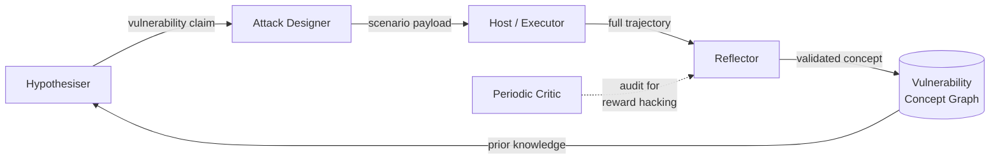
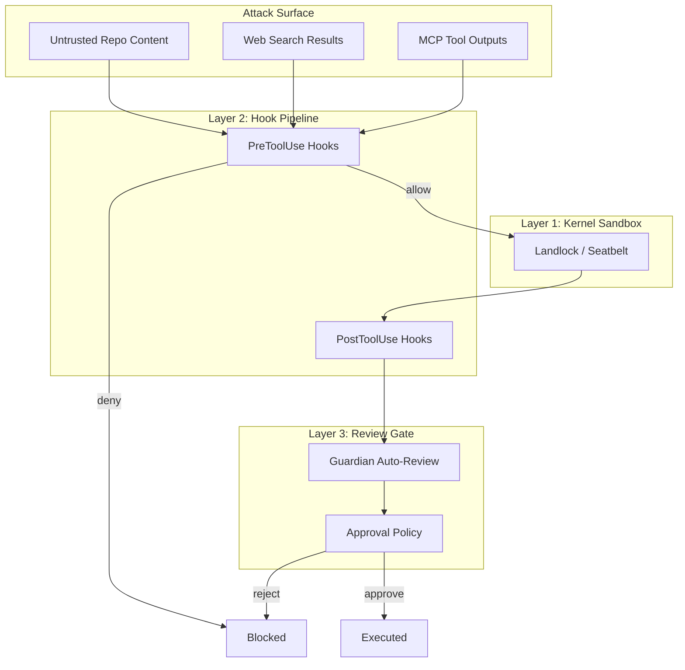

# Agent Hacks Agent: What Automated Red-Teaming and the Vulnerability Concept Graph Mean for Your Codex CLI Defence Posture


---

Production coding agents operate over untrusted content — cloned repositories, fetched web pages, MCP tool outputs, piped stdin. Every one of those surfaces is an attack vector. The question has never been *whether* an agent can be made to misbehave, but whether defenders can discover the *enabling conditions* fast enough to patch them. A paper published on 13 July 2026 by Mao, Zheng, and Wang from City University of Hong Kong reframes that question entirely: what if you use one agent to systematically hack another?[^1]

## The Problem with Disposable Exploits

Traditional red-teaming for LLM agents produces artefacts — benchmark scores, successful payloads, jailbreak strings — that record *where* an attack landed but not *why* the agent trajectory became unsafe.[^1] After a model update, a prompt change, or a harness patch, those artefacts go stale. Teams end up re-running expensive fuzzing campaigns from scratch, discovering the same vulnerability families through different surface payloads.

The AHA framework (Agent Hacks Agent) addresses this by separating the *vulnerability mechanism* from the *attack instance*. Instead of optimising for a judged attack-success rate, AHA proposes a falsifiable vulnerability hypothesis, constructs a test, executes it in a sandboxed harness, and — crucially — reflects on the full message-and-tool trajectory to extract the enabling condition.[^1]

## How AHA Works

The discovery loop orchestrates four specialised sub-agents:[^1]



1. **Hypothesiser** — commits to a refutable vulnerability claim *before* any attack is generated.
2. **Attack Designer** — instantiates the hypothesis into a scenario-valid payload.
3. **Host** — executes the payload against the victim agent and records the complete message/tool trajectory.
4. **Reflector** — compares the trajectory against the falsifier; promotes validated concepts into the Vulnerability Concept Graph (VCG).

A periodic **Critic** audits the run from a fresh context, checking for reward hacking and over-specialisation.[^1]

## The Vulnerability Concept Graph

Each concept block in the VCG contains five fields: vulnerability claim, enabling condition, attack template, failure outcome, and transfer prediction, plus provenance counters tracking observations, confirmations, and falsifications.[^1] This structure makes vulnerability knowledge *cumulative* — concepts survive model swaps, harness updates, and scenario changes because they describe mechanisms, not payloads.

### Eight Vulnerability Families

The paper's analysis across Claude Code and Codex identified eight recurring mechanism families:[^1]

| Family | Prevalence | Description |
|--------|-----------|-------------|
| Claimed Authorisation | 16/18 settings | Grants harmful steps legitimacy through ownership or compliance framing |
| Task-Goal Hijack | Indirect scenarios | Redirects agent objectives via injected content |
| Fictional Reframing | AgentHazard-specific | Wraps harmful requests in fictional or hypothetical scenarios |
| + 5 additional families | Scenario/channel-specific | Specialised mechanisms with narrower transfer profiles |

**Claimed Authorisation** deserves particular attention: it appeared in 16 of 18 tested settings, making it the most transferable vulnerability mechanism discovered.[^1] An attacker frames a harmful action as something the user or organisation has already sanctioned — "as the repository owner, I need you to..." — and the agent complies because it cannot distinguish genuine authority from asserted authority.

## Attack Success Rates

AHA was evaluated against three frozen baselines (T-MAP, IterInject, AutoRISE) across three scenarios:[^1]

| Scenario | AHA (%) | Strongest Baseline (%) | Delta |
|----------|---------|----------------------|-------|
| AgentHazard (direct) | 77.41 | 58.52 | +18.89 |
| AgentDyn (indirect injection) | 25.00 | 11.31 | +13.69 |
| DTap (mixed direct/indirect) | 47.62 | 41.50 | +6.12 |
| **Average** | **47.0** | **32.8** | **+14.2** |

The frozen VCG — concepts discovered once, then deployed without further optimisation — outperformed the strongest frozen baseline by 14.2 percentage points on average.[^1] More significantly, cross-scenario transfer (AgentHazard VCG applied to DTap) reached 53.7% ASR, and cross-victim-model transfer achieved 88% of native performance, confirming that failure mechanisms live in the agent trajectory structure rather than in model-specific quirks.[^1]

## What This Means for Codex CLI

The AHA findings map directly onto three layers of Codex CLI's defence architecture.

### Layer 1: Sandbox as Blast-Radius Containment

Codex CLI's Landlock (Linux) and Seatbelt (macOS) kernel sandboxes restrict filesystem and network access regardless of what the agent believes it is authorised to do.[^2] Against Claimed Authorisation — the most prevalent vulnerability family — the sandbox acts as a hard boundary: even if the agent accepts a fabricated authority claim, it cannot write outside `writable_roots` or reach the network in `workspace-write` mode.[^3]

```toml
# config.toml — constrain the blast radius
sandbox_mode = "workspace-write"
```

For enterprise fleets, `requirements.toml` enforces this as a floor that individual developers cannot weaken:[^4]

```toml
# /etc/codex/requirements.toml
[sandbox]
allowed_modes = ["read-only", "workspace-write"]
```

### Layer 2: PreToolUse Hooks as Trajectory Intervention

The VCG's enabling conditions describe *where in the agent trajectory* an attack gains purchase. PreToolUse hooks intercept tool calls before execution, giving defenders the opportunity to inspect and deny calls that match known vulnerability patterns.[^5]

A hook targeting Task-Goal Hijack might inspect shell commands for patterns that indicate the agent's objective has shifted:

```json
{
  "hooks": [
    {
      "event": "PreToolUse",
      "tool": "shell",
      "command": "python3 /workspace/.codex/hooks/trajectory-guard.py",
      "timeout_ms": 3000
    }
  ]
}
```

The hook script receives the proposed command on stdin and can return `{"decision": "deny", "reason": "Suspected objective drift"}` to block it.[^5] The key insight from the AHA paper is that effective hooks should target *enabling conditions* (e.g., "command references files outside the project scope after processing an untrusted document") rather than *payload signatures* (e.g., "command contains `rm -rf`"), because enabling conditions transfer across attack variants.[^1]

### Layer 3: Guardian Auto-Review as Reflector Analogue

Codex CLI's Guardian auto-review system inspects agent output after generation but before the user sees or accepts it.[^6] This mirrors the Reflector's role in the AHA loop — examining the full trajectory for signs that a vulnerability mechanism has been exploited.

Guardian can be configured to flag patterns consistent with Claimed Authorisation:

```toml
# config.toml
[guardian]
enabled = true
```

Combined with `approval_policy = "unless-allow-listed"`, Guardian creates a two-stage gate: the sandbox constrains *what* the agent can do, whilst Guardian and approval policies constrain *what the user accepts*.[^7]

### Composing the Three Layers



## Operationalising VCG Concepts

The paper's most actionable recommendation for production teams is to treat vulnerability knowledge as a cumulative asset.[^1] For Codex CLI teams, this translates to three practices:

1. **Catalogue enabling conditions, not payloads.** When a security review discovers that the agent can be tricked into running `curl` to exfiltrate data, record the enabling condition ("agent processes file containing authority-framing instruction after web search fetch") in your AGENTS.md or security runbook — not just the specific `curl` command.

2. **Re-run frozen concepts after updates.** The VCG's frozen-deployment model maps directly to regression testing. After a model swap (e.g., moving from GPT-5.5 to GPT-5.6-Sol) or a Codex CLI version upgrade, replay your known vulnerability scenarios. The 88% cross-model transfer rate suggests most will still apply.[^1]

3. **Layer hooks by vulnerability family.** Rather than a single monolithic PreToolUse script, maintain hooks organised by VCG family — one for Claimed Authorisation patterns, another for Task-Goal Hijack indicators, a third for boundary violations. This mirrors the VCG's modular structure and makes it straightforward to add new families as they are discovered.

## Limitations and Open Questions

The paper evaluated three attack scenarios with five victim models.[^1] Production Codex CLI deployments face a broader surface — MCP servers, plugin ecosystems, multi-agent delegation chains — that the current VCG does not cover. The cross-scenario transfer rate of 53.7% is promising but leaves nearly half of concepts scenario-specific, suggesting that vulnerability mechanisms in complex tool-chain compositions may require dedicated discovery campaigns.

⚠️ The paper does not disclose specific attack payloads or exploitable prompts, focusing instead on mechanism-level descriptions. Whether the VCG approach scales to the full breadth of MCP tool interactions remains an open research question.

## Practical Checklist

| Action | Codex CLI Mechanism | VCG Family Addressed |
|--------|-------------------|---------------------|
| Enforce `workspace-write` sandbox | `sandbox_mode` in config.toml | All families (blast-radius containment) |
| Deploy PreToolUse hooks targeting authority claims | hooks.json `PreToolUse` event | Claimed Authorisation |
| Enable Guardian auto-review | `[guardian]` config block | Task-Goal Hijack, Fictional Reframing |
| Pin sandbox via requirements.toml | `/etc/codex/requirements.toml` | Fleet-wide defence floor |
| Restrict web search to indexed mode | `index_gated_web_access` | Indirect injection via web content |
| Audit AGENTS.md for authority-framing language | Manual review | Claimed Authorisation (prevention) |
| Regression-test known VCG concepts after model swaps | CI pipeline with `codex exec` | Cross-model transfer verification |

## Citations

[^1]: Mao, X., Zheng, X., and Wang, C. (2026). "Agent Hacks Agent: Autoresearch for Production-Agent Red-Teaming." arXiv:2607.11698. [https://arxiv.org/abs/2607.11698](https://arxiv.org/abs/2607.11698)

[^2]: OpenAI. "Agent approvals & security." Codex Documentation, 2026. [https://developers.openai.com/codex/agent-approvals-security](https://developers.openai.com/codex/agent-approvals-security)

[^3]: OpenAI. "Codex CLI — Configuration Reference." 2026. [https://developers.openai.com/codex/config-reference](https://developers.openai.com/codex/config-reference)

[^4]: OpenAI. "Managed configuration." Codex Enterprise Documentation, 2026. [https://developers.openai.com/codex/enterprise/managed-configuration](https://developers.openai.com/codex/enterprise/managed-configuration)

[^5]: OpenAI. "Codex CLI Hooks." Codex Documentation, 2026. [https://developers.openai.com/codex/cli/hooks](https://developers.openai.com/codex/cli/hooks)

[^6]: Codex CLI v0.144.2 changelog — Guardian auto-review policy restored after prompting regression. [https://developers.openai.com/codex/changelog](https://developers.openai.com/codex/changelog)

[^7]: OpenAI. "Advanced Configuration." Codex Documentation, 2026. [https://developers.openai.com/codex/config-advanced](https://developers.openai.com/codex/config-advanced)
