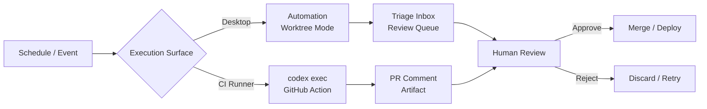
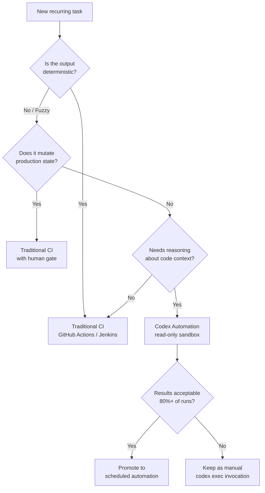

# Codex Automations as Lightweight CI: Where Scheduled Agents Replace Pipelines — and Where They Must Not


---

Codex Automations and `codex exec` have quietly become the build step for an increasing number of teams. A scheduled goal that runs daily, processes Kanban tickets, and commits the results looks remarkably like a CI pipeline — except the "build step" is a reasoning model rather than a deterministic script. This article examines where that substitution is sound, where it is dangerous, and how to configure Codex CLI to stay on the right side of the boundary.

## Two Execution Surfaces, One Mental Model

Codex provides two distinct paths for unattended work, and understanding the split is essential before treating either as CI infrastructure.

### Desktop App Automations

The ChatGPT desktop app (macOS and Windows) ships automations as a first-class feature [^1]. Each automation bundles three things:

- **A prompt** — plain English describing the recurring task.
- **Optional skills** — invoked with `$skill-name` syntax for domain-specific tooling.
- **A schedule** — hourly, daily, weekly, or custom cadence via RFC 5545 recurrence rules [^2].

For Git repositories, automations offer two execution modes: **worktree mode**, which isolates scheduled changes from your active local work, and **local mode**, which modifies files directly in the main checkout [^1]. Worktree mode is the safer default — each run gets a fresh branch, and you review the diff before merging.

### `codex exec` — The CLI Primitive

`codex exec` is the non-interactive counterpart: no TUI, no prompts, autonomous task completion with an exit code [^3]. It streams progress to stderr and prints final output to stdout, making it a native Unix citizen. For structured downstream consumption, `--output-schema` constrains the agent's response to a JSON Schema you provide [^4].

```bash
codex exec \
  --profile ci \
  --output-schema .codex/schemas/dependency-audit.json \
  "Audit all npm dependencies for known CVEs. Return structured JSON."
```

Both surfaces share the same model, the same AGENTS.md context, and the same sandbox machinery [^1]. The difference is trigger mechanism: desktop automations are clock-driven; `codex exec` is event-driven (cron, GitHub Actions, webhooks).

## The CI Substitution Pattern

The pattern emerging in production teams follows a recognisable shape:



### What Works as Lightweight CI

Codex automations genuinely replace traditional CI steps for tasks where the "build" is inherently fuzzy — where you would otherwise write a brittle script that hard-codes assumptions a reasoning model handles naturally [^5]:

- **Daily repository briefs** — summarising git history, open PRs, and unresolved issues.
- **Documentation drift checks** — comparing code changes against docs and flagging staleness.
- **Dependency sweeps** — auditing for CVEs, licence violations, or version staleness.
- **Release note generation** — compiling changelogs from commit messages and PR descriptions.
- **Linting reports** — running static analysis and formatting the results for review.
- **Priority triage** — scanning issue trackers and categorising by severity [^5].

These share a common trait: the output is a **report** or **draft**, not a production mutation. The agent gathers context, analyses, and presents — the human decides.

### The Six Structural Elements

The Developers Digest analysis identifies six elements that separate effective automations from background noise [^5]:

| Element | Purpose | Example |
|---------|---------|---------|
| **Purpose** | Why this automation exists | "Catch documentation drift before it compounds" |
| **Inputs** | Exact files, repos, dashboards | `src/`, `docs/`, GitHub PR API |
| **Actions** | Specific repeatable tasks | Compare function signatures against docs |
| **Boundaries** | Explicit autonomy restrictions | "Do not modify any files. Report only." |
| **Output** | Defined format | Markdown report in triage inbox |
| **Verification** | Post-execution checks | `pnpm lint`, `pnpm build` |

## The `codex-action` for Server-Side CI

For teams that need server-side execution rather than a developer's laptop, the official GitHub Action (`openai/codex-action@v1`) wraps `codex exec` with CI-appropriate defaults [^6]:


```yaml
name: Codex dependency audit
on:
  schedule:
    - cron: '0 6 * * 1'  # Every Monday at 06:00 UTC
  workflow_dispatch:

jobs:
  audit:
    runs-on: ubuntu-latest
    permissions:
      contents: read
      pull-requests: write
    steps:
      - uses: actions/checkout@v5
        with:
          fetch-depth: 0

      - name: Run Codex audit
        id: codex
        uses: openai/codex-action@v1
        with:
          openai-api-key: ${{ secrets.OPENAI_API_KEY }}
          prompt-file: .github/codex/prompts/dependency-audit.md
          sandbox: read-only
          output-file: audit-report.md

      - uses: actions/github-script@v7
        with:
          script: |
            await github.rest.issues.createComment({
              issue_number: context.payload.pull_request?.number || 1,
              body: process.env.CODEX_OUTPUT,
            });
        env:
          CODEX_OUTPUT: ${{ steps.codex.outputs.final-message }}
```


Three sandbox modes control what Codex can do on the runner [^6]:

- **`read-only`** — no file changes, no network. The safe default for audit and review tasks.
- **`workspace-write`** — can modify files within the checkout. Appropriate for auto-fix workflows.
- **`danger-full-access`** — unrestricted. Almost never appropriate in CI.

The `safety-strategy` input defaults to `drop-sudo`, which irreversibly removes sudo from the runner — an important safeguard when the agent has write access [^6].

## Where the Boundary Must Hold

The substitution breaks down — dangerously — when automations cross from **reporting** to **mutating production state**. The Developers Digest analysis is explicit: "Avoid auto-publishing public content, sending emails, changing billing settings, merging PRs, deleting data, or making large refactors" [^5].

### The Three Failure Modes

**1. Compounding unattended mistakes.** A flaky test or circular dependency can send an agent into ten or twenty retries, each replaying the full conversation history [^7]. Without turn caps and token budgets, a single automation can burn through a day's API allocation before anyone notices.

**2. Worktree accumulation.** Daily automations create one worktree per run. Over a fortnight, that is 14 worktrees per automation [^1]. Codex cleans up worktrees older than four days when you accumulate more than ten, but teams with multiple automations regularly hit disk pressure before cleanup triggers.

**3. Repeated stale findings.** If a linting error has been in the codebase for weeks and nobody fixes it, the daily automation keeps reporting it — creating noise that trains the team to ignore the triage inbox entirely [^1].

### The Cline Incident as Cautionary Tale

The February 2026 Cline npm publish incident demonstrated what happens when an AI-powered triage workflow processes untrusted input inside a privileged pipeline [^8]. The attack chain — untrusted issue input → shell access in CI → cache poisoning → credential abuse → package publication — maps directly onto the risk surface of any Codex automation running with `approval_policy = "never"` and network access.

IBM's 2026 X-Force report documented a nearly 4× increase in supply chain compromises since 2020, driven precisely by the trust relationship between CI/CD automation tools and SaaS integrations [^8]. Codex automations operating with `danger-full-access` or unrestricted network sit squarely in this attack surface.

## Configuration for Safe Automation

### Named Profiles

Separate your interactive and automation configurations using named profiles in `~/.codex/config.toml`:

```toml
[profile.ci-audit]
model = "gpt-5.5-codex"
approval_policy = "on-request"
sandbox_mode = "read-only"

[profile.ci-autofix]
model = "gpt-5.5-codex"
approval_policy = "on-request"
sandbox_mode = "workspace-write"
```

The `on-request` approval policy ensures the agent cannot execute write operations without explicit consent — even in non-interactive mode, this translates to the operation being logged and the run pausing for review [^9].

### Turn and Token Budgets

Cap unattended runs to prevent runaway loops:

```bash
codex exec \
  --profile ci-audit \
  --max-turns 20 \
  --max-tokens 50000 \
  "Run the weekly dependency audit."
```

### Fleet Governance with `requirements.toml`

For enterprise deployments, `requirements.toml` enforces minimum security posture across all team members [^10]:

```toml
[automation]
max_sandbox_mode = "workspace-write"
require_approval_policy = "on-request"
require_verification_step = true
```

This prevents any developer from configuring an automation with `danger-full-access` or disabling the approval gate.

## Decision Framework: Traditional CI vs Codex Automation



The decision hinges on two questions:

1. **Is the output deterministic?** If running the same input always produces the same output (compilation, unit tests, linting with fixed rules), use traditional CI. Determinism is its strength.

2. **Does the task require reasoning about code context?** If the task involves understanding intent, comparing documentation against implementation, or triaging issues by severity, Codex automations add value that a shell script cannot.

The workflow pattern that works: **schedule the gathering, gate the acting**. Let Codex collect context, analyse patterns, and draft outputs. Require human approval before any draft becomes a commit, a merge, or a deployment.

## The Reliability Threshold

The Record and Replay reliability discussion is instructive here [^11]. An 80–90% success rate creates a specific trust problem: you cannot fully delegate, so you still monitor, which halves the productivity gain. For automations to become genuine "fire and forget" lightweight CI, they need to cross the 95% reliability threshold — and the path to that is structural (better prompts, tighter boundaries, verification steps) rather than simply waiting for smarter models.

Test prompts manually in regular chat sessions before scheduling them. Verify tool behaviour and output quality on the first few runs. Make prompts durable with clear instructions on each run's objectives [^2]. And always set the minimum sandbox access required — grant network or file access only when the task genuinely needs it.

## Conclusion

Codex Automations are not a replacement for CI/CD. They are a **complement** — best suited to the fuzzy, context-heavy recurring tasks that traditional pipelines handle poorly or not at all. The boundary is clear: automations should **report**, traditional CI should **enforce**. Cross that line without the right guardrails, and you have not built lightweight CI — you have built an unsupervised agent with production credentials.

## Citations

[^1]: OpenAI, "Scheduled Tasks," ChatGPT Learn, 2026. [https://learn.chatgpt.com/docs/automations?surface=app](https://learn.chatgpt.com/docs/automations?surface=app)

[^2]: OpenAI, "Codex Changelog," ChatGPT Learn, July 2026. [https://developers.openai.com/codex/changelog](https://developers.openai.com/codex/changelog)

[^3]: OpenAI, "Non-interactive Mode," ChatGPT Learn, 2026. [https://developers.openai.com/codex/noninteractive](https://developers.openai.com/codex/noninteractive)

[^4]: Steve Kinney, "Structured CLI Output as Pipeline Glue," Self-Testing AI Agents, 2026. [https://stevekinney.com/courses/self-testing-ai-agents/structured-cli-output-as-pipeline-glue](https://stevekinney.com/courses/self-testing-ai-agents/structured-cli-output-as-pipeline-glue)

[^5]: Developers Digest, "Codex Automations: Where Scheduled AI Agents Actually Help," 2026. [https://www.developersdigest.tech/blog/codex-automations-recurring-engineering-work](https://www.developersdigest.tech/blog/codex-automations-recurring-engineering-work)

[^6]: OpenAI, "Codex GitHub Action," ChatGPT Learn, 2026. [https://learn.chatgpt.com/docs/github-action](https://learn.chatgpt.com/docs/github-action)

[^7]: Daniel Vaughan, "Loop Engineering with Codex CLI," Codex Knowledge Base, June 2026. [https://codex.danielvaughan.com/2026/06/11/loop-engineering-codex-cli-autonomous-agent-loops-automations-subagents-goal-mode/](https://codex.danielvaughan.com/2026/06/11/loop-engineering-codex-cli-autonomous-agent-loops-automations-subagents-goal-mode/)

[^8]: Cycode, "Top AI Security Vulnerabilities to Watch out for in 2026," 2026. [https://cycode.com/blog/ai-security-vulnerabilities/](https://cycode.com/blog/ai-security-vulnerabilities/)

[^9]: Daniel Vaughan, "The Writes Mode Permission Primitive," Codex Knowledge Base, July 2026. [https://codex.danielvaughan.com/2026/07/18/codex-cli-writes-mode-permission-primitive-reads-without-asking-writes-with-consent-least-privilege/](https://codex.danielvaughan.com/2026/07/18/codex-cli-writes-mode-permission-primitive-reads-without-asking-writes-with-consent-least-privilege/)

[^10]: OpenAI, "Codex CLI Features," ChatGPT Learn, 2026. [https://developers.openai.com/codex/cli/features](https://developers.openai.com/codex/cli/features)

[^11]: Daniel Vaughan, "Record and Replay: Demonstrated Workflows into Reusable Agent Skills," Codex Knowledge Base, June 2026. [https://codex.danielvaughan.com/2026/06/19/codex-record-and-replay-demonstrated-workflows-reusable-agent-skills-macos/](https://codex.danielvaughan.com/2026/06/19/codex-record-and-replay-demonstrated-workflows-reusable-agent-skills-macos/)
