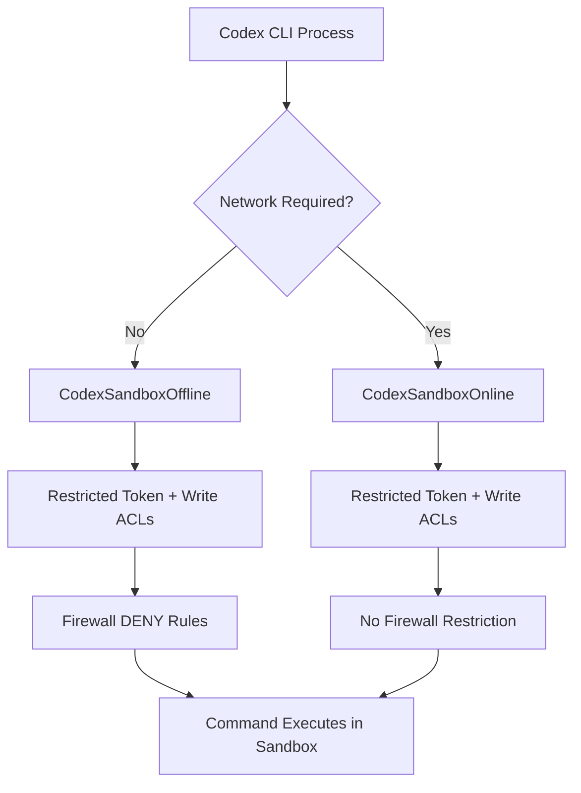
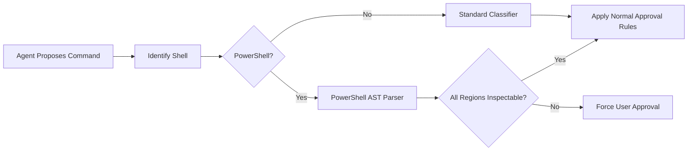

# The Windows Sandbox Deep Dive: How Codex CLI Isolates Agent Workloads with Restricted Tokens, Synthetic SIDs, and PowerShell AST Safety


---

## Why Windows Sandboxing Is Different

Every coding agent needs a sandbox. On macOS, Codex CLI delegates to Apple's `sandbox-exec` with a Seatbelt profile. On Linux, it layers Landlock LSM atop seccomp-bpf. Both operating systems offer kernel primitives purpose-built for process containment. Windows offers nothing equivalent that cleanly maps to an agentic workload[^1].

That single architectural gap forced the Codex engineering team — led by David Wiesen — to build a custom isolation layer from Windows security primitives: Security Identifiers (SIDs), Access Control Lists (ACLs), and write-restricted tokens[^1]. The result is a two-tier sandbox model shipping since v0.142 that every Windows developer running Codex CLI should understand, because its configuration directly determines what the agent can and cannot touch on your machine.

---

## What Was Rejected — and Why

Before arriving at the current design, OpenAI evaluated three existing Windows isolation mechanisms and rejected each[^1][^2]:

### AppContainer

AppContainer provides strong isolation but assumes the contained process is a standalone application with no need to read the host filesystem. Codex agents must read your repository, your toolchains, your Git configuration, and your dependency caches. AppContainer's default-deny posture for filesystem reads made it impractical without punching so many holes that the security boundary became meaningless[^2].

### Windows Sandbox

Windows Sandbox runs an entire lightweight VM. It is unavailable on Windows Home edition, cannot share the host's development environment without explicit mapping, and carries startup latency incompatible with the rapid command-execute-observe loop that agentic coding demands[^1].

### Mandatory Integrity Control (MIC)

MIC labels (Low, Medium, High, System) provide a coarse vertical privilege hierarchy. They cannot express the horizontal boundaries Codex needs: "write here but not there, read everywhere except these sensitive paths." MIC was deemed insufficient for granular agent isolation[^1].

---

## The Two-Tier Architecture

Codex CLI ships two native Windows sandbox modes, configured in `~/.codex/config.toml`[^3]:

```toml
[windows]
sandbox = "elevated"   # Recommended — dedicated sandbox users + firewall rules
# sandbox = "unelevated"  # Fallback — restricted tokens under your own user
```

### Elevated Mode

The elevated sandbox is the production-grade option. On first run, Codex provisions two local Windows user accounts[^1][^2]:

- **CodexSandboxOffline** — targeted by Windows Firewall deny rules; used for commands that should have no network access
- **CodexSandboxOnline** — not firewall-restricted; used when the agent legitimately needs outbound connectivity (e.g., `npm install`, `git push`)



Each command runs under a restricted token derived from the sandbox user, not your real Windows identity. The token carries the `WRITE_RESTRICTED` flag, meaning every write-style access check must pass an additional restricted-SID evaluation[^1]. The restricted SID list contains `[Everyone, Logon, Synthetic]`, ensuring the process can only write to directories where Codex has explicitly planted an Access Control Entry (ACE) granting the synthetic sandbox SID write permission[^2].

In practice, that means the agent can write to your workspace directory and any paths you configure in `writable_roots`, and nowhere else:

```toml
[sandbox]
writable_roots = [
    "C:\\Users\\dev\\AppData\\Local\\Temp",
    "D:\\build-cache"
]
```

### Unelevated Mode

When IT policy blocks local user creation or administrator access, the unelevated sandbox provides a weaker but still meaningful boundary[^3]. Instead of dedicated sandbox accounts, it creates a restricted token derived from *your* current Windows user. The token still carries `WRITE_RESTRICTED` with a synthetic SID, and Codex still plants ACEs on the workspace directory, but two important protections are absent[^1]:

1. **No firewall rules** — network isolation relies on environment-level offline controls rather than OS-enforced firewall deny rules
2. **Everyone SID gap** — if a directory already grants write access to the `Everyone` SID (common in `%TEMP%` and some legacy paths), the restricted token cannot prevent writes there[^1]

```toml
[windows]
sandbox = "unelevated"
```

Both modes default to running commands on a private Windows desktop for UI isolation[^3]. If you need legacy `Winsta0\Default` behaviour — for instance, because a GUI test harness expects the interactive desktop — disable it:

```toml
[windows]
sandbox_private_desktop = false
```

### Enterprise Enforcement

Fleet administrators can lock sandbox mode via `requirements.toml`, preventing developers from falling back to the weaker option[^3]:

```toml
[windows]
allowed_sandbox_implementations = ["elevated"]
```

---

## PowerShell AST Safety Classification

Windows developers face a shell-specific safety challenge that macOS and Linux users never encounter. Codex CLI's dangerous-command classifier must parse PowerShell syntax to determine whether a command is safe for auto-approval[^4].

### How the Classifier Works

When the agent proposes a shell command, Codex identifies the shell (Bash, Zsh, PowerShell, cmd.exe) and routes the command text to the appropriate parser. For PowerShell, the classifier invokes the PowerShell Abstract Syntax Tree (AST) parser, which tokenises the command into inspectable regions[^4].

If every AST region is classifiable — the parser can see exactly what the command does — the classifier applies its rules: is this a known-safe command? Does it match any dangerous patterns (forced `rm`, registry writes, service manipulation)? If so, does the current approval policy permit auto-execution or require human consent?

### The Opaque Region Problem

The security gap emerges when PowerShell commands contain AST regions the classifier *cannot* inspect[^5]. This occurs with:

- **Dynamic invocation** — `Invoke-Expression` with runtime-constructed strings
- **Encoded commands** — `-EncodedCommand` with Base64 payloads
- **Script block obfuscation** — nested `[ScriptBlock]::Create()` calls
- **Dot-sourced external scripts** — `. .\unknown-script.ps1`

Before the fix shipped in v0.142.2, these opaque regions could slip through auto-approval because the classifier had no way to evaluate them[^5]. The fix is straightforward: **any PowerShell command containing an executable AST region the classifier cannot fully inspect now requires explicit user approval**, regardless of the configured approval policy[^5].



### Cross-Platform Safety

PR #24946 (merged June 2026) placed the Windows PowerShell classifier behind `#[cfg(windows)]` conditional compilation[^4]. Before this change, `is_known_safe_command` invoked PowerShell safety checks on *all* platforms. On macOS or Linux, a repository-controlled `pwsh` binary could execute during safety parsing — before the normal sandboxed execution path — creating a pre-sandbox code execution vector[^4].

After the fix:
- **On Windows:** the PowerShell classifier remains active, parsing commands through the system's trusted PowerShell installation
- **On macOS/Linux:** PowerShell-style commands follow standard non-Windows evaluation logic, removing the pre-sandbox execution risk

---

## The v0.144.5 Dangerous-Command Expansion

The July 16 release (v0.144.5) extended dangerous-command detection for both PowerShell and Bash[^6]. Key improvements:

- **Expanded `rm` recognition** — more forced-removal variants (`rm -rf /`, `Remove-Item -Recurse -Force`) are caught, including flag reordering and aliased forms
- **Clearer rejection messages** — when a command is blocked, the rejection now explains *which* pattern triggered the denial rather than returning an opaque refusal[^6]

This matters for approval policy tuning. If you are running `approval_policy = "on-request"` (the `writes` mode introduced in v0.144.0[^7]), understanding *why* a command was flagged helps you decide whether to approve, deny, or adjust your policy.

---

## Practical Configuration for Windows Developers

### Recommended Production Setup

```toml
# ~/.codex/config.toml

model = "gpt-5.6-sol"
approval_policy = "on-request"

[windows]
sandbox = "elevated"
sandbox_private_desktop = true

[sandbox]
writable_roots = [
    "C:\\Users\\dev\\.nuget\\packages",
    "C:\\Users\\dev\\AppData\\Local\\Temp"
]
```

### CI/CD Pipeline Setup

For non-interactive Windows CI runners, combine the elevated sandbox with never-ask approval and explicit writable paths[^7]:

```bash
codex exec --ask-for-approval never \
    --sandbox-writable-root "D:\build-output" \
    "Run the full test suite and generate coverage reports"
```

### Diagnosing Sandbox Issues

`codex doctor` (enhanced in v0.143.0) now reports Windows-specific diagnostics including sandbox user provisioning status, firewall rule integrity, and ACL configuration[^8]. If shell commands fail with `CreateRestrictedToken failed: 87`, switch to unelevated mode and file a bug — that error indicates the restricted token creation API rejected the SID configuration[^9].

---

## Known Limitations

The Windows sandbox is production-grade but not without friction:

1. **Self-update fails from sandbox** — Codex cannot update itself when running inside its own sandbox due to permission boundaries; update from an unsandboxed terminal[^10]
2. **Shell preference ignored** — the Codex desktop app may route through PowerShell even when "Integrated Terminal Shell" is set to Command Prompt[^11]
3. **v0.143.0 shell_command regression** — a brief regression caused `shell_command` tool calls to fail with a duplicated function name; resolved in v0.143.1[^12]
4. **Everyone SID gap in unelevated mode** — directories with permissive ACLs granting `Everyone` write access remain writable from the sandbox[^1]

---

## What This Means for Your Security Posture

The Windows sandbox architecture reflects a broader principle in agent security: **isolation must match the workload, not the operating system's default assumptions**. AppContainer assumes contained apps need no host access. Windows Sandbox assumes full VM isolation is acceptable. Neither assumption holds for a coding agent that must read your entire project, execute your build tools, and write changes back to your repository.

Codex's approach — synthetic SIDs, write-restricted tokens, dedicated sandbox users, and firewall segmentation — is bespoke engineering that trades elegance for precision. If you are deploying Codex CLI across a Windows fleet, the elevated sandbox with `requirements.toml` enforcement is the minimum viable security configuration. If you are an individual developer, understand that unelevated mode has real gaps and upgrade to elevated when you can.

The PowerShell AST classifier adds a shell-specific safety net that Bash users take for granted. On Unix, `rm -rf /` is trivially parseable. On Windows, `Invoke-Expression (Get-Content .\payload.ps1)` is not — and the classifier now correctly forces approval for anything it cannot fully inspect.

---

## Citations

[^1]: OpenAI, "Building a safe, effective sandbox to enable Codex on Windows," OpenAI Blog, May 2026. [https://openai.com/index/building-codex-windows-sandbox/](https://openai.com/index/building-codex-windows-sandbox/)

[^2]: InfoQ, "How OpenAI Built a Secure Windows Sandbox for Codex Agents," June 2026. [https://www.infoq.com/news/2026/06/codex-windows-sandbox-design/](https://www.infoq.com/news/2026/06/codex-windows-sandbox-design/)

[^3]: OpenAI, "Windows sandbox documentation," ChatGPT Learn. [https://learn.chatgpt.com/docs/windows/windows-sandbox](https://learn.chatgpt.com/docs/windows/windows-sandbox)

[^4]: openai/codex PR #24946, "Avoid PowerShell safety parsing off Windows," GitHub, June 2026. [https://github.com/openai/codex/pull/24946](https://github.com/openai/codex/pull/24946)

[^5]: Codex CLI Changelog, v0.142.2, "PowerShell commands containing executable AST regions the safety classifier cannot inspect now require approval." [https://learn.chatgpt.com/docs/changelog](https://learn.chatgpt.com/docs/changelog)

[^6]: Codex CLI Changelog, v0.144.5, July 16 2026, "Improved dangerous-command detection, including more forced rm forms." [https://github.com/openai/codex/releases/tag/rust-v0.144.5](https://github.com/openai/codex/releases/tag/rust-v0.144.5)

[^7]: Codex CLI Changelog, v0.144.0, July 9 2026, "Added writes app-approval mode." [https://learn.chatgpt.com/docs/changelog](https://learn.chatgpt.com/docs/changelog)

[^8]: Codex CLI Changelog, v0.143.0, "codex doctor reports richer environment, Git, terminal, app-server, and thread inventory diagnostics." [https://learn.chatgpt.com/docs/changelog](https://learn.chatgpt.com/docs/changelog)

[^9]: openai/codex Issue #18451, "Windows sandboxed shell commands fail with CreateRestrictedToken failed: 87." [https://github.com/openai/codex/issues/18451](https://github.com/openai/codex/issues/18451)

[^10]: OpenAI Developer Community, "Codex CLI on Windows update fails," July 2026. [https://community.openai.com/t/codex-cli-on-windows-update-fails/1381341](https://community.openai.com/t/codex-cli-on-windows-update-fails/1381341)

[^11]: openai/codex Issue #19629, "Windows Codex app command execution still depends on PowerShell." [https://github.com/openai/codex/issues/19629](https://github.com/openai/codex/issues/19629)

[^12]: openai/codex Issue #31639, "shell_command fails with unsupported call: shell_commandshell_command." [https://github.com/openai/codex/issues/31639](https://github.com/openai/codex/issues/31639)
