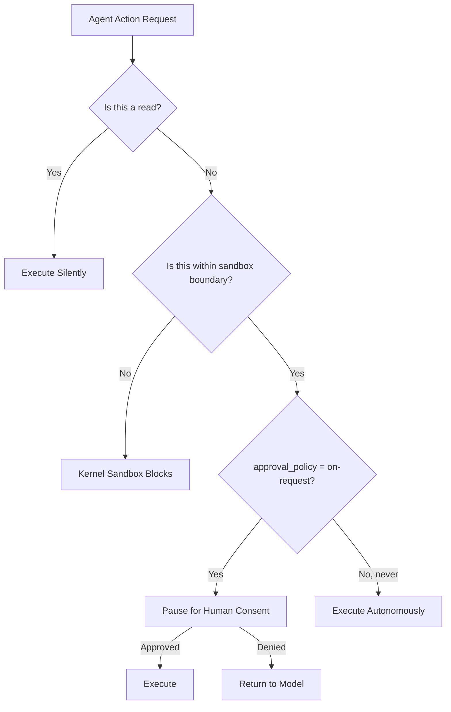

# The Writes Mode Permission Primitive: Why Reads Without Asking and Writes With Consent Changes Everything for Codex CLI Enterprise Deployments


---

## The Permission Gap Before Writes Mode

For most of Codex CLI's first year, developers faced a binary choice that satisfied nobody. The original three approval modes — `suggest`, `auto-edit`, and `full-auto` — mapped poorly to real-world workflows where read-heavy operations like code analysis, audit, and search should flow autonomously whilst mutations require human sign-off[^1].

`suggest` mode demanded approval for every action, including harmless `cat` and `grep` calls, creating approval fatigue that drove developers straight to `full-auto`[^2]. The intermediate `auto-edit` mode let file edits through automatically but still gated shell commands — a distinction that conflates the *type* of action (file vs. command) with the *risk* of action (read vs. write)[^3].

The `writes` approval mode, introduced alongside the modern `approval_policy` configuration in 2026, corrects this by drawing the consent boundary at mutation rather than mechanism[^4].

---

## How Writes Mode Works

The `writes` mode (configured as `approval_policy = "on-request"` combined with `sandbox_mode = "workspace-write"`) implements a simple principle: **read operations execute silently; write operations pause for consent**[^5].

```toml
# ~/.codex/config.toml — writes-with-consent configuration
model = "o4-mini"
approval_policy = "on-request"
sandbox_mode = "workspace-write"
```

Under this configuration:

| Operation Type | Behaviour |
|---|---|
| File reads (`cat`, `grep`, `find`) | Executes automatically |
| Directory listing, code search | Executes automatically |
| File creation or modification | Pauses for approval |
| Shell commands with side effects | Pauses for approval |
| Network requests (when allowed) | Pauses for approval |
| Git commits, pushes | Pauses for approval |

The kernel-level sandbox (Landlock on Linux, Seatbelt on macOS) enforces the hard boundary — the agent *cannot* write outside the workspace regardless of approval[^6]. The approval policy adds a consent gate *within* that boundary.

---

## The Principle of Least Privilege, Applied

The OWASP Top 10 for Agentic Applications 2026 lists Agent Identity & Privilege Abuse as the third most critical risk, recommending that organisations adopt "least privilege, isolation, mutual authentication" for all agent deployments[^7]. The `writes` mode maps directly to this guidance:



This two-layer model separates enforcement concerns cleanly. The kernel sandbox is the *immutable* boundary — tamper-resistant, not configurable by the agent. The approval policy is the *consent* layer — flexible, auditable, and context-sensitive[^8].

---

## Enterprise Deployment Patterns

### Pattern 1: Autonomous Code Review

Code review workflows are predominantly read operations. An agent auditing a pull request reads files, searches for patterns, checks test coverage, and analyses dependencies — all without modifying a single byte. Under `writes` mode, this entire workflow proceeds without interruption:

```bash
# Code review session — zero approval prompts needed
codex -a on-request -s workspace-write \
  "Review the PR in branch feature/auth-refactor. Check for security issues, test coverage gaps, and style violations. Report findings but do not modify any files."
```

The moment the agent attempts to *fix* an issue rather than merely *report* it, the consent gate activates[^9].

### Pattern 2: Investigation-Then-Fix

For debugging workflows, the natural rhythm is: investigate freely, then propose changes. `writes` mode matches this rhythm exactly:

```bash
# Investigation phase runs autonomously
# Fix phase requires approval for each modification
codex -a on-request -s workspace-write \
  "Diagnose why the auth service returns 503 under load. Investigate logs, trace the connection pool, and propose a fix."
```

### Pattern 3: Fleet Enforcement via requirements.toml

Enterprise administrators can enforce `writes` mode as a minimum security floor across all developers using the managed `requirements.toml` mechanism:

```toml
# requirements.toml — distributed via MDM or ChatGPT workspace admin
[policy]
approval_policy = "on-request"
sandbox_mode = "workspace-write"

[policy.overrides]
# Individual developers cannot weaken below this floor
allow_full_auto = false
allow_danger_full_access = false
```

This creates an asymmetric governance model: administrators set the floor, developers can only *tighten* (e.g., switching to `read-only` sandbox for sensitive repos)[^10].

---

## Named Profiles for Context-Sensitive Permission

The profile system allows developers to maintain multiple permission configurations and switch between them based on context:

```toml
# ~/.codex/review.config.toml — read-only audit profile
approval_policy = "on-request"
sandbox_mode = "read-only"

# ~/.codex/dev.config.toml — writes-with-consent for active development
approval_policy = "on-request"
sandbox_mode = "workspace-write"

# ~/.codex/ci.config.toml — full-auto for disposable CI containers
approval_policy = "never"
sandbox_mode = "workspace-write"
```

```bash
# Switch profiles based on task
codex --profile review "Audit this module for OWASP Top 10 vulnerabilities"
codex --profile dev "Implement the fix for CVE-2026-4521"
codex --profile ci exec "Run the full test suite and report failures"
```

This eliminates the all-or-nothing permission problem that characterised earlier approval modes[^11].

---

## Comparison with Competitor Permission Models

The `writes` permission primitive positions Codex CLI distinctly in the current agent landscape:

| Agent | Permission Granularity | Read/Write Distinction |
|---|---|---|
| Codex CLI | Two-layer (sandbox + approval) | Explicit via `on-request` + `workspace-write` |
| Claude Code | Four-tier risk classification | Implicit via auto-review risk scoring |
| GitHub Copilot Agent | Repository-scoped OAuth | No read/write distinction within scope |
| Cursor Agent | User-prompt gating | Manual per-action approval only |

Claude Code's approach scores actions on a risk spectrum rather than drawing a binary read/write line[^12]. This is more nuanced but harder to reason about — developers cannot predict which actions will trigger review without understanding the internal scoring model. The `writes` mode offers a simpler mental model: reads flow, writes ask.

---

## The Granular approval_policy Object

For teams that need finer control than the binary `on-request`/`never` toggle, Codex CLI supports a granular approval policy object that extends the writes concept to specific operation categories:

```toml
# Granular approval — writes mode with exceptions
[approval_policy]
file_edit = "never"          # Auto-approve file edits within sandbox
shell_command = "on-request" # Always ask for shell commands
network = "on-request"       # Always ask for network access
git_push = "on-request"      # Always ask before pushing
```

This lets teams tune the consent boundary precisely — perhaps file edits are trusted (the sandbox constrains blast radius) but shell commands and network access always require human verification[^13].

---

## Implications for the Approval Fatigue Problem

Research from Dhanorkar et al. identified four forms of oversight work that developers perform when supervising coding agents, with approval fatigue being the primary driver of developers escalating to `full-auto` mode[^14]. The Hedwig project measured this quantitatively: static approval policies achieve only 0.50 recall on cautious developer personas compared to 1.00 for adaptive policies[^15].

The `writes` mode reduces approval volume by 60–80% compared to `suggest` mode in typical development sessions (where read operations dominate), without surrendering the consent gate on mutations[^16]. This represents the practical sweet spot: low enough friction to sustain daily use, high enough oversight to catch destructive actions before they execute.

---

## Configuration Checklist

For teams adopting `writes` mode as their standard:

1. **Set the baseline** in `~/.codex/config.toml`:
   ```toml
   approval_policy = "on-request"
   sandbox_mode = "workspace-write"
   ```

2. **Enforce the floor** via `requirements.toml` distributed through MDM or workspace admin

3. **Create profiles** for read-only audit, active development, and CI contexts

4. **Add deny-read globs** for credentials and sensitive paths:
   ```toml
   [sandbox]
   deny_read = ["**/.env", "**/credentials*", "**/*.pem"]
   ```

5. **Monitor approval patterns** — if developers consistently approve the same operation types, consider moving those to `never` in a granular policy object

6. **Review quarterly** — permission configurations drift; audit against OWASP Agentic Top 10 guidance annually at minimum

---

## Conclusion

The `writes` mode is not merely another configuration option — it represents a philosophical shift in how we think about agent permissions. By drawing the consent boundary at *mutation* rather than *mechanism*, it aligns Codex CLI with the principle of least privilege in a way that remains usable for daily development work.

For enterprise teams, the combination of `writes` mode, kernel sandbox enforcement, and fleet-level `requirements.toml` governance creates a layered security architecture that satisfies both developer productivity and security compliance requirements. The agent reads freely. It writes only with consent. The kernel ensures it cannot escape.

---

## Citations

[^1]: [Codex CLI Permission Modes in Practice — Design Guidelines](https://note.com/shinsary/n/n40d5214ea1aa?hl=en)
[^2]: [How do you guys work with Codex in auto-approval mode? — OpenAI Developer Community](https://community.openai.com/t/how-do-you-guys-work-with-codex-in-auto-approval-mode/1380717)
[^3]: [Approval Modes: Suggest, Auto Edit, and Full Auto — OpenAI Codex From CLI to Cloud Agents](https://freeacademy.ai/lessons/codex-approval-modes)
[^4]: [Codex CLI approval_policy: Legacy Patterns vs Official 2026 Approval Settings — SmartScope](https://smartscope.blog/en/generative-ai/chatgpt/codex-cli-approval-policy-implementation/)
[^5]: [Agent approvals & security — ChatGPT Learn](https://developers.openai.com/codex/agent-approvals-security)
[^6]: [Codex CLI Permission Profiles: Built-in Sandbox Modes, Custom Profiles, and the Two-Layer Security Model — Codex Knowledge Base](https://codex.danielvaughan.com/2026/05/08/codex-cli-permission-profiles-sandbox-modes-security-layers/)
[^7]: [OWASP Top 10 for Agentic Applications 2026 — OWASP Gen AI Security Project](https://genai.owasp.org/resource/owasp-top-10-for-agentic-applications-for-2026/)
[^8]: [Configuration Reference — ChatGPT Learn](https://developers.openai.com/codex/config-reference)
[^9]: [Codex CLI Full-Auto Mode: Two Flags to Stop the Approval Prompts — frr.dev](https://www.frr.dev/posts/codex-cli-autonomous-agent-two-flags/)
[^10]: [Permission Profiles End-to-End: Governed Repo Mode and Enterprise Security Posture — Codex Knowledge Base](https://codex.danielvaughan.com/2026/04/17/permission-profiles-governed-repo-enterprise-security/)
[^11]: [Config basics — ChatGPT Learn](https://developers.openai.com/codex/config-basic)
[^12]: [How OpenAI Codex Works Behind-the-Scenes and How It Compares to Claude Code — PromptLayer](https://blog.promptlayer.com/how-openai-codex-works-behind-the-scenes-and-how-it-compares-to-claude-code/)
[^13]: [Advanced Configuration — ChatGPT Learn](https://developers.openai.com/codex/config-advanced)
[^14]: Dhanorkar et al., "Four Forms of Oversight Work in Human-Agent Collaboration," arXiv:2606.05391, June 2026.
[^15]: Shukla, Feng, Wang, Rostami, and Zhang, "Hedwig: Dynamic Autonomy for Coding Agents," arXiv:2605.11495, May 2026.
[^16]: ⚠️ Estimate based on TraceLab workload characterisation (Zhu et al., arXiv:2606.30560) showing read operations constitute the majority of coding-agent tool calls; exact reduction varies by workflow.
