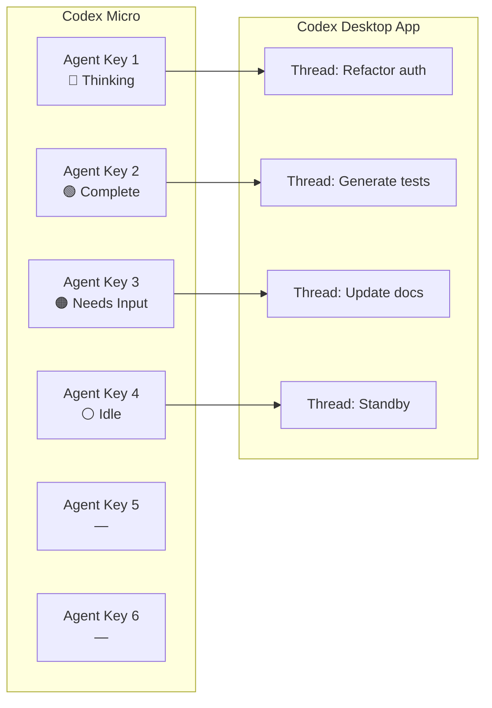
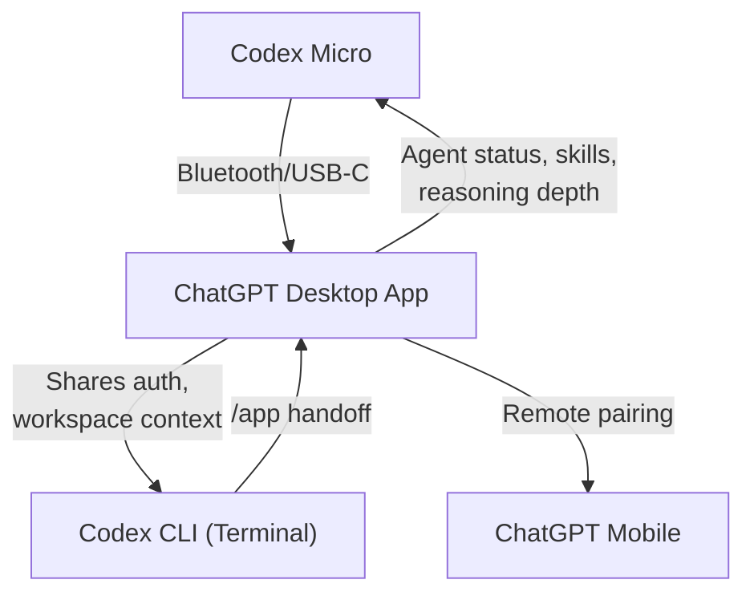

# Codex Micro: What OpenAI's First Hardware Product Means for Tactile Agent Control


---

On 15 July 2026, OpenAI shipped its first branded hardware product: the **Codex Micro**, a \$230 programmable macropad built in collaboration with boutique keyboard manufacturer Work Louder [^1][^2]. Thirteen mechanical keys, a rotary encoder, a planar joystick, and six RGB-backlit "Agent Keys" — all housed in a CNC-milled aluminium-and-polycarbonate chassis. It is, depending on your perspective, either a long-overdue tactile control surface for multi-agent workflows or an expensive novelty that software shortcuts already handle.

This article examines the hardware itself, how it maps to Codex agent orchestration, what it implies for CLI-centric developers, and whether the concept of dedicated physical controls for AI agents has legs.

## Hardware at a Glance

The Codex Micro shares its chassis with Work Louder's Creator Micro 2 [^3]. The key specifications are:

| Component | Detail |
|-----------|--------|
| Switches | 13 low-profile MX-style mechanical, clicky or silent variants |
| Actuation | 40 ± 10 gf, 2.8 ± 0.25 mm travel |
| Durability | 50 million keypresses per switch |
| Inputs | Rotary encoder, planar joystick, capacitive touch sensor |
| Materials | CNC polycarbonate frame, sandblasted anodised aluminium base |
| Connectivity | Bluetooth and USB-C |
| Compatibility | macOS and Windows |
| Layers | 6 programmable via Work Louder Input software |
| In the box | Codex Micro, USB-C cable, 32 custom icon keycaps, 11 solid colour caps |

The device supports Work Louder's **Input** configurator for custom actions, multi-step macros, and application-linked layer switching — meaning it can automatically switch its active layer when Codex comes into focus [^3]. It also supports the **VIA** configurator, an open-source GUI built on QMK firmware that permits real-time key remapping without reflashing [^3].

## Agent Keys: Ambient Status Without Screen Context-Switching

The six top-row keys — the Agent Keys — are the distinguishing feature. Each one binds to a running Codex agent and reflects its state through live RGB colour feedback [^1][^4]:

| Colour | State |
|--------|-------|
| White | Idle |
| Blue | Thinking |
| Green | Complete (unread) |
| Peach | Needs input |
| Red | Error |

A single tap selects the bound agent; a double-tap brings it to the foreground [^2]. The value proposition is **peripheral awareness**: when running three or four agents in parallel — a refactoring task, a test-generation pass, a documentation update — you can see which needs attention without leaving your editor or terminal.



This maps directly to a pain point reported by developers running multiple concurrent Codex tasks: the ChatGPT desktop app's sidebar can show thread status, but you have to be looking at it [^5]. The Codex Micro pushes that status into your physical peripheral vision.

## The Rotary Encoder: Reasoning Depth on a Dial

The rotary encoder adjusts Codex's **reasoning depth** — the same parameter you set with `Alt+,` / `Alt+.` in the CLI TUI or through the reasoning slider in the desktop app [^4][^6]. Twist clockwise for deeper reasoning on complex architectural decisions; twist counter-clockwise for rapid, low-latency completions.

This is a small but telling design choice. It acknowledges that reasoning depth is not a set-and-forget preference but a **continuous, task-sensitive parameter** that developers adjust frequently. A physical dial eliminates the menu navigation or keyboard shortcut recall that currently mediates this adjustment.

For CLI users, the equivalent remains `Alt+,` and `Alt+.` in the TUI, or the `model_reasoning_effort` key in `config.toml` [^6]:

```toml
# ~/.codex/config.toml
[model]
model_reasoning_effort = "medium"  # low | medium | high | ultra
```

## The Joystick: Radial Workflow Shortcuts

The planar joystick maps four directional flicks to preset or custom Codex workflows [^1][^4]. Default mappings target the most repetitive agent-supervision actions:

- **Up**: Review a pull request
- **Right**: Debug an error
- **Down**: Refactor code
- **Left**: Custom skill slot

Each direction triggers a Codex skill — the same reusable prompt templates available through the `/skill` slash command or the skills marketplace [^7]. The joystick is clickable, opening a radial menu for additional workflow triggers.

## What About the CLI?

Here is the critical question for terminal-centric developers: **the Codex Micro does not integrate with the CLI directly**. It connects to the **ChatGPT desktop app**, which hosts the Codex, Chat, and Work surfaces [^2][^5]. The CLI remains a separate process with its own TUI and keybindings.

This means CLI developers face a choice:

1. **Use the desktop app** alongside the CLI, leveraging the Micro for agent supervision while keeping the terminal for direct `codex exec` and interactive sessions.
2. **Remap the Micro as a generic macropad** using VIA or Input, binding keys to terminal commands, tmux pane switching, or shell aliases — losing the live Agent Key status but gaining tactile shortcuts for any workflow.
3. **Ignore it entirely** and continue using keyboard shortcuts, which already cover the same ground.



The `/app` command in the CLI can hand off the current thread to the desktop app [^6], creating a workflow where you start in the terminal, hand off to the desktop app when you want Micro-mediated multi-agent supervision, then return to the terminal for focused work.

## The DIY Counter-Argument

Community reaction has been polarised. The most common criticism: you can buy a generic programmable macropad for £20–30 and achieve similar key-mapping functionality [^8]. A QMK-compatible device with VIA support gives you the same six layers, the same macro capabilities, and the same joystick inputs.

What you cannot replicate is the **live Agent Key status integration**. That requires the proprietary bridge between the Codex backend and the device's RGB controller, which is bundled into the Codex Micro's firmware and the ChatGPT desktop app's device protocol. Whether that single feature justifies a 10× price premium is a personal judgement.

## Enterprise Implications

For teams running Codex at scale — and OpenAI claims 5 million weekly active Codex developers as of July 2026 [^1] — the Codex Micro raises an interesting question about **agent observability**. In a world where developers routinely run 3–6 concurrent agents, status visibility becomes a genuine productivity concern, not a luxury.

The concept extends beyond a single macropad. Imagine:

- **Dashboard displays** showing fleet-wide agent status for engineering leads
- **IDE status bar integrations** reflecting agent states without app switching
- **Notification routing** that escalates "needs input" states after configurable timeouts

The Codex Micro is a consumer product, but the underlying pattern — **dedicated surfaces for agent state awareness** — is an enterprise infrastructure problem. OpenAI's requirements.toml and fleet enforcement mechanisms already govern agent behaviour at the organisational level [^6]; what is missing is fleet-wide observability tooling.

## Practical Assessment

The Codex Micro is worth considering if you meet **all three** criteria:

1. You use the ChatGPT desktop app (not just the CLI) as your primary Codex surface
2. You routinely run multiple concurrent agents
3. You value tactile, peripheral-vision feedback over screen-based status checking

If your workflow is CLI-first, the Micro adds little that `Alt+,`/`Alt+.`, slash commands, and terminal multiplexers do not already provide. If you run a single agent at a time, the Agent Keys offer no advantage over the desktop app's sidebar.

For the right workflow, though, the live status feedback and the reasoning dial are genuinely useful — not because they enable new capabilities, but because they reduce the **supervisory overhead** of multi-agent orchestration to a glance and a twist.

## What This Signals

OpenAI's first hardware product is not a consumer device in the Jony Ive mould — that project remains separate and is expected later in 2026 [^5]. The Codex Micro is a **developer tool** that signals OpenAI's belief that agent supervision will become a distinct, recurring activity deserving its own control surface.

Whether dedicated agent controllers become a product category or remain a niche curiosity depends on how multi-agent workflows evolve. If the trend towards higher agent concurrency continues — and the v0.144 release's Ultra reasoning concurrency warning suggests it will [^9] — then the problem the Codex Micro addresses is real, even if this particular solution is not for everyone.

---

## Citations

[^1]: "OpenAI's first gadget is the \$230 Codex Micro macropad," *The New Stack*, 15 July 2026. [https://thenewstack.io/openai-codex-micro-macropad/](https://thenewstack.io/openai-codex-micro-macropad/)

[^2]: "OpenAI launches a physical keypad for controlling agents," *Engadget*, 15 July 2026. [https://www.engadget.com/2215952/openai-launches-a-physical-keypad-for-controlling-agents/](https://www.engadget.com/2215952/openai-launches-a-physical-keypad-for-controlling-agents/)

[^3]: Work Louder, "Codex Micro," product page, accessed 18 July 2026. [https://worklouder.cc/codex-micro](https://worklouder.cc/codex-micro)

[^4]: "OpenAI's \$230 'Codex Micro': Supervising AI Agents at Your Desk with 13 Keys," *XenoSpectrum*, 15 July 2026. [https://xenospectrum.com/en/openai-codex-micro-agent-controller/](https://xenospectrum.com/en/openai-codex-micro-agent-controller/)

[^5]: "Amid hardware legal battle, OpenAI releases a \$230 keyboard for Codex," *TechCrunch*, 15 July 2026. [https://techcrunch.com/2026/07/15/amid-hardware-legal-battle-openai-releases-a-230-keyboard-for-codex/](https://techcrunch.com/2026/07/15/amid-hardware-legal-battle-openai-releases-a-230-keyboard-for-codex/)

[^6]: OpenAI, "Developer commands — Codex CLI reference," *ChatGPT Learn*, accessed 18 July 2026. [https://developers.openai.com/codex/cli/reference](https://developers.openai.com/codex/cli/reference)

[^7]: OpenAI, "Plugins," *ChatGPT Learn*, accessed 18 July 2026. [https://developers.openai.com/codex/plugins](https://developers.openai.com/codex/plugins)

[^8]: "'It honestly feels like a prank and not a real product': coders aren't loving OpenAI's first hardware launch," *TechRadar*, 16 July 2026. [https://www.techradar.com/ai-platforms-assistants/openai/what-is-the-codex-micro-openais-first-hardware-gadget-explained](https://www.techradar.com/ai-platforms-assistants/openai/what-is-the-codex-micro-openais-first-hardware-gadget-explained)

[^9]: OpenAI, "Codex changelog," *ChatGPT Learn*, accessed 18 July 2026. [https://developers.openai.com/codex/changelog](https://developers.openai.com/codex/changelog)
