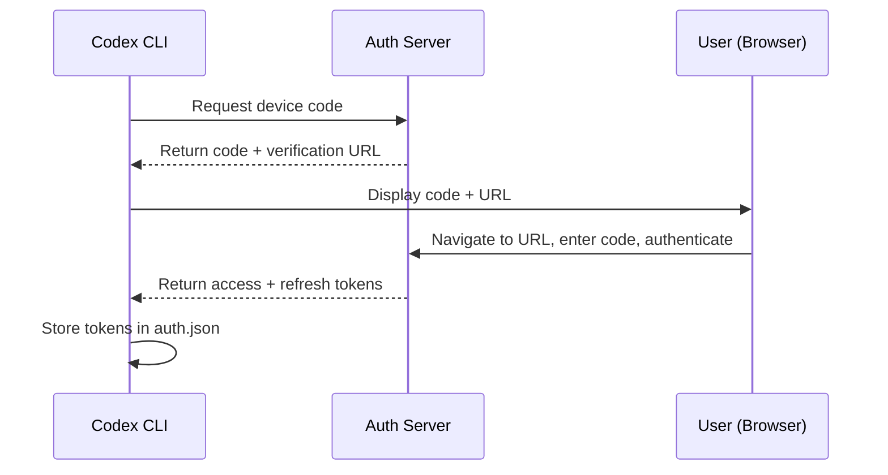
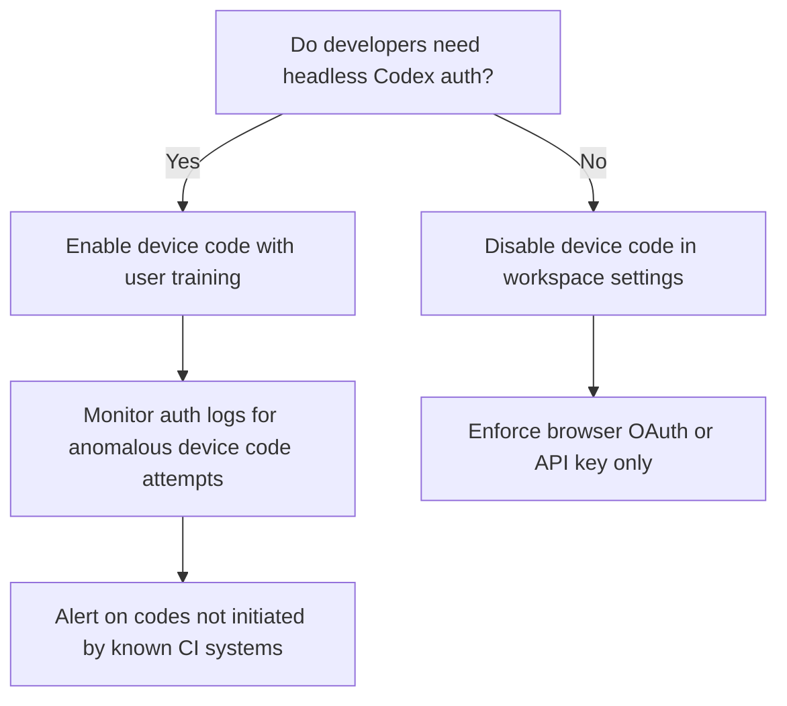

# Device Code Phishing and Your Codex CLI: What the 37x Surge in OAuth Abuse Means for Developer Authentication Security


---

The device code flow that lets you authenticate Codex CLI on a headless server is the same protocol that attackers weaponised to compromise 340+ Microsoft 365 organisations in the first half of 2026[^1]. Push Security documented a **37.5x increase** in device code phishing pages across 14 distinct phishing-as-a-service (PhaaS) kits[^2], and in early July the DEBULL campaign demonstrated that collaboration-themed lures can harvest OAuth tokens without ever showing a fake login page[^3]. If you run `codex login --device-auth` on CI boxes, cloud workstations, or SSH-only hosts, you need to understand the threat model — and the defences Codex CLI now provides.

## The Protocol Under Attack

Device code authentication implements OAuth 2.0's Device Authorization Grant (RFC 8628)[^4]. It was designed for devices with limited input — smart TVs, IoT controllers, CLI tools. The flow is straightforward:



The security assumption is that the person entering the code is the person who requested it. Device code phishing breaks this assumption: an attacker generates the code, then tricks a legitimate user into entering it on the real authentication page[^5]. The victim completes their own MFA challenge on behalf of the attacker. No fake login page is needed. No password is intercepted. The resulting refresh tokens persist even after a password reset[^2].

## Why Developers Are Particularly Exposed

Developer tooling has normalised the device code flow. GitHub CLI, Azure CLI, AWS SSO, and now Codex CLI all support `--device-auth` variants for headless environments[^6]. The pattern — "here's a code, go to this URL and enter it" — feels routine to anyone who has authenticated a CLI tool on a remote box.

The DEBULL campaign, active from late June into July 2026, exploited exactly this familiarity. Attackers compromised an initial M365 account, then used it to distribute collaboration-themed lures to the victim's contacts. A backend broker generated and polled Microsoft Authentication Broker device-code tokens while victims completed legitimate Microsoft login prompts[^3]. Post-exploitation used GraphSpy-derived workflows for email exfiltration and Microsoft Graph API reconnaissance[^3].

The attack surface for Codex CLI users is narrower — Codex authenticates against chatgpt.com rather than Microsoft Entra — but the pattern is identical. Any tool that accepts a user-entered code on a legitimate auth page is susceptible to social engineering that redirects that code entry to an attacker-controlled session.

## Codex CLI's Authentication Landscape

Codex CLI offers three authentication paths, each with distinct security characteristics[^7]:

### Browser-Based OAuth (Default)

```bash
codex login
```

Opens a local browser window. The OAuth callback returns tokens to a localhost listener. This is the most secure option for workstations with a browser, as the code never leaves the local machine.

### Device Code Flow (Headless)

```bash
codex login --device-auth
```

Prints a one-time code and a chatgpt.com URL. The code expires after 15 minutes. This is the only option for headless environments where no browser is available locally[^8].

As of v0.144.5, the CLI displays an explicit phishing warning when initiating device code login[^9]:

> **Stop if the code came from a website or another person.**

This change, merged via PR #31648 on 8 July 2026, addresses the core issue: the previous warning did not help users distinguish a login they initiated from a phishing attempt[^9].

### API Key Authentication

```bash
printenv OPENAI_API_KEY | codex login --with-api-key
```

Bypasses OAuth entirely. API keys follow your API organisation's retention and data-sharing settings rather than workspace RBAC[^7]. For CI/CD, the environment variable `CODEX_API_KEY` works with `codex exec` without requiring `codex login` at all[^10].

## Credential Storage and the auth.json Risk

After authentication, Codex stores tokens in `$CODEX_HOME/auth.json` (defaulting to `~/.codex/auth.json`). This file contains access tokens, refresh tokens, and session metadata in **plaintext JSON**[^10]. It should be treated as a password-equivalent secret.

Codex CLI provides four credential storage modes, configured via `cli_auth_credentials_store` in `config.toml`[^10]:

```toml
# ~/.codex/config.toml
cli_auth_credentials_store = "keyring"  # Options: file, keyring, auto, ephemeral
```

| Mode | Storage | Best For |
|------|---------|----------|
| `file` | `auth.json` on disk | Simple setups (default) |
| `keyring` | OS keychain (macOS Keychain, GNOME Keyring) | Workstations with desktop environment |
| `auto` | Keyring if available, fallback to file | Portable configurations |
| `ephemeral` | In-memory only, lost on exit | High-security environments |

For headless CI/CD, the `CODEX_ACCESS_TOKEN` environment variable avoids persisting credentials entirely[^10].

## Hardening Your Authentication Posture

### 1. Prefer API Keys Over Device Code in Automation

Device code flow requires human interaction — it is designed for interactive headless sessions, not unattended automation. For CI/CD pipelines, GitHub Actions, and scheduled `codex exec` runs, use API keys exclusively:


```bash
# GitHub Actions example
- name: Run Codex migration
  env:
    CODEX_API_KEY: ${{ secrets.OPENAI_API_KEY }}
  run: codex exec "Apply database migration for ticket PROJ-1234" --json
```


This eliminates the device code attack surface entirely for automated workloads[^10].

### 2. Use Ephemeral Credential Storage on Shared Infrastructure

On shared development servers, CI runners, or cloud workstations where multiple users access the same filesystem:

```toml
cli_auth_credentials_store = "ephemeral"
```

Tokens exist only in process memory and vanish when the session ends. Combined with `CODEX_ACCESS_TOKEN`, this prevents credential leakage via filesystem access[^10].

### 3. Rotate and Scope API Keys

Use separate API keys per environment (development, staging, production) and per team. Codex CLI's named profiles make this practical:

```toml
[profiles.ci]
model = "o3"
approval_policy = "never"

[profiles.dev]
model = "o4-mini"
approval_policy = "unless-allow-listed"
```

If a key is compromised, blast radius is limited to its associated profile and environment.

### 4. Lock Down Device Code at the Workspace Level

For ChatGPT Enterprise and EDU workspaces, administrators can disable device code authentication entirely through workspace permissions[^8]. If your organisation's threat model does not require headless CLI authentication, disable it:



### 5. Enforce requirements.toml for Fleet-Wide Policy

Organisations using managed Codex CLI deployments can enforce credential storage policy via `requirements.toml`, preventing individual developers from downgrading security:

```toml
# /etc/codex/requirements.toml
cli_auth_credentials_store = "keyring"
```

This ensures that even if a developer sets `file` in their personal `config.toml`, the organisational requirement takes precedence[^11].

## Recognising a Device Code Phishing Attempt

The updated Codex CLI warning is your first line of defence, but awareness matters more than tooling. A device code phishing attempt against Codex CLI would look like this:

1. You receive a message (email, Slack, Teams) asking you to "verify your Codex access" or "approve a shared workspace"
2. The message contains a chatgpt.com URL and a code — or a link that redirects to the legitimate chatgpt.com device login page
3. You enter the code and complete authentication, granting the attacker a valid session

The key distinguisher: **you should only enter a device code that you personally generated by running `codex login --device-auth`**. If a code appears in any other context — a message, a webpage, a shared document — it is an attack.

## The Broader Authentication Trend

The 2026 device code phishing surge is part of a broader shift in attack methodology. Storm-2372 targeted government agencies and defence contractors with device code phishing as early as February 2025[^12]. By March 2026, the EvilTokens PhaaS platform had enabled commodity attackers to run the same technique at scale, hitting 340+ M365 organisations across five countries[^1]. DEBULL, active in July 2026, demonstrates continued refinement with GraphSpy post-exploitation and Cloudflare Workers deployment infrastructure[^3].

For developer tooling, the implication is clear: any CLI authentication flow that relies on out-of-band code entry is a phishing target. The Codex CLI team's response — clearer warnings in PR #31648[^9], support for keyring storage, ephemeral mode, and API key alternatives — provides the building blocks for defence. But the configuration defaults favour convenience over security. It falls to you to choose the right authentication method for each environment and enforce it consistently across your team.

## Citations

[^1]: Cloud Security Alliance, "OAuth Device Code Phishing Hits 340+ Microsoft 365 Organizations," March 2026. [https://labs.cloudsecurityalliance.org/research/csa-research-note-oauth-device-code-phishing-m365-20260325-c/](https://labs.cloudsecurityalliance.org/research/csa-research-note-oauth-device-code-phishing-m365-20260325-c/)

[^2]: Push Security, "Analyzing the rise in device code phishing attacks in 2026," 2026. [https://pushsecurity.com/blog/device-code-phishing](https://pushsecurity.com/blog/device-code-phishing)

[^3]: The Hacker News, "DEBULL Tooling Abuses Microsoft Device-Code Flow to Target M365 Accounts," July 7, 2026. [https://thehackernews.com/2026/07/debull-tooling-abuses-microsoft-device.html](https://thehackernews.com/2026/07/debull-tooling-abuses-microsoft-device.html)

[^4]: IETF, "OAuth 2.0 Device Authorization Grant," RFC 8628, August 2019. [https://datatracker.ietf.org/doc/html/rfc8628](https://datatracker.ietf.org/doc/html/rfc8628)

[^5]: The HG Tech, "OAuth Security in 2026: How Attackers Exploit the Protocol You Trust," 2026. [https://thehgtech.com/guides/oauth-security-attacks-defense-2026.html](https://thehgtech.com/guides/oauth-security-attacks-defense-2026.html)

[^6]: Logto Blog, "Getting CLI authentication right: the complete guide to all 4 methods," 2026. [https://blog.logto.io/cli-authentication-methods](https://blog.logto.io/cli-authentication-methods)

[^7]: OpenAI, "Authentication — Codex CLI," 2026. [https://developers.openai.com/codex/auth/](https://developers.openai.com/codex/auth/)

[^8]: OpenAI GitHub, "Codex CLI cannot log in on headless environments unless Device Code auth is enabled by workspace admin," Issue #9253. [https://github.com/openai/codex/issues/9253](https://github.com/openai/codex/issues/9253)

[^9]: OpenAI GitHub, "Clarify device-code phishing warning," PR #31648, merged July 8, 2026. [https://github.com/openai/codex/pull/31648](https://github.com/openai/codex/pull/31648)

[^10]: Codex Knowledge Base, "Codex CLI Authentication: OAuth, Device Code, API Keys, and CI/CD Credential Management," April 1, 2026. [https://codex.danielvaughan.com/2026/04/01/codex-cli-authentication-flows-credential-management/](https://codex.danielvaughan.com/2026/04/01/codex-cli-authentication-flows-credential-management/)

[^11]: OpenAI, "Configuration Reference — Codex CLI," 2026. [https://developers.openai.com/codex/config-reference](https://developers.openai.com/codex/config-reference)

[^12]: Microsoft, "Storm-2372 conducts device code phishing campaign," February 2025. [https://www.microsoft.com/en-us/security/blog/2025/02/13/storm-2372-conducts-device-code-phishing-campaign/](https://www.microsoft.com/en-us/security/blog/2025/02/13/storm-2372-conducts-device-code-phishing-campaign/)
