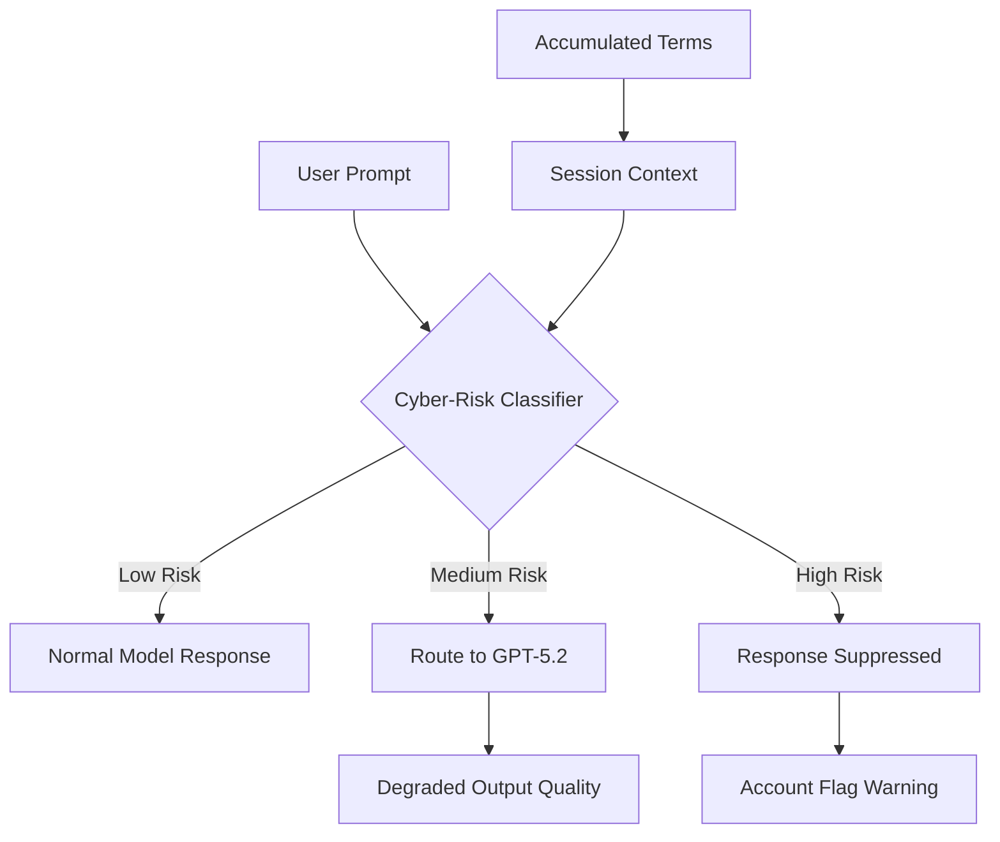
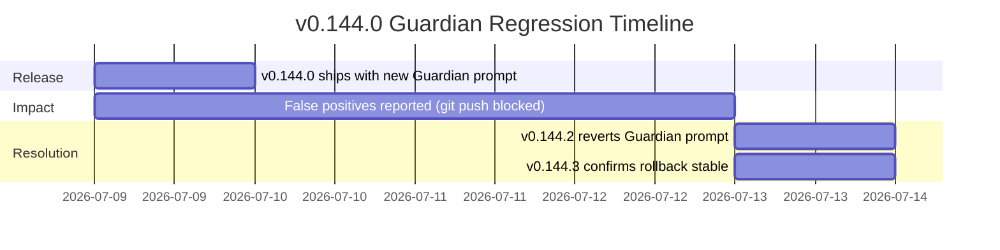

# The Guardian False-Positive Crisis: When Codex CLI's Safety Classifier Blocks Legitimate Development — and How to Fight Back


---

Between May and July 2026, a pattern emerged across the Codex CLI issue tracker that no amount of prompt engineering could resolve: legitimate developers — security professionals, SREs, DevOps engineers, and even game designers — found their sessions interrupted, responses hidden, and accounts flagged by Codex's automated cyber-risk classifier [^1][^2][^3]. The problem culminated in v0.144.0's Guardian prompting regression on 9 July 2026, which mistakenly classified normal `git push` operations to private repositories as data exfiltration attempts, forcing an emergency rollback within four days [^4][^5].

This article examines how the classifier works, why false positives cluster around specific development domains, what the v0.144.0 incident reveals about prompt-based safety architectures, and what practical steps affected developers can take today.

---

## How the Cyber-Risk Classifier Works

Codex's safety architecture operates at multiple layers. The cyber-risk classifier sits between the user's prompt and the model, analysing conversational context for signals that resemble offensive security activity [^6]. When triggered, one of two things happens:

1. **Model downgrade**: High-risk traffic is routed from the current model (e.g. GPT-5.6 Sol) to a less cyber-capable model (GPT-5.2), degrading output quality [^6].
2. **Response suppression**: The response is hidden entirely, with a warning that the account has been "flagged for potentially high-risk cyber activity" [^1][^7].

The classifier appears to operate on conversational context rather than individual command intent [^2]. Once a session accumulates enough security-adjacent terminology, subsequent benign commands inherit the elevated risk score.



---

## The Trigger Vocabulary Problem

The classifier reacts to terms that are ambiguous in isolation but common in legitimate development workflows [^2][^3]:

| Term | Legitimate Context | Flagged As |
|------|-------------------|------------|
| `token` | OAuth refresh tokens, JWT validation | Credential theft |
| `authorization` | HTTP header middleware | Access bypass |
| `HMAC` | Webhook signature verification | Cryptographic attack |
| `payload binding` | Request validation middleware | Exploit construction |
| `HTTP 403` | Permission testing, debugging | Privilege escalation |
| `mutation regression` | GraphQL test maintenance | System manipulation |
| `exfiltration` | Data pipeline documentation | Active data theft |
| `risk`, `mitigation` | Project management, compliance | Threat activity |

The classifier does not preserve ownership context [^1]. Writing "fix the HMAC validation in *my* authentication middleware" and "bypass HMAC validation in *their* authentication system" trigger similar confidence scores, because the classifier evaluates term co-occurrence rather than semantic intent.

---

## The v0.144.0 Guardian Regression Incident

On 9 July 2026, Codex CLI v0.144.0 shipped with a Guardian auto-review prompting update [^4][^5]. The new prompt was intended to improve detection of genuinely dangerous operations, but it introduced a catastrophic false-positive rate:

- **Normal `git push` to private repos** → flagged as data exfiltration [^4]
- **Standard npm/pip package publishing** → flagged as supply-chain attack
- **Routine credential rotation scripts** → flagged as credential harvesting

The regression was severe enough that OpenAI reverted the change entirely. v0.144.2, released on 13 July 2026, restored the previous Guardian auto-review policy, request format, and tool behaviour [^5].

### Timeline



### What Went Wrong

The incident reveals a structural fragility in prompt-based safety systems: the Guardian auto-review subagent evaluates agent actions through a natural-language prompt that classifies intent. When that prompt is updated — even with good intentions — the classification boundary shifts unpredictably. There is no regression test suite for prompt-based classifiers that can guarantee monotonic improvement [^4].

---

## The Scale of the Problem

The issue tracker tells the story. Between April and July 2026, at least ten substantive false-positive issues were filed by affected users [^1][^2][^3][^7][^8][^9]:

- **Issue #12171**: Account flagged during normal software development and internal documentation [^7]
- **Issue #19738**: Routine sysadmin/DevOps work blocked [^8]
- **Issue #23381**: Government/GSM development work blocked, with screenshots provided [^9]
- **Issue #28015**: Normal local repo maintenance repeatedly interrupted [^2]
- **Issue #32225**: GPT-5.6 classifiers make Codex App "operationally unusable" for blue-team work [^10]
- **Issue #32468**: Authorised defensive local-repo work flagged on 11 July 2026 [^1]

The common thread: affected users are disproportionately security professionals, infrastructure engineers, and anyone whose legitimate work involves security-adjacent vocabulary. The very people who most need capable AI assistance for defensive security are the ones most likely to be blocked.

---

## Trusted Access for Cyber — The Official Escape Hatch

OpenAI's official remedy is the Trusted Access for Cyber (TAC) programme [^6][^11]. Verified security professionals receive:

- Lower classifier sensitivity thresholds
- Access to GPT-5.5-Cyber, a model fine-tuned for permissive defensive security workflows [^11]
- Removal of automatic model downgrading for security-adjacent prompts

### TAC Requirements (as of June 2026)

- Identity verification through OpenAI's vetting process
- Advanced Account Security enabled (mandatory since 1 June 2026) [^11]
- Demonstrated professional security role

### TAC Limitations

The programme has significant gaps:

1. **Application backlog**: Multiple users report weeks-long wait times
2. **Scope limitation**: TAC covers the model tier, not the Guardian auto-review classifier in CLI specifically
3. **Self-referential failure**: Issue #22988 documents that Trusted Access verification itself was blocked by false positives [^12]
4. **Team coverage**: TAC is individual, not organisational — every team member needs separate verification

---

## Practical Defence Strategies for Affected Developers

While waiting for classifier improvements, several mitigation patterns reduce false-positive frequency:

### 1. Session Hygiene — Segregate Security Contexts

The classifier accumulates context across a session. Segregate security-adjacent work into dedicated, short-lived sessions:

```bash
# Start a fresh session for security-related work
codex --thread new "Review the authentication middleware changes"

# Don't mix security vocabulary into long-running feature sessions
```

### 2. Vocabulary Substitution in Prompts

Avoid trigger terms in your prompts where synonyms suffice:

```bash
# Instead of:
codex "Fix the token exfiltration vulnerability in the auth module"

# Try:
codex "Fix the credential-leak issue in the login module"
```

This is an imperfect workaround — you should not need to self-censor legitimate technical vocabulary — but it reduces classifier activation in practice.

### 3. Use `codex exec` for Non-Interactive Security Tasks

The `codex exec` non-interactive mode processes commands with less conversational context accumulation:

```bash
# Run security-adjacent operations in exec mode
codex exec "Run the OWASP dependency check and report findings" \
  --model o4-mini \
  --output-format json
```

### 4. File-Based Context Instead of Inline Prompts

Move security-specific instructions into AGENTS.md rather than typing them in prompts:

```toml
# In AGENTS.md - classifier sees file content differently from user prompts
## Security Testing Context
This project contains authentication middleware.
Standard operations include credential rotation, webhook signature verification,
and permission boundary testing. All operations target locally-owned resources.
```

### 5. Report Every False Positive

Use the `/feedback` command immediately after each false positive. OpenAI has stated that feedback volume directly influences classifier retuning priority:

```
/feedback This was a false positive. I was performing [specific task]
on my own repository. No offensive activity was involved.
```

---

## Configuration for Classifier Resilience

For teams that routinely work in security-adjacent domains, defensive configuration reduces disruption:

```toml
# config.toml - named profile for security work
[profiles.security-work]
model = "gpt-5.5-cyber"  # If TAC-approved
approval_policy = "unless-allow-listed"
notify = ["shell"]

# Shorter sessions reduce context accumulation
[profiles.security-work.session]
model_auto_compact_token_limit = 32000  # Compact aggressively
```

```toml
# requirements.toml - enterprise fleet policy
[security_team]
model_allowlist = ["gpt-5.5-cyber", "o4-mini"]
max_session_tokens = 65536  # Force shorter sessions
```

---

## The Architectural Lesson

The v0.144.0 incident and the broader false-positive pattern expose a fundamental tension in prompt-based safety architectures:

1. **Classifiers trained on offensive patterns inevitably flag defensive work** — the vocabulary overlap between "attacking a system" and "defending a system" is near-total.
2. **Prompt-based safety lacks formal verification** — unlike sandbox policies (Landlock, Seatbelt) that operate on deterministic rules, classifier prompts produce probabilistic outputs that shift with every update.
3. **Conversational context poisons future decisions** — once flagged, a session's risk score monotonically increases, creating a doom spiral.

The long-term solution likely requires structural changes: deterministic allowlists for verified accounts, per-repository trust signals, and classifier architectures that distinguish ownership context from action vocabulary. Until then, the workarounds above represent the pragmatic path forward.

---

## Citations

[^1]: GitHub Issue #32468 — "False-positive cybersecurity guard repeatedly hides authorized defensive local-repo work" (11 July 2026). https://github.com/openai/codex/issues/32468

[^2]: GitHub Issue #28015 — "False positive cybersecurity safety check repeatedly blocks normal local repo maintenance in Codex CLI" (2026). https://github.com/openai/codex/issues/28015

[^3]: GitHub Issue #19533 — "False positive cyber-safety flag on benign software engineering work" (2026). https://github.com/openai/codex/issues/19533

[^4]: Codex CLI Changelog — v0.144.0 release notes (9 July 2026). https://github.com/openai/codex/releases

[^5]: Codex CLI Changelog — v0.144.2 "Restored the previous Guardian auto-review policy, request format, and tool behavior after rolling back a prompting regression" (13 July 2026). https://github.com/openai/codex/releases/tag/rust-v0.144.2

[^6]: OpenAI — "Cyber Safety" developer documentation. https://developers.openai.com/codex/concepts/cyber-safety

[^7]: GitHub Issue #12171 — "Account being flagged for potentially high-risk cyber activity" (2026). https://github.com/openai/codex/issues/12171

[^8]: GitHub Issue #19738 — "False positive cybersecurity risk flags on routine sysadmin/devops work in Codex CLI" (2026). https://github.com/openai/codex/issues/19738

[^9]: GitHub Issue #23381 — "Critical: false-positive cyber-risk warnings still block normal Gov/GSM dev work" (19 May 2026). https://github.com/openai/codex/issues/23381

[^10]: GitHub Issue #32225 — "GPT-5.6 classifiers interrupt legitimate blue-team work and Codex App becomes operationally unusable" (July 2026). https://github.com/openai/codex/issues/32225

[^11]: OpenAI — "Scaling Trusted Access for Cyber with GPT-5.5 and GPT-5.5-Cyber" (May 2026). https://openai.com/index/gpt-5-5-with-trusted-access-for-cyber/

[^12]: GitHub Issue #22988 — "False-positive cybersecurity risk flags blocking normal Pro account usage — Trusted Access verification also blocked" (2026). https://github.com/openai/codex/issues/22988
