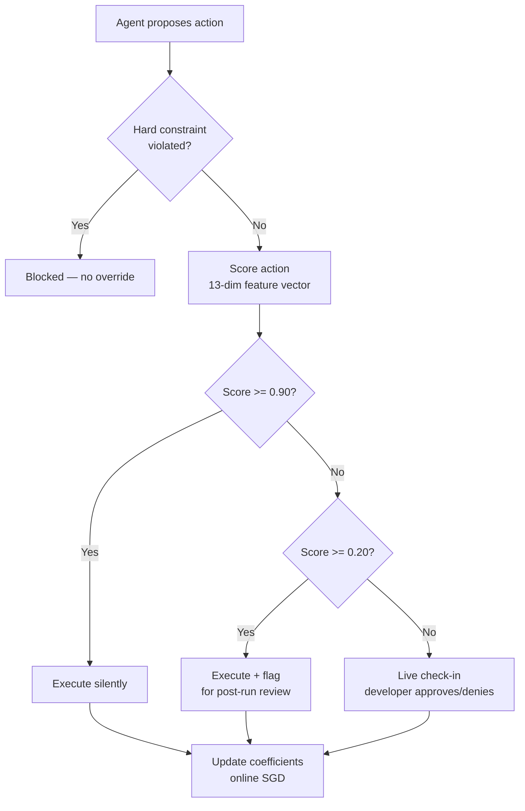
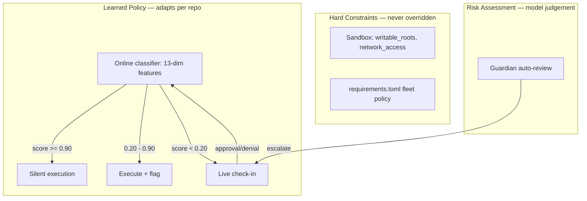

# Hedwig and the Case for Dynamic Autonomy: What Learned Trust Means for Codex CLI Approval Policies


---

Every Codex CLI user knows the ritual: pick `suggest`, `auto-edit`, or `full-auto`, then live with that choice for the duration of the session. The approval policy is a dial you set once. But a growing body of research argues that static permission modes are the wrong abstraction — that developer trust in an agent is not a constant but a *function* that shifts with task context, accumulated experience, and the specific files under the cursor.

Hedwig, a CLI-layer prototype presented at ACM CAIS 2026, makes that argument concrete [^1]. It replaces static permission presets with a learned policy that adjusts approval thresholds per repository, per file path, and per change pattern — all driven by the developer's own approval and denial history. The implications for Codex CLI's approval architecture are worth examining.

## The Static Autonomy Problem

Codex CLI's three approval modes map to progressively wider grants of trust [^2]:

| Mode | File edits | Shell commands | Typical use |
|------|-----------|---------------|-------------|
| `suggest` | Requires approval | Requires approval | Untrusted tasks, new repos |
| `auto-edit` | Auto-approved | Requires approval | Familiar codebases |
| `full-auto` | Auto-approved | Auto-approved | Disposable environments, CI |

This taxonomy is clean. It is also, according to Hedwig's formative survey of 21 senior engineers (20 of 21 with eight or more years of experience, 20 of 21 using coding agents weekly), insufficient [^1]. The survey identified two recurring frustrations:

1. **Autonomy calibration is a moving target.** Developers discover their preferred oversight level only after working with an agent over time. A `suggest` session that begins cautiously becomes tedious within minutes when the agent proves competent at routine edits.

2. **Task context matters more than global mode.** Eleven of 21 respondents preferred check-ins at key milestones rather than blanket approval or blanket autonomy. Only two wanted intervention solely on risky actions [^1].

A separate Microsoft Research study of 17 experienced developers corroborates this finding from a different angle: developers perform at least four distinct forms of oversight — a priori control, co-planning, real-time monitoring, and post-hoc review — and struggle most with reviewing agent-generated code rather than with granting permissions [^3]. The implication is that a binary approve/deny gate is the wrong checkpoint granularity.

## How Hedwig Works

Hedwig introduces a three-tier approval cascade governed by a learned scoring function [^1]:



The scoring engine is an online logistic regression classifier trained via stochastic gradient descent across a 13-dimensional feature vector capturing diff size, blast radius, change-pattern risk, prior approval/denial counts, security sensitivity, verification failure history, and model confidence [^1].

Three design choices stand out:

### Per-Repository Coefficient Persistence

Coefficients are stored per repository and persist across sessions. Five approvals on a utility file lower the check-in threshold for that path; three denials on an API file shift coefficients towards higher scrutiny [^1]. This means the policy for a mature, well-understood codebase naturally diverges from the policy for a repo the developer opened yesterday.

### Warm-Start Initialisation

Rather than starting from zero, the classifier initialises from engineering priors — sensible defaults that treat API signature changes as higher risk than documentation edits [^1]. This avoids the cold-start brittleness that would otherwise force excessive check-ins on first use.

### Behavioural Guidance Retrieval

Beyond numeric scoring, Hedwig stores developer corrections as text snippets retrievable by semantic similarity. When a developer corrects the agent ("preserve the nested response structure"), that correction is retrieved in future sessions when the agent encounters similar architectural decisions [^1]. This separates *what the agent should know* (guidance) from *what the agent is allowed to do* (policy).

## Hedwig vs. Claude Code: Early Numbers

The evaluation used synthetic traces derived from two backend tasks (adding a GET endpoint, extending with an optional filter) scored by an LLM judge [^1]:

| Condition | Check-in ratio | Recall | Precision |
|-----------|---------------|--------|-----------|
| Hedwig — cautious persona | 0.55 | 1.00 | 0.67 |
| Claude Code — cautious persona | 0.18 | 0.50 | 1.00 |
| Hedwig — permissive persona | 0.36 | — | 0.00 |
| Claude Code — permissive persona | 0.00 | — | — |

The headline result: Hedwig's cautious persona achieved perfect recall — every operation the judge deemed worthy of a check-in was surfaced to the developer — while Claude Code with hand-authored `CLAUDE.md` instructions missed half of them, silently passing API signature changes [^1]. The 19-point check-in ratio gap between cautious (0.55) and permissive (0.36) personas emerged from learned history alone, without any manual reconfiguration.

The trade-off is precision: Hedwig surfaced two false positives, interrupting for operations the judge considered safe. Whether this is acceptable depends on your tolerance for approval fatigue versus your tolerance for silent misses.

## What This Means for Codex CLI

Codex CLI already has the building blocks for adaptive autonomy, even if they are not wired together as a learning system:

### Smart Approvals and Prefix Rules

Since v0.120, Codex CLI's smart approvals system proposes execution policy rules based on observed approval patterns [^4]. Prefix rules match command prefixes (e.g., `["git", "add"]`) and auto-approve matching commands. The rule engine understands shell pipelines, splitting compound commands at safe operators and evaluating each component independently [^4].

This is a form of learned trust, but it operates at the command level rather than the change-pattern level. It cannot distinguish between `git add` on a test file (low risk) and `git add` on a production configuration (high risk) — the kind of contextual discrimination that Hedwig's 13-dimensional feature vector enables.

### Guardian Auto-Review

Guardian delegates eligible approval decisions to a reviewer subagent, escalating only genuinely risky operations to the human [^5]. This addresses approval fatigue from a different direction: rather than learning the developer's preferences, it applies the model's own judgement about risk.

The Hedwig research suggests these approaches are complementary. Guardian handles the *what is risky* question; a learned policy would handle the *what does this particular developer on this particular codebase consider risky* question.

### The Missing Piece: Per-Repository Learning

What Codex CLI lacks is Hedwig's per-repository coefficient persistence — a mechanism that adapts approval thresholds based on accumulated developer decisions across sessions. The current `approval_policy` is a session-level constant [^2]. There is no cross-session memory of which file paths have earned trust and which have not.

A practical implementation path would extend `config.toml` with a `[learned_policy]` section:

```toml
[learned_policy]
enabled = true
persist_path = "~/.codex/policies/"      # per-repo coefficient storage
proceed_threshold = 0.90                  # silent execution above this score
flag_threshold = 0.20                     # live check-in below this score
warm_start = "engineering_priors"         # initialisation strategy
```

Combined with existing `sandbox_mode` constraints as hard limits and Guardian as a risk assessor, this would create a three-layer autonomy stack:



## The Oversight Work That Remains

The Microsoft Research study on human oversight in practice identifies a finding that tempers enthusiasm for autonomy expansion: oversight is "not only reactive and retrospective but also preventative and proactive" [^3]. Developers do not merely approve or deny — they co-plan, monitor in real time, and review post hoc. A learned approval policy addresses only the approve/deny gate; it says nothing about the quality of the co-planning conversation or the depth of post-hoc review.

The same study found that developers use test results as a heuristic guarantee for code correctness [^3] — a pattern that maps directly to Codex CLI's verification step but also highlights the risk of over-reliance on test suites as a proxy for understanding. Dynamic autonomy that reduces check-ins may inadvertently reduce the developer's situational awareness of what the agent is actually doing.

Hedwig addresses this partially through its end-of-session transparency report, which separates policy-initiated check-ins from agent-initiated ones [^1]. Developers see whether interruptions stemmed from learned risk thresholds or from the model's own uncertainty. Codex CLI's existing `--print-instructions` diagnostic could be extended to provide similar per-session governance traces.

## Practical Takeaways

Until Codex CLI ships a learned-policy feature, developers can approximate dynamic autonomy with existing tools:

1. **Use named profiles as pseudo-adaptive modes.** Create `[profiles.cautious]` and `[profiles.trusted]` in `config.toml` with different `approval_policy` and `sandbox_mode` settings. Switch between them based on task context rather than committing to one mode per session.

2. **Review and prune smart approval rules weekly.** The `default.rules` file accumulates prefix rules that may no longer reflect your current trust boundaries [^4]. Treat it as a living policy document.

3. **Layer Guardian with manual approval.** Set `approval_policy = "unless-allow-listed"` with Guardian enabled to get model-judged risk assessment before the approval prompt reaches you [^5]. This simulates the middle band of Hedwig's three-tier cascade.

4. **Track your own approval patterns.** Session JSONL logs in `~/.codex/sessions/` record every approval and denial [^6]. A simple script counting approval rates per file path would reveal where your trust already exceeds your configured autonomy level.

## Looking Ahead

The Hedwig prototype is a research demo, not a production tool. Its evaluation used synthetic traces rather than a longitudinal field deployment, and the two-task scope is narrow [^1]. But the core insight — that developer trust is learned, contextual, and multi-dimensional — aligns with what practitioners report and what the oversight literature confirms [^3].

Codex CLI's architecture, with its layered separation of sandbox enforcement, approval policy, and Guardian review, is well-positioned to incorporate learned-policy features. The question is not whether adaptive autonomy is desirable — the survey data and the approval-fatigue problem make that clear — but how to make the learning transparent, inspectable, and revocable. Hedwig's `hw observe preferences` and `hw observe weights` commands, which let developers inspect and revoke learned trust, offer a template worth studying [^1].

Static permission modes got us this far. The next step is making the dial turn itself — carefully, visibly, and under the developer's thumb.

---

## Citations

[^1]: Shukla, T., Feng, K.J.K., Wang, L., Rostami, M. and Zhang, A.X. (2026) 'Hedwig: Dynamic Autonomy for Coding Agents Under Local Oversight', *ACM CAIS 2026 Demo Track*. arXiv:2605.11495. Available at: [https://arxiv.org/abs/2605.11495](https://arxiv.org/abs/2605.11495)

[^2]: OpenAI (2026) 'Agent approvals & security', *Codex Documentation*. Available at: [https://developers.openai.com/codex/agent-approvals-security](https://developers.openai.com/codex/agent-approvals-security)

[^3]: Dhanorkar, S., Passi, S. and Vorvoreanu, M. (2026) 'Human oversight of agentic systems in practice: Examining the oversight work, challenges, and heuristics of developers using software agents'. arXiv:2606.05391. Available at: [https://arxiv.org/abs/2606.05391](https://arxiv.org/abs/2606.05391)

[^4]: OpenAI (2026) 'Rules', *Codex Documentation*. Available at: [https://developers.openai.com/codex/rules](https://developers.openai.com/codex/rules)

[^5]: OpenAI (2026) 'Configuration Reference', *Codex Documentation*. Available at: [https://developers.openai.com/codex/config-reference](https://developers.openai.com/codex/config-reference)

[^6]: PixelPaw Labs (2026) 'Codex Trace: OpenAI Codex CLI session log viewer'. Available at: [https://github.com/PixelPaw-Labs/codex-trace](https://github.com/PixelPaw-Labs/codex-trace)
