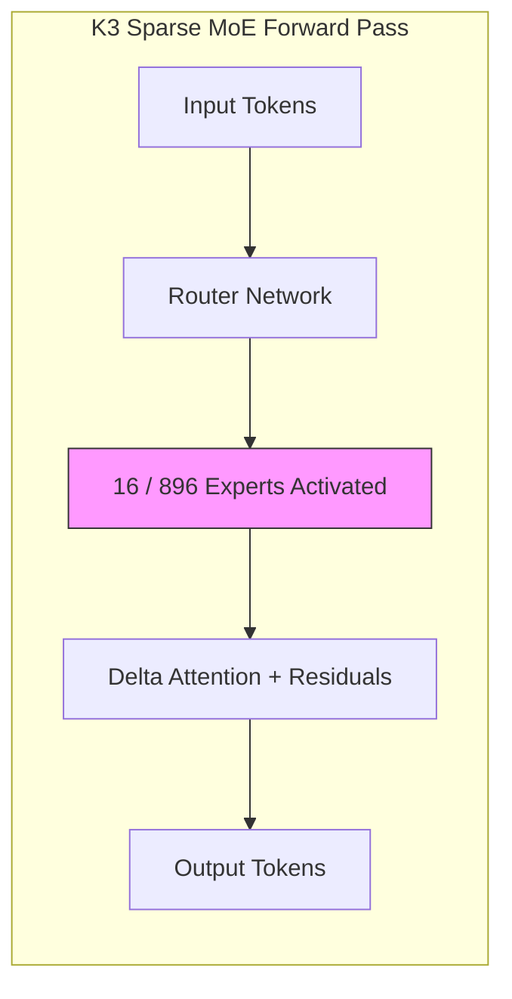
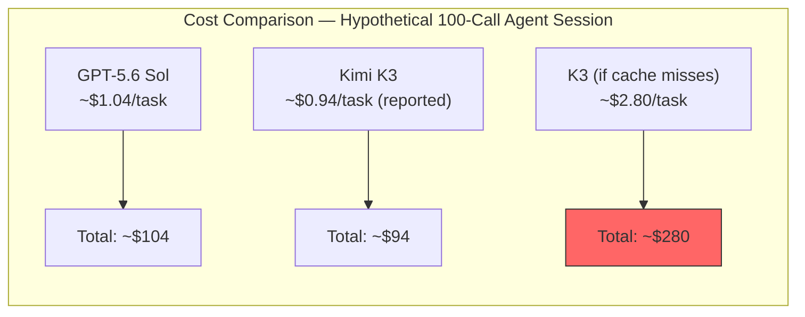

# Kimi K3 and the Largest Open-Weight Model Yet: What 2.8 Trillion Parameters Mean for Your Codex CLI Multi-Provider Strategy


---

On 16 July 2026, Beijing-based Moonshot AI released Kimi K3 — a 2.8-trillion-parameter mixture-of-experts model with a one-million-token context window and open weights promised by 27 July [^1]. Within hours it topped Arena.ai's Frontend Code evaluation at 1,679 Elo, ahead of Claude Fable 5 and GPT-5.6 Sol [^2]. The model's API speaks the OpenAI Chat Completions wire format, which means Codex CLI users can point a custom `[model_providers]` block at it today.

This article examines K3's coding-agent benchmarks, its architecture, and the practical question every Codex CLI practitioner now faces: when — if ever — should you route agent work to a third-party model?

## Architecture at a Glance

K3 is a sparse mixture-of-experts transformer with three proprietary innovations [^1]:

- **Kimi Delta Attention** reduces KV-cache pressure at long context lengths
- **Attention Residuals** add skip connections across attention layers
- **Stable LatentMoE** with Quantile Balancing routes tokens across 896 experts, activating 16 per forward pass

Weights ship in MXFP4 (weights) and MXFP8 (activations), trained with quantisation-aware fine-tuning from the SFT stage onward [^1]. Moonshot recommends a supernode with at least 64 accelerators for deployment [^4], though the MXFP4 quantisation significantly reduces memory requirements compared to full-precision weights.



## Coding Benchmark Scorecard

K3's coding results sit in the frontier cluster but not uniformly at the top. Moonshot's self-reported figures [^1] and independent evaluation from Artificial Analysis [^3] and NxCode [^4] paint a nuanced picture:

| Benchmark | K3 | GPT-5.6 Sol | Claude Fable 5 | Notes |
|---|---|---|---|---|
| DeepSWE | 67.5 | 73.0 | — | Kimi Code harness; 67.3 with mini-SWE-agent [^4] |
| Terminal-Bench 2.1 | 88.3 | 88.8 | 84.6 | Near-parity with Sol [^4] |
| FrontierSWE | 81.2 | — | 86.6 | Dominance rating; not yet on public leaderboard [^4] |
| ProgramBench | 77.8 | — | — | Raw hidden-test pass rate [^4] |
| SWE Marathon (20 tasks) | 42.0 | — | — | Long-horizon maintenance [^4] |
| Frontend Code Arena | 1,679 Elo | — | — | Blind developer voting [^2] |

Two observations stand out. First, **harness dependency matters enormously**: K3's DeepSWE score drops from 67.5 to 67.3 when swapping from KimiCode to mini-SWE-agent, and incompatible context compaction strategies can degrade quality further [^4]. Second, **long-horizon performance lags**: a SWE Marathon score of 42.0 suggests K3 struggles on precisely the chained, sequential maintenance tasks that production codebases demand [^4].

## The Benchmark Credibility Problem

Simon Willison, reviewing K3 the same day, made a point worth internalising: his long-running pelican SVG benchmark "no longer correlates with actual model quality" because it ignores "agentic tool calling and the ability to operate tools reliably as conversations grow in length" [^5]. He found that GLM-5.2 outperforms Claude Fable 5 on the pelican task despite clearly being the weaker model in practice.

The implication for Codex CLI users is direct. Codex CLI's value comes from its agentic scaffolding — sandbox enforcement, approval policies, PostToolUse hooks, Guardian auto-review — not from raw model capability. A model that scores well on isolated benchmarks may still choke on the 40th tool call in a long session because it loses track of file state, forgets earlier instructions, or hallucinates API signatures.

**No coding benchmark currently measures what Codex CLI actually does**: orchestrate dozens of sequential tool invocations inside a sandboxed, permission-gated loop. Until benchmarks catch up, treat all model comparisons with appropriate scepticism.

## Connecting K3 to Codex CLI

K3's API is OpenAI Chat Completions-compatible [^6], which means Codex CLI can connect via a custom provider block. The API endpoint lives at `api.moonshot.ai/v1`, or you can route through OpenRouter under the slug `moonshotai/kimi-k3` [^7].

### Direct Configuration

```toml
# ~/.codex/config.toml

[model_providers.kimi]
name = "Kimi (Moonshot AI)"
base_url = "https://api.moonshot.ai/v1"
api_key_env = "KIMI_API_KEY"
wire_api = "responses"
```

Then launch with:

```bash
codex --provider kimi --model kimi-k3 "refactor the payment module"
```

### Via OpenRouter

```toml
[model_providers.openrouter]
name = "OpenRouter"
base_url = "https://openrouter.ai/api/v1"
api_key_env = "OPENROUTER_API_KEY"
wire_api = "responses"
```

```bash
codex --provider openrouter --model moonshotai/kimi-k3 "migrate tests to vitest"
```

### Caveats

There are two compatibility wrinkles to watch:

1. **Reasoning is always on**: K3 does not support `reasoning_effort` values below `max` — the model's extended thinking is non-optional [^6]. Codex CLI sessions that set `reasoning.effort = "low"` in `config.toml` will either be ignored or error, depending on the provider's implementation.

2. **Wire format gap**: Codex CLI requires the Responses API wire format (`wire_api = "responses"`), but Moonshot's native endpoint speaks Chat Completions [^6]. This works today because Codex CLI's provider layer translates between the two, but subtle incompatibilities may surface with K3-specific parameters like the `thinking` field, which must be passed via `extra_body` rather than as a top-level parameter.

## Cost Architecture

K3's pricing looks competitive until you examine the detail [^1] [^3]:

| Tier | Price per MTok |
|---|---|
| Cache-hit input | \$0.30 |
| Cache-miss input | \$3.00 |
| Output | \$15.00 |

Moonshot reports cache-hit rates above 90% on coding workloads [^1], which drops effective input cost dramatically. But Artificial Analysis found that K3 consumed 130 million tokens across their evaluation suite — roughly double the median of 63 million — and generates output at 62 tokens per second, below the median 72 [^3]. High output pricing combined with high verbosity can produce surprisingly large bills.



The practical recommendation from NxCode is to use K3 selectively for "long, valuable, tool-heavy" work and maintain cheaper models for classification and simple edits [^4] — a tiered routing strategy that Codex CLI's profile system supports natively.

## A Multi-Provider Routing Strategy

Codex CLI's named profiles let you define per-task model routing without changing your default configuration:

```toml
# ~/.codex/config.toml

[profiles.default]
model = "o4-mini"

[profiles.heavy]
model = "gpt-5.6-sol"
provider = "openai"

[profiles.frontier-test]
model = "kimi-k3"
provider = "kimi"
```

```bash
# Quick edit — cheap, fast
codex -p default "fix the typo in README.md"

# Complex refactor — Sol's strength
codex -p heavy "extract the auth module into a separate package"

# Experimental — test K3 on a contained task
codex -p frontier-test "rewrite the CSV parser with streaming support"
```

This pattern gives you empirical data on model quality within your own codebase rather than relying on third-party benchmarks. Run the same task through two profiles, diff the outputs, and let your PostToolUse hooks and test suite be the judge.

## What Open Weights Change

K3's open-weight release, promised for 27 July [^1], will allow self-hosting on enterprise infrastructure. For organisations running Codex CLI behind air-gapped networks or with data-sovereignty requirements, this is significant. You would point Codex CLI at a local vLLM instance serving K3 with the same `[model_providers]` block pattern shown above.

Moonshot recommends at least 64 accelerators for production deployment [^4], making self-hosting a significant infrastructure commitment. That is expensive hardware, but it is hardware you control — no tokens leave your network, no third-party data processing agreements required. Moonshot has already contributed KDA prefill cache support to the vLLM project [^1], reducing the self-hosting friction.

## Practical Recommendations

1. **Do not switch your default model to K3 based on benchmarks alone.** The benchmarks do not measure Codex CLI's agentic loop behaviour. Test K3 on contained, reversible tasks first.

2. **Use profiles for A/B testing.** Run the same prompt through your current model and K3, then compare outputs. Your test suite is a better evaluator than any leaderboard.

3. **Watch the output token bill.** K3's verbosity and high output pricing (\$15/MTok) can surprise you. Monitor token usage via `codex --json` output or your provider's dashboard.

4. **Wait for independent harness results.** Moonshot's self-reported scores use KimiCode harness. Until independent groups reproduce results with standard harnesses, treat the numbers as indicative [^4] [^5].

5. **Plan for open weights.** If data sovereignty matters to your organisation, the 27 July release opens a self-hosted path. Start evaluating your GPU fleet capacity now.

## Citations

[^1]: Moonshot AI, "Kimi K3 Tech Blog: Open Frontier Intelligence," kimi.com, July 2026. [https://www.kimi.com/blog/kimi-k3](https://www.kimi.com/blog/kimi-k3)

[^2]: Tom's Hardware, "China's 2.8-trillion-parameter Kimi K3 beats Claude Fable 5 in Frontend Code Arena benchmark," July 2026. [https://www.tomshardware.com/tech-industry/artificial-intelligence/moonshot-releases-2-8-trillion-parameter-kimi-k3](https://www.tomshardware.com/tech-industry/artificial-intelligence/moonshot-releases-2-8-trillion-parameter-kimi-k3)

[^3]: Artificial Analysis, Kimi K3 evaluation data. Referenced via NxCode and Simon Willison. [https://artificialanalysis.ai/](https://artificialanalysis.ai/)

[^4]: NxCode, "Kimi K3 Benchmarks Explained: A Coding-Agent Evaluation Guide," July 2026. [https://www.nxcode.io/resources/news/kimi-k3-benchmarks-coding-agent-evaluation-guide-2026](https://www.nxcode.io/resources/news/kimi-k3-benchmarks-coding-agent-evaluation-guide-2026)

[^5]: Simon Willison, "Kimi K3, and what we can still learn from the pelican benchmark," simonwillison.net, July 2026. [https://simonwillison.net/2026/Jul/16/kimi-k3/](https://simonwillison.net/2026/Jul/16/kimi-k3/)

[^6]: Kimi API Platform, "API Overview," platform.kimi.ai. [https://platform.kimi.ai/docs/api/overview](https://platform.kimi.ai/docs/api/overview)

[^7]: OpenRouter, "Kimi K3 — API Pricing & Benchmarks." [https://openrouter.ai/moonshotai/kimi-k3](https://openrouter.ai/moonshotai/kimi-k3)
