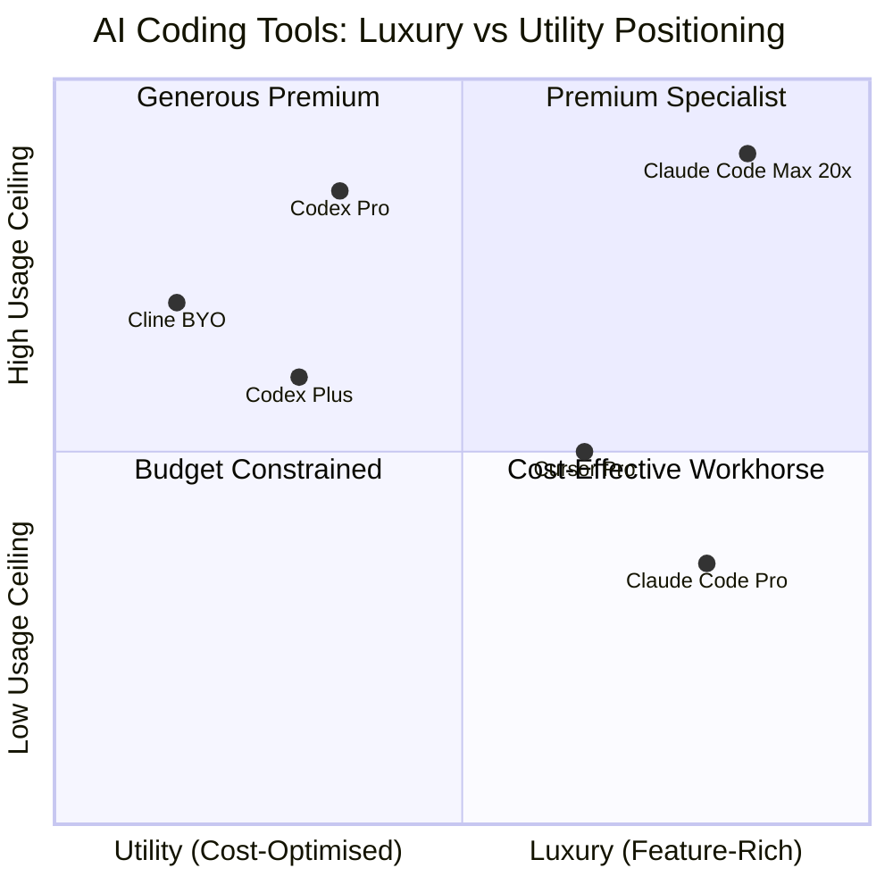

# The Luxury-vs-Utility Split in AI Coding Tools: Why Developer Choice Is No Longer About Intelligence


---

The AI coding tools market hit approximately \$12.8 billion in 2026, up from \$5.1 billion in 2024 [^1]. Benchmark scores have converged — Claude Code (Opus 4.6) scores 80.8% on SWE-bench Verified, Codex CLI (GPT-5.3-Codex) scores 77.3% on Terminal-Bench 2.0, and Cursor sits somewhere in between depending on which model you route through it [^2]. The differences are real but shrinking. What is *not* converging is everything else: pricing architecture, usage metering, UX philosophy, and ecosystem strategy.

The market has split into luxury and utility tiers. Understanding which side of the split you are on — and why — matters more than which model scores three percentage points higher on a benchmark you will never run.

## The Three-Tier Market Structure

### The Luxury Tier: Claude Code

Anthropic has positioned Claude Code as the premium reasoning engine. Opus 4.6 builds a mental map of your entire codebase before writing a line [^2]. The redesigned desktop app offers drag-and-drop pane arrangement, an integrated terminal, an in-app file editor, a rebuilt diff viewer, and a preview pane that runs local servers [^3]. Claude Design launched in April 2026, giving users inline commenting, direct text editing, and adjustment knobs for spacing, colour, and layout — with `/design-sync` pulling design system tokens into Claude Code [^4].

This is the Mercedes-Benz of coding agents. The experience is polished, the reasoning is deep, and the bill reflects it. Anthropic's own published figures put Claude Code at approximately £13 per developer per active day and £150–250 per developer per month [^5]. One documented complex refactoring hit \$155 on Claude Code versus \$15 on Codex — a 10× real-spend difference driven by token consumption [^5].

The usage model compounds the premium positioning. Claude Code uses a 5-hour rolling session window plus a weekly cap measured in *active model hours* — the time models spend processing, not wall-clock time [^5]. A single pool is shared across Chat, Code, Design, and Co-work. Heavy users report hitting the 5-hour limit regularly [^6].

### The Utility Tier: Codex CLI

Codex CLI is the Toyota Corolla [^6]. It is open-source, Rust-based, and defaults to cloud-sandboxed execution [^2]. GPT-5.3-Codex runs at approximately 65–70 tokens per second, with the Spark variant hitting 1,000+ tok/s on Cerebras hardware [^2]. In practice, Codex returns results in seconds where Claude Code takes tens of seconds.

On 9 July 2026, OpenAI merged Codex into the ChatGPT desktop app for macOS and Windows [^7]. Chat, Work, and Codex became three tabs in a single application — available on every plan, including Free [^7]. This was a distribution play: Codex gained ChatGPT's hundreds of millions of users overnight, whilst keeping dedicated features like inline diff editing, pull request review in the sidebar, and multi-repository projects [^7].

The usage architecture is the critical differentiator. Codex keeps chat and coding usage pools *separate* [^6]. On ChatGPT Plus (\$20/month), you get 15–80 local messages, 5 cloud tasks, and 5 code reviews per 5-hour window [^5]. Personal resets (30-day tokens) and frequent global resets mean heavy users rarely exhaust their allowance [^6]. An \$8/month Go tier exists for light usage [^5].

### The Hybrid Tier: Cursor and Friends

Cursor occupies a third position — the premium IDE wrapper. At \$4 billion ARR with 64% Fortune 500 penetration [^1], it has become the fastest-growing SaaS company of all time. But Cursor is fundamentally a harness, not a model. It routes to whichever model you choose, making it simultaneously luxury (polished UX, \$200/month Max tier) and utility (bring-your-own-key flexibility).

The open-source terminal agents — Cline, Aider, Gemini CLI, OpenCode — occupy the extreme utility end at \$2–5/month with BYO API keys [^8].

## Why the Split Matters More Than Benchmarks



Three structural forces drive the split:

### 1. Usage Economics, Not Model Intelligence, Determines Daily Experience

JetBrains' April 2026 survey found Claude Code is the most-loved tool (46% satisfaction) but also the most-limiting [^1]. When your shared usage pool means a complex Design session eats into your Code allowance, the premium experience acquires a hidden tax. Codex's pool isolation means coding never competes with chat for capacity [^6].

For heavy users — those running 6+ hours of active coding per day — the effective cost gap is stark:

```toml
# Approximate monthly cost at heavy usage (6h+ active/day)

[claude_code]
plan = "Max 5x"           # £100/month
effective_daily_cap = "moderate"
pool_shared = true        # chat + code + design compete

[codex]
plan = "Pro"              # £200/month  (or Plus at £20)
effective_daily_cap = "generous"
pool_shared = false       # coding pool is independent
```

### 2. Distribution Strategy Creates Different Lock-In Vectors

Claude Code remains a standalone CLI tool and desktop app. Its lock-in vector is *configuration depth*: teams invest in `CLAUDE.md` files, custom slash commands, and Agent Teams workflows [^9]. The switching cost is institutional knowledge encoded in Anthropic-specific formats.

Codex's lock-in vector is *platform ubiquity*. Once you are inside the ChatGPT desktop app — chatting, working, and coding in one surface — the friction of opening a separate tool increases. The merger of Chat, Work, and Codex into a unified app is the super-app strategy [^7]: make Codex the default by making it unavoidable.

Cursor's lock-in is the IDE itself. With revenue from seat licences rather than token consumption, Cursor's incentive is to keep you in its editor — regardless of which model you route through it [^1].

### 3. The Workflow Determines the Tier

The best developers in 2026 do not choose one tool. They choose *per task* [^2]:

| Task Type | Optimal Tier | Why |
|---|---|---|
| Complex multi-file refactoring | Luxury (Claude Code) | Deep reasoning across dependency graphs |
| Rapid prototyping | Utility (Codex CLI) | Speed and token efficiency |
| Code review and security audit | Luxury (Claude Code Agent Teams) | Coordinated multi-agent review |
| CI/CD integration | Utility (Codex CLI) | Cloud sandbox, `codex exec` |
| Design-to-code handoff | Luxury (Claude Design → Code) | Integrated design system sync |
| Quick bug fixes | Utility (Codex CLI or Cline) | Cost per interaction |

The hybrid workflow — Codex for speed, Claude for depth — is increasingly the senior developer default [^2].

## The Moat Question: Premium UX or Generous Capacity?

Claude Code's moat is *capability density*. The redesigned desktop app, Claude Design integration, Agent Teams, and the forthcoming `/ultrareview` slash command create a feature surface that is genuinely difficult to replicate. But features only matter if you can use them before hitting a rate limit.

Codex's moat is *distribution and cost structure*. Available on every ChatGPT plan including Free, with isolated usage pools and frequent resets, it optimises for *volume of interactions*. The ChatGPT desktop merger means Codex is the default coding agent for hundreds of millions of users who never explicitly chose it [^7].

Neither moat is decisive. The market is likely to sustain both tiers indefinitely, as it has with premium and utility options in every other developer tooling category — from JetBrains IntelliJ (premium) vs VS Code (utility), to GitHub Enterprise vs GitLab CE.

## Practical Implications for Team Leads

If you are choosing tools for a team, the decision framework is straightforward:

1. **Measure active coding hours per developer per day.** If your team averages under 3 hours of active model time, Claude Code Pro at £20/month is sufficient and the reasoning quality is unmatched.

2. **Audit your usage pool conflicts.** If developers also use Claude for chat, design, or research, the shared pool will limit coding capacity. Codex's isolated pools avoid this entirely.

3. **Evaluate your CI/CD integration needs.** Codex's cloud sandbox and `codex exec` integrate more naturally with automated pipelines [^10]. Claude Code's strengths are interactive and review-oriented.

4. **Consider the configuration investment.** If your team already has extensive `CLAUDE.md` files, switching costs are real. If you are starting fresh, the lower-friction Codex onboarding — via a ChatGPT subscription your team likely already has — reduces procurement overhead.

5. **Budget for the hybrid.** The most productive teams in 2026 are running both. A Plus (\$20) + Pro (\$20) stack gives you utility Codex and luxury Claude Code for \$40/month — less than a single Cursor Max seat.

## The Coming Subsidy Cliff

One developer's warning deserves amplification: "We're drinking the Kool-Aid too much because one day the subsidies will end" [^11]. Both OpenAI and Anthropic are subsidising model usage heavily to win market share. When subsidised pricing ends — and it will — the luxury-vs-utility split will widen further. Teams that have built workflows dependent on unlimited Claude Code Max usage may face painful adjustments.

The prudent strategy is to build tool-agnostic workflows where possible, invest in portable configuration formats like `agents.md` rather than vendor-specific ones, and treat the current pricing as a temporary window for experimentation rather than a permanent baseline.

---

## Citations

[^1]: [Cursor AI Revenue and Market Share 2026](https://www.getpanto.ai/blog/cursor-ai-statistics) — Cursor at \$4B ARR, \$12.8B total market, JetBrains survey data on satisfaction (46% Claude Code, 19% Cursor, 9% Copilot)
[^2]: [Claude Code vs Codex CLI 2026 Comparison](https://www.termdock.com/en/blog/claude-code-vs-codex-cli) — SWE-bench 80.8% (Claude), Terminal-Bench 77.3% (Codex), token speeds, hybrid workflow recommendation
[^3]: [Redesigning Claude Code on Desktop for Parallel Agents](https://claude.com/blog/claude-code-desktop-redesign) — Drag-and-drop panes, integrated terminal, in-app file editor, diff viewer, preview pane
[^4]: [Introducing Claude Design by Anthropic Labs](https://www.anthropic.com/news/claude-design-anthropic-labs) — Inline commenting, direct text editing, adjustment knobs, `/design-sync`, Claude Code handoff
[^5]: [Claude Code vs Codex Pricing and Limits (July 2026)](https://www.morphllm.com/comparisons/codex-vs-claude-code) — \$13/dev/day average, \$155 vs \$15 refactoring cost, 5-hour windows, message allowances, active model hours
[^6]: James NoCode — *Codex vs Claude Code (2026)* (YouTube, 2026-07-10) — Mercedes/Corolla framing, separate usage pools, rate-limit experience comparison
[^7]: [Codex + ChatGPT + GPT-5.6: OpenAI's July 9 Release Deep Dive](https://kie.ai/blog/codex-chatgpt-work-gpt-5-6-analysis) — Merger into ChatGPT desktop app, three-tab structure, availability on Free plan
[^8]: [AI Coding Tools 2026: Complete Guide](https://www.the-ai-corner.com/p/ai-coding-tools-complete-guide-2026) — Open-source terminal agents (Cline, Aider, Gemini CLI) at \$2–5/month BYO key
[^9]: [Agent Instruction Files: agents.md, CLAUDE.md, and Cross-Tool Portability](https://danielvaughan.com/articles/2026-05-27-agent-instruction-files-agents-md-claude-md-cross-tool-portability-codex-cli/) — Configuration lock-in via vendor-specific instruction files
[^10]: [Codex CLI Changelog July 2026](https://learn.chatgpt.com/docs/changelog) — Remote Control QR pairing, DigitalOcean plugin, token budgets, multi-agent delegation, indexed web search
[^11]: Ras Mic, in Riley Brown & Ras Mic — *OpenAI Just Merged ChatGPT and Codex* (YouTube, July 2026) — Warning on subsidised pricing sustainability
