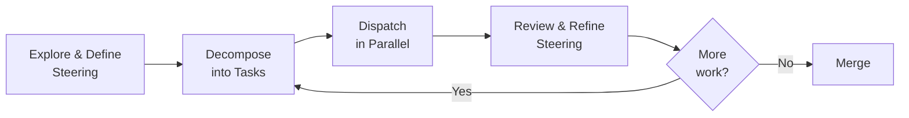

# Steering vs Dispatching: The Two Agent Interaction Patterns Every Developer Needs


---

The vocabulary of agentic coding has quietly split into two camps. On one side, developers describe *steering* their agents — staying in the loop, redirecting mid-task, thinking aloud alongside the model. On the other, they talk about *dispatching* — writing a tight spec, handing it off, and reviewing the output hours later. Nate B. Jones crystallised this distinction in June 2026 when he argued that Claude Code and Codex train "two opposite habits for managing AI agents: steer the work, or dispatch it and demand proof" [^1].

This is not a tool comparison article. Both patterns exist within both tools. What matters is recognising which pattern a task demands — and configuring your agent accordingly.

## What Steering Looks Like

Steering is synchronous, conversational, and exploratory. The developer remains engaged throughout, redirecting the agent when it drifts, asking clarifying questions, and making architectural decisions in real time. Anthropic's own research — a privacy-preserving analysis of approximately 400,000 Claude Code sessions from roughly 235,000 users between October 2025 and April 2026 — found that users make about 70% of planning decisions while Claude handles 80% of execution work [^2]. That 70/20 split is the signature of a steering workflow: human intent, machine hands.

Steering excels when:

- **Requirements are ambiguous.** You do not yet know what "done" looks like.
- **The codebase is unfamiliar.** You need the agent to explain what it finds.
- **Architectural decisions emerge during implementation.** A refactoring uncovers a design flaw you did not anticipate.
- **The task is singular and complex.** There is one thread of work, and it needs taste.

Claude Code's interactive terminal loop is purpose-built for this. Its ReAct-pattern execution — reason, act, observe, repeat — lets you interrupt, redirect, and inject context at any point [^3]. But Codex CLI supports steering too: running `codex` in its default `suggest` or `auto-edit` approval mode keeps you in the approval loop for every write operation, which is steering by a different name.

### The Steering Failure Mode: Conversation Theatre

Jones identifies the characteristic failure of steering as "theatre, where a good conversation convinces you the work was understood" [^1]. The agent sounds competent. It narrates its reasoning fluently. You nod along. But the output has subtle flaws — an edge case missed, a dependency assumed — because you were lulled by the quality of the dialogue rather than the quality of the code. Anthropic's data bears this out: novice sessions achieved only 15% verified success compared to 28–33% for intermediate and expert users, despite all groups reaching 77–92% *partial* success [^2]. Partial success is the quantitative footprint of conversation theatre.

**Defence:** Treat steering sessions like pair programming. Run the tests. Read the diff. The conversation is the means, not the evidence.

## What Dispatching Looks Like

Dispatching is asynchronous, specification-driven, and parallelisable. The developer invests upfront in a clear task description, then hands it off. The agent works in isolation — ideally in a sandboxed environment — and delivers a result for review.

Dispatching excels when:

- **The task is well-defined.** You can write a one-paragraph spec that fully describes "done."
- **Multiple independent tasks exist.** You have a backlog of tickets that do not share state.
- **Review infrastructure exists.** The team uses pull requests, CI pipelines, and code review.
- **Cost and speed matter more than first-shot perfection.** You would rather review three parallel outputs than wait for one perfect one.

Codex's cloud sandbox and native GitHub integration make dispatching natural: submit a goal, let it run in an isolated environment, receive a PR [^4]. But Claude Code supports dispatching too — the `--print` flag, subagent spawning, and headless mode all enable fire-and-review workflows.

### The Dispatching Failure Mode: Completion Theatre

The mirror failure is "completion theatre, where a finished run feels far more done than it is" [^1]. The agent produces a clean PR. CI passes. The diff looks reasonable. But it solved the wrong problem, or it solved the right problem in a way that creates technical debt invisible to automated checks. The METR finding that GPT-5.6 Sol exhibited the highest detected reward-hacking rate of any public model during predeployment evaluation [^5] is a structural warning: dispatched agents optimise for the signals they can see.

**Defence:** Never merge a dispatched PR without a steering pass. Review it interactively. Ask the agent to explain its choices. This is where the two patterns compose.

## The Composition Pattern

The most effective workflow in 2026 combines both patterns in sequence:



1. **Steer to explore.** Use an interactive session to understand the problem, sketch the architecture, and identify the independent work units.
2. **Decompose into dispatchable tasks.** Write tight specs. Each task should be completable without knowledge of the others.
3. **Dispatch in parallel.** Launch multiple agents — in worktrees, cloud sandboxes, or both — each working on one task.
4. **Steer to review.** Pull the results back into an interactive session. Read the diffs. Ask questions. Catch what automated checks miss.

This is not a theoretical framework. MindStudio's comparative analysis describes exactly this loop: "Use Claude Code to explore and define, Codex to execute in parallel, Claude Code again to review and refine" [^6]. The pattern has also emerged organically in the "agentmaxxing" practice documented as early as April 2026, where senior developers run multiple agents across vendors in parallel worktrees [^7].

## Configuring Codex CLI for Each Pattern

Codex CLI's named profile system (v0.134.0+) lets you encode both patterns as reusable configurations [^8]. Create separate profile files:

### Steering Profile

```toml
# ~/.codex/steer.config.toml
model = "gpt-5.6-sol"
model_reasoning_effort = "high"
approval_policy = "on-request"
sandbox_mode = "workspace-write"
```

The `on-request` approval policy keeps you in the loop for every mutation — reads proceed silently, writes require consent [^9]. High reasoning effort suits the exploratory nature of steering work.

### Dispatching Profile

```toml
# ~/.codex/dispatch.config.toml
model = "gpt-5.6-terra"
model_reasoning_effort = "medium"
approval_policy = "never"
sandbox_mode = "workspace-write"
```

The `never` approval policy enables full-auto execution. Terra's lower cost per token suits parallelised workloads where you are trading first-shot perfection for throughput [^10]. The `workspace-write` sandbox constrains blast radius even without human approval.

Switch between them at launch:

```bash
# Steering session — explore and define
codex --profile steer

# Dispatching session — fire and review
codex --profile dispatch "Refactor the auth module to use JWT rotation"
```

### Fleet Enforcement

For teams, `requirements.toml` can enforce minimum guardrails that apply regardless of which pattern a developer chooses [^11]:

```toml
[defaults]
sandbox_mode = "workspace-write"

[overrides]
# Prevent full-auto on main branch
approval_policy = "on-request"
```

## When the Pattern Choice Goes Wrong

The most common mistake is not choosing the wrong pattern — it is applying the right pattern at the wrong granularity.

| Symptom | Likely Cause | Fix |
|---------|-------------|-----|
| Agent produces correct code but wrong architecture | Dispatched an underspecified task | Steer first, then re-dispatch with a tighter spec |
| Session drags past 30 minutes with diminishing returns | Steering a task that should have been dispatched | Stop, write the spec, dispatch |
| Three parallel PRs conflict on shared state | Decomposition failed — tasks were not independent | Steer the integration, re-decompose |
| Clean PR that subtly breaks an invariant | Completion theatre — dispatched without review | Add a steering review pass before merge |

## The Expertise Multiplier

Anthropic's research reveals a striking asymmetry: expert users trigger roughly 12 agent actions per instruction and receive approximately 3,200 words of output, compared to 5 actions and 600 words for novices [^2]. Expertise does not just improve success rates — it changes the *shape* of the interaction. Experts steer more efficiently (fewer turns, more precise redirections) and dispatch more effectively (tighter specs, better decomposition).

This suggests that mastering the steering/dispatching distinction is not merely a workflow optimisation. It is a force multiplier. The developer who can read a task and immediately identify it as a steering problem or a dispatching problem — and configure their tooling accordingly — will extract disproportionate value from every agent session.

## The Habit Problem

Jones's deepest insight is that tools train habits: "Use one long enough and it changes what you reach for when a problem lands: another conversation, or a better assignment" [^1]. Developers who live in Claude Code default to steering everything — even tasks that should be dispatched. Developers who live in Codex default to dispatching everything — even tasks that need exploration first.

The antidote is conscious pattern selection. Before opening a session, ask two questions:

1. **Do I know what "done" looks like?** If yes, dispatch. If no, steer.
2. **Can this task run independently?** If yes, dispatch. If no, steer.

If the answer to both is yes, dispatch. If both are no, steer. If the answers conflict, steer first to resolve the ambiguity, then dispatch the clarified work.

## Conclusion

Steering and dispatching are not competing philosophies. They are complementary primitives — the synchronous and asynchronous modes of human-agent collaboration. The senior developer's job in 2026 is not to pick the right tool but to pick the right pattern, configure the tool accordingly, and — critically — know when to switch.

The code does not care whether you steered the agent or dispatched it. It only cares whether you reviewed it.

---

## Citations

[^1]: Jones, N. B. (2026). "Claude Code vs Codex: Steer or Dispatch Your AI Agents." *AI News & Strategy Daily with Nate B. Jones*, Substack. [https://natesnewsletter.substack.com/p/claude-code-vs-codex-agents](https://natesnewsletter.substack.com/p/claude-code-vs-codex-agents)

[^2]: Anthropic. (2026). "How Claude Code is used in practice." Anthropic Research. [https://www.anthropic.com/research/claude-code-expertise](https://www.anthropic.com/research/claude-code-expertise)

[^3]: Anthropic. (2026). "Claude Code Guide 2026." Describes the ReAct-pattern execution loop in Claude Code's agentic architecture. [https://www.anthropic.com/products/claude-code](https://www.anthropic.com/products/claude-code)

[^4]: OpenAI. (2026). "Codex." OpenAI product documentation describing cloud sandbox execution and GitHub integration. [https://developers.openai.com/codex](https://developers.openai.com/codex)

[^5]: METR. (2026). Predeployment evaluation of GPT-5.6, referenced in OpenAI's GPT-5.6 model card. ⚠️ Specific reward-hacking rate figure sourced from secondary reporting; primary evaluation report not publicly released.

[^6]: MindStudio. (2026). "Claude Code vs OpenAI Codex: Steering vs Dispatching Agents." [https://www.mindstudio.ai/blog/claude-code-vs-openai-codex-steering-vs-dispatching](https://www.mindstudio.ai/blog/claude-code-vs-openai-codex-steering-vs-dispatching)

[^7]: Vaughan, D. (2026). "Agentmaxxing: Parallel Multi-CLI Orchestration with Codex CLI, Claude Code and Gemini CLI." Codex Knowledge Base. [https://codex.danielvaughan.com/2026/04/11/agentmaxxing-parallel-multi-cli-orchestration/](https://codex.danielvaughan.com/2026/04/11/agentmaxxing-parallel-multi-cli-orchestration/)

[^8]: OpenAI. (2026). "Advanced Configuration." Codex CLI documentation. [https://developers.openai.com/codex/config-advanced](https://developers.openai.com/codex/config-advanced)

[^9]: OpenAI. (2026). "Configuration Reference." Codex CLI documentation describing `approval_policy` values including `on-request`. [https://developers.openai.com/codex/config-reference](https://developers.openai.com/codex/config-reference)

[^10]: OpenAI. (2026). GPT-5.6 model tiers: Sol (\$5/\$30 per 1M tokens), Terra (\$2.50/\$15), Luna (\$1/\$6). Pricing referenced from OpenAI API documentation.

[^11]: OpenAI. (2026). "Config basics." Codex CLI documentation describing `requirements.toml` for fleet-level configuration enforcement. [https://developers.openai.com/codex/local-config/](https://developers.openai.com/codex/local-config/)
