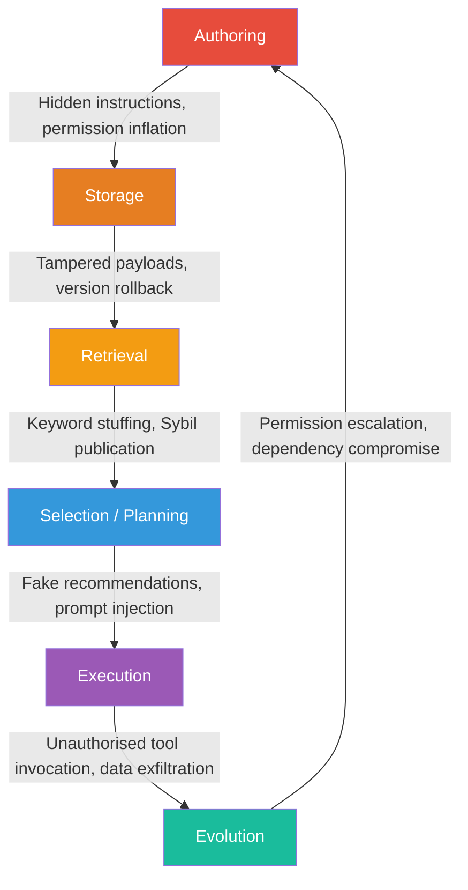
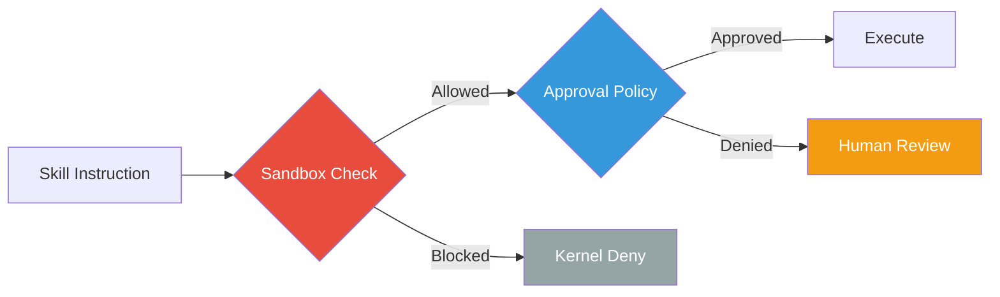

# Agent Skill Security: The Lifecycle Threat Model Every Codex CLI Developer Needs


---

You install a community skill from a marketplace, your agent discovers it, selects it, loads its SKILL.md, and executes its instructions. At which point could an attacker compromise your session?

The answer, according to two independent research teams publishing in mid-2026, is *every single one of those points* — and most existing defences only cover one.

## The Skill Lifecycle Is the Attack Surface

Reusable skills have become the primary extension mechanism for coding agents. Codex CLI discovers SKILL.md files via breadth-first traversal across six scopes — from the current directory up through the repository root, home directory, and system-level paths [^1]. Each skill is a markdown document with YAML frontmatter declaring a name, description, and optional dependencies. Codex loads only metadata (name, description, file path) until it decides to activate a skill, at which point the full SKILL.md instructions enter the context window [^2].

This lazy-loading architecture is elegant for context management — the metadata phase consumes at most 2% of the model's context window or 8,000 characters [^2]. But it also means the security properties of a skill are evaluated at multiple, distinct moments, each with its own trust assumptions and attack surface.

Two papers published in May–July 2026 have formalised this insight into actionable threat models.

## SkillSec-Eval: Six Stages, Five Defence Layers

Badhe and Tiwari's *Agent Skill Security* (arXiv:2607.13987, July 2026) presents SkillSec-Eval, a lifecycle-aware framework that models each skill as a five-component tuple: metadata, workflow, permissions, tools, and provenance [^3]. They map attack vectors across six lifecycle stages and evaluate defences against a corpus of 327 real-world skills spanning 15 capability clusters [^3].

The results are sobering:



### Defence effectiveness by stage

| Stage | Defence Strategy | Attack Success (Defended) | Attack Success (Baseline) |
|---|---|---|---|
| Repository Admission | Hybrid rules + LLM | 7.9% MAR | 52.9% MAR |
| Retrieval | Validation layer | 7.8–26.6% | 31.8–93.2% |
| Planner Selection | Metadata sanitisation | 0–8.7% | 4.7–45.6% |
| Runtime Execution | Taint tracking + policy | 23% ASR; 87% blocks | — |
| Evolution | Continuous validation | 92.5% detection | — |

The critical finding: **no individual defence is sufficient**. Advanced attacks bypass semantic or runtime filters alone [^3]. The hybrid admission gate (structural rules combined with LLM-based intent verification) reduces the malicious admission rate from 52.9% to 7.9%, but still admits roughly 1 in 13 poisoned skills [^3].

## SKILL.md as Operational Text, Not Documentation

Saha et al.'s earlier *Under the Hood of SKILL.md* (arXiv:2605.11418, May 2026) focused specifically on the SKILL.md file format, demonstrating that it functions as **operational text that shapes which capabilities agents find, trust, and use** [^4].

Their key findings across three registry-facing stages:

- **Discovery manipulation**: Short textual triggers embedded in SKILL.md metadata achieve up to 86% pairwise win rate and 80% Top-10 placement in embedding-based retrieval [^4]
- **Selection bias**: Description-only framing biases agents toward functionally equivalent adversarial variants, which are selected in 77.6% of paired trials [^4]
- **Governance evasion**: Semantic evasion strategies cause malicious skills to avoid blocking verdicts in 36.5–100% of cases [^4]

SkillSafetyBench (arXiv:2605.12015) complements this with 155 adversarial cases across 47 tasks and 6 risk domains, demonstrating that even benign user requests can trigger unsafe behaviour when task-relevant skill materials or local artefacts steer the agent [^5].

## Mapping the Threat Model to Codex CLI's Defence Stack

Codex CLI's security architecture was not designed around a skill-lifecycle threat model — it predates these papers. But its layered controls map surprisingly well to the six stages, with some notable gaps.

### Stage 1–2: Authoring and Storage (Admission Control)

Codex CLI's `requirements.toml` provides fleet-level governance that functions as an admission gate [^6]. Enterprise administrators can configure:

```toml
[skills]
allowed_sources = ["openai-official", "platform-team-internal"]
allow_implicit_invocation = false

[mcp_servers]
allowlist = ["github-mcp", "jira-mcp"]
```

The `allowed_marketplaces` directive restricts which skill repositories Codex will discover from [^7]. Combined with MDM distribution (via `com.openai.codex` preference keys for Jamf, Mosyle, or Kandji), this provides zero-touch admission control across a fleet [^6].

**Gap**: There is no built-in cryptographic signature verification for individual SKILL.md files. A skill that passes the marketplace allowlist check is trusted without content-integrity validation. The SkillSec-Eval hybrid admission gate (rules + LLM semantic check) has no direct analogue in Codex CLI today.

### Stage 3: Retrieval (Discovery Filtering)

Codex CLI's skill discovery uses BFS traversal up to depth 6, visiting at most 2,000 directories per root [^1]. The `enabled_tools` and `disabled_tools` configuration keys in `config.toml` provide static filtering of MCP tools [^8], and `allow_implicit_invocation: false` in `agents/openai.yaml` prevents a skill from being autonomously selected [^2].

```toml
# config.toml — restrict which skills can activate implicitly
[skills]
disabled_skills = ["community-*"]
```

**Gap**: There is no semantic diversity filtering or embedding-space anomaly detection during retrieval. The Sybil attack vector — publishing multiple near-identical malicious skills to dominate retrieval results — is unmitigated at this layer [^4].

### Stage 4: Selection (Planner Integrity)

When Codex's planner selects a skill, it reasons over the metadata visible in the skill list. The SkillSec-Eval paper found that metadata sanitisation (removing prompt injection patterns before planner reasoning) reduces attack success from 45.6% to 8.7% for fake recommendation attacks [^3].

Codex CLI's Guardian auto-review subagent provides a structural analogue here — it reviews agent actions through a four-tier risk classification before execution [^9]. However, Guardian evaluates *tool calls and commands*, not skill selection decisions. A malicious skill that describes itself innocuously in metadata but contains harmful instructions in its body passes Guardian's gate at the selection stage.

### Stage 5: Execution (Sandbox + Approval)

This is where Codex CLI's defences are strongest. The two-layer security model requires both sandbox and approval policy to agree before any action proceeds [^9]:



- **OS-level sandbox**: Landlock + seccomp on Linux, Seatbelt on macOS, restricted tokens + synthetic SIDs on Windows [^10]
- **Approval policy**: `untrusted` mode requires human confirmation for any state-mutating or network-accessing command [^9]
- **PreToolUse/PostToolUse hooks**: Deterministic hook pipelines can inspect and block tool calls before and after execution [^8]
- **Network proxy**: Domain allowlisting prevents data exfiltration to unexpected destinations [^9]

The SkillSec-Eval paper found that runtime taint tracking achieves only 66.67% accuracy due to semantic paraphrasing bypasses [^3]. Codex CLI's kernel-level sandbox sidesteps this weakness entirely — it does not rely on semantic analysis for enforcement. A skill that instructs the agent to exfiltrate data hits the Landlock/Seatbelt wall regardless of how cleverly the instruction is phrased.

### Stage 6: Evolution (Update Governance)

Skill evolution — where a previously benign skill becomes malicious through an update — is the least-addressed stage in Codex CLI. The SkillSec-Eval paper achieves 92.5% malicious detection through continuous validation that treats every version as a new admission event [^3].

Codex CLI has no built-in skill versioning or update validation. Skills loaded from the filesystem reflect whatever is currently on disc. In a Git-managed repository, this means a compromised dependency update that modifies a SKILL.md file takes effect immediately on the next agent session.

**Mitigation**: Pin skills in version control and use `PostToolUse` hooks to verify skill content hashes against a known-good manifest:

```bash
# .agents/hooks/post-skill-load.sh
sha256sum .agents/skills/*/SKILL.md | diff - .agents/skills/SKILL_HASHES || exit 1
```

## A Practical Hardening Checklist

Based on the SkillSec-Eval lifecycle model and Codex CLI's current capabilities, here is a defence-in-depth configuration:

```toml
# requirements.toml — enterprise fleet governance
[skills]
allowed_sources = ["openai-official", "internal-verified"]
allow_implicit_invocation = false

[sandbox]
sandbox_mode = "workspace-write"

[approval]
approval_policy = "untrusted"

[network]
allowed_domains = ["github.com", "api.openai.com"]
```

1. **Admission**: Restrict skill sources via `requirements.toml` allowlists. Reject community skills that have not passed internal review [^6]
2. **Retrieval**: Disable implicit invocation for untrusted skills. Require explicit `$skill-name` activation [^2]
3. **Selection**: Use `PreToolUse` hooks to log and audit skill selection events [^8]
4. **Execution**: Run in `untrusted` approval mode with `workspace-write` sandbox. Enable Guardian auto-review [^9]
5. **Evolution**: Pin SKILL.md content hashes in version control. Review skill diffs in PRs with the same rigour as code changes
6. **Fleet**: Distribute requirements via MDM. Enforce minimum Codex CLI version floors [^6]

## The Structural Gap: Pre-Context Poisoning

Both papers identify a structural limitation that no current coding agent fully addresses: **metadata injection and model steering occur before any hook or sandbox can intervene** [^3] [^4]. The SKILL.md description field influences planner reasoning at the metadata phase, before the full skill is loaded and before any PreToolUse hook fires.

This is the skill-security equivalent of the Unicode TAG-block problem in MCP tool descriptions — the attack surface exists in the space between what the human sees and what the model processes [^11]. Until skill metadata passes through a sanitisation layer that operates independently of the model's reasoning, this gap remains open.

The research consensus is clear: lifecycle-aware, layered defence is no longer optional. Codex CLI's kernel sandbox and approval policy provide strong execution-stage protection, but the pre-execution stages — admission, retrieval, and selection — require deliberate configuration and, in some cases, external tooling to harden.

## Citations

[^1]: [Codex CLI Skills System — DeepWiki](https://deepwiki.com/yulin0629/codex/7-command-execution-and-security) — BFS traversal up to depth 6, 2,000 directory limit, six discovery scopes.

[^2]: [Build Skills — OpenAI Codex Documentation](https://learn.chatgpt.com/docs/build-skills) — SKILL.md format specification, lazy loading, 2% context budget, `allow_implicit_invocation` flag.

[^3]: Badhe, S. & Tiwari, P. (2026). *Agent Skill Security: Threat Models, Attacks, Defenses, and Evaluation*. arXiv:2607.13987. — SkillSec-Eval framework, 327 skills, six-stage lifecycle, defence effectiveness metrics.

[^4]: Saha, S. et al. (2026). *Under the Hood of SKILL.md: Semantic Supply-chain Attacks on AI Agent Skill Registry*. arXiv:2605.11418. — 86% retrieval manipulation, 77.6% selection bias, governance evasion rates.

[^5]: SkillSafetyBench (2026). *Evaluating Agent Safety under Skill-Facing Attack Surfaces*. arXiv:2605.12015. — 155 adversarial cases, 47 tasks, 6 risk domains, non-user attack vectors.

[^6]: [Managed Configuration — OpenAI Codex Enterprise](https://developers.openai.com/codex/enterprise/managed-configuration) — `requirements.toml` fleet enforcement, MDM integration, `allowed_marketplaces` directive.

[^7]: [Codex CLI Plugin Marketplace — Codex Knowledge Base](https://codex.danielvaughan.com/2026/04/24/codex-cli-plugin-marketplace-building-distributing-extending/) — Plugin distribution, marketplace allowlisting, install/uninstall sync.

[^8]: [Configuration Reference — OpenAI Codex](https://developers.openai.com/codex/config-reference) — `enabled_tools`, `disabled_tools`, `tool_output_token_limit`, PreToolUse/PostToolUse hooks.

[^9]: [Agent Approvals & Security — OpenAI Codex](https://developers.openai.com/codex/agent-approvals-security) — Two-layer security model, Guardian auto-review, four-tier risk classification, approval policy modes.

[^10]: [Sandbox — OpenAI Codex](https://developers.openai.com/codex/concepts/sandboxing) — Landlock + seccomp (Linux), Seatbelt (macOS), restricted tokens + synthetic SIDs (Windows).

[^11]: Rashidi (2026). *Unicode TAG-Block Concealment of Tool-Metadata Payloads in the Model Context Protocol*. arXiv:2607.05744. — Approval-view fidelity gap in MCP metadata surfaces.
