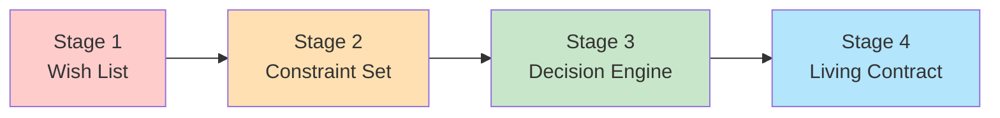
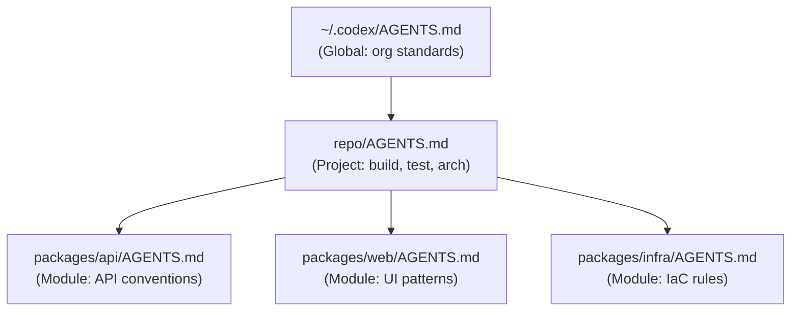

# The AGENTS.md Maturity Curve: How Project Context Evolves from Wish List to Force Multiplier


---

## Introduction

Most developers write their first AGENTS.md in under five minutes. It usually contains a language declaration, a vague style preference, and perhaps a build command. Three months later, the same file — if it survives — looks nothing like its origin. The instructions are shorter, sharper, and encode hard-won architectural decisions rather than aspirational guidelines.

This article maps the maturity curve that AGENTS.md files follow in practice, identifies the inflection points that trigger evolution, and provides concrete patterns for each stage. The framework draws on Augment Code's empirical research showing that a well-structured AGENTS.md can produce output improvements equivalent to upgrading from Haiku to Opus[^1], whilst a poorly structured one actively degrades performance.

---

## The Four Stages



### Stage 1 — The Wish List (Week 1)

The typical first AGENTS.md reads like a job specification written by someone who has never hired:

```markdown
# AGENTS.md

Use TypeScript. Follow best practices. Write clean code.
Keep functions small. Use meaningful variable names.
```

This fails because every directive is either a language default (the model already knows TypeScript conventions) or too vague to act upon ("best practices" maps to nothing concrete)[^2]. Augment Code's research found that removing an entire "Architecture" section — whilst keeping only commands, constraints, and non-standard patterns — produces identical agent behaviour at lower token cost[^1].

**Symptoms of Stage 1:**
- Prose paragraphs instead of actionable directives
- No build or test commands
- Ambiguous qualifiers ("be careful", "where appropriate")
- Zero encoding of project-specific decisions

### Stage 2 — The Constraint Set (Weeks 2–6)

The first real improvement arrives after a frustrating agent failure. The developer adds the specific command that would have prevented the error:

```markdown
## Build & Test

- Build: `pnpm build --filter=@acme/core`
- Test: `pnpm test --run --reporter=verbose`
- Lint: `pnpm lint --fix`

## Constraints

- Never import from `@acme/legacy` — that package is deprecated
- All API routes must use the `withAuth` middleware
- Database migrations use Drizzle, not raw SQL
```

This is where setup commands appear — identified as "high-leverage" content because agents waste enormous context guessing how to build and test[^3]. The file now contains negations (what *not* to do) alongside positive commands.

**Trigger:** The first time an agent breaks a build, introduces a banned dependency, or ignores a project convention.

### Stage 3 — The Decision Engine (Months 2–4)

The qualitative leap. Instructions move from "what to do" to "how to choose":

```markdown
## State Management Decision Table

| Scope | Duration | Solution |
|-------|----------|----------|
| Component-local | Render cycle | `useState` |
| Cross-component | Session | Zustand store in `stores/` |
| Persistent | Across sessions | Server state via tRPC query |
| Global config | App lifetime | Environment variable |

## Error Handling

When an API call fails:
1. Check if the error is retryable (5xx or network timeout)
2. If retryable: use exponential backoff, max 3 attempts
3. If not retryable: throw an `AppError` with the original status code
4. Never swallow errors silently — always log to `logger.error()`
```

Decision tables let agents pick the right pattern immediately without exploring alternatives[^1]. Numbered workflows are the strongest single pattern — Augment Code found that a well-written workflow moved agents from "unable to complete" to "correct on first try"[^1].

**Trigger:** Repeated agent output that is *technically correct* but architecturally wrong — using the right syntax with the wrong pattern.

### Stage 4 — The Living Contract (Month 5+)

At full maturity, AGENTS.md becomes a team governance artefact:

```markdown
## Non-Obvious Patterns

- `useServerAction()` hooks must be co-located with their form component
  (not extracted to a shared hooks directory). Rationale: server actions
  carry implicit security boundaries that break when shared.

- The `payments` module uses eventual consistency. Never read-after-write
  without a 500ms delay or a subscription confirmation.

## Review Criteria

Before proposing any PR:
1. Run `pnpm typecheck` — zero errors
2. Run `pnpm test --run` — all green
3. If touching `packages/auth`: run `pnpm test:e2e --project=auth`
4. Confirm no new `any` types introduced
```

The "Non-Obvious Patterns" section delivers the highest signal-to-noise ratio[^1]. These encode decisions that took the team hours or days to reach — knowledge that no model could infer from code alone.

**Trigger:** New team members (human or agent) repeatedly violating undocumented conventions.

---

## The Token Budget Trap

Every stage adds content, yet the Codex CLI imposes a default 32 KiB limit via `project_doc_max_bytes`[^4]. OpenAI's GitHub issue tracker shows silent truncation as the number-one AGENTS.md production problem[^5]. Teams that dump everything into the root file hit this ceiling quickly.

The mature response is hierarchical splitting:

```toml
# ~/.codex/config.toml
project_doc_max_bytes = 65536
project_doc_fallback_filenames = ["TEAM_GUIDE.md", ".agents.md"]
```



Nested files only load when you are working in that subtree[^4], so each subproject carries tailored instructions without consuming the global budget. OpenAI's own repository uses 88 AGENTS.md files across subcomponents[^3].

---

## Debugging the Active Chain

Since April 2026, Codex CLI supports `--print-instructions` to dump the merged instruction set for a session[^6]:

```bash
codex --print-instructions
```

This replaces the older workaround of asking the agent to summarise its loaded context. Use it when:

- Instructions appear to be ignored (likely truncated)
- Override files might be shadowing project-level rules
- A monorepo refactor has changed directory structure

---

## Anti-Patterns That Persist Across Stages

Regardless of maturity level, certain patterns reliably degrade output:

| Anti-Pattern | Why It Fails | Fix |
|---|---|---|
| Contradictory priorities without explicit ordering | Model skips verification, rushes to code | Number priorities explicitly |
| Prose paragraphs of architectural philosophy | Treated as background noise, not instructions | Convert to decision tables or numbered steps |
| "Be careful with..." | Too vague to constrain behaviour | Replace with concrete forbidden actions |
| Duplicated instructions across nested files | Conflicting versions cause unpredictable behaviour | Single source of truth per concern |

---

## The Standardisation Inflection

AGENTS.md is no longer a single-vendor format. In December 2025, the Linux Foundation formed the Agentic AI Foundation (AAIF) with AGENTS.md as a founding project alongside Anthropic's MCP and Block's goose[^7]. As of May 2026, AAIF has 190 member organisations[^8], and AGENTS.md is read natively by 30+ tools including Claude Code, GitHub Copilot, Cursor, Gemini CLI, Windsurf, and Devin[^3].

This standardisation accelerates the maturity curve. Instructions written for Codex CLI now transfer directly to Claude Code sessions — the same file governs both agents without modification. Teams no longer need parallel `.cursorrules`, `CLAUDE.md`, and `AGENTS.md` files encoding the same constraints in different dialects.

---

## Measuring Maturity

A quick self-assessment:

| Criterion | Stage 1 | Stage 2 | Stage 3 | Stage 4 |
|---|---|---|---|---|
| Contains build/test commands | ❌ | ✅ | ✅ | ✅ |
| Includes negations (what NOT to do) | ❌ | ✅ | ✅ | ✅ |
| Decision tables or numbered workflows | ❌ | ❌ | ✅ | ✅ |
| Non-obvious patterns section | ❌ | ❌ | ❌ | ✅ |
| Hierarchical split across directories | ❌ | ❌ | Partial | ✅ |
| Updated after every architectural decision | ❌ | ❌ | ❌ | ✅ |
| Verified with `--print-instructions` | ❌ | ❌ | ❌ | ✅ |

---

## Practical Migration Path

For teams stuck at Stage 1, the fastest route to Stage 3:

1. **Delete everything vague.** If the model would do it anyway without the instruction, remove it.
2. **Add your exact build, test, and lint commands.** Copy them from CI — flags included.
3. **Record every "no, not like that" correction** you give the agent this week. Each one becomes a constraint or decision table entry.
4. **Split when you exceed 150 lines.** Move module-specific instructions into subdirectories.
5. **Run `--print-instructions` weekly** to verify nothing is silently truncated.

The entire migration typically takes two to three weeks of normal development — not a dedicated documentation sprint.

---

## Conclusion

AGENTS.md maturity is not about writing more; it is about encoding *decisions* rather than *descriptions*. The inflection point arrives when teams stop telling agents what good code looks like and start telling them how to choose between valid alternatives. That shift — from description to decision — is what separates a wish list from a force multiplier.

---

## Citations

[^1]: Augment Code, "A good AGENTS.md is a model upgrade. A bad one is worse than no docs at all." (2026). https://www.augmentcode.com/blog/how-to-write-good-agents-dot-md-files

[^2]: Blake Crosley, "AGENTS.md Patterns: What Actually Changes Agent Behavior" (2026). https://blakecrosley.com/blog/agents-md-patterns

[^3]: Augment Code, "How to Build Your AGENTS.md (2026): The Context File That Makes AI Coding Agents Actually Work." https://www.augmentcode.com/guides/how-to-build-agents-md

[^4]: OpenAI, "Custom instructions with AGENTS.md" — official documentation. https://developers.openai.com/codex/guides/agents-md

[^5]: GitHub Issue #7138, "AGENTS.md is silently truncated without any warning within the TUI." https://github.com/openai/codex/issues/7138

[^6]: CodeGateway, "AGENTS.md for Codex CLI (2026): Lookup Order, Limits & Monorepo Templates." https://www.codegateway.dev/en/blog/agents-md-playbook-2026

[^7]: Linux Foundation, "Linux Foundation Announces the Formation of the Agentic AI Foundation (AAIF)." (December 2025). https://www.linuxfoundation.org/press/linux-foundation-announces-the-formation-of-the-agentic-ai-foundation

[^8]: Linux Foundation, "Agentic AI Foundation Adds 43 New Members." (May 2026). https://www.linuxfoundation.org/press/agentic-ai-foundation-adds-43-new-members-as-enterprise-and-government-adoption-of-open-agent-standards-accelerates
