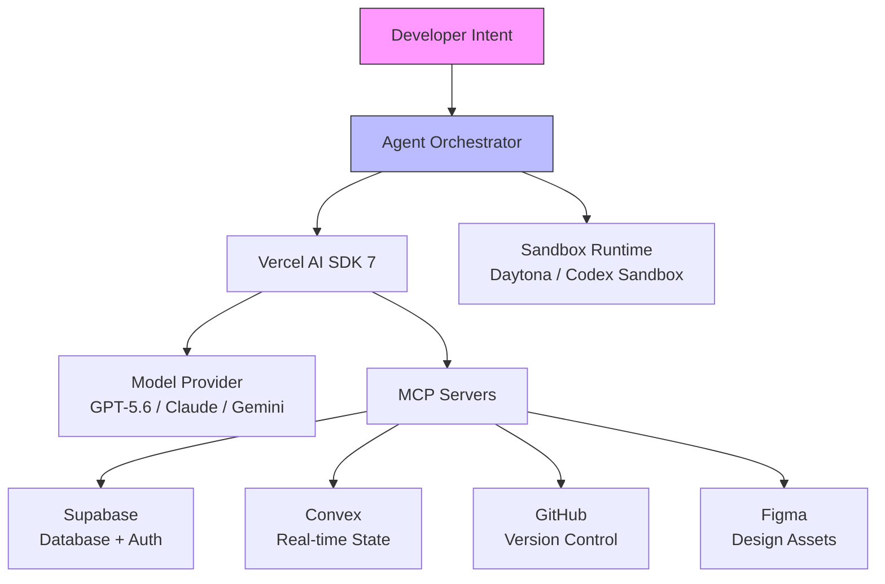
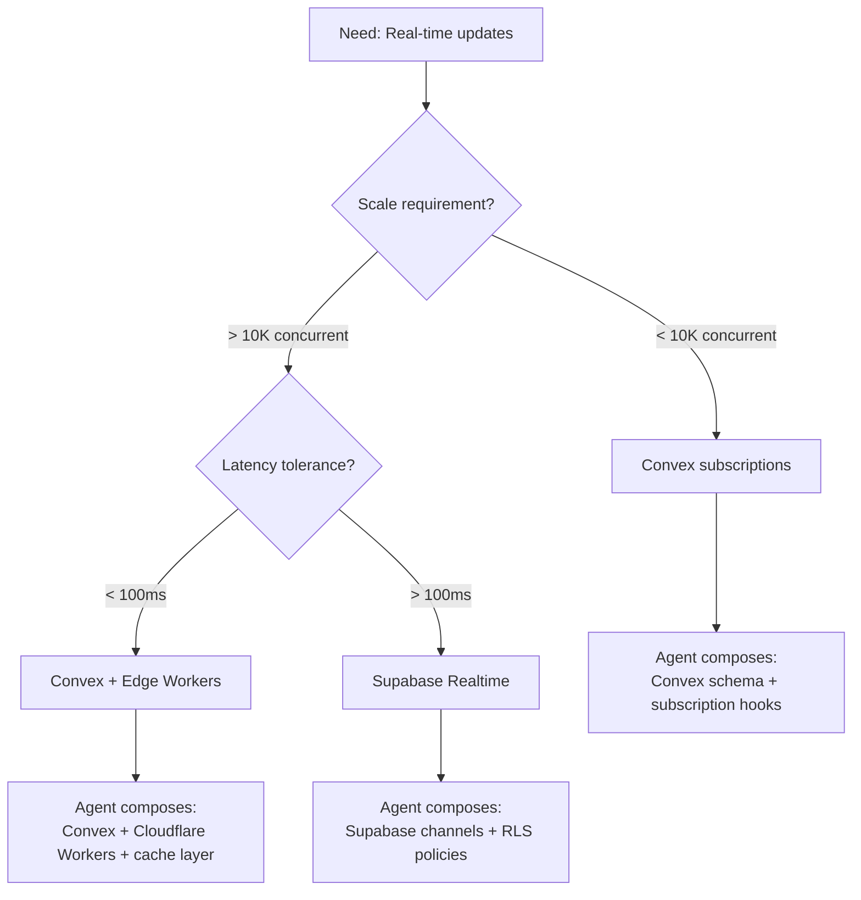

# The Building Block Economy: How Agent-Native Tools Are Reshaping What It Means to Build Software


---

## The Shift Nobody Named

Something fundamental changed in how software gets built during the first half of 2026, and it happened so gradually that most developers missed the inflection point. Coding agents stopped generating code from scratch and started *selecting and composing pre-built services*. The developer's value moved from implementation to orchestration.

Monthly MCP server downloads grew 970x between November 2024 and March 2026 — from roughly 100,000 to 97 million[^1]. Over 78% of enterprise AI teams now run at least one MCP-backed agent in production[^1]. This is not a protocol success story. It is evidence of a structural shift: agents now have more services to connect to than code to write.

## What the Building Block Economy Looks Like

The pattern is consistent across every major agent-native platform in 2026:

| Platform | Building Block Type | Agent Integration |
|----------|-------------------|-------------------|
| Vercel Marketplace | Agents + Services | Native integrations with unified billing[^2] |
| Convex | Components + real-time DB | Agent-aware state primitives[^3] |
| Supabase MCP | 20+ database tools | Schema inspection, migration generation, branching[^4] |
| Daytona | Sandboxed dev environments | Isolated execution contexts for agents |
| Codex CLI + MCP | Remote tool servers | `config.toml` service declarations[^5] |

The Vercel Marketplace now distinguishes between two types of AI building blocks: *Agents* (which handle specialised work on your behalf) and *Services* (which provide the infrastructure to build and run your own agents)[^2]. This taxonomy itself reveals the shift — platforms no longer sell you libraries to import; they sell you capabilities to invoke.

## The Composable Agent Stack

Vercel's AI SDK 7 embodies this pattern most explicitly. It provides a provider-agnostic interface for building agents that reason, call tools, run across many turns, and work across files and sandboxes[^6]. The SDK's evolution from `streamText` to composable agents mirrors the broader industry movement.



In this architecture, the agent's primary job is *selection and composition*, not generation. The developer's primary job is *defining the selection criteria*.

## Codex CLI as Composition Engine

Codex CLI's MCP integration makes it a natural composition engine. A typical `config.toml` for a full-stack project in mid-2026 looks like this:

```toml
[mcp.supabase]
type = "remote"
url = "https://mcp.supabase.com"
auth = "oauth2"

[mcp.linear]
type = "remote"
url = "https://mcp.linear.app"
auth = "oauth2"

[mcp.figma]
type = "remote"
url = "https://mcp.figma.com"
auth = "oauth2"

[mcp.github]
type = "stdio"
command = "npx"
args = ["-y", "@github/mcp-server"]
```

Each entry declares a service the agent can invoke. The agent selects which tools to use based on the task[^5]. When you ask Codex CLI to "add user authentication with email magic links", it does not generate an authentication system from first principles. It composes Supabase Auth's magic link flow, wires it into the existing schema, and generates only the glue code that connects components.

This is the building block economy in action: **the agent's intelligence is applied to selection and integration, not implementation**.

## The Developer as Architect-Selector

Fortune reported in March 2026 on the emergence of a "supervisor class" of developers whose primary skill is directing AI agents rather than writing code[^7]. This framing understates the complexity. The real skill is *knowing which blocks to select and how they compose*.

Consider the decision tree for adding real-time features to an application:



An agent can execute any of these paths. But *choosing the right path* requires understanding the project's constraints, the team's operational capabilities, and the long-term cost profile. This is architectural judgement — the skill that appreciates rather than depreciates as agents improve.

## The Composability Requirement

MCP's 2026 roadmap explicitly targets higher-level abstractions: servers advertising composable "skills" (multi-tool workflows) rather than individual tools[^1]. This lets agents reason about capabilities at a higher level of abstraction — selecting "deploy a preview environment" rather than individually invoking "create branch", "build image", "provision URL", "configure DNS".

The shift has implications for how you structure your `AGENTS.md`:

```markdown
## Service Selection Preferences

When adding new capabilities, prefer composing existing MCP services
over generating custom implementations:

1. Check available MCP tools first (`codex --list-tools`)
2. Use Supabase for all database operations (never raw SQL files)
3. Use Convex for real-time state (never custom WebSocket code)
4. Use Linear MCP for ticket management (never screen-scraping)

## Composition Constraints

- Maximum 3 MCP services per feature (complexity budget)
- All inter-service communication via typed interfaces
- Fallback to local implementation only if no MCP tool covers >80% of the requirement
```

This is the new form of architectural governance: *constraining which blocks the agent can select from*.

## When Composition Fails

The building block economy has failure modes that differ from traditional development:

**Service version drift.** When Supabase MCP updates its schema tool API, your agent's composition patterns may silently break. Unlike a pinned library version, remote MCP servers can change underneath you[^8].

**Abstraction leakage.** Agents compose services at the interface level. When a bug occurs at the interaction boundary between two services — say, a race condition between Convex's real-time subscription and Supabase's RLS policy evaluation — the agent lacks the implementation context to debug it.

**Selection bias.** Agents over-index on services they have tools for. If your `config.toml` includes Supabase but not PlanetScale, the agent will always reach for Supabase regardless of which database better fits the requirement.

**Cost compounding.** Each MCP call adds latency and may incur cost. An agent composing five services to handle a request that could be a single function creates operational overhead invisible in the code.

## Measuring Composition Quality

If the developer's role shifts to architect-selector, we need new metrics:

| Metric | What It Measures | Target |
|--------|-----------------|--------|
| Service coverage ratio | % of features using existing blocks vs custom code | > 70% |
| Composition depth | Number of services composed per feature | 2-4 (sweet spot) |
| Glue code ratio | Lines of custom integration vs total feature code | < 30% |
| Service coupling score | Cross-service dependency complexity | Low (each feature uses independent service subsets) |

These metrics are not yet standardised, but they matter more than lines of code generated or tokens consumed when evaluating agent-assisted development.

## The Platform Lock-In Paradox

Here is the uncomfortable truth of the building block economy: **composing services is easier than decomposing them**. Once your agent has woven Convex subscriptions throughout your application's state management, migrating to an alternative requires understanding every composition point. The agent that composed the system cannot necessarily decompose it.

MCP mitigates this at the protocol level — tools are protocol-standardised, so switching a Supabase MCP server for a Neon MCP server is theoretically a configuration change[^1]. In practice, each service exposes different tool semantics, and agent workflows that depend on Supabase-specific capabilities (like database branching) do not transfer cleanly.

## What This Means for Codex CLI Users

Three practical takeaways:

1. **Curate your MCP surface deliberately.** Every service in `config.toml` shapes what your agent reaches for. Treat it as an architectural decision, not a convenience feature.

2. **Write selection criteria in AGENTS.md, not implementation instructions.** Tell the agent *when* to use each service and *what constraints* to respect, rather than *how* to implement features.

3. **Budget composition depth.** Set explicit limits on how many services a single feature should compose. Three is usually the maximum before debugging becomes intractable.

The developer who thrives in the building block economy is not the one who knows how to build authentication from scratch. It is the one who knows *when Supabase Auth is the right choice, when Clerk is better, and when the requirements demand a custom implementation despite the cost*. That judgement — the selection intelligence — is the skill that agents cannot yet replicate.

---

## Citations

[^1]: Toloka AI, "The future of MCP: 2026 roadmap, enterprise adoption, and what comes next," 2026. [https://toloka.ai/blog/the-future-of-mcp-enterprise-adoption/](https://toloka.ai/blog/the-future-of-mcp-enterprise-adoption/)

[^2]: Vercel, "AI agents and services on the Vercel Marketplace," 2026. [https://vercel.com/blog/ai-agents-and-services-on-the-vercel-marketplace](https://vercel.com/blog/ai-agents-and-services-on-the-vercel-marketplace)

[^3]: Convex Developer Hub, "AI Agents," 2026. [https://docs.convex.dev/agents/overview](https://docs.convex.dev/agents/overview)

[^4]: Composio, "How to integrate Supabase MCP with Codex," 2026. [https://composio.dev/toolkits/supabase/framework/codex](https://composio.dev/toolkits/supabase/framework/codex)

[^5]: OpenAI Developers, "Model Context Protocol | ChatGPT Learn," 2026. [https://developers.openai.com/codex/mcp](https://developers.openai.com/codex/mcp)

[^6]: Vercel, "AI SDK 7," 25 June 2026. [https://vercel.com/blog/ai-sdk-7](https://vercel.com/blog/ai-sdk-7)

[^7]: Fortune, "The supervisor class: how AI agents are remaking the developer's career," March 2026. [https://fortune.com/2026/03/31/ai-agents-vibe-coding-developer-skills-supervisor-class/](https://fortune.com/2026/03/31/ai-agents-vibe-coding-developer-skills-supervisor-class/)

[^8]: The New Stack, "MCP's biggest growing pains for production use will soon be solved," 2026. [https://thenewstack.io/model-context-protocol-roadmap-2026/](https://thenewstack.io/model-context-protocol-roadmap-2026/)
