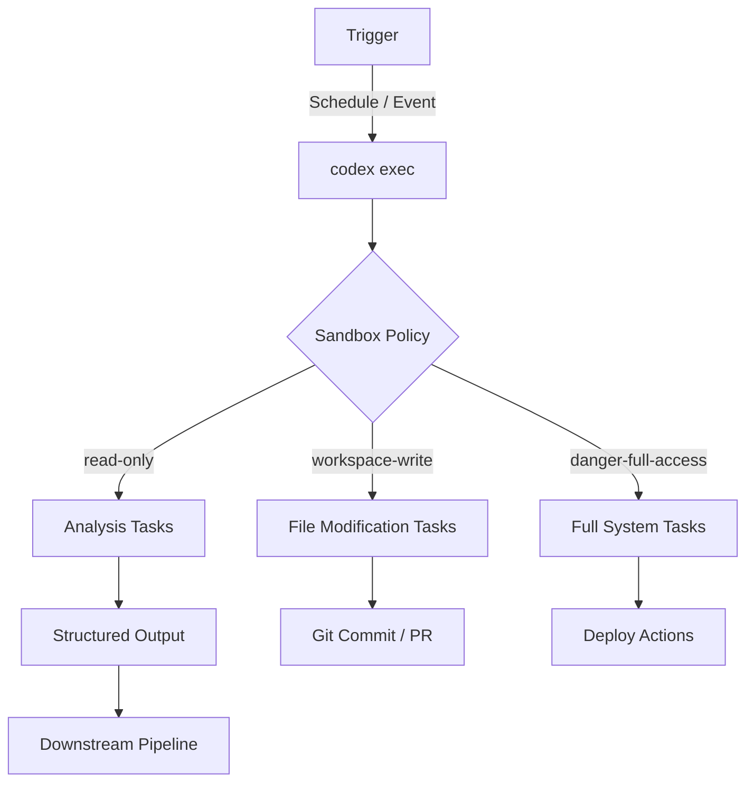
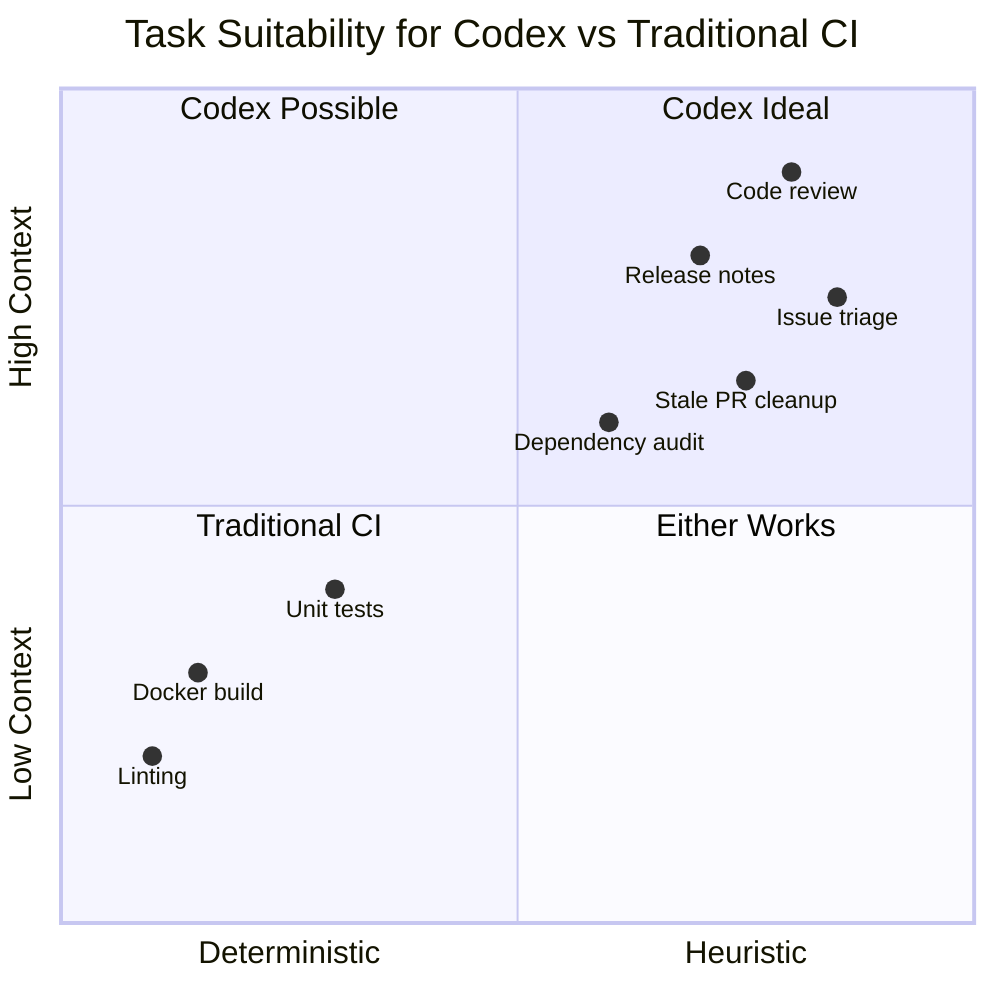

# Codex Automations as Lightweight CI: When Scheduled Agents Replace Your Pipeline


---

## The Pattern

A developer schedules a Codex goal to run daily at midnight: triage open issues, summarise CI failures, draft release notes. No YAML pipeline. No Docker images. No matrix strategies. Just a natural-language prompt executing on a schedule with full repository context.

This is Codex Automations functioning as lightweight CI — and for a growing class of recurring engineering tasks, it is replacing traditional pipelines entirely.

## Automations: The Two Execution Surfaces

Codex offers two distinct automation surfaces that serve different trust boundaries[^1][^2]:

### App Automations (GUI)

The Codex desktop app (macOS since 2 February 2026, Windows since 4 March 2026) provides a first-class Automations panel[^1]. You name the automation, select a project, write a prompt, attach optional skills, and set a schedule. Codex runs it in a background worktree and surfaces results for human review before any changes land.

### `codex exec` (CLI)

For pipeline integration, `codex exec` is the non-interactive primitive[^3]. It starts a single agent session, executes to completion, streams progress to stderr, writes the final agent message to stdout, and exits with a meaningful exit code. No TUI, no approval prompts — pure autonomous execution.

```bash
codex exec --sandbox workspace-write \
  "Triage all issues labelled 'needs-triage' and add priority labels"
```

The distinction matters: App Automations assume a human reviews output; `codex exec` assumes a machine consumes it.

## Anatomy of a Codex CI Workflow



### Triggers

Codex Triggers, introduced in March 2026, fire on repository events — pushes, pull requests, issue comments, CI failures — with sub-second latency via GitHub webhooks pointed at `https://api.openai.com/v1/codex/triggers/events`[^4]. Combined with cron-based schedules, this covers both time-driven and event-driven automation patterns.

### Sandbox Policies

The `--sandbox` flag controls the agent's blast radius[^3]:

| Policy | Use Case | Risk Level |
|--------|----------|------------|
| `read-only` (default) | Analysis, reporting, code review | Minimal |
| `workspace-write` | File edits, test generation, refactoring | Moderate |
| `danger-full-access` | System commands, deployments | High — isolated runners only |

### Structured Output

The `--output-schema` flag enforces a JSON Schema on the agent's final response[^3], enabling programmatic consumption by downstream tools:

```bash
codex exec \
  --sandbox read-only \
  --output-schema ./schemas/release-summary.json \
  "Summarise all commits since the last tag as a release brief"
```

This transforms Codex from a conversational tool into a structured data producer — exactly what pipeline steps require.

## The GitHub Action: `openai/codex-action@v1`

For teams already invested in GitHub Actions, `openai/codex-action@v1` wraps installation, proxy configuration, and execution into a single step[^5]:


```yaml
name: Daily Issue Triage
on:
  schedule:
    - cron: '0 21 * * *'

jobs:
  triage:
    runs-on: ubuntu-latest
    permissions:
      contents: write
      issues: write
    steps:
      - uses: actions/checkout@v4
      - uses: openai/codex-action@v1
        with:
          codex-prompt: |
            Review all open issues labelled 'needs-triage'.
            Add priority labels based on severity and impact.
            Close duplicates with a linking comment.
          safety-strategy: drop-sudo
          sandbox: workspace-write
        env:
          OPENAI_API_KEY: ${{ secrets.OPENAI_API_KEY }}
```


The `safety-strategy: drop-sudo` input irreversibly removes sudo privileges before the agent runs — protecting secrets held in runner memory[^5].

### Permission Profiles

Newer integrations should prefer permission profiles over raw sandbox flags[^5]:

```yaml
- uses: openai/codex-action@v1
  with:
    codex-prompt: "Generate changelog from recent commits"
    permission-profile: ":workspace"
```

The `:workspace` profile grants write access to the checked-out repository without broader system access.

### Access Control

By default, the action only runs for users with write access to the repository[^5]. You can expand this via `allow-users` or `allow-bots` inputs, but never set `allow-users: "*"` — this exposes your API key to abuse from any contributor.

## When Codex Replaces Traditional CI

Codex Automations excel at tasks that are:

1. **Language-heavy** — summarisation, triage, documentation generation
2. **Heuristic** — decisions that require judgement rather than deterministic logic
3. **Context-dependent** — tasks needing awareness of the full codebase, not just changed files
4. **Low-frequency** — daily, weekly, or event-triggered rather than per-commit



Concrete examples from production use at OpenAI include daily issue triage, CI failure summarisation, and release brief generation[^1].

## When Codex Should Not Replace CI

Traditional pipelines remain superior for:

- **Deterministic builds** — compilation, container packaging, artefact signing
- **Sub-second latency requirements** — pre-commit hooks, syntax linting
- **Reproducibility guarantees** — identical inputs must produce identical outputs
- **Cost-sensitive high-frequency runs** — per-commit checks at scale burn tokens rapidly

The `codex exec` invocation carries inference cost. At current Codex CLI pricing (v0.144.6), a typical triage task consuming 10-20K tokens costs roughly \$0.02-0.05 per run[^6]. Daily is fine; per-commit on a busy monorepo is not.

## The Hybrid Pattern

The pragmatic approach layers Codex atop existing CI rather than replacing it:


```yaml
name: Post-CI Analysis
on:
  workflow_run:
    workflows: ["Build and Test"]
    types: [completed]

jobs:
  analyse-failures:
    if: ${{ github.event.workflow_run.conclusion == 'failure' }}
    runs-on: ubuntu-latest
    steps:
      - uses: actions/checkout@v4
      - uses: openai/codex-action@v1
        with:
          codex-prompt: |
            The CI build just failed. Analyse the failure logs,
            identify root cause, and post a summary comment on the
            triggering commit with suggested fixes.
          sandbox: read-only
```


Traditional CI handles the deterministic build-and-test loop. Codex handles the intelligent response to failures — a task that previously required a human to read logs and diagnose issues.

## Goal Mode for Long-Horizon Automations

For tasks exceeding a single turn, the `/goal` command (shipped in Codex CLI 0.128.0, 30 April 2026) enters a persistent agentic loop[^7]. It keeps working toward a stated objective until completion, token budget exhaustion, or an unresolvable blocker. State persists across sessions.

Combined with App Automations, this enables multi-hour background tasks:

```
Automation: "Weekly Architecture Review"
Schedule: Every Monday 02:00 UTC
Goal: Review all PRs merged this week. Identify architectural
      drift from ARCHITECTURE.md. Draft a summary with recommendations.
Token budget: 500K
```

The agent pauses if it hits the budget and resumes on the next scheduled run — making it viable for tasks that span hundreds of files.

## Security Considerations

Running an LLM-powered agent in CI introduces novel attack surfaces:

- **Prompt injection via issue content** — malicious issue text could manipulate the agent's behaviour. Mitigate with strict system prompts and the `--sandbox read-only` default[^3].
- **Secret exfiltration** — an agent with network access could POST secrets to external endpoints. The `drop-sudo` safety strategy and network-restricted sandboxes mitigate this[^5].
- **Non-determinism** — the same input may produce different outputs across runs. Use `--output-schema` to constrain output shape, but accept that content will vary.

⚠️ Codex Automations in CI should be treated as untrusted code execution. Apply the same isolation you would give a third-party GitHub Action.

## Practical Recommendations

1. **Start read-only** — analysis and reporting tasks carry near-zero risk
2. **Use structured output** — `--output-schema` makes agent output machine-parseable
3. **Layer, don't replace** — trigger Codex from `workflow_run` events rather than replacing build steps
4. **Budget tokens explicitly** — set token limits to prevent runaway costs
5. **Audit regularly** — review automation outputs weekly; drift accumulates silently

## What Comes Next

OpenAI's roadmap includes cloud-based automation execution — Codex Jobs running entirely in OpenAI's infrastructure, triggered by events without requiring a local machine or self-hosted runner[^1]. This would eliminate the last operational friction: maintaining always-on infrastructure for scheduled agent tasks.

The boundary between "CI pipeline" and "AI agent" is dissolving. The question is no longer whether to use Codex in your automation — it's which layer of your pipeline benefits most from natural-language intelligence versus deterministic execution.

---

## Citations

[^1]: OpenAI, "Scheduled tasks", Codex App Documentation, 2026. https://developers.openai.com/codex/app/automations

[^2]: OpenAI, "Automations", OpenAI Academy, 2026. https://openai.com/academy/codex-automations/

[^3]: OpenAI, "Non-interactive mode", Codex CLI Documentation, 2026. https://developers.openai.com/codex/noninteractive

[^4]: OpenAI Codex Automations: Schedules and Triggers Guide, Tudor Daniel, April 2026. https://tudordaniel.ro/en/2026/04/24/openai-codex-automations-schedules-and-triggers-guide/

[^5]: OpenAI, "Codex GitHub Action", Developer Documentation, 2026. https://developers.openai.com/codex/github-action

[^6]: OpenAI Codex CLI v0.144.6 release, July 2026. https://github.com/openai/codex/releases

[^7]: OpenAI, "Goal Mode in Codex CLI: Persistent Objectives, Token Budgets, and the Shift to Agentic Loops", Codex Knowledge Base, May 2026. https://codex.danielvaughan.com/2026/05/03/codex-cli-goal-mode-persistent-objectives-token-budgets-agentic-loops/
