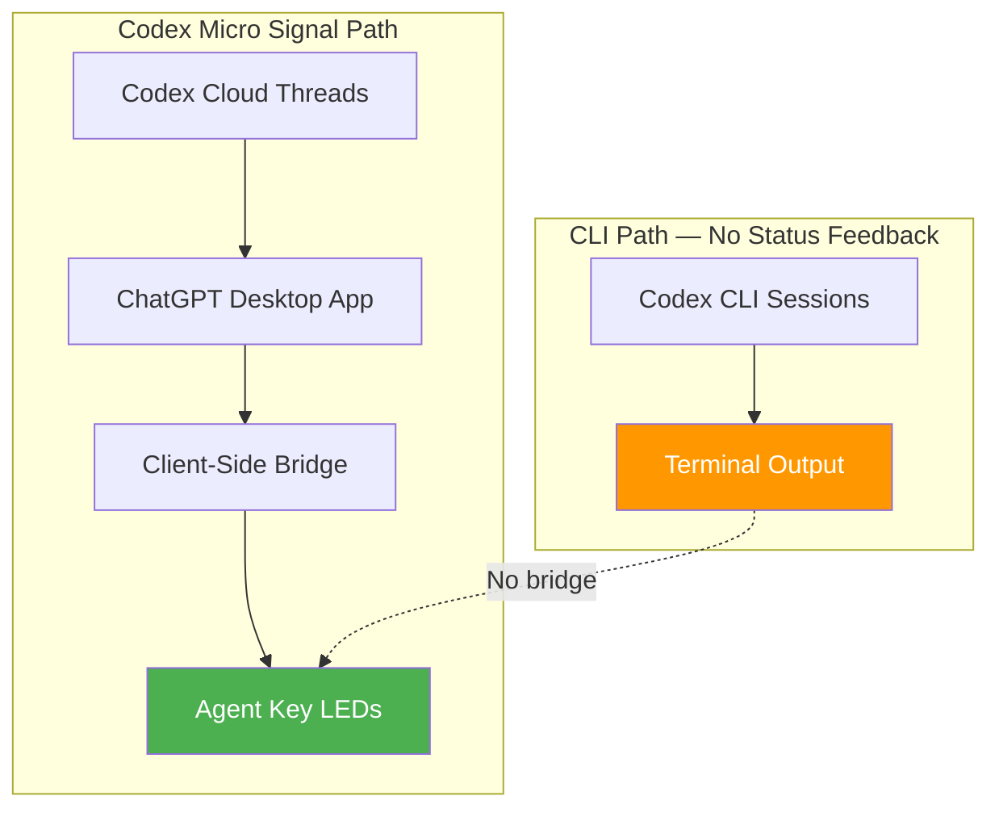
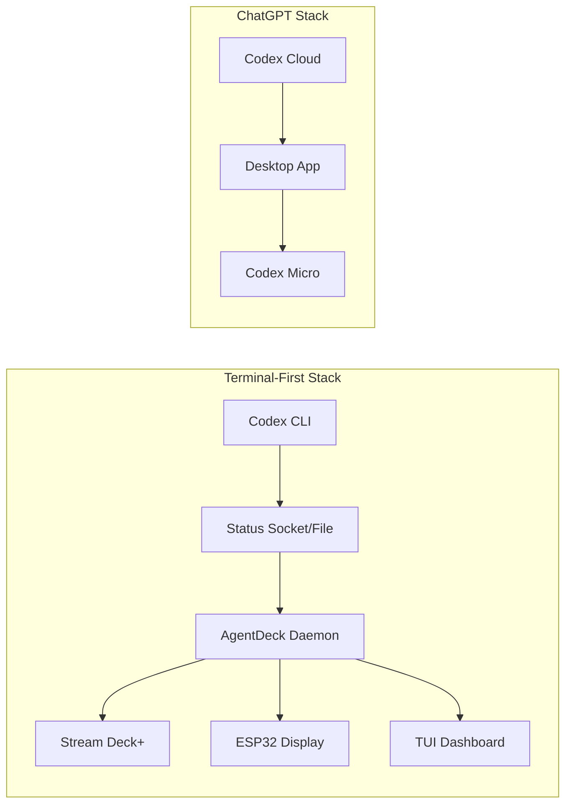

# Physical Agent Control Surfaces: What OpenAI's Codex Micro Reveals About the Human-Agent Interface


---

## The Hardware Thesis

On 15 July 2026, OpenAI shipped the Codex Micro — a \$230 macropad built in collaboration with Canadian keyboard maker Work Louder [^1]. It sold out within 48 hours [^2]. The device is unremarkable as keyboard hardware: 13 low-profile mechanical switches, a rotary encoder, an analogue joystick, and six frosted RGB keys [^3]. What makes it significant is the thesis it encodes: that managing parallel AI coding agents benefits from a dedicated physical control surface, and that the human-agent interaction loop is better served by tactile feedback than by terminal commands alone.

This article examines that thesis, the device's actual capabilities and limitations, the emerging open-source alternatives, and what it all means for developers already running multi-agent workflows with Codex CLI.

## What the Codex Micro Actually Does

### Hardware Specifications

The Codex Micro is built on Work Louder's existing Creator Micro 2 platform [^3]. The chassis is CNC polycarbonate and aluminium with a sandblasted anodised bottom. Buyers choose between clicky POM or silent POK switches, both rated to 50 million keystrokes at 40g actuation force and 2.8mm travel [^3]. Connectivity is USB-C or Bluetooth Low Energy.

### The Agent Keys

The six translucent keys across the top row are the device's distinguishing feature. Each key maps to a live Codex thread and illuminates to signal state [^4]:

| Colour | State |
|--------|-------|
| White | Idle |
| Green | Unread response |
| Blue | Thinking/reasoning |
| Peach | Awaiting human input |
| Red | Error |

Pressing an Agent Key switches to that thread without bringing the ChatGPT desktop app to the foreground [^4].

### The Reasoning Dial

The rotary encoder adjusts how much reasoning compute — time and token budget — an agent applies to the current task [^1]. This is conceptually distinct from model selection (choosing o3-mini versus o4-pro). It adjusts effort within a single model tier, giving developers a continuous control rather than a discrete dropdown.

### The Joystick

The analogue joystick triggers common Codex workflows: reviewing a PR, debugging an error, refactoring a selection [^3]. Each direction maps to a configurable action via Work Louder's Input configurator or the open-source VIA firmware tool [^3].

## The Critical Limitation: ChatGPT Desktop Only

The Agent Key RGB feedback requires the ChatGPT desktop app running as a client-side bridge [^4]. Developers who use Codex exclusively through the CLI, the VS Code extension, JetBrains plugin, or the browser interface will find the six status keys static or dark [^4]. This is not a general-purpose Codex accessory — it is a ChatGPT Work accessory that leverages the July 9 desktop app merger [^4].

For Codex CLI users, the device functions as a standard macro pad. You can bind keys to shell commands (`codex --approval-mode suggest "review this PR"`), but the ambient status feedback — the primary differentiator — is unavailable.



## The Broader Landscape: Physical Control for AI Agents

The Codex Micro is not the only hardware play in this space. AgentDeck, an open-source project, provides a physical controller and multi-surface dashboard for AI coding agents with support for Stream Deck+, Android tablets, iOS/macOS, ESP32 displays, and TUI interfaces [^5].

AgentDeck's key advantage: it supports Claude Code, Codex CLI, OpenCode, and OpenClaw through a unified daemon hub [^5]. It runs across 16 display surfaces simultaneously and includes a performance evaluation framework (APME) that tracks agent efficiency in local SQLite [^5]. Unlike the Codex Micro, AgentDeck is agent-agnostic and open-source.

### Comparison Matrix

| Feature | Codex Micro | AgentDeck | Stream Deck + VIA |
|---------|-------------|-----------|-------------------|
| Price | \$230 | Free (+ hardware) | ~\$80–200 |
| Agent status LEDs | 6 keys (ChatGPT only) | Unlimited surfaces | Manual config |
| Supported agents | Codex (ChatGPT desktop) | Claude Code, Codex CLI, OpenCode, OpenClaw | Any (via scripts) |
| Reasoning control | Native dial | Custom bindings | Custom bindings |
| Open source | No (VIA for keymaps only) | Yes | Partially |
| CLI integration | Macro keys only | Native daemon | Script-based |

## When Does Hardware Control Make Sense?

The productivity argument for a physical control surface rests on three premises:

1. **Parallel agent supervision scales beyond a single terminal.** If you're running 4–6 concurrent Codex threads, glanceable ambient status (coloured LEDs in peripheral vision) is faster than cycling through terminal tabs.

2. **Mode switching has cognitive cost.** Reaching for a physical dial to adjust reasoning effort is faster than opening a settings panel or typing a flag, because it keeps your eyes on the code.

3. **Muscle memory compounds.** The same argument that justifies keyboard shortcuts over mouse clicks applies: physical keys mapped to frequent actions eventually bypass conscious thought.

The counter-argument is equally straightforward: keyboard shortcuts are free, terminal multiplexers (tmux, Zellij) provide split-pane agent monitoring, and a \$50 QMK numpad handles macro binding without the \$230 premium [^6].

## Configuring Codex CLI for Physical Control

Even without Agent Key integration, Codex CLI users can map physical keys to useful commands. Here's a practical configuration using a QMK-compatible macro pad:

```bash
# Key 1: Launch new Codex session with low reasoning
codex --model o4-mini --approval-mode suggest "quick fix: $CLIPBOARD"

# Key 2: Launch deep reasoning session
codex --model o3 --approval-mode full-auto "architect: $CLIPBOARD"

# Key 3: Resume last session
codex --resume

# Key 4: List active sessions
codex sessions list --format json | jq '.[] | select(.status == "active")'
```

For named profiles, bind keys to specific profiles in your `config.toml`:

```toml
[profiles.quick]
model = "o4-mini"
approval_policy = "on-request"

[profiles.deep]
model = "o3"
approval_policy = "unless-allow-listed"
```

Then bind a macro key to:

```bash
codex --profile deep "review the architecture of src/"
```

## The Hardware Moat Strategy

The Codex Micro's significance is not as a peripheral. It is a switching-cost mechanism [^6]. Once developers build muscle memory around a physical device — once their workflow assumes coloured LEDs showing agent state and a dial adjusting reasoning effort — migrating to a competitor becomes more expensive than just cancelling a subscription.

This mirrors historical platform lock-in strategies: Apple's Magic Mouse trained gestures that don't transfer to other mice; Elgato's Stream Deck created content-creator workflows that assumed its grid of LCD keys. OpenAI is betting that the same dynamic applies to AI agent control.

Whether it works depends on whether the ChatGPT desktop integration remains exclusive. If OpenAI publishes a status API that third-party hardware can consume, the moat evaporates. If they keep it proprietary, the Codex Micro becomes the first physical lock-in device in the AI coding space.

## What This Means for the Terminal-First Developer

For developers running Codex CLI or Claude Code from a terminal:

1. **The Codex Micro offers limited value today.** Without CLI status integration, it is a \$230 macro pad.
2. **AgentDeck is the open-source alternative** if you want physical controls with actual multi-agent support [^5].
3. **The reasoning dial concept is worth stealing.** Map a MIDI controller or rotary encoder to a shell script that adjusts your `--model` or profile flag dynamically. The UX insight — continuous reasoning control — is sound even without OpenAI's specific hardware.
4. **Watch for an open status protocol.** If Codex CLI gains a local socket or file-based status output, community bridges to generic hardware become trivial.



## Conclusion

The Codex Micro is less a productivity tool and more a declaration of intent. OpenAI believes the human-agent interface will evolve beyond text — that developers managing fleets of parallel agents need ambient status, tactile controls, and continuous reasoning adjustment. The hardware is limited (ChatGPT desktop only, sold out, \$230 for a macro pad), but the design choices reveal a roadmap.

For senior developers already in terminal-first workflows, the practical takeaway is not to buy the Codex Micro. It is to recognise that multi-agent supervision is becoming a distinct UX problem, and to invest in the tools — AgentDeck, custom QMK bindings, terminal dashboards — that solve it without platform lock-in.

---

## Citations

[^1]: TechCrunch, "Amid hardware legal battle, OpenAI releases a \$230 keyboard for Codex," 15 July 2026. [https://techcrunch.com/2026/07/15/amid-hardware-legal-battle-openai-releases-a-230-keyboard-for-codex/](https://techcrunch.com/2026/07/15/amid-hardware-legal-battle-openai-releases-a-230-keyboard-for-codex/)

[^2]: DualMedia, "Codex Micro Keyboard Sold Out Fast, but Who Needs It?" July 2026. [https://www.dualmedia.com/codex-micro-keyboard/](https://www.dualmedia.com/codex-micro-keyboard/)

[^3]: Tom's Hardware, "OpenAI's first hardware device is an RGB macropod — 'Codex Micro' features 13 low-profile keys and a joystick for controlling AI coding agents," July 2026. [https://www.tomshardware.com/peripherals/keyboards/openais-first-hardware-device-is-an-rgb-macropod-codex-micro-features-13-low-profile-keys-and-a-joystick-for-controlling-ai-coding-agents](https://www.tomshardware.com/peripherals/keyboards/openais-first-hardware-device-is-an-rgb-macropod-codex-micro-features-13-low-profile-keys-and-a-joystick-for-controlling-ai-coding-agents)

[^4]: TechTimes, "OpenAI Codex Micro Ships Today: Agent Keys Only Work With ChatGPT Desktop," 16 July 2026. [https://www.techtimes.com/articles/320670/20260716/openai-codex-micro-ships-today-agent-keys-only-work-chatgpt-desktop.htm](https://www.techtimes.com/articles/320670/20260716/openai-codex-micro-ships-today-agent-keys-only-work-chatgpt-desktop.htm)

[^5]: GitHub, "puritysb/AgentDeck: Physical controller & multi-surface dashboard for AI coding agents," 2026. [https://github.com/puritysb/AgentDeck](https://github.com/puritysb/AgentDeck)

[^6]: The New Stack, "OpenAI's first gadget is the \$230 Codex Micro macropad," July 2026. [https://thenewstack.io/openai-codex-micro-macropad/](https://thenewstack.io/openai-codex-micro-macropad/)
