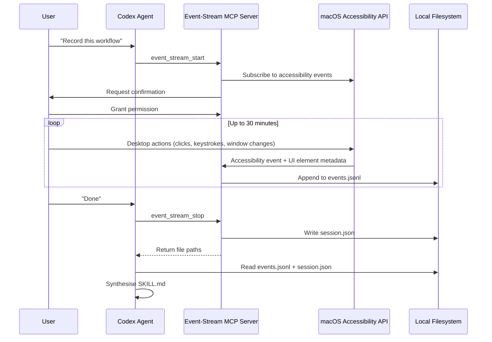
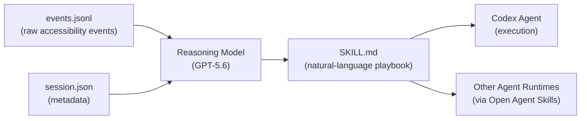

# MCP as Observation Layer: How Record and Replay Turns the Model Context Protocol from Tool Caller into Event-Stream Backbone


---

## Beyond Tool Calling

Most developers encounter MCP (Model Context Protocol) as a tool-calling interface — a way for an agent to invoke external functions like "read a file" or "query a database." That framing captures perhaps a third of what the protocol actually does. Inside Codex's Record and Replay system, MCP serves a fundamentally different purpose: it is the **observation backbone** that captures, streams, and persists human actions so a reasoning model can synthesise them into reusable skills [^1] [^2].

This architectural choice is not incidental. It reveals where MCP is heading as a protocol and what it means for developers building agent-native tooling.

---

## The Event-Stream MCP Server

Record and Replay, shipped in Codex app 26.616 on 18 June 2026 [^3], is built on top of a dedicated **event-stream MCP server** that sits alongside the standard Codex MCP infrastructure. This server does not expose tools for the agent to act on the world. Instead, it exposes tools that let the agent **observe the world** — specifically, the user's desktop activity [^2] [^4].

The server provides three lifecycle tools:

| MCP Tool | Purpose |
|----------|---------|
| `event_stream_start` | Begins recording. Requests user confirmation before capturing. Sessions cap at 30 minutes [^4]. |
| `event_stream_status` | Polls the active recording, returning paths to generated metadata and event files [^4]. |
| `event_stream_stop` | Terminates the recording and returns save locations for post-processing [^4]. |

These are not tool calls in the traditional sense. They are **session lifecycle controls** — closer to a recording studio's transport buttons (record, status, stop) than to a function call that returns a value. The actual captured data does not flow back through the MCP response channel. Instead, it is written to local files that the agent reads after recording completes [^2] [^4].



---

## Accessibility API, Not Screen Coordinates

The event-stream MCP server captures actions through **macOS's accessibility API combined with input event monitoring** [^2] [^4]. This is the critical architectural decision that separates Record and Replay from traditional RPA macro recorders.

A conventional macro recorder captures: "Click at pixel (1247, 683)." When the window moves, the macro breaks.

The event-stream MCP server captures: "Click the AXButton with role 'Submit' in the window titled 'Deployment Pipeline' of the application 'Safari'." When the window moves, the intent survives [^2] [^5].

Each event in the `events.jsonl` output contains [^4]:

- **Timestamp** — when the action occurred
- **Kind** — the event type (click, keystroke, window focus change)
- **App and window** — which application and window received the action
- **Accessibility role and subrole** — `AXButton`, `AXCheckBox`, `AXMenuItem`, and similar identifiers
- **Descriptive text** — labels, visible text, and accessibility descriptions

This JSON Lines format is designed for streaming: each line is a self-contained event that can be written incrementally during recording and parsed line-by-line during synthesis [^4].

---

## The Skill Synthesis Pipeline

After recording stops, the agent reads the captured files and invokes a `skill-creator` workflow to transform raw events into a `SKILL.md` file [^4] [^6]. This is where the observation data meets the reasoning model.

The synthesis process produces a file with two components [^6] [^7]:

**YAML frontmatter** — the skill's identity:

```yaml
---
name: deploy-staging-pipeline
description: >
  Triggers the staging deployment pipeline via the CI dashboard.
  Use when the user asks to deploy to staging or run the
  staging pipeline.
---
```

The `name` field follows strict constraints: lowercase letters, numbers, and hyphens only, capped at 64 characters, and must match the parent folder name exactly [^7]. The `description` field caps at 1,024 characters and must state both what the skill does and when to use it — this is the only field Codex reads during **skill discovery**, before loading the full body [^7].

**Markdown body** — the skill's playbook:

The body describes what the workflow accomplishes, what variable inputs it accepts, what steps to follow, and how to verify the result [^6]. Crucially, it uses accessible labels, roles, and visible text rather than screen coordinates [^2] [^4], making the generated skill robust to layout changes.



---

## Why MCP and Not a Custom Protocol?

OpenAI could have built the event-stream capture as a proprietary internal API. Instead, they built it as an MCP server — the same protocol used for filesystem access, database queries, and external tool integration [^1] [^2]. This choice has three consequences worth examining.

### 1. Uniform Lifecycle Management

Every MCP server in Codex — whether it provides file access, browser automation, or event-stream recording — follows the same lifecycle: discovery, initialisation, tool invocation, and shutdown. The event-stream server slots into the existing MCP management infrastructure without special-casing [^8]. When Codex starts a recording session, it uses the same `CallToolRequest` → `codex/event` notification pipeline that handles any other MCP interaction [^8].

### 2. Composability with Other MCP Servers

Because the event-stream server is just another MCP server, it can coexist with other servers in the same session. A recording session could theoretically capture user actions whilst a separate MCP server provides database context, a third serves documentation, and a fourth handles git operations. The agent orchestrates all four through the same protocol [^1] [^8].

### 3. The Observation Pattern as a Protocol Primitive

This is the most consequential implication. MCP's specification already includes **resources** (data the server exposes for the client to read), **tools** (functions the client can invoke), and **prompts** (templates the server suggests) [^1]. The event-stream server demonstrates a fourth pattern: **observation** — where the server watches the environment and produces a stream of structured events that the client processes asynchronously.

The MCP 2026 roadmap explicitly lists event-driven triggers and streaming results as priorities [^9]. Resource subscriptions — where a server notifies the client when data changes — are already specified but remain one of MCP's least-adopted features [^9]. The event-stream MCP server is a production-grade existence proof that streaming observation works within the protocol's existing transport layer.

---

## From Observation to Execution: The Two-Surface Architecture

Record and Replay operates across two surfaces [^3] [^10]:

1. **Desktop App** — where recording happens. The event-stream MCP server runs here, coupled to the macOS accessibility API. This is the observation surface.
2. **CLI or App** — where execution happens. The generated SKILL.md file runs here, with the agent interpreting natural-language steps against the current environment. This is the execution surface.

The MCP event-stream server is the bridge between these surfaces. It captures intent on one surface and persists it in a format that can be consumed on the other. Because SKILL.md files use the Open Agent Skills format [^11], the execution surface need not be Codex at all — any agent runtime that understands SKILL.md can replay the skill.

This decoupling is architecturally significant. It means the observation infrastructure (accessibility API + MCP event-stream) and the execution infrastructure (reasoning model + tool-calling MCP servers) evolve independently. You can improve recording fidelity without changing how skills execute, and vice versa.

---

## Limitations and Open Questions

### macOS Only

The event-stream MCP server currently requires macOS's accessibility API [^3] [^4]. Windows and Linux lack equivalent implementations in the Codex stack. The accessibility API dependency also explains the geographic restrictions — Record and Replay is unavailable in the EEA, UK, and Switzerland due to regulatory considerations around screen observation [^3].

### Semantic Fidelity

Not all user actions map cleanly to accessibility events. Drag-and-drop operations, canvas-based applications, and custom UI frameworks that do not expose accessibility metadata produce gaps in the event stream. The reasoning model must infer intent from incomplete observations — a task that improves with model capability but remains imperfect [^5].

### The Connector Substitution Problem

After recording, Codex may replace some UI steps with direct API or connector calls that produce richer results than literal replay [^12]. This is generally beneficial — a deterministic API call is more reliable than a UI interaction — but it changes the recorded workflow's semantics. Whether the agent should faithfully replay or intelligently reinterpret remains an open design question.

### Event-Stream Security

The event-stream MCP server records everything visible on screen during the session, including sensitive data that happens to appear in browser tabs, chat windows, or notification banners. The captured `events.jsonl` file persists locally, but no automatic redaction is applied. Developers recording workflows that interact with production systems should be aware that credentials, tokens, and personal data may appear in the event stream.

---

## Implications for MCP Server Development

If you are building MCP servers, Record and Replay offers a template for a pattern that extends well beyond skill creation:

- **Audit logging** — an MCP server that observes agent actions and produces a structured audit trail, readable by compliance tooling
- **Session analytics** — capture interaction patterns to improve agent configuration
- **Training data collection** — observe expert workflows to generate fine-tuning datasets
- **Environment monitoring** — watch CI pipelines, deployment dashboards, or monitoring systems and produce event streams that agents can reason over

The common thread is that MCP servers need not be passive — waiting for tool calls — or active — performing actions. They can be **observational**: watching, recording, and structuring what happens in the environment so that reasoning models can process it later.

---

## Practical Takeaways

1. **MCP is not just for tool calling.** The event-stream server demonstrates that MCP's transport layer handles observation, streaming, and session management as naturally as it handles function invocation.

2. **Accessibility APIs are the new scraping.** Screen coordinates are fragile. Accessibility trees are semantic. If you are building observation tooling, prefer the accessibility layer.

3. **SKILL.md is the interface contract.** The event-stream server produces raw events; the reasoning model produces SKILL.md. If you are integrating with the Record and Replay pipeline, SKILL.md is where you plug in — not the raw event stream.

4. **The observation pattern is reusable.** Any MCP server can implement start/status/stop lifecycle tools and stream structured events to a JSONL file. The pattern generalises beyond desktop recording.

5. **Mind the security surface.** Event streams capture what is on screen, not what you intend to capture. Treat `events.jsonl` files with the same care you would give a screen recording of your desktop.

---

## Citations

[^1]: Anthropic, "Model Context Protocol — Architecture Overview," *modelcontextprotocol.io*, 2025. [https://modelcontextprotocol.io/docs/learn/architecture](https://modelcontextprotocol.io/docs/learn/architecture)

[^2]: azukiazusa, "Trying Out Record & Replay: Turning a Workflow into a Reusable Skill," *azukiazusa.dev*, June 2026. [https://azukiazusa.dev/en/blog/workflow-to-reusable-skill/](https://azukiazusa.dev/en/blog/workflow-to-reusable-skill/)

[^3]: OpenAI, "Record & Replay," *ChatGPT Learn*, June 2026. [https://learn.chatgpt.com/docs/extend/record-and-replay](https://learn.chatgpt.com/docs/extend/record-and-replay)

[^4]: OpenAI, "Codex Changelog — App 26.616," *developers.openai.com*, 18 June 2026. [https://developers.openai.com/codex/changelog](https://developers.openai.com/codex/changelog)

[^5]: TechTimes, "OpenAI Codex Automation Gains Record and Replay: Show It Once, Skip the Script," *TechTimes*, 20 June 2026. [https://www.techtimes.com/articles/318759/20260620/openai-codex-automation-gains-record-replay-show-it-once-skip-script.htm](https://www.techtimes.com/articles/318759/20260620/openai-codex-automation-gains-record-replay-show-it-once-skip-script.htm)

[^6]: OpenAI, "Build Skills," *ChatGPT Learn*, 2026. [https://developers.openai.com/codex/skills](https://developers.openai.com/codex/skills)

[^7]: DeepWiki, "SKILL.md Format Specification," *deepwiki.com*, 2026. [https://deepwiki.com/openai/skills/7.1-skill.md-format-specification](https://deepwiki.com/openai/skills/7.1-skill.md-format-specification)

[^8]: DeepWiki, "MCP Server Implementation (codex-mcp-server)," *deepwiki.com*, 2026. [https://deepwiki.com/openai/codex/6.4-mcp-server-implementation-(codex-mcp-server)](https://deepwiki.com/openai/codex/6.4-mcp-server-implementation-(codex-mcp-server))

[^9]: Ted Tschopp, "MCP's 2026 Roadmap: From Agent Integration Standard to Production Connectivity Layer," *tedt.org*, 2026. [https://tedt.org/MCPs-2026-Roadmap/](https://tedt.org/MCPs-2026-Roadmap/)

[^10]: Developers Digest, "Codex: Record & Replay in 9 Minutes," *YouTube*, June 2026. [https://www.youtube.com/watch?v=7f4n6h1gzdA](https://www.youtube.com/watch?v=7f4n6h1gzdA)

[^11]: OpenAI, "Skills — openai/skills," *GitHub*, 2026. [https://github.com/openai/skills](https://github.com/openai/skills)

[^12]: DigitalApplied, "Codex Record & Replay: Show It Once, Skip the Script," *digitalapplied.com*, 2026. [https://www.digitalapplied.com/blog/openai-codex-record-replay-no-code-agent-skills-guide](https://www.digitalapplied.com/blog/openai-codex-record-replay-no-code-agent-skills-guide)
