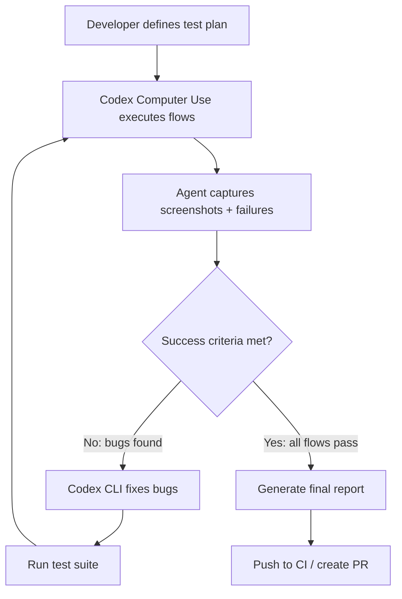
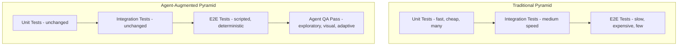

# The QA Loop Pattern: Computer Use + Success Criteria as an Automated Testing Framework


---

Since April 2026, Codex has been able to see, click, and type across macOS applications — and since May, Windows too [^1][^2]. This capability, combined with loop controllers and structured success criteria, creates something genuinely new: an automated QA engineer that runs in the background, self-scores its findings, and iterates until the result meets a defined quality bar.

This article formalises the **QA Loop Pattern** — prompt + feedback engine + success criteria — and examines where it fits within the traditional testing pyramid.

## The Pattern in Three Sentences

1. **Prompt**: Tell Codex which flows to test and what environment to target.
2. **Feedback engine**: Computer Use executes the flows, captures screenshots, and generates structured bug reports.
3. **Success criteria**: A loop controller (or the agent itself) evaluates whether the pass meets a defined threshold and either terminates or triggers another round.

The loop continues until the success criteria are satisfied or a configured limit is reached.

## Architecture



This is fundamentally a **build-test-fix loop** where the "test" step is a visual agent rather than a scripted test runner. The key insight is that Computer Use provides the same observational fidelity as a human tester — it sees rendered pixels, not DOM trees [^3].

## The Two Surfaces: App and CLI

OpenAI's documentation recommends combining both Codex surfaces in a single QA workflow [^4]:

| Surface | Role | Strength |
|---------|------|----------|
| Codex App (Computer Use) | Visual QA pass — click through flows, capture failures | Catches UI regressions, layout bugs, visual state issues |
| Codex CLI (`codex exec`) | Fix bugs, run test suites, push code | Fast iteration, scriptable, CI-friendly |

A practical workflow:

```bash
# 1. Run visual QA pass in Codex App (generates bug-report.md)
# 2. Feed bugs to CLI for automated fixing
codex exec "Fix the bugs documented in bug-report.md. \
  After each fix, run the test suite. \
  Stop when all tests pass."
```

The handoff between surfaces is manual today, but automatable via the `/app` command or through Codex Automations scheduling [^5].

## Implementing Loop Control with codex-loop

The open-source `codex-loop` plugin (compozy/codex-loop) provides structured loop control through Codex's hook system [^6]. It ships as a single Go binary contributing `UserPromptSubmit` and `Stop` hooks, with three limiter modes:

### Time-based (min)

```bash
# Keep hardening for at least 30 minutes
codex --plugin codex-loop --loop-min 30m \
  "Run the QA test plan in test-plan.md. Fix any failures found."
```

### Round-based (rounds)

```bash
# Exactly 5 build-test-fix cycles
codex --plugin codex-loop --loop-rounds 5 \
  "Execute the login flow test plan. \
   Score each pass 1-5. Fix issues between rounds."
```

### Goal-based (goal)

```bash
# Loop until an external verifier confirms success
codex --plugin codex-loop --loop-goal "curl -s http://localhost:3000/health | grep ok" \
  "Fix failing integration tests until the health endpoint returns ok."
```

Goal mode invokes a configurable headless reviewer command after each round, interprets the output as a structured verdict, and decides whether another iteration is needed [^6]. This is particularly powerful for QA because the success signal can be an actual end-to-end check rather than the agent's self-assessment.

## Structured Success Criteria

The weakest QA loops fail because their success criteria are vague. OpenAI's own documentation recommends explicit structure [^4]:

```markdown
## Test Plan: Checkout Flow

### Success criteria
- All 5 critical paths complete without error
- No P1 (blocker) bugs remain
- Screenshot evidence for each verified step

### For every bug found, include:
- Repro steps
- Expected result
- Actual result
- Severity (P1/P2/P3)
- Screenshot

### Completion rules
- Continue past non-blocking issues
- Stop immediately on data loss or security issues
- End with triage summary sorted by severity
```

When combined with self-scoring, the agent evaluates its own output against these criteria:

```bash
codex exec "Run the checkout flow test plan. \
  After each pass, score yourself 1-5 on: \
    - Flow completion (all steps reached?) \
    - Bug severity (any P1s remaining?) \
    - Report quality (repro steps present?) \
  Continue until all scores reach 5/5."
```

⚠️ **Caveat**: Self-scoring is inherently unreliable. Agents tend to rate themselves generously [^7]. For production QA gates, prefer external verification (goal mode with a real health check or test suite exit code) over agent self-assessment.

## Context Refresh: Preventing Loop Drift

Long-running QA loops suffer from context drift — the agent loses track of what it has already fixed or begins optimising for the wrong metric. `codex-loop` addresses this with a context refresh mechanism [^6]:

Before each auto-continue, the plugin can run a local command to refresh context from test logs, changed files, or build status, then append that data into the next prompt. This keeps the agent grounded in reality rather than its own increasingly stale conversation history.

```toml
# codex-loop.toml
[refresh]
command = "cat test-results.log | tail -50"
inject_as = "system"
```

This is analogous to how `model_auto_compact_token_limit` prevents context window overflow in standard Codex CLI sessions [^8], but applied specifically to the feedback loop.

## Where This Fits in the Testing Pyramid

The traditional testing pyramid places unit tests at the base (fast, cheap, many) and E2E/UI tests at the top (slow, expensive, few) [^9]. The QA Loop Pattern occupies a new position:



The agent QA pass sits **above** traditional E2E tests because it is:

- **Exploratory**: It can deviate from scripts when it notices something unexpected
- **Visual**: It verifies pixel-level rendering, not just DOM state
- **Adaptive**: It adjusts to UI changes without brittle selectors breaking

However, it does **not replace** the lower layers. Slack's engineering team explicitly positions agentic testing as complementary — AI agents execute workflows based on intent rather than fixed scripts, adapting to UI changes at runtime whilst complementing deterministic unit, integration, and E2E strategies [^10].

## When the Pattern Breaks Down

The QA Loop Pattern has clear failure modes:

1. **Non-deterministic environments**: If the application state differs between runs (random data, time-dependent features), the agent cannot establish a reliable baseline.

2. **Authentication walls**: Computer Use cannot handle 2FA flows or biometric gates without pre-configured test accounts.

3. **Performance testing**: The agent observes functionality, not latency. A 3-second page load looks identical to a 300ms one in a screenshot.

4. **Compounding retries**: Without round limits, a failing loop burns tokens indefinitely. Always set a `--loop-rounds` ceiling even in goal mode.

5. **The 80-90% reliability threshold**: Current Computer Use succeeds roughly 8-9 times out of 10 [^11]. This means you cannot fully delegate — you still monitor, which halves the productivity gain. The path from 90% to 99% likely requires architectural changes rather than incremental model improvement.

## Practical Configuration for Production Use

A production-grade QA loop combines multiple safeguards:

```toml
# In config.toml — named profile for QA work
[profiles.qa-loop]
model = "o4-mini"
approval_policy = "on-request"
sandbox_mode = "workspace-write"

[profiles.qa-loop.options]
model_auto_compact_token_limit = 80000
tool_output_token_limit = 16000
```

```bash
# Run with codex-loop plugin, round limit, and goal verification
codex --profile qa-loop \
  --plugin codex-loop \
  --loop-rounds 10 \
  --loop-goal "npm test -- --ci 2>&1 | tail -1 | grep 'Tests: .* passed'" \
  "Execute the QA test plan at docs/test-plan.md. \
   Use Computer Use to verify each flow visually. \
   Fix any P1/P2 bugs found. \
   Run the test suite after each fix."
```

Key decisions:

- **`o4-mini`** for cost efficiency — QA loops are token-heavy and rarely need frontier reasoning [^12]
- **`approval_policy = "on-request"`** ensures write operations require consent — the loop should not silently push broken fixes
- **Round limit of 10** prevents runaway token burn
- **Goal verification via test suite** provides an objective exit signal

## The Broader Implication

The QA Loop Pattern represents a shift from **test-then-ship** to **continuously verify**. Rather than a discrete QA phase before release, the agent runs perpetually in the background — catching regressions as they are introduced, generating bug reports with screenshots, and optionally fixing them before a human ever sees the failure.

This is not a replacement for your test suite. It is a **complement** — the exploratory, visual, adaptive layer that catches what scripted tests miss. The teams getting the most value from it in 2026 treat it as a second pair of eyes, not an autonomous QA department [^9].

---

## Citations

[^1]: OpenAI, "Codex for (almost) everything" — Computer Use launch announcement, April 2026. [https://openai.com/index/codex-for-almost-everything/](https://openai.com/index/codex-for-almost-everything/)

[^2]: The Decoder, "OpenAI's Codex can now operate your Windows PC autonomously, hunting bugs and testing apps on its own", May 2026. [https://the-decoder.com/openais-codex-can-now-operate-your-windows-pc-autonomously-hunting-bugs-and-testing-apps-on-its-own/](https://the-decoder.com/openais-codex-can-now-operate-your-windows-pc-autonomously-hunting-bugs-and-testing-apps-on-its-own/)

[^3]: OpenAI Developer Documentation, "Computer Use". [https://developers.openai.com/codex/app/computer-use](https://developers.openai.com/codex/app/computer-use)

[^4]: OpenAI Developer Documentation, "QA your app with Computer Use". [https://developers.openai.com/codex/use-cases/qa-your-app-with-computer-use](https://developers.openai.com/codex/use-cases/qa-your-app-with-computer-use)

[^5]: OpenAI Developer Documentation, "Codex use cases". [https://developers.openai.com/codex/use-cases](https://developers.openai.com/codex/use-cases)

[^6]: compozy/codex-loop — GitHub repository. [https://github.com/compozy/codex-loop](https://github.com/compozy/codex-loop)

[^7]: Ralphable, "Codex CLI agent review loop: the 2026 workflow for reliable AI pull requests". [https://ralphable.com/blog/codex-cli-agent-review-loop-2026](https://ralphable.com/blog/codex-cli-agent-review-loop-2026)

[^8]: OpenAI, "Codex Prompting Guide". [https://developers.openai.com/cookbook/examples/gpt-5/codex_prompting_guide](https://developers.openai.com/cookbook/examples/gpt-5/codex_prompting_guide)

[^9]: Block Engineering Blog, "Testing Pyramid for AI Agents". [https://engineering.block.xyz/blog/testing-pyramid-for-ai-agents](https://engineering.block.xyz/blog/testing-pyramid-for-ai-agents)

[^10]: InfoQ, "Slack Introduces Agent Driven End-to-End Testing to Improve Resilience in UI Test Automation", July 2026. [https://www.infoq.com/news/2026/07/slack-agentic-e2e-testing-ui/](https://www.infoq.com/news/2026/07/slack-agentic-e2e-testing-ui/)

[^11]: Riley Brown & Ras Mic, "OpenAI Just Merged ChatGPT and Codex", YouTube, July 2026. [https://www.youtube.com/watch?v=Fv0XfyLT3xU](https://www.youtube.com/watch?v=Fv0XfyLT3xU)

[^12]: OpenAI, "Codex CLI releases" — model and pricing tiers. [https://github.com/openai/codex/releases](https://github.com/openai/codex/releases)
