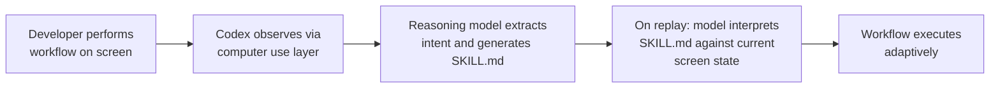
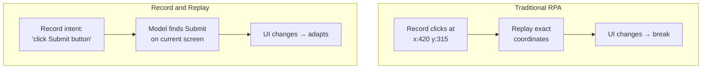

# Record and Replay: Why Demonstration Is Replacing Prompting for Agent Skill Creation


---

## The Shift from Telling to Showing

Since June 2026, OpenAI's Codex desktop app has shipped a feature that quietly inverts the entire agent-training paradigm: Record and Replay[^1]. Instead of describing a workflow in prose — crafting prompts, iterating on phrasing, debugging edge cases in natural language — you perform the task once while the agent watches, and it generates a reusable skill it can execute autonomously thereafter.

This is not a macro recorder. It is not RPA. The distinction matters because it explains why Record and Replay works where its predecessors failed, and why "prompting" as a primary skill-creation interface may already be on its way out.

## How Record and Replay Works

The architecture has three distinct phases:



### Recording Phase

You initiate a recording session (up to 30 minutes) and perform your workflow normally — clicking through UIs, filling forms, navigating between applications[^2]. Codex's computer-use layer captures screen state and your interactions, but critically, it does not store raw coordinates or pixel positions.

### Skill Generation Phase

After recording stops, Codex's reasoning model analyses the captured session and generates a `SKILL.md` file — a natural-language description of:

- **When** to activate the skill (trigger conditions)
- **What inputs** the workflow requires
- **What steps** to follow (described semantically, not positionally)
- **How to verify** the result succeeded[^3]

### Replay Phase

On subsequent invocations, the language model interprets the SKILL.md instructions against the *current* screen state. If a button has moved, a form field has been renamed, or a menu has been reorganised, the model adapts — because it understands what the workflow is trying to accomplish, not where specific pixels were located on the day of recording[^4].

## The SKILL.md Format

The generated skill file follows the Agent Skills open standard[^5]:

```yaml
---
name: file-expense-report
version: 1.0.0
description: Files a monthly expense report in Concur from receipt photos
author: daniel
tags: [finance, automation, monthly]
agents: [codex-cli, claude-code, cursor]
---
```

```markdown
## When to Use
Activate when the user says "file expenses", "submit receipts",
or at the start of each month.

## Inputs
- Receipt photos (1-20 images)
- Cost centre code (string, e.g. "ENG-042")

## Steps
1. Open Concur at https://concur.example.com
2. Navigate to "Create New Report"
3. Set report title to "Expenses - {current_month} {current_year}"
4. For each receipt photo:
   a. Click "Add Expense"
   b. Upload the image
   c. Verify OCR-extracted amount matches receipt
   d. Assign to provided cost centre
5. Submit report for approval

## Verification
- Report status shows "Submitted"
- All receipts appear as line items
- Total matches sum of individual amounts
```

The format is deliberately minimal — two required frontmatter fields (`name` and `description`), a Markdown body, and optional supporting directories for scripts, references, and assets[^6].

## Why This Differs from RPA

Traditional RPA tools — UiPath, Automation Anywhere, Power Automate Desktop — record at the coordinate and DOM-selector level. They capture *where* you clicked, *which* CSS class identified the target element, and *what sequence* of keystrokes followed. This creates brittle automations that break when:

- A UI redesign moves elements
- A SPA framework changes its DOM structure
- Resolution or scaling differs between recording and replay environments
- Dynamic content shifts element positions

Record and Replay routes generalisation through a language model instead[^7]. The SKILL.md captures *intent* in natural language, and at replay the model interprets that intent against whatever the screen actually looks like now. This is the meaningful architectural distinction: the recorder stopped storing where you clicked and started storing what you were trying to do.



## The Compound Reliability Problem

Record and Replay is not a panacea. The Stanford 2026 AI Index reports AI agents achieve an average 66% task success rate on the OSWorld benchmark — up sharply from 12% a year earlier, but still a 34% failure rate in unsupervised desktop automation[^8].

More critically, reliability compounds multiplicatively across steps. Temporal's analysis demonstrates that even an agent achieving 85% reliability on each individual step of a 10-step workflow succeeds end-to-end only about 20% of the time[^9]. This creates a specific trust problem: you cannot fully delegate, so you still monitor, which halves the productivity gain.

In practice, early adopters report 80-90% per-execution success rates for well-defined, stable-UI workflows[^10]. This places Record and Replay firmly in the "daily driver for simple tasks, supervised for complex ones" category.

## Portability: The Unexpected Interoperability Layer

Perhaps the most consequential design decision is that SKILL.md files are portable. The Agent Skills open standard, originally developed by Anthropic and open-sourced in December 2025, is now supported by Codex CLI, Claude Code, Gemini CLI, Cursor, Kiro, and at least 28 other tools[^11].

A skill recorded in the Codex desktop app can be:

1. Dropped into `.claude/skills/` for Claude Code consumption
2. Symlinked to `.agents/skills/` for Codex CLI
3. Version-controlled in Git alongside the project it automates
4. Shared across teams as a portable automation artefact

This creates an unintentional interoperability layer between competing agent ecosystems. If SKILL.md becomes the de facto standard for workflow automation — and adoption data suggests it already is — then recording a skill in one tool and replaying it in another reduces vendor lock-in significantly.

## When Demonstration Beats Prompting

Demonstration excels for:

| Scenario | Why Demonstration Wins |
|----------|----------------------|
| Multi-application workflows | Crossing app boundaries is hard to describe textually but trivial to show |
| UI-heavy tasks | Describing "the third dropdown in the second panel" is error-prone; clicking it once is unambiguous |
| Procedural knowledge | Steps that are easy to do but hard to articulate — the "I know it when I see it" category |
| Non-technical users | Business analysts can record workflows without learning prompt syntax |

Prompting remains superior for:

| Scenario | Why Prompting Wins |
|----------|-------------------|
| Conditional logic | "If X then Y, else Z" is clearer in text than in a linear recording |
| Parameterised workflows | Recordings capture one execution path; prompts describe the abstract pattern |
| Code generation | Terminal-based workflows are better expressed as instructions than screen recordings |
| Composability | Prompts compose more naturally than recordings |

## Practical Implications for Codex CLI Users

Record and Replay is a desktop-app feature (macOS only, v26.616+)[^12]. It does not exist in the terminal-native Codex CLI. However, the outputs — SKILL.md files — are fully consumable by Codex CLI's skill system.

The pragmatic workflow:

```bash
# Record in the desktop app, then use from CLI
ls .agents/skills/file-expense-report/
# SKILL.md  scripts/  references/

# Invoke the skill from Codex CLI
codex "Run the file-expense-report skill with cost centre ENG-042"
```

This creates a two-surface development pattern: use the desktop app's visual recorder for demonstration-friendly workflows, then invoke and orchestrate from the CLI for automation pipelines.

## The Prompt Engineer Displacement

Record and Replay does not eliminate prompt engineering — it compresses it. The system still produces a prompt (the SKILL.md); it simply generates that prompt from observation rather than requiring manual authorship.

For senior developers, this means:

1. **Skill creation** shifts from writing to reviewing — you demonstrate, then edit the generated SKILL.md to handle edge cases
2. **Quality control** moves downstream — instead of iterating on prompt phrasing, you iterate on skill verification criteria
3. **Expertise surfaces differently** — knowing *what to demonstrate* (and what to leave out) becomes the scarce skill

The demonstration-first approach does not make the underlying engineering simpler. It makes the *interface* to that engineering more natural for procedural knowledge capture.

## Availability and Constraints

- **Platform:** macOS only (v26.616+)[^12]
- **Plans:** ChatGPT Plus, Pro, Business, Enterprise, Edu
- **Regions:** Not available in the EEA, UK, or Switzerland at launch[^1]
- **Duration:** Up to 30 minutes per recording session
- **Output:** SKILL.md following the Agent Skills open standard

---

## Citations

[^1]: OpenAI Developer Community, "Introducing Record & Replay", June 2026. https://community.openai.com/t/introducing-record-replay/1384088

[^2]: TechTimes, "OpenAI Codex Automation Gains Record and Replay: Show It Once, Skip the Script", June 2026. https://www.techtimes.com/articles/318759/20260620/openai-codex-automation-gains-record-replay-show-it-once-skip-script.htm

[^3]: OpenAI, "Record and Replay", ChatGPT Learn documentation. https://developers.openai.com/codex/record-and-replay

[^4]: eesel AI, "OpenAI Codex record and replay, explained (2026)". https://www.eesel.ai/blog/codex-record-and-replay-explained

[^5]: Agensi, "The SKILL.md Open Standard: Full Specification (2026)". https://www.agensi.io/learn/skill-md-specification-open-standard

[^6]: OpenAI, "Build skills", ChatGPT Learn documentation. https://developers.openai.com/codex/skills

[^7]: MindStudio, "OpenAI Codex Record and Replay: How to Automate Repetitive Computer Tasks". https://www.mindstudio.ai/blog/openai-codex-record-replay-automate-tasks

[^8]: Stanford HAI, "AI Index Report 2026", OSWorld benchmark results.

[^9]: Temporal engineering analysis on compound step reliability in AI agent workflows.

[^10]: The AI Advantage, "Codex Record and Replay", YouTube, June 2026 — reporting 8-9/10 success rate in testing.

[^11]: The Prompt Index, "AI Agent Skills Guide 2026: SKILL.md, Claude Code, Codex & Security". https://www.thepromptindex.com/how-to-use-ai-agent-skills-the-complete-guide.html

[^12]: Digital Applied, "Codex Record & Replay: Show It Once, Skip the Script". https://www.digitalapplied.com/blog/openai-codex-record-replay-no-code-agent-skills-guide
