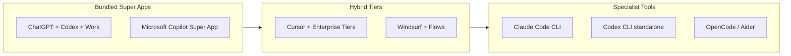
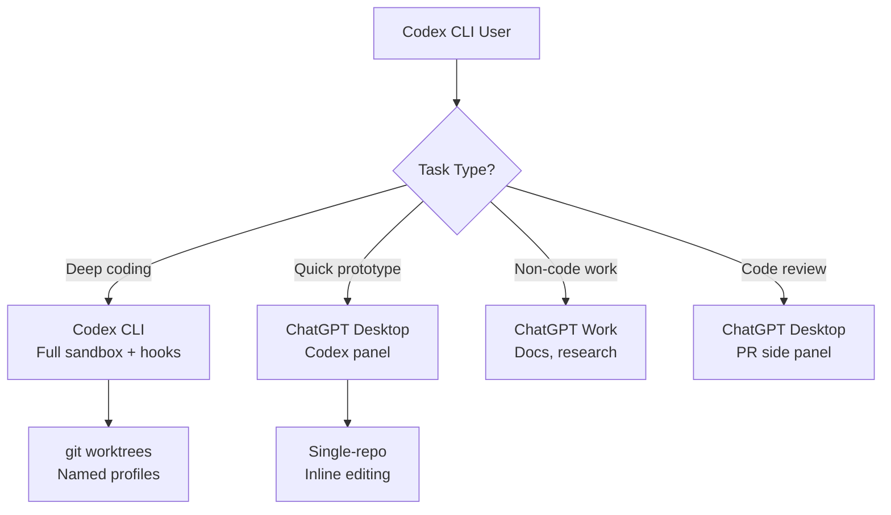

# The Super App Gambit: What Codex's Absorption into ChatGPT Means for the Agent IDE War


---

## The Merger That Changed the Landscape

On 9 July 2026, OpenAI folded Codex into the ChatGPT desktop application[^1]. What had been a standalone coding agent became one panel — alongside Chat and Work — inside a unified interface available on every ChatGPT plan, including Free[^2]. Overnight, Codex gained access to ChatGPT's hundreds of millions of users.

This was not a product improvement. It was a distribution play.

The same week, Microsoft confirmed its own bundling initiative: a unified Copilot super app combining GitHub Copilot, Copilot Chat, Copilot Cowork, and an agentic workflow system[^3]. Meanwhile, Anthropic kept Claude Code as a standalone terminal tool requiring a paid plan[^4]. Three radically different distribution strategies, each betting on a different theory of how developers adopt coding agents.

## Three Theories of Distribution

The agent IDE market in mid-2026 can be mapped along a spectrum from maximum bundling to maximum specialisation:



Each position implies a different bet:

| Strategy | Bet | Risk |
|----------|-----|------|
| **Super app** (OpenAI, Microsoft) | Distribution wins; most developers prefer one interface | Feature bloat, lowest-common-denominator UX |
| **Hybrid** (Cursor, Windsurf) | IDE-native integration captures the workflow | High burn rate; \$4B ARR but \$60B SpaceX acquisition suggests ceiling anxiety[^5] |
| **Specialist** (Claude Code, Codex CLI) | Quality wins; senior developers self-select the best tool | Limited distribution; requires bottom-up organic adoption |

## The Data Behind the Gambit

The distribution bet is not irrational. Consider the numbers:

- **GitHub Copilot** holds 29% work adoption — the highest of any AI coding tool — despite only 9% naming it "most loved"[^6]
- **Claude Code** earns 46% "most loved" among senior developers but requires a paid plan starting at \$20/month[^7]
- **Cursor** hit \$4B ARR by June 2026, with 75% of revenue from enterprise contracts[^5]
- **Copilot's share** fell from 67% to 51% in twelve months as Cursor and Claude Code gained ground[^8]

The pattern is clear: distribution dominates initial adoption, but quality drives retention. OpenAI is betting it can have both — ChatGPT's reach combined with Codex's capability.

## What Actually Changed for Codex Users

For existing Codex app users, the merger brought concrete improvements alongside the rebadging:

- Inline editing within diffs (previously a Claude Code advantage)
- Pull request review in a side panel
- Faster computer use powered by GPT-5.6[^1]
- Multi-repository support per project
- ChatGPT Work for non-coding agentic tasks (document generation, research, slide creation)[^2]

For Codex CLI users, nothing changed. The CLI remains standalone at v0.144.6[^9], with its own configuration (`codex.toml`), sandbox model, and approval policies. This dual-track approach — super app for the masses, CLI for power users — mirrors the Unix philosophy of offering both GUI and terminal interfaces.

## The Antitrust Shadow

Microsoft's parallel bundling of Copilot into a super app across Windows, Office, and VS Code has already drawn regulatory attention[^3]. OpenAI's move is subtler — ChatGPT is not an operating system — but the principle is identical: bundle a coding agent into an existing product with massive reach to suppress competitor adoption.

The European Commission's Digital Markets Act (DMA) designates platforms with over 45 million monthly active users as "gatekeepers" subject to interoperability obligations[^10]. ChatGPT crossed that threshold long ago. Whether coding agent bundling constitutes self-preferencing under DMA Article 6(5) remains untested, but the argument writes itself: a developer using ChatGPT Free now gets Codex at no additional cost, whilst Claude Code requires a separate \$20+/month subscription.

## Why Anthropic's Specialist Bet May Still Win

Against the super app thesis, Anthropic's Claude Code tells a counter-story:

1. **Quality differential**: Claude Code scores 80.8% on SWE-bench versus Codex's 56.8%[^7] ⚠️ (benchmark scores are harness-dependent and may not reflect real-world parity)
2. **Senior developer preference**: The 46% "most loved" rating creates organic bottom-up adoption in engineering teams[^7]
3. **Enterprise revenue density**: Focused tools command higher per-seat prices — Anthropic reportedly captures million-dollar annual contracts from enterprise engineering teams[^4]
4. **Terminal-native workflow**: Claude Code's CLI-first design integrates with existing developer toolchains without demanding a new application window

The historical precedent favours specialists in developer tooling. Git beat TFS. VS Code beat Visual Studio. Docker beat VMware for developers. In each case, the lighter, more focused tool won developer hearts despite the incumbent's distribution advantage.

## The Codex CLI User's Position

For Codex CLI practitioners, the super app merger creates an interesting strategic position:



The practical recommendation is straightforward: use the ChatGPT desktop app for lightweight tasks where Codex's GUI conveniences (inline diffs, PR panel, computer use preview) add value. Use Codex CLI for production work requiring sandbox isolation, hook pipelines, `requirements.toml` governance, and deterministic configuration.

Configure named profiles in `~/.config/codex/config.toml` to enforce this separation:

```toml
[profiles.gui-tasks]
model = "gpt-5.6-terra"
approval_policy = "on-request"
sandbox_mode = "workspace-write"

[profiles.production]
model = "gpt-5.6-sol"
approval_policy = "unless-allow-listed"
sandbox_mode = "full"

[profiles.production.hooks.post_tool_use]
command = "scripts/lint-and-test.sh"
```

## What Happens Next

The super app gambit will be tested over the next 6–12 months. Three signals to watch:

1. **Free-tier conversion**: How many ChatGPT Free users who discover Codex through the merged app convert to paid plans? If conversion is low, the distribution play generates cost without revenue.
2. **Enterprise displacement**: Do enterprise teams consolidate on ChatGPT+Codex, or does the "best-of-breed" pattern (Copilot for autocomplete, Claude Code for agentic work) persist?
3. **Regulatory action**: If the DMA or DOJ moves against Microsoft's Copilot bundling, it creates precedent that could constrain OpenAI's strategy too.

The deeper question is whether "agent IDE" is even the right frame. OpenAI is not building an IDE — it is building an operating environment where coding is one capability among many. Anthropic is building the best coding tool. These are different products for different markets that happen to overlap on the task of "write code with AI assistance."

For senior developers running Codex CLI today, the strategic advice is simple: the super app changes nothing about your workflow. The CLI remains the power tool. But watch the enterprise purchasing conversation carefully — when your CTO asks "why are we paying for three AI coding tools?", the super app's bundled economics become the answer they hear first.

## Citations

[^1]: OpenAI, "ChatGPT is now a partner for your most ambitious work," openai.com, 9 July 2026. [https://openai.com/index/chatgpt-for-your-most-ambitious-work/](https://openai.com/index/chatgpt-for-your-most-ambitious-work/)

[^2]: TechTimes, "ChatGPT Work Is Free on Every Plan: What OpenAI's Codex Merger Changes for You," 10 July 2026. [https://www.techtimes.com/articles/320087/20260710/chatgpt-work-free-every-plan-what-openais-codex-merger-changes-you.htm](https://www.techtimes.com/articles/320087/20260710/chatgpt-work-free-every-plan-what-openais-codex-merger-changes-you.htm)

[^3]: Windows News, "Microsoft Copilot Super App (2026): One Hub for Chat, GitHub Copilot, Agents," July 2026. [https://windowsnews.ai/article/microsoft-copilot-super-app-2026-one-hub-for-chat-github-copilot-agents.421314](https://windowsnews.ai/article/microsoft-copilot-super-app-2026-one-hub-for-chat-github-copilot-agents.421314)

[^4]: Silicon Report, "OpenAI Merges Codex into ChatGPT Desktop App, Creating Agentic 'Super App' Amid UI Criticism," July 2026. [https://www.siliconreport.com/openai-merges-codex-into-chatgpt-desktop-app-creating-agentic-super-app-amid-ui-criticism-168166a9](https://www.siliconreport.com/openai-merges-codex-into-chatgpt-desktop-app-creating-agentic-super-app-amid-ui-criticism-168166a9)

[^5]: Forbes, "Cursor Hits \$4 Billion Annualized Revenue Ahead Of SpaceX IPO," 8 June 2026. [https://www.forbes.com/sites/richardnieva/2026/06/08/cursor-4-billion-annualized-revenue/](https://www.forbes.com/sites/richardnieva/2026/06/08/cursor-4-billion-annualized-revenue/)

[^6]: JetBrains AI Pulse Survey, April 2026. Cited via Getpanto, "GitHub Copilot Statistics 2026." [https://www.getpanto.ai/blog/github-copilot-statistics](https://www.getpanto.ai/blog/github-copilot-statistics)

[^7]: MorphLLM, "Codex vs Claude Code (July 2026): Benchmarks, Subagents & Limits Compared." [https://www.morphllm.com/comparisons/codex-vs-claude-code](https://www.morphllm.com/comparisons/codex-vs-claude-code)

[^8]: Tech Insider Ireland, "Copilot Share Falls to 51% as Cursor Hits \$2B ARR [2026]." [https://tech-insider.org/ie/github-copilot-market-share-2026/](https://tech-insider.org/ie/github-copilot-market-share-2026/)

[^9]: OpenAI, "Codex CLI Changelog," v0.144.6, 18 July 2026. [https://developers.openai.com/codex/changelog](https://developers.openai.com/codex/changelog)

[^10]: European Commission, Digital Markets Act, Regulation (EU) 2022/1925, Article 3 (Designation of gatekeepers) and Article 6(5) (Self-preferencing prohibition).
