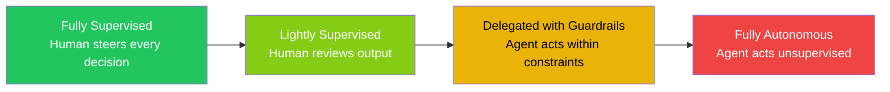
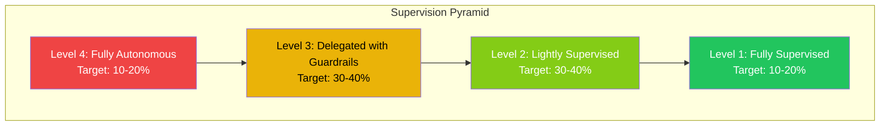
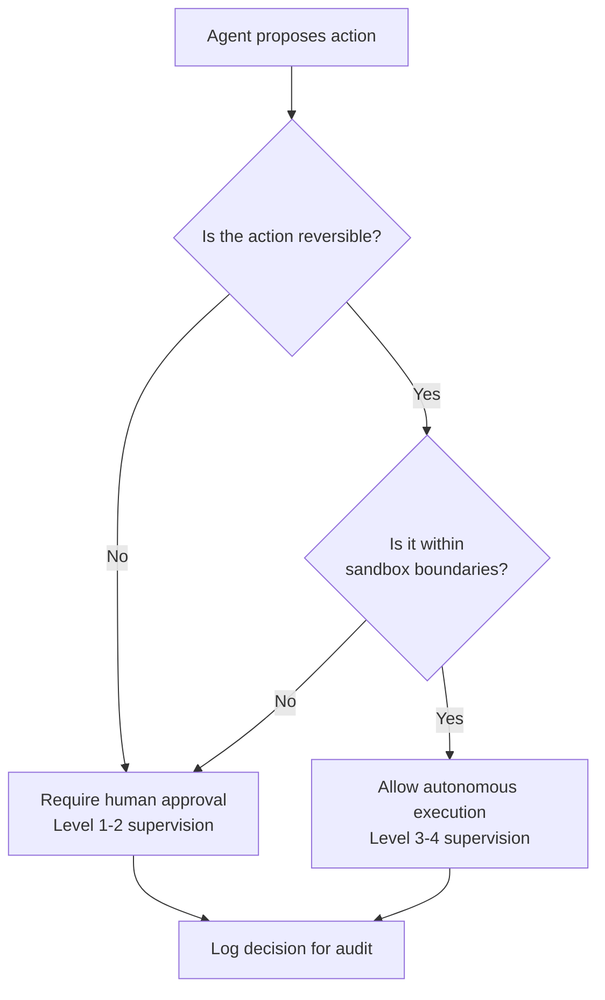

# Supervised vs Unsupervised Code: The Metric That Replaces 'Percentage Written by AI'


---

## The Death of "Percentage Written by AI"

Every engineering leadership deck in 2026 contains a slide reporting how much code is "AI-generated." The number is meaningless. As Andrew Ambrosino, who leads the Codex desktop app at OpenAI, argued on Lenny's Podcast: the question "how much code is AI-written?" is outdated when the answer approaches 100% — the real question is *supervised vs unsupervised* [^1]. How many times did a human steer it? That reframing has profound implications for how we measure quality, assign liability, and structure teams.

The data confirms the problem with the old metric. GitClear's longitudinal analysis shows code churn nearly doubled since widespread AI adoption — from 3.3% to between 5.7% and 7.1% — with AI-generated code disproportionately represented in that churn [^2]. A team reporting 60% AI-written code without quality context creates a false success narrative. Worse, the METR randomised controlled trial found developers using AI tools took 19% *longer* to complete tasks while believing they were 20% faster — a 39-percentage-point perception gap [^3].

The metric is broken. Here's what replaces it.

---

## The Supervision Spectrum

Rather than a binary "human-written vs AI-written" classification, code exists on a supervision spectrum. Each level implies different quality characteristics, review requirements, and risk profiles.



### Level 1: Fully Supervised (Steering)

The developer drives every decision. The agent acts as an intelligent autocomplete — suggesting code that the developer accepts, modifies, or rejects in real time. In Codex CLI terms, this maps to **suggest mode**, where every file edit and shell command requires explicit approval [^4].

### Level 2: Lightly Supervised (Reviewing)

The agent produces complete implementations that a developer reviews before merge. This maps to Codex CLI's **auto-edit mode** — file changes apply automatically, but shell commands still require approval [^4]. The human's role shifts from writing to reviewing.

### Level 3: Delegated with Guardrails (Bounded Autonomy)

The agent operates within explicit constraints: sandbox boundaries, token budgets, permission profiles, and approval policies for irreversible actions. Codex CLI's **writes mode** (introduced in v0.144.0) exemplifies this — reads execute without asking, writes require consent [^5]. The developer sets the constraints and reviews the outcome, not each step.

### Level 4: Fully Autonomous (Fire and Forget)

The agent operates with **full-auto mode** in an isolated sandbox, executing both file edits and shell commands without approval [^4]. Goal mode can run for hours without interaction. The developer states an objective and reviews the final result.

---

## Why Supervision Level Matters More Than Authorship

Anthropic's 2026 Agentic Coding Trends Report found that engineers use AI in roughly 60% of their work but report being able to "fully delegate" only 0–20% of tasks [^6]. That gap — between *usage* and *delegation* — is precisely what supervision metrics capture and authorship metrics miss.

The implications cascade through every dimension of engineering management:

### Quality Correlation

Augment Code's research demonstrates that the DORA 2024 dataset showed a 25% increase in AI adoption correlating with a 1.5% *decrease* in delivery throughput and a 7.2% decrease in stability [^3]. The root cause isn't that AI code is worse — it's that *unsupervised* AI code lacks the human steering that catches architectural mistakes, semantic misunderstandings, and subtle requirement gaps.

### Liability and Audit

When code causes a production incident, "was this AI-generated?" is the wrong question. The right questions: What supervision level was it produced under? Who reviewed it? What constraints governed the agent? These map directly to existing engineering governance structures.

### Cost Efficiency

Faros AI's analysis of 10,000 developers found that PR volume rose 98% per developer, but review time increased 91% and PR size grew 154% — with no measurable improvement in organisational DORA metrics [^3]. High *volume* at low *supervision* creates review bottlenecks. The solution isn't more code; it's better-supervised code.

---

## Measuring Supervision: A Practical Framework

### The Steering Ratio

The steering ratio measures the distribution of human engineering time between judgment-heavy work and mechanical execution [^3]. In an AI-native workflow, this becomes:

```
Steering Ratio = Time spent on judgment decisions / Total engineering time
```

A healthy team sees this ratio *increase* as AI adoption grows — humans spend more time on architecture, design, and review, less on implementation. If the ratio decreases, developers are drowning in low-value approval prompts or blindly accepting output.

### The Supervision Pyramid

Track what proportion of merged code was produced at each supervision level:



The pyramid inverts as agent reliability improves, but the key insight is that you *track the distribution*, not just the total.

### Pairing Metrics

Never report supervision metrics in isolation. The larridin.com AI Code Share framework recommends pairing [^2]:

| Primary Metric | Quality Pair |
|---|---|
| AI-Assisted Lines % | Code Turnover Rate (< 15% at 30 days) |
| Supervision Level Distribution | Change Failure Rate |
| Delegation Percentage | Mean Time to Recovery |
| Steering Ratio | Architecture Decision Records per sprint |

---

## Codex CLI as a Supervision Instrument

Codex CLI's approval mode architecture maps directly onto the supervision spectrum, making it one of the few tools where supervision level is *configurable and auditable*.

### Configuration for Each Level

```toml
# Level 1: Fully Supervised
[profile.supervised]
approval_mode = "suggest"
sandbox = "full"

# Level 2: Lightly Supervised
[profile.review]
approval_mode = "auto-edit"
sandbox = "workspace-write"

# Level 3: Delegated with Guardrails
[profile.delegated]
approval_mode = "writes"
sandbox = "workspace-write"
token_budget = 50000

# Level 4: Fully Autonomous
[profile.autonomous]
approval_mode = "full-auto"
sandbox = "workspace-write"
token_budget = 200000
```

### Auditing Supervision Decisions

Codex CLI's session traces record every approval decision, providing an auditable trail of supervision events. Combined with OpenTelemetry export (available since v0.140), teams can aggregate supervision patterns across the organisation [^7].

A CHI 2026 paper cautions that step-by-step approval across all decisions "can severely limit agent autonomy when desirable and may also disengage the user if their only form of supervision is repetitive" [^3]. The solution: route decisions based on *reversibility*. Irreversible actions (production deployments, database migrations) demand Level 1–2 supervision. Reversible actions (feature branches, test generation) can safely operate at Level 3–4.

---

## The Reversibility Heuristic



This heuristic aligns with how Codex CLI's writes mode already operates — reads are inherently reversible and execute freely; writes are potentially irreversible and require consent [^5].

---

## What Engineering Leaders Should Do Monday Morning

1. **Stop reporting "% AI-generated code"** — it conflates supervised and unsupervised output and provides no quality signal.

2. **Instrument supervision levels** — tag PRs and commits with the approval mode used during generation. Codex CLI's session metadata makes this straightforward.

3. **Track code turnover by supervision level** — if Level 4 (autonomous) code has > 22% turnover at 90 days, the constraints are too loose [^2].

4. **Set supervision policies per domain** — security-critical paths require Level 1–2; test generation and documentation can operate at Level 3–4.

5. **Measure the steering ratio** — if developers are spending *less* time on judgment work as AI adoption grows, something is wrong.

6. **Pair every throughput metric with a quality metric** — rising PR velocity with flat DORA metrics signals unsupervised volume inflation, not genuine productivity [^3].

---

## The Uncomfortable Implication

If supervision quality matters more than code authorship, then the most valuable engineering skill in 2026 isn't writing code or even prompting an agent — it's *knowing when to intervene*. As Ambrosino frames it: implementation is now abundant and nearly free; taste, curation, and the judgment to decide what to build have become the binding constraints [^1].

The developer who reviews ten autonomous agent outputs with sharp architectural judgment delivers more value than the developer who pair-programmes with an agent through a hundred files. The metric should reflect that.

---

## Citations

[^1]: Ambrosino, A. (2026). "OpenAI Codex lead on the new shape of product work." Lenny's Podcast. [https://www.lennysnewsletter.com/p/openai-codex-lead-on-the-new-shape](https://www.lennysnewsletter.com/p/openai-codex-lead-on-the-new-shape)

[^2]: Larridin. (2026). "AI Code Share: What Percentage of Your Code Is AI-Generated?" Developer Productivity Hub. [https://larridin.com/developer-productivity-hub/ai-code-share-percentage-ai-generated](https://larridin.com/developer-productivity-hub/ai-code-share-percentage-ai-generated)

[^3]: Augment Code. (2026). "Why AI Agent Metrics Lie: What CTOs Should Track." [https://www.augmentcode.com/guides/why-ai-agent-metrics-lie](https://www.augmentcode.com/guides/why-ai-agent-metrics-lie)

[^4]: OpenAI. (2026). "Agent approvals & security." Codex CLI Documentation. [https://developers.openai.com/codex/agent-approvals-security](https://developers.openai.com/codex/agent-approvals-security)

[^5]: OpenAI. (2026). "Codex CLI v0.144.0 Release Notes — Writes Approval Mode." [https://github.com/openai/codex/releases](https://github.com/openai/codex/releases)

[^6]: Anthropic. (2026). "2026 Agentic Coding Trends Report." [https://resources.anthropic.com/2026-agentic-coding-trends-report](https://resources.anthropic.com/2026-agentic-coding-trends-report)

[^7]: OpenAI. (2026). "Codex CLI Changelog." [https://github.com/openai/codex/blob/main/CHANGELOG.md](https://github.com/openai/codex/blob/main/CHANGELOG.md)
