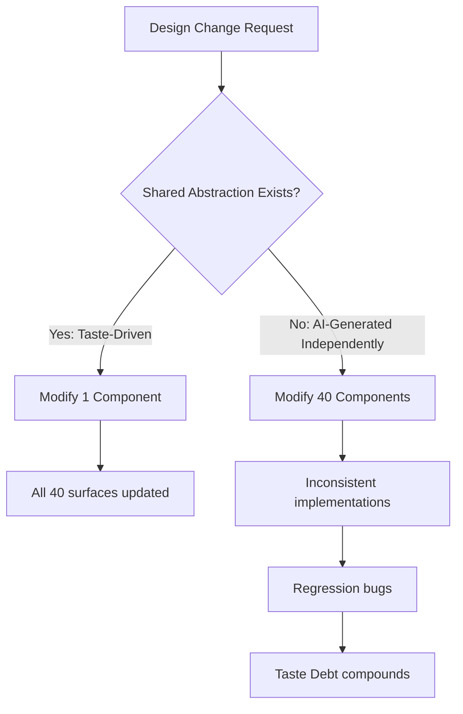
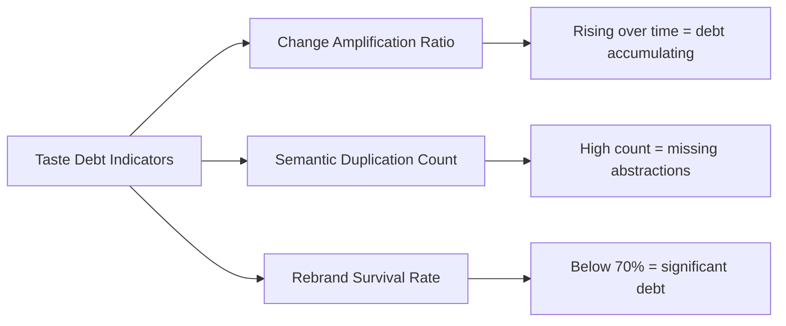

# Taste as the New Technical Debt: Why Design Abstraction Is the Last Human Frontier in AI-Generated Codebases


---

## The Implementation Layer Is Solved

Andrew Ambrosino, the engineer leading OpenAI's Codex desktop app, made a deceptively simple claim on Lenny's Podcast in June 2026: "Implementation is now cheap. Taste is the scarce resource."[^1] The statement is easy to nod along with and harder to act on. If implementation is abundant, what exactly is *taste* in an engineering context, and why does its absence compound into something that looks remarkably like technical debt?

The answer lies in a gap that current models — including GPT-5.6 Sol powering Codex[^2] — cannot reliably bridge: the abstraction layer between visual design intent and code structure. Models generate syntactically correct, functionally adequate code at extraordinary speed. What they do not generate is *coherent architecture that survives change*. When a rebrand arrives, or a design system evolves, or a product pivots, the shallow AI-generated codebase fractures in ways that a taste-driven codebase does not.

---

## What "Taste" Actually Means in Code

Taste is not aesthetics. In a codebase, taste manifests as the ability to recognise that two visually different components share an interaction pattern and should therefore share an abstraction. It is the judgment that says "these five buttons look different but behave identically under hover, focus, and disabled states — they are one component with five skins, not five components."

Ambrosino's framing is precise: models produce "cliché design" because they lack the capacity to abstract across visual semantics and codebase structure simultaneously[^1]. They optimise locally — generating a correct component for the immediate prompt — without maintaining the global coherence that makes a design system *systematic*.

This matters because the cost of incoherence is not paid at generation time. It is paid at *modification* time.

---

## The Mechanics of Taste Debt

Consider a concrete scenario. A team uses Codex CLI's goal mode to generate a dashboard application across 40 components over three weeks. Each component passes its tests. Each matches its Figma spec. The codebase is, by any automated metric, healthy.

Then the design team ships a new interaction pattern: all clickable surfaces must now support long-press for contextual actions. In a taste-driven codebase, this is a single change to a shared `Pressable` abstraction. In a taste-*absent* codebase — one where each component was generated independently by an AI that optimised for immediate correctness — the same change requires touching 40 files, because no shared abstraction exists.



This is taste debt: the accumulating cost of AI-generated code that is correct but *unabstracted*. It compounds silently because no linter catches it, no test fails, and no code review bot flags "you have 40 independent implementations of the same interaction pattern."

---

## Why Models Fail at This Specific Task

The failure is architectural, not a matter of model intelligence. Current reasoning models process code within a context window. They see the component they are generating and, at best, the immediately referenced files. They do not maintain a persistent mental model of "the interaction patterns in this codebase form a taxonomy, and this new component belongs at position X in that taxonomy."

Research published in 2026 confirms this empirically. A study on design issues in AI IDE-generated large-scale projects found that code is routinely "organized into functions and classes without coherent architectural reasoning," producing what the authors term "code slop" — syntactically correct, architecturally meaningless output[^3]. A separate study found that AI-assisted programming *decreased* the productivity of experienced developers by increasing maintenance burden through precisely this mechanism: comprehension debt accumulates when engineers accept code they do not fully understand because it was not built with coherent intent[^4].

The Codex CLI's `AGENTS.md` mechanism partially addresses this — you can encode design system rules, naming conventions, and abstraction requirements[^5]. But `AGENTS.md` operates at the instruction level. Taste operates at the *judgment* level. You cannot write a rule that says "recognise novel opportunities for shared abstractions that do not yet exist."

---

## The Supervision Gradient

This connects directly to the supervised/unsupervised code framing emerging in 2026[^6]. Taste-critical work demands high supervision — not because the AI cannot write the code, but because the AI cannot *decide what abstraction the code belongs to*. The human's role shifts from "write the implementation" to "design the abstraction and verify the AI placed it correctly."

In practice, this creates a supervision gradient:

| Work Type | Supervision Level | Human Role |
|-----------|------------------|------------|
| Utility code (parsers, adapters) | Low — dispatch and review | Verify correctness |
| Feature code (new screens, flows) | Medium — steer periodically | Verify coherence with existing patterns |
| Abstraction code (shared components, design tokens) | High — pair continuously | Define the abstraction, verify placement |
| Novel abstractions (new patterns, paradigm shifts) | Full human authorship | Create what does not yet exist |

Codex CLI's approval modes map cleanly to this gradient. `auto-edit` for utility code, `suggest` for feature code, and interactive mode for abstraction work[^7]. The discipline is in *choosing the right mode for the right layer* — not defaulting to full autonomy because it is faster.

---

## Measuring Taste Debt

If taste debt is real, it should be measurable. Three proxies emerge:

**1. Change amplification ratio.** For a given design change, how many files must be modified? In a well-abstracted codebase, this ratio is low (one abstraction change propagates to many surfaces). In a taste-debt-heavy codebase, it approaches 1:1 (each surface must be individually modified). Track this over time; if it rises, taste debt is accumulating.

**2. Semantic duplication.** Not syntactic duplication (which linters catch) but *behavioural* duplication — components that do the same thing differently. This requires human review or, increasingly, AI-assisted analysis where you ask a model to "identify components in this codebase that share interaction patterns but do not share implementations."

**3. Rebrand survival rate.** Simulate a rebrand: change the colour palette, update the typography scale, add a new interaction state. What percentage of components update automatically through design tokens and shared abstractions versus requiring manual intervention? Below 70% suggests significant taste debt.



---

## Codex CLI Patterns for Taste Preservation

Several patterns reduce taste debt accumulation when working with Codex CLI:

### Abstraction-First Prompting

Before generating feature code, generate the abstraction layer. Rather than prompting "build a settings page with these fields," prompt in two phases:

```bash
# Phase 1: Define the abstraction
codex exec "Review the existing form components in src/components/forms/. \
  Propose a shared FormField abstraction that unifies the input, validation, \
  and error-display patterns. Write the abstraction only, no consumers."

# Phase 2: Generate the feature using the abstraction
codex exec "Using the FormField abstraction in src/components/forms/FormField.tsx, \
  build the settings page per the spec in docs/settings-spec.md."
```

### Design System Assertions in AGENTS.md

Encode taste rules as hard constraints rather than soft suggestions:

```toml
# In codex.toml or AGENTS.md
[rules.design-system]
"NEVER create a new interactive component without first checking if an existing \
abstraction in src/components/primitives/ already handles the interaction pattern."
"ALL clickable surfaces MUST use the Pressable primitive, not raw onClick handlers."
"When generating a component that shares behaviour with an existing component, \
ALWAYS extract the shared behaviour into a hook or primitive BEFORE implementing."
```

### Periodic Abstraction Audits

Schedule a Codex automation to run weekly:

```bash
codex exec "Analyse all components in src/components/. Identify groups of 3+ \
  components that share interaction patterns but do not share abstractions. \
  Output a markdown report with suggested refactoring opportunities."
```

This uses the model's pattern-recognition strength (identifying similarity) whilst keeping the *decision* about whether to abstract in human hands.

---

## The Organisational Implication

Ambrosino describes his team structure as "zone defence" — designers write code, product managers own infrastructure, and formal role boundaries blur[^1]. This is not whimsy. It is a direct response to the taste problem. When implementation is cheap, the bottleneck shifts to the people who can maintain design coherence across an accelerating volume of generated code. Those people need to be close to both the design intent and the code structure simultaneously.

For teams adopting Codex CLI heavily, this suggests a structural change: the "design system engineer" role — historically a niche specialisation — becomes the highest-leverage position on the team. They do not write more code than the AI. They ensure the AI's code belongs to a coherent whole.

---

## The Compounding Problem

Augment Code's research on AI technical debt identifies the core mechanism: "GenAI may accelerate debt accumulation by increasing code volume without proportionate improvements in quality, integration with the software, or architectural coherence"[^8]. Taste debt is a specific, measurable instance of this general warning.

The compounding is non-linear. Each independently-generated component that *should* share an abstraction but does not makes the *next* component less likely to find and reuse a pattern — because the pattern was never extracted. The codebase becomes a flat collection of correct-but-isolated implementations, and the cognitive load of understanding it grows with every addition.

This is the paradox of AI-accelerated development: you ship faster, but you also accumulate the need for architectural refactoring faster. Without deliberate taste governance, the acceleration is self-defeating.

---

## Conclusion: Taste Is Not Optional

The shift from "how much code did the AI write?" to "how much taste did the human apply?" is not a rhetorical reframing. It is a measurable change in where engineering value accrues. Teams that treat Codex CLI as a faster typist will accumulate taste debt at the same rate they accelerate feature delivery. Teams that treat it as an implementation layer beneath a human-governed abstraction architecture will compound their advantage.

The last human frontier is not writing code. It is deciding what code *means* — which pieces belong together, which patterns should be shared, and when a novel abstraction must be created that no model would invent unprompted. That judgment is taste. Its absence is debt. And unlike traditional technical debt, no amount of AI-powered refactoring can repay it — because the model that generated the debt cannot see what is missing.

---

## Citations

[^1]: Ambrosino, A. (2026). "OpenAI Codex lead on the new shape of product work." *Lenny's Podcast*, 28 June 2026. https://www.lennysnewsletter.com/p/openai-codex-lead-on-the-new-shape
[^2]: OpenAI. (2026). "GPT-5.6: Frontier intelligence that scales with your ambition." https://openai.com/index/gpt-5-6/
[^3]: Wang, Y. et al. (2026). "Beyond Functional Correctness: Design Issues in AI IDE-Generated Large-Scale Projects." *arXiv:2604.06373*. https://arxiv.org/pdf/2604.06373
[^4]: Yilmaz, M. et al. (2025). "AI-Assisted Programming Decreases the Productivity of Experienced Developers by Increasing the Technical Debt and Maintenance Burden." *arXiv:2510.10165*. https://arxiv.org/pdf/2510.10165
[^5]: OpenAI. (2026). "Codex CLI Features." *OpenAI Developers*. https://developers.openai.com/codex/cli/features
[^6]: Ambrosino, A. (2026). Supervised vs unsupervised code framing, ibid. Lenny's Podcast appearance.
[^7]: OpenAI. (2026). "Codex CLI: Non-interactive mode." *OpenAI Developers*. https://developers.openai.com/codex/noninteractive
[^8]: Augment Code. (2026). "What Happens When AI Technical Debt Compounds (And How Spec-Driven Dev Prevents It)." https://www.augmentcode.com/guides/ai-technical-debt-compounds-spec-driven-development
