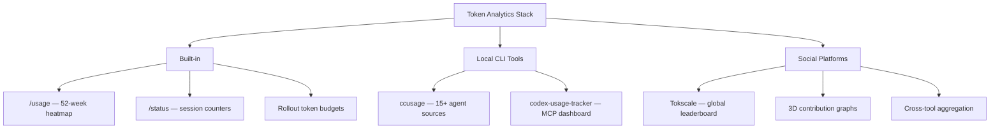
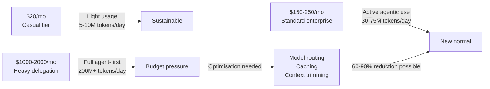

# Token Burn as Computing Paradigm Indicator: What Your Consumption Metrics Actually Reveal


---

One developer burned 860 million tokens in a single day through Codex [^1]. Another team's monthly OpenAI bill hit \$1.3 million — 603 billion tokens across 7.6 million requests [^2]. These numbers sound alarming until you reframe the question: is token consumption a cost to minimise, or a leading indicator of a fundamental shift in how developers work?

The answer, as with most interesting questions, is both. But the emerging ecosystem of token-tracking tools, competitive leaderboards, and usage analytics suggests that "token burn rate" is becoming the developer equivalent of what CPU cycles were in the 1990s — the primitive unit of computational work that defines a generation.

## The Metrics That Matter

### Raw Consumption vs Productive Consumption

Not all tokens are equal. A naive metric of "tokens consumed per day" conflates several distinct activities:

- **Exploration tokens** — reasoning through architectural options, discarded after evaluation
- **Execution tokens** — generating code that ships to production
- **Correction tokens** — fixing errors from earlier turns (a form of waste)
- **Cache tokens** — repeated context that could have been served from cache at 90% discount [^3]

The ratio between these categories reveals more about developer effectiveness than the absolute number. A developer burning 50 million tokens/day with a 70% execution ratio is vastly more productive than one burning 200 million tokens/day with a 15% execution ratio and 60% correction loops.

### The Tools for Measurement

Three tiers of token analytics have emerged in 2026:



**Codex CLI built-in tracking** arrived in v0.140.0 with the `/usage` command [^4]. It fetches activity data asynchronously from the API and renders a GitHub-style contributions heatmap covering 52 weeks. Three subcommands — `/usage daily`, `/usage weekly`, and `/usage cumulative` — provide different temporal views. The `/status` command supplements this with per-session token counters and context window utilisation.

**ccusage** (v20.0.17) is a Rust-based CLI that reads local session logs from 15+ coding agents — Claude Code, Codex, OpenCode, Gemini CLI, Amp, and more — producing unified daily, weekly, monthly, and session-level reports with cost estimates [^5]. It processes data locally without uploading anything, making it suitable for enterprise environments with data residency requirements.

**Tokscale** takes the opposite approach: a social platform where developers submit usage data to a global leaderboard, compete on consumption, and display 2D/3D contribution graphs on public profiles [^6]. It tracks input, output, cache read/write, and reasoning tokens across every major coding agent.

## The Paradigm Indicator Thesis

Nate B. Jones — who reported burning over 860 million tokens in a single day — frames his token usage trajectory as evidence of "the first change in the computing paradigm in 40 years" [^1]. His year-long tracking showed a dramatic inflection point coinciding with the arrival of computer use capabilities and GPT-5.5's expanded context window.

The argument has structural merit. Consider the progression:

| Era | Primary Work Unit | Cost Trend | Developer Relationship |
|-----|------------------|------------|----------------------|
| Mainframe | CPU hours | Decreasing | Ration carefully |
| Client-server | Compute instances | Decreasing | Provision on demand |
| Cloud | API calls | Decreasing | Scale elastically |
| Agent | Tokens | Decreasing | Delegate aggressively |

Each transition followed the same pattern: the new unit of work was initially expensive and rationed, then became cheap enough that consumption volume became a signal of adoption rather than waste. We are mid-transition with tokens.

### The Inflection Evidence

Several data points support the inflection thesis:

1. **Cost per token has fallen 10× in 18 months** — GPT-4 Turbo launched at \$10/\$30 per million tokens; GPT-5.5 operates at \$2.50/\$15 [^7]
2. **Prompt caching delivers 90% discounts** on repeated context, fundamentally changing the economics of agentic workflows [^3]
3. **Agentic workflows consume 10-100× more tokens than chat** because full context resends on every tool call [^8] — yet adoption is accelerating, not retreating
4. **Enterprise spend is normalising** at \$150–\$250/developer/month as a standard line item [^9]

## Healthy vs Unhealthy Burn Profiles

If token consumption is a paradigm indicator, distinguishing productive burn from waste becomes critical. Based on community data and enterprise reports, several patterns emerge:

### Healthy Profile

```toml
# Example Codex CLI rollout budget configuration
[token_budget]
daily_limit = "75M"
warning_threshold = "60M"
model_allocation.planning = "o3"          # Higher reasoning for architecture
model_allocation.execution = "o4-mini"    # Cost-efficient for implementation
model_allocation.review = "o3"            # Full reasoning for code review

[cache_strategy]
min_cache_life = "30m"
explicit_breakpoints = true
target_cache_hit_rate = 0.65
```

A healthy burn profile shows:

- **Steady daily increase** with weekend dips (consistent delegation habits)
- **Cache hit rates above 60%** (efficient context reuse)
- **Correction ratio below 20%** (well-configured agents.md reducing rework)
- **Mixed-model usage** (routing trivial tasks to cheaper models)
- **Peak days correlating with feature completions** (delegation of substantial work, not idle loops)

### Unhealthy Profile

- **Erratic spikes** followed by zero-usage days (context thrashing, no session continuity)
- **Cache hit rates below 30%** (poor prompt structure, no caching strategy)
- **Correction ratio above 50%** (agent misconfiguration producing persistent errors)
- **Single-model usage at highest tier** (no cost-aware routing)
- **High consumption with low commit frequency** (tokens burned without productive output)

## The Cost Curve and Enterprise Reality

The current cost landscape in mid-2026 creates a bifurcated reality [^9] [^10]:



Microsoft's Experiences + Devices division reportedly ordered engineers off Claude Code by June 2026 after token billing hit approximately \$2,000 per engineer per month, exhausting the annual AI budget early [^10]. This isn't evidence that agent-first development is unsustainable — it's evidence that unmanaged delegation without cost-aware routing is unsustainable.

The optimisation playbook is well-documented: prompt caching alone can cut spend by 59%, model routing achieves 97.7% of frontier accuracy at 61% of cost, and output compression reduces tokens by 65% on average [^3] [^8].

## Tracking Your Own Inflection Point

For individual developers, the actionable insight is not "burn more tokens" but "track your burn and look for the inflection":

```bash
# Install ccusage for unified local analytics
npm install -g ccusage

# View last 30 days across all agents
ccusage --period 30d --sources codex,claude

# Or use Codex CLI's built-in tracking
# Within a Codex session:
/usage weekly
```

The inflection point — where your token consumption jumps by an order of magnitude without a corresponding spike in frustration or rework — marks the moment you've shifted from "using AI as autocomplete" to "delegating substantive work to agents." That's the paradigm shift made visible in a single metric.

## The Competitive Dimension

Tokscale's global leaderboard [^6] has gamified what was previously an invisible metric. Whether this is healthy is debatable — competitive token burning could incentivise waste — but it serves an important function: normalising high consumption and providing social proof that heavy delegation is a legitimate working pattern, not an indulgence.

The leaderboard also creates transparency around what "heavy usage" actually looks like, helping teams calibrate their expectations and budgets against community baselines rather than arbitrary internal limits.

## Conclusion

Token burn rate is not a vanity metric. Tracked properly — with breakdowns by category, cache efficiency, correction ratio, and productive output — it becomes the clearest signal of where a developer or team sits on the adoption curve from "AI-assisted" to "agent-first."

The developers burning hundreds of millions of tokens daily aren't wasteful. They're early adopters of a paradigm where the marginal cost of computational thinking approaches zero. The developers who should worry are those with flat-line usage graphs — not because high consumption is inherently good, but because stagnant consumption in a deflationary cost environment suggests they're leaving delegation capacity on the table.

Track your tokens. Find your inflection. The paradigm shift is visible in the data.

---

## Citations

[^1]: Nate B. Jones, "Codex: Your First Personal AI Agent Delegation Loop," YouTube, 2026. [https://www.youtube.com/watch?v=xqGCbEDbny8](https://www.youtube.com/watch?v=xqGCbEDbny8)

[^2]: Automate X, "I Burned 435 Million Tokens on Codex in a Month. Here's What I Found," Medium, June 2026. [https://medium.com/@automate.x.a2b/i-burned-435-million-tokens-on-codex-in-a-month-heres-what-the-i-found-0216f4be0788](https://medium.com/@automate.x.a2b/i-burned-435-million-tokens-on-codex-in-a-month-heres-what-the-i-found-0216f4be0788)

[^3]: "The 2026 Token Optimization Playbook: Cut AI Agent Memory Costs 3–4×," Mem0, 2026. [https://mem0.ai/blog/the-2026-token-optimization-playbook-cut-ai-agent-memory-costs-3–4x](https://mem0.ai/blog/the-2026-token-optimization-playbook-cut-ai-agent-memory-costs-3%E2%80%934x)

[^4]: "Check token usage from the terminal with /usage added in Codex CLI 0.140.0," DevelopersIO, 2026. [https://dev.classmethod.jp/en/articles/codex-cli-usage-token-activity/](https://dev.classmethod.jp/en/articles/codex-cli-usage-token-activity/)

[^5]: ccusage — Coding (Agent) CLI Usage Analysis. [https://ccusage.com/](https://ccusage.com/)

[^6]: Tokscale — AI Token Usage Tracker & Leaderboard. [https://github.com/junhoyeo/tokscale](https://github.com/junhoyeo/tokscale)

[^7]: OpenAI, "Codex rate card," OpenAI Help Center, 2026. [https://help.openai.com/en/articles/20001106-codex-rate-card](https://help.openai.com/en/articles/20001106-codex-rate-card)

[^8]: "AI Agents Burn 50x More Tokens Than Chats," LeanOps, 2026. [https://leanopstech.com/blog/agentic-ai-cost-runaway-token-budget-2026/](https://leanopstech.com/blog/agentic-ai-cost-runaway-token-budget-2026/)

[^9]: "AI Coding Costs (2026): Claude vs Codex vs Gemini, Real Monthly Spend From Token Math," MorphLLM, 2026. [https://www.morphllm.com/ai-coding-costs](https://www.morphllm.com/ai-coding-costs)

[^10]: "AI coding agents could soon cost more than the developers using them," The Register, June 2026. [https://www.theregister.com/ai-and-ml/2026/06/24/ai-coding-agents-could-soon-cost-more-than-the-developers-using-them/5260864](https://www.theregister.com/ai-and-ml/2026/06/24/ai-coding-agents-could-soon-cost-more-than-the-developers-using-them/5260864)
