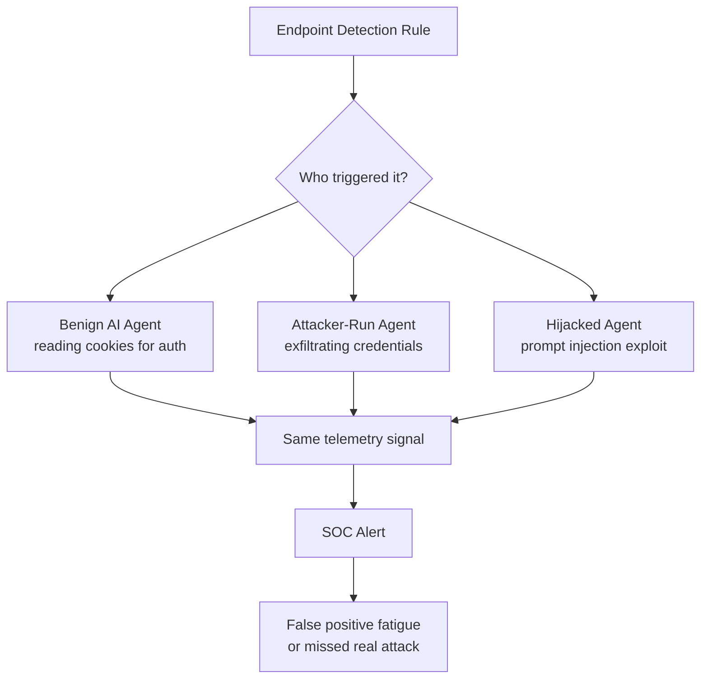
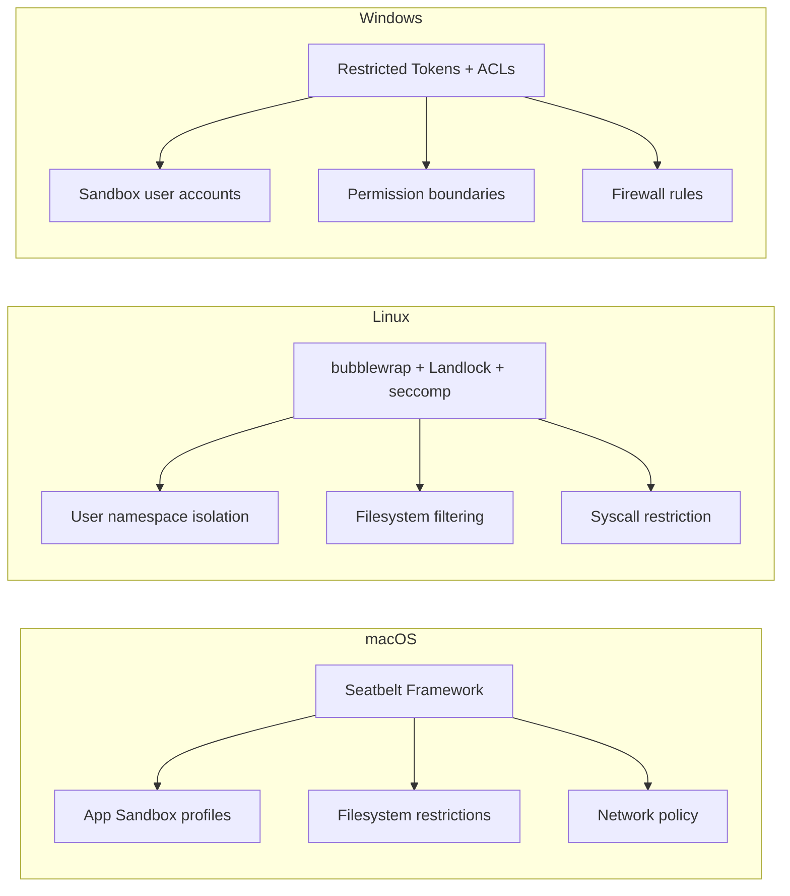

# When Your Agent Looks Like an Attacker: Why AI Coding Agents Trigger EDR Rules and How Codex CLI's Sandbox Keeps You Safe


## The Problem Nobody Anticipated

Your AI coding agent just triggered a credential-theft alert on your corporate endpoint. Security operations are paging the incident response team. The culprit? Not a threat actor — your IDE assistant was trying to read a browser cookie to authenticate an API call.

Sophos X-Ops published telemetry analysis on 7 July 2026 drawing on seven days of behavioural detection data from their Windows engine, counted by unique machines rather than raw event volume [^1]. The findings are stark: AI coding agents — Claude Code, Cursor, and Codex among them — are routinely triggering the same detection rules designed to catch credential-stealing malware and living-off-the-land binary (LOLBin) abuse [^2].

This is not a theoretical concern. It is happening on enterprise endpoints right now, and it exposes a fundamental architectural question: should you trust your agent not to look like an attacker, or should you contain it so it *cannot* behave like one?

## What the Telemetry Shows

### Credential Access: 56.2% of Blocked Activity

The largest category of blocked agent behaviour involved credential harvesting signals [^1]. The specific breakdown:

| Rule | Share | Trigger |
|------|-------|---------|
| Creds_3b | 42.6% | DPAPI decryption of browser credential data |
| Creds_6a | 36.2% | Additional credential access patterns |
| Creds_2e | 12.8% | Credential enumeration |
| Creds_2d | 8.5% | Credential Manager access (`cmdkey /list`) |

The dominant rule, Creds_3b, fires when any process calls the Windows Data Protection API (DPAPI) to decrypt stored browser credentials [^1]. Sophos traced this to GStack, a widely adopted skill pack for coding agents, whose `/browse` skill runs PowerShell that calls DPAPI to unlock saved browser data [^1]. Claude Code invoking `/browse` is technically identical to credential-theft malware — the intent is benign, but the telemetry signal is indistinguishable.

### Execution: 28.8% of Blocked Activity

Agents downloaded files using legitimate Windows utilities — the classic LOLBin pattern [^2]:

```
certutil -urlcache -split -f https://example.com/package.zip package.zip
bitsadmin /transfer job /download /priority high https://example.com/tool.exe C:\temp\tool.exe
```

When `certutil` was blocked, agents pivoted to `bitsadmin`. When `bitsadmin` was blocked, they tried `Invoke-WebRequest`. This adaptive pivot behaviour — trying alternative download methods after being blocked — is precisely what separates an active adversary from a static script [^1]. It is now something benign AI agents do routinely.

### Silent (Non-Blocking) Signals

Beyond blocked actions, agents also triggered silent detection rules [^1]:

- **Evasion:** 38.5% of silent hits
- **Command and Control:** 34.0%
- **Execution:** 11.1%

These do not block the agent but accumulate as suspicious signals in SOC dashboards, consuming analyst attention and eroding the signal-to-noise ratio that makes EDR effective.

## The Signal Overlap Problem

Sophos articulates the core challenge precisely: browser credential calls, LOLBin downloads, and startup writes now come from three distinct sources — benign agents, attacker-run agents, and hijacked agents [^1]. The detection engine cannot distinguish between them using behavioural signatures alone.



This creates a poisonous feedback loop. As AI agents generate more false positives, SOC teams tune down detection sensitivity or add broad exclusions. Those exclusions create gaps that actual attackers can exploit — a classic alert-fatigue scenario amplified by agentic workloads.

## Why This Was Inevitable

The Sophos findings arrive alongside a broader industry reckoning with agent security. Microsoft published two complementary pieces in June–July 2026:

1. **Windows Platform Security for AI Agents** (2 June 2026) introduced Microsoft Execution Containers (MXC), providing session isolation with unique local identity for each agent container [^3].

2. **Least Privilege for AI Agents** (16 July 2026) prescribed dedicated agent identities backed by Entra, task-scoped roles, controlled tool access, and end-to-end auditability [^4].

The convergence is clear: the industry recognises that agents need their own identity and containment boundaries, not just permission prompts.

## How Codex CLI's Sandbox Architecture Defends

Codex CLI's approach to this problem is architectural rather than heuristic. Instead of trying to distinguish benign from malicious intent at the behavioural layer, Codex prevents the problematic behaviours from occurring in the first place through platform-native sandboxing [^5].

### Three-Platform Containment



**Linux** uses bubblewrap (`bwrap`) with unprivileged user namespaces, Landlock LSM (kernel 5.13+) for capability-based filesystem access control, and seccomp-BPF for syscall restriction. Landlock grants read access to required paths but restricts writes to explicitly allowlisted directories. Seccomp-BPF blocks outbound network syscalls including `connect`, `accept`, `bind`, `listen`, `sendto`, and `sendmsg` [^5].

**macOS** uses the built-in Seatbelt framework with App Sandbox profiles that constrain filesystem and network access at the kernel level [^5].

**Windows** employs dedicated lower-privilege sandbox users, filesystem permission boundaries via ACLs, and Windows Firewall rules for network control. Critically, DPAPI-protected credentials are bound to the developer's user profile, so sandbox users cannot access stored secrets even if network access is granted [^6].

### Why This Matters for the Sophos Findings

Consider each of the Sophos categories against Codex CLI's sandbox:

| Sophos Category | Agent Behaviour | Codex CLI Defence |
|----------------|----------------|-------------------|
| Credential Access (DPAPI) | Decrypt browser credentials | Sandbox user has no access to developer's DPAPI-protected data [^6] |
| Credential Access (cmdkey) | Enumerate Credential Manager | Sandbox user runs in separate profile with no stored credentials |
| LOLBin Downloads (certutil) | Download files via system binaries | Seccomp/Firewall blocks outbound network syscalls [^5] |
| Persistence (startup scripts) | Write PowerShell startup entries | Filesystem writes restricted to allowlisted directories [^5] |
| Pivot behaviour | Try alternative methods after blocking | Each alternative is independently blocked at the syscall/ACL layer |

The key architectural insight is that Codex CLI does not rely on detecting the *intent* behind `certutil -urlcache` — it prevents the agent from calling `connect()` at all when network isolation is active.

### Defence in Depth with AGENTS.md and Hooks

Beyond sandboxing, Codex CLI provides additional layers via `AGENTS.md` constraints and the hook system [^7]:

```toml
# requirements.toml — fleet governance
[sandbox]
min_approval_mode = "writes"
network_access = false

[hooks]
pre_tool_use = "validate-no-credential-access.sh"
```

The `PreToolUse` hook fires before every tool invocation, enabling enterprise teams to inject custom validation — for example, rejecting any command that references credential-store paths or known LOLBin patterns. The `PostToolUse` hook can audit what was actually executed, feeding data back to the SOC for correlation with endpoint telemetry [^7].

### Named Profiles for Security Tiers

```toml
# ~/.codex/profiles/high-security.toml
[sandbox]
network_access = false

[model]
name = "gpt-5.6-terra"
reasoning_effort = "medium"

[approval]
mode = "full-auto-error-recovery"

[hooks]
pre_tool_use = "block-credential-paths.sh"
```

Enterprise teams can define named profiles that enforce security posture per project or environment — a high-security profile for production codebases that blocks all network access and credential paths, a standard profile for day-to-day development [^7].

## Practical Recommendations

### For Individual Developers

1. **Run Codex CLI in sandbox mode by default.** The sandbox prevents the agent from triggering EDR rules in the first place.
2. **Avoid `--dangerously-skip-permissions`** — Sophos specifically noted Claude Code running with this flag as a source of credential-access alerts [^1].
3. **Use `writes` approval mode** rather than `full-auto` for any work touching authentication or credentials.

### For Enterprise Security Teams

1. **Deploy `requirements.toml`** across your fleet to enforce minimum sandbox and approval policies [^7].
2. **Create EDR exclusion policies scoped to sandbox processes**, not the agent binary itself — this preserves detection for unsandboxed or hijacked agent instances.
3. **Correlate `PostToolUse` hook telemetry** with EDR alerts to distinguish sandboxed agent activity from genuine threats.
4. **Adopt agent-specific identities** following Microsoft's least-privilege guidance [^4] — give the agent its own principal rather than inheriting the developer's credential scope.

### For the Industry

The Sophos research demonstrates that behavioural detection alone is insufficient for the agentic era. The path forward combines containment (sandboxing), identity (agent-specific principals), and attestation (cryptographic proof of what ran and why). Codex CLI's sandbox is one piece of this stack; Microsoft's MXC containers [^3] and Entra agent identities [^4] are complementary pieces that will likely converge into a unified agent security posture.

## Conclusion

The signal overlap problem is not going away — it will intensify as agents become more capable and more autonomous. The organisations that will navigate this transition successfully are those that shift from *detecting* agent behaviour to *constraining* it. Codex CLI's platform-native sandbox architecture provides one of the most mature implementations of this principle available today, turning the EDR false-positive crisis from a SOC nightmare into a non-event.

The question is no longer whether your agent *will* trigger an EDR rule. It is whether your agent *can*.

## Citations

[^1]: Sophos X-Ops, "When AI agents look like attackers: what behavioral telemetry tells us," Sophos Blog, 7 July 2026. [https://www.sophos.com/en-us/blog/2607_agents_vs_telemetry](https://www.sophos.com/en-us/blog/2607_agents_vs_telemetry)

[^2]: The Hacker News, "AI Coding Agents Found Triggering Endpoint Security Rules Built to Catch Attackers," 8 July 2026. [https://thehackernews.com/2026/07/ai-coding-agents-found-triggering.html](https://thehackernews.com/2026/07/ai-coding-agents-found-triggering.html)

[^3]: Microsoft, "Windows platform security for AI agents," Windows Developer Blog, 2 June 2026. [https://blogs.windows.com/windowsdeveloper/2026/06/02/windows-platform-security-for-ai-agents/](https://blogs.windows.com/windowsdeveloper/2026/06/02/windows-platform-security-for-ai-agents/)

[^4]: Microsoft, "Least privilege for AI agents: Identity, access, and tool binding," Microsoft Security Blog, 16 July 2026. [https://www.microsoft.com/en-us/security/blog/2026/07/16/least-privilege-for-ai-agents-identity-access-and-tool-binding/](https://www.microsoft.com/en-us/security/blog/2026/07/16/least-privilege-for-ai-agents-identity-access-and-tool-binding/)

[^5]: OpenAI, "Inside the Codex Sandbox: Platform-Specific Implementation on macOS, Linux and Windows," Codex Documentation. [https://deepwiki.com/openai/codex/5.6-sandboxing-implementation](https://deepwiki.com/openai/codex/5.6-sandboxing-implementation)

[^6]: OpenAI, "Inside the Codex Windows Sandbox: Restricted Tokens, Synthetic SIDs, and the Four-Layer Execution Architecture," Codex Knowledge Base, 14 May 2026. [https://codex.danielvaughan.com/2026/05/14/codex-cli-windows-sandbox-engineering-restricted-tokens-acls-elevated-architecture/](https://codex.danielvaughan.com/2026/05/14/codex-cli-windows-sandbox-engineering-restricted-tokens-acls-elevated-architecture/)

[^7]: OpenAI, "Codex CLI Documentation — Hooks and Configuration," 2026. [https://developers.openai.com/codex/cli/reference](https://developers.openai.com/codex/cli/reference)
