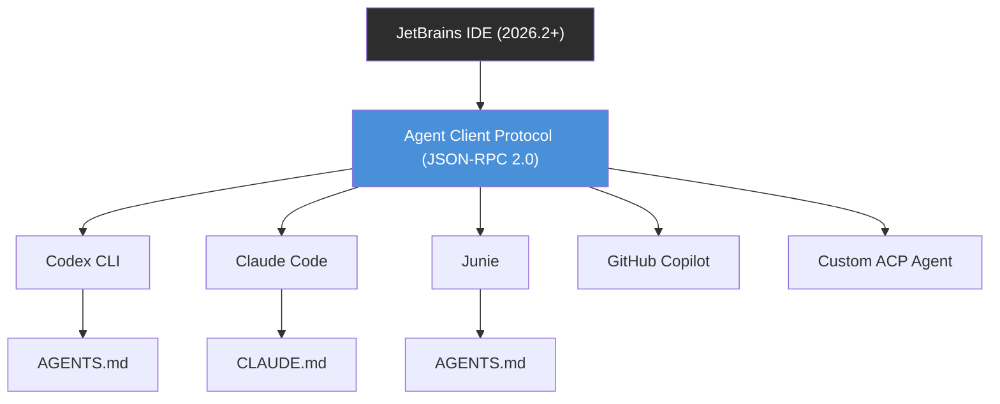
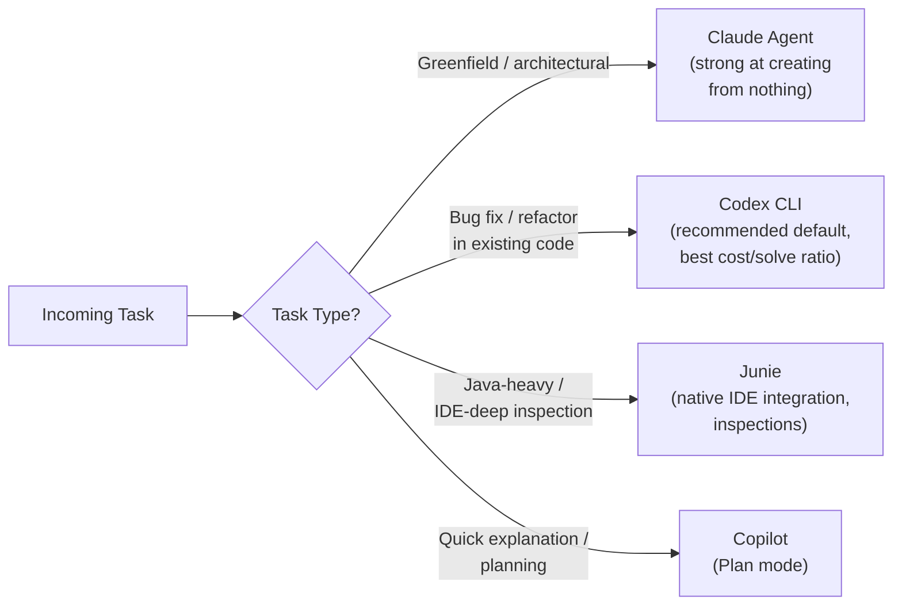

# From Terminal to IDE: How Codex CLI Became JetBrains' Recommended Agent — and What Multi-Agent IDEs Mean for Your Workflow


---

For most of its life, Codex CLI has been a terminal-native tool. You install it, point it at a repository, and work through shell prompts. That changed materially in June–July 2026 when two things happened in quick succession: JetBrains made Codex the **recommended agent** in AI Assistant [^1], and GitHub Copilot shipped Codex as an **agent provider** in JetBrains IDEs alongside Claude [^2]. The IDE is no longer a single-agent environment — it is a multi-agent orchestration surface, and Codex CLI sits at its centre.

This article examines why JetBrains chose Codex, how the Agent Client Protocol (ACP) makes multi-agent IDEs possible, and what the practical workflow implications are for senior developers already using Codex CLI in the terminal.

## Why JetBrains Chose Codex as the Default

JetBrains published a rigorous evaluation methodology alongside the announcement [^1]. The selection was not based on model leaderboard position. Instead, three practical metrics drove the decision: **solve rate**, **median cost per task**, and **end-to-end latency**.

### Benchmark Results

The evaluation covered real-world software engineering tasks with automated test verification:

| Language | Tasks | Codex Solve Rate | Codex Median Cost | Codex Median Latency |
|----------|-------|-------------------|--------------------|-----------------------|
| Java     | 225   | 43.9%             | \$0.1292            | 124s                  |
| C#       | 38    | 62.6%             | \$0.1152            | 143s                  |
| Python   | 90    | 20.2%             | \$0.1724            | 298s                  |

The closest competitor was **Junie** (powered by Gemini 3 Flash), which scored marginally higher on Java (45.2%) but lower on C# (58.7%) and Python (15.6%). Weighted across all three ecosystems, Codex edged ahead at 39.9% versus Junie's 39.1% [^1]. Claude Agent and Copilot were evaluated but did not reach the shortlist.

Configurations exceeding \$20/month for the top 2% of users were eliminated outright — a constraint that excluded several high-reasoning-effort model tiers [^1]. The result: GPT-4o with medium reasoning became the Codex configuration shipped to all JetBrains AI subscribers.

An online A/B test with real users validated the offline numbers by measuring engagement, agent-switching frequency, and return-to-chat rates [^1].

## The Agent Client Protocol: One IDE, Many Agents

The enabling technology behind multi-agent IDEs is the **Agent Client Protocol (ACP)** — an open JSON-RPC 2.0 standard co-developed by JetBrains and Zed [^3]. ACP defines a standard communication interface between code editors and AI coding agents, analogous to what the Language Server Protocol (LSP) did for language intelligence in the 2010s.

Any agent that implements ACP can be plugged into a supporting IDE without custom integration work. The official ACP Registry, live since 28 January 2026, lists verified compatible agents including Gemini CLI, Claude Code, Auggie, OpenCode, and Codex CLI [^4]. SDKs are available in Python, TypeScript, Kotlin, and Rust [^3].



This is a fundamental architectural shift. Instead of the IDE being tightly coupled to a single AI backend, ACP turns the IDE into an **agent host** — a surface that routes tasks to whichever agent the developer selects from a dropdown [^5].

## Operation Modes and Permission Models

Each agent exposes its own operation modes through ACP. For Codex, three modes are available [^6]:

- **Read-only** — browse and explain code; no file modifications permitted
- **Agent** — modify files within the project workspace only
- **Agent (full access)** — modify files anywhere on the machine and run commands with minimal restrictions

Compare this to the other agents' permission models:

| Agent          | Modes                                                    |
|----------------|----------------------------------------------------------|
| Codex          | Read-only, Agent, Agent (full access)                    |
| Claude Agent   | Auto, Default, Accept Edits, Plan, Don't Ask, Bypass     |
| Junie          | Brave mode, Debug mode                                   |
| GitHub Copilot | Agent, Plan, Autopilot                                   |

Each model carries its own security philosophy. Codex's three-tier approach maps directly to the CLI's existing `approval_policy` settings in `config.toml`, meaning developers who already have muscle memory from terminal usage get the same trust boundaries inside the IDE [^6].

## Configuration: What Carries Over from the CLI

The IDE integration is not a separate product — it shells out to your local Codex CLI installation. This means:

1. **`AGENTS.md`** in the project root is read by Codex within JetBrains, keeping instructions version-controlled and portable [^6].
2. **`config.toml`** under `~/.codex` controls `sandbox_mode`, `approval_policy`, network access, and MCP server declarations — unchanged from terminal usage [^7].
3. **Sandbox enforcement** uses the same OS-native mechanisms: Seatbelt on macOS, Landlock + seccomp on Linux, restricted tokens on Windows [^7].
4. **MCP servers** configured for the CLI are available inside the IDE. JetBrains also adds its own MCP management UI under Settings → Tools → AI Assistant → Model Context Protocol [^6].

### Authentication

Three authentication paths exist [^6]:

```toml
# Option 1: JetBrains AI subscription (bundled)
# No config needed — Codex uses JetBrains AI tokens

# Option 2: BYOK (config.toml)
[api]
api_key = "sk-..."  # Must be issued directly by OpenAI

# Option 3: ChatGPT account
# Sign in through the IDE's authentication flow
```

Note the BYOK limitation: third-party API keys (e.g., Azure OpenAI) are not supported for the IDE integration. Only keys issued directly by OpenAI work [^6].

## The Multi-Agent Workflow in Practice

With ACP, the IDE supports concurrent agent sessions. JetBrains Air, launched as a free public preview in March 2026, takes this further by orchestrating Codex, Claude, Gemini, and Junie simultaneously on different tasks [^8].

The emerging pattern described by practitioners follows a **task-appropriate routing** model:



The JetBrains blog explicitly recommends a dual-agent pattern: a terminal agent for strategy and an IDE agent for execution [^9]. In practice, this means Codex CLI in the terminal for broad architectural reasoning across multiple repositories, with Junie or Codex-inside-IDE handling file-level edits that benefit from static analysis context.

## What Changes for Existing Codex CLI Users

If you already use Codex CLI from the terminal, the IDE integration changes less than you might expect:

**What stays the same:**
- Your `config.toml`, `AGENTS.md`, sandbox settings, and MCP declarations all carry over
- The same GPT-5.6 models (Sol, Terra, Luna) are available through the same CLI binary
- Skills and hooks work identically

**What you gain:**
- The IDE's project index — symbol resolution, type checking, deprecation warnings — is available to Codex through the JetBrains MCP server [^10]
- Agent switching: swap to Claude or Junie mid-session for tasks where they excel, without leaving the IDE
- MCP server management through a GUI rather than editing TOML files
- The JetBrains AI subscription bundles Codex usage, potentially reducing direct API costs

**What to watch:**
- The IDE integration currently uses GPT-4o with medium reasoning as the default [^1]. If you are using GPT-5.6 Sol in the terminal, confirm your model selection carries through
- `.aiignore` is not yet supported in the Codex agent integration [^6]
- DataGrip and Database Tools require specific HTTP stream configuration [^6]

## ACP vs MCP: Complementary Protocols

A common point of confusion: ACP and MCP are complementary, not competing, protocols.

- **ACP** connects the IDE to agents. It handles task delegation, approval workflows, and session management.
- **MCP** connects agents to tools. It handles tool discovery, invocation, and result handling.

A JetBrains IDE uses ACP to talk to Codex CLI, which in turn uses MCP to talk to external tools (databases, search indices, the JetBrains IDE's own MCP server). The two protocols sit at different layers of the stack [^3] [^10].

## The Competitive Landscape

JetBrains' move to make Codex the recommended agent — while simultaneously supporting Claude, Junie, Copilot, and any ACP-compatible agent — signals a strategic bet: the IDE wins by being the best **host**, not by being tied to the best **model**. This mirrors what happened with LSP a decade ago, when editors stopped competing on language support and started competing on developer experience.

For Codex CLI, the JetBrains endorsement is significant. Terminal-first tools have historically struggled to gain enterprise adoption where IDE usage is mandated by policy. Being the default agent in IntelliJ, PyCharm, WebStorm, and Rider across all JetBrains AI subscriptions puts Codex CLI on every enterprise developer's machine whether they sought it out or not [^1].

## Getting Started

For developers on JetBrains 2026.2+:

```bash
# 1. Install Codex CLI (if not already present)
npm install -g @openai/codex

# 2. Verify the installation
codex --version

# 3. In JetBrains: Settings → Tools → AI Assistant → Agents
#    Select "Codex" from the agent picker
#    Set the CLI path if not auto-detected

# 4. Optional: configure via config.toml
codex config edit
```

Your existing `AGENTS.md` and project-level configuration will be picked up automatically. No migration needed.

## Citations

[^1]: JetBrains Blog, "Introducing a Recommended Agent in AI Chat, With Codex as the Current Default", June 2026. [https://blog.jetbrains.com/ai/2026/06/codex-is-now-the-recommended-agent-in-jetbrains-ai/](https://blog.jetbrains.com/ai/2026/06/codex-is-now-the-recommended-agent-in-jetbrains-ai/)

[^2]: GitHub Changelog, "Codex as agent provider and agentic enhancements in JetBrains IDEs", 7 July 2026. [https://github.blog/changelog/2026-07-07-codex-as-agent-provider-and-agentic-enhancements-in-jetbrains-ides/](https://github.blog/changelog/2026-07-07-codex-as-agent-provider-and-agentic-enhancements-in-jetbrains-ides/)

[^3]: JetBrains, "Agent Client Protocol (ACP)". [https://www.jetbrains.com/acp/](https://www.jetbrains.com/acp/)

[^4]: JetBrains Blog, "ACP Agent Registry Is Live: Find and Connect AI Coding Agents in Your JetBrains IDE", January 2026. [https://blog.jetbrains.com/ai/2026/01/acp-agent-registry/](https://blog.jetbrains.com/ai/2026/01/acp-agent-registry/)

[^5]: JetBrains AI Assistant Documentation, "Agents". [https://www.jetbrains.com/help/ai-assistant/agents.html](https://www.jetbrains.com/help/ai-assistant/agents.html)

[^6]: JetBrains AI Assistant Documentation, "Codex Agent". [https://www.jetbrains.com/help/ai-assistant/codex-agent.html](https://www.jetbrains.com/help/ai-assistant/codex-agent.html)

[^7]: Codex CLI Guide 2026, "Setup, Sandbox, AGENTS.md & MCP". [https://blakecrosley.com/guides/codex](https://blakecrosley.com/guides/codex)

[^8]: JetBrains, "JetBrains Air: Multi-Agent Development Environment", March 2026. ⚠️ Source based on search result summaries; direct URL not verified.

[^9]: JetBrains Blog, "Codex Is Now Integrated Into JetBrains IDEs", January 2026. [https://blog.jetbrains.com/ai/2026/01/codex-in-jetbrains-ides/](https://blog.jetbrains.com/ai/2026/01/codex-in-jetbrains-ides/)

[^10]: Daniel Vaughan, "Codex CLI + JetBrains MCP Server: Giving Your Terminal Agent IDE-Grade Intelligence", May 2026. [https://codex.danielvaughan.com/2026/05/08/codex-cli-jetbrains-mcp-server-ide-intelligence-terminal-agent/](https://codex.danielvaughan.com/2026/05/08/codex-cli-jetbrains-mcp-server-ide-intelligence-terminal-agent/)
