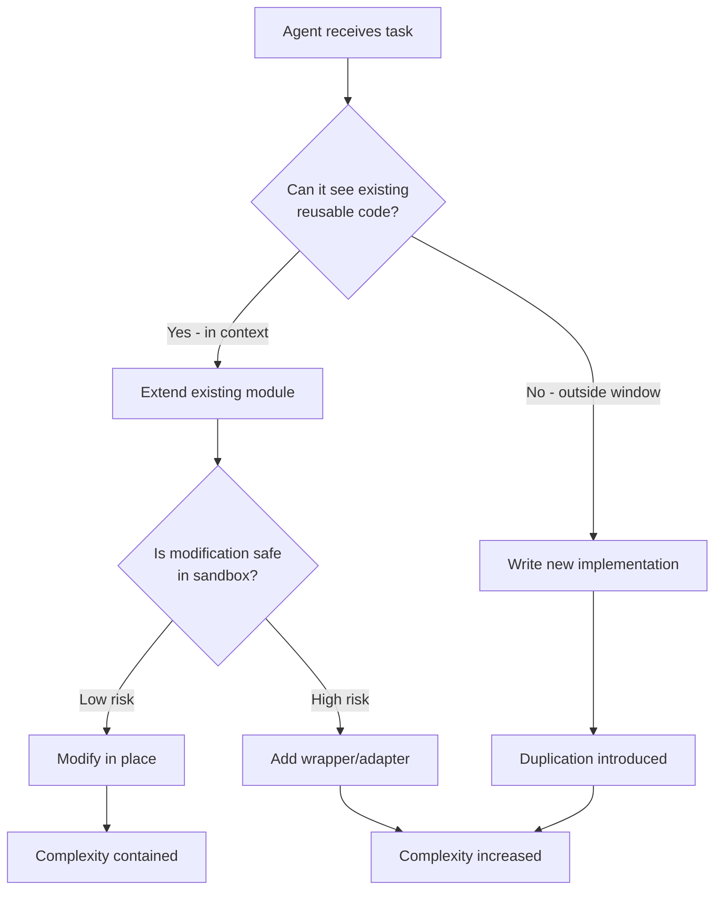
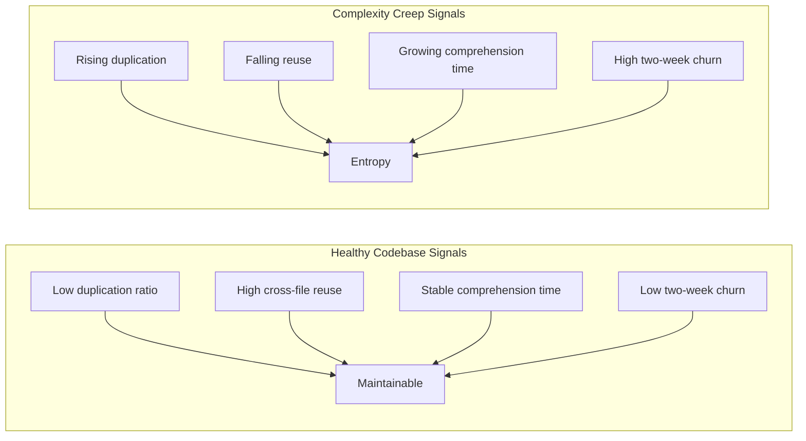

# Complexity Creep: Why AI Coding Agents Add More Than They Simplify


---

The numbers are in, and they are uncomfortable. A peer-reviewed study of 806 open-source repositories that adopted AI coding assistants found a 41% increase in code complexity and a 30% rise in static analysis warnings [^1]. A separate analysis of 623 million real-world code changes showed code duplication up 81% compared to pre-AI baselines [^2]. Cross-file function reuse — the structural backbone of maintainable software — fell 35% over the same period [^2].

AI coding agents write code faster than any human ever could. They also, left unchecked, make codebases progressively harder to understand, modify, and trust. This article examines why complexity creep happens, what the research reveals about its mechanisms, and how Codex CLI users can defend against it.

## The Evidence: Speed at the Cost of Quality

He et al. presented the most rigorous study to date at MSR 2026 in Rio de Janeiro [^1]. Using a difference-in-differences design with staggered adoption, they compared repositories that adopted Cursor AI against matched controls. The headline finding — a 25.1% average increase in cyclomatic complexity — survived every robustness check they threw at it. Velocity gains were real but transient; the complexity persisted.

GitClear's longitudinal analysis tells the same story from a different angle [^2]. Across eight maintainability metrics tracked from 2023 to 2026, every signal moved in the wrong direction once AI-assisted commits crossed the 25% threshold:

| Metric | Change vs 2022 Baseline |
|--------|------------------------|
| Code block duplication | +81% |
| Within-commit copy/paste | +41% |
| Error-masking constructs | +47% |
| Cross-file function calls | -35% |
| Refactoring line moves | -70% |
| Long-term legacy maintenance | -74% |
| Two-week code churn | +15% |

The pattern is unmistakable. Agents default to additive solutions. They duplicate rather than extract. They inline rather than compose. They generate new modules rather than extend existing ones.

## Why Agents Are Additive by Default

Three architectural properties of current LLM-based agents explain the bias:

### Context windows are finite; codebases are not

An agent operating within a 272,000-token input window [^3] cannot hold an entire codebase in context. When it cannot see the existing utility function three directories away, it writes a new one. This is not a reasoning failure — it is an information access failure. The agent makes a locally rational decision with incomplete global knowledge.

### Training rewards completion, not simplification

LLMs are trained on code that was written, not code that was deleted. The training signal overwhelmingly rewards producing new tokens. Refactoring — which at its core means reducing or reorganising tokens — runs against the gradient. The agentic refactoring study by Horikawa et al. confirmed this empirically: agents performed refactoring in 26.1% of commits, but 78% of those were low-level consistency edits (variable renaming, formatting) rather than design-level simplification [^4].

### Additive changes are safer in sandbox environments

Codex CLI's sandbox (Landlock on Linux, Seatbelt on macOS) constrains file system access [^5]. Within that constraint, adding a new file is always safe. Modifying an existing file risks breaking something. An agent optimising for task completion within a sandboxed environment will rationally prefer the additive path.



## Agentic Entropy: The Hidden Cost

Casserini et al. coined the term *agentic entropy* in their April 2026 paper to describe a subtler problem than raw complexity metrics capture [^6]. Traditional diff-based code review shows *what* changed but hides the planning steps, tool-call sequences, and cross-file reasoning that drove the agent's decisions. When an agent refactors without deep semantic understanding of why code was structured a particular way, it can introduce *structural fragility* — code that passes unit tests but fails under production edge cases [^6].

This connects to what researchers at five independent institutions simultaneously identified in early 2026: *comprehension debt* [^7]. AI coding tools generate code 5–7× faster than developers can understand it. The debt does not appear in velocity dashboards or sprint reviews. It surfaces six to eighteen months later when nobody can confidently modify, debug, or own the code.

The Substrate Collapse paper (arXiv:2606.20882) formalised the measurement problem [^8]. Traditional metrics like truck factor assume that code authorship correlates with code understanding. When an agent generates modules thousands of times daily, that correlation breaks. The metric still produces a number; the number is meaningless.

## Defending Against Complexity Creep with Codex CLI

Codex CLI provides several mechanisms to counteract the additive bias. None are automatic — they require deliberate configuration.

### 1. Encode complexity constraints in AGENTS.md

The most effective single intervention is telling the agent not to duplicate:

```toml
# AGENTS.md complexity constraints
## Architecture Rules
- NEVER create a new utility function if one with equivalent behaviour exists
- Before writing any new module, search for existing implementations using Grep
- Maximum cyclomatic complexity per function: 10
- Maximum file length: 300 lines — split if exceeded
- Prefer extending existing abstractions over creating new ones

## Anti-Patterns to Avoid
- DO NOT inline logic that belongs in a shared module
- DO NOT add wrapper classes around simple function calls
- DO NOT duplicate error-handling logic — use the shared error handler in src/errors/
```

Research shows that decision-table-style AGENTS.md rules produce measurably better constraint adherence than prose instructions [^9]. Keep rules concrete and falsifiable.

### 2. Gate merges with PostToolUse hooks

Codex CLI's `PostToolUse` hook fires after every tool invocation [^5]. Wire it to a static analysis check:

```bash
#!/bin/bash
# .codex/hooks/post-tool-use.sh
# Block commits that increase complexity beyond threshold

if [[ "$TOOL_NAME" == "write_file" || "$TOOL_NAME" == "apply_patch" ]]; then
    # Run complexity check on changed files
    npx complexity-report --threshold 10 "$FILE_PATH"
    if [ $? -ne 0 ]; then
        echo "REJECT: File exceeds complexity threshold"
        exit 1
    fi
fi
```

This creates a deterministic gate that no amount of agent persuasion can bypass.

### 3. Use dedicated refactoring profiles

Codex CLI's named profiles (introduced in v0.143.0) let you create a refactoring-specific configuration [^10]:

```toml
# ~/.codex/profiles/refactor.toml
[model]
name = "gpt-5.6-sol"
reasoning_effort = "high"

[approval]
mode = "full"  # Every change reviewed

[instructions]
system = """
You are a refactoring agent. Your goal is to REDUCE complexity, not add features.
Rules:
1. Net line count must decrease or stay the same
2. No new files unless splitting an oversized module
3. Extract duplicated logic into shared functions
4. Remove dead code before adding new code
5. Run tests after every change
"""
```

Invoke with `codex --profile refactor "Reduce duplication in src/handlers/"`.

### 4. Schedule complexity audits as automations

The Codex App's automations panel supports scheduled tasks [^11]. Configure a weekly complexity audit:

```bash
# Weekly complexity sweep
codex exec --profile refactor \
  "Analyse the codebase for duplicated logic, unused imports, \
   and functions exceeding complexity threshold 10. \
   Create a report in docs/complexity-audit.md and fix \
   the three highest-impact issues."
```

This is Ambrosino's "overnight garbage collection" concept made operational [^12] — an agent that runs against the codebase's entropy whilst the team sleeps.

### 5. Measure what matters

Traditional metrics fail in agent-heavy codebases [^8]. Track these instead:

- **Duplication ratio**: percentage of code blocks appearing more than once (should trend downward)
- **Cross-file call density**: number of inter-module function calls per KLOC (should trend upward)
- **Comprehension half-life**: time for a new team member to make their first confident modification (should stay stable)
- **Churn-to-commit ratio**: lines modified within two weeks of creation (should stay below 15%)



## The Structural Problem Remains

None of these defences address the root cause: current LLMs are architecturally biased toward generation over reduction. Until training objectives change — rewarding an agent for deleting 50 lines and replacing them with a 10-line abstraction as much as for writing 50 new lines — complexity creep will remain the default trajectory.

The practical implication for senior engineers is clear. Agent-assisted development is not "write code faster." It is "write code faster *and* spend the time you saved on architectural governance that the agent cannot do for itself." The 41% complexity increase [^1] is not inevitable. It is the cost of treating agents as unsupervised contributors rather than supervised tools that require human steering on structural decisions.

Every hour saved on implementation must fund at least fifteen minutes of complexity review. The teams that internalise this will build systems that last. The teams that do not will discover, eighteen months from now, that they have the fastest-growing codebase nobody can maintain.

## Citations

[^1]: He, H., Miller, C., Agarwal, S., Kästner, C., & Vasilescu, B. (2026). "Speed at the Cost of Quality: How Cursor AI Increases Short-Term Velocity and Long-Term Complexity in Open-Source Projects." *Proceedings of the 23rd International Conference on Mining Software Repositories (MSR '26)*, Rio de Janeiro, Brazil. [https://cmustrudel.github.io/papers/msr2026he.pdf](https://cmustrudel.github.io/papers/msr2026he.pdf)

[^2]: GitClear. (2026). "The Maintainability Gap: 2026 AI Code Quality Research." [https://www.gitclear.com/the_ai_code_quality_maintainability_gap](https://www.gitclear.com/the_ai_code_quality_maintainability_gap)

[^3]: OpenAI. (2026). "Codex CLI Changelog — v0.144.6." GPT-5.6 Sol, Terra, and Luna context windows corrected to 272,000 input tokens. [https://developers.openai.com/codex/changelog](https://developers.openai.com/codex/changelog)

[^4]: Horikawa, K., Li, H., Kashiwa, Y., Adams, B., Iida, H., & Hassan, A.E. (2025). "Agentic Refactoring: An Empirical Study of AI Coding Agents." arXiv:2511.04824. [https://arxiv.org/abs/2511.04824](https://arxiv.org/abs/2511.04824)

[^5]: OpenAI. (2026). "Codex CLI Documentation." [https://developers.openai.com/codex/cli](https://developers.openai.com/codex/cli)

[^6]: Casserini, M., Facchini, A., & Ferrario, A. (2026). "Beyond the 'Diff': Addressing Agentic Entropy in Agentic Software Development." arXiv:2604.16323. [https://arxiv.org/abs/2604.16323](https://arxiv.org/abs/2604.16323)

[^7]: StepTo. (2026). "Comprehension Debt: The AI Code Crisis Your Metrics Are Completely Missing." [https://stepto.net/blog/comprehension-debt-ai-code-understanding-2026](https://stepto.net/blog/comprehension-debt-ai-code-understanding-2026)

[^8]: (2026). "The Substrate Collapse: AI Code Generation Invalidates Authorship-Based Knowledge Metrics." arXiv:2606.20882. [https://arxiv.org/abs/2606.20882](https://arxiv.org/abs/2606.20882)

[^9]: Augment Code. (2026). "What Happens When AI Technical Debt Compounds (And How Spec-Driven Dev Prevents It)." [https://www.augmentcode.com/guides/ai-technical-debt-compounds-spec-driven-development](https://www.augmentcode.com/guides/ai-technical-debt-compounds-spec-driven-development)

[^10]: OpenAI. (2026). "Codex CLI v0.143.0 Release Notes." Named profiles, system proxy routing, and remote plugin support. [https://github.com/openai/codex/releases](https://github.com/openai/codex/releases)

[^11]: OpenAI. (2026). "Introducing Upgrades to Codex." Codex App automations and scheduled tasks. [https://openai.com/index/introducing-upgrades-to-codex/](https://openai.com/index/introducing-upgrades-to-codex/)

[^12]: Ambrosino, A. (2026). "Why OpenAI is Merging Codex and ChatGPT." Lenny's Podcast, June 2026. Discussion of overnight autonomous complexity reduction.
