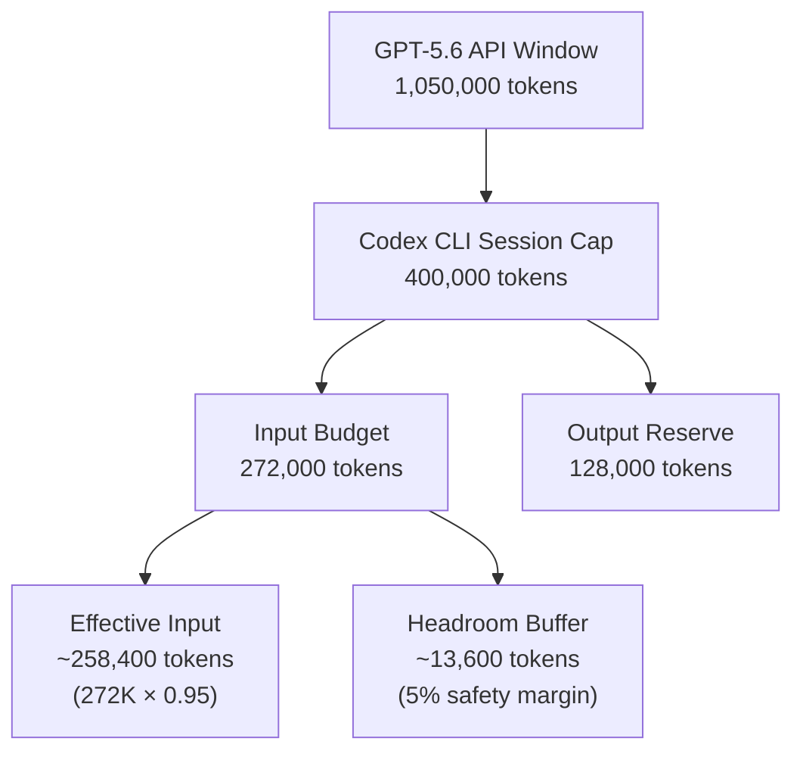
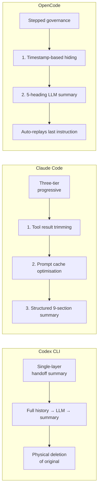

# The Context Window Gap: Why Codex CLI Caps GPT-5.6's Million-Token Window at 272K — and Why That's Sensible Engineering


---

GPT-5.6 Sol advertises a 1,050,000-token context window [^1]. Codex CLI v0.144.6, released on 18 July 2026, corrected the bundled model metadata to cap that window at 272,000 input tokens [^2]. Developers paying for Pro or Max plans have filed GitHub issues calling this a "severe regression" [^3]. They are simultaneously right to be frustrated and wrong about the underlying engineering decision. This article explains how Codex CLI's context budget actually works, why the gap exists, and how to manage it in practice.

## The Anatomy of 272K

The million-token figure from OpenAI's model card describes the raw API limit — the maximum payload the model endpoint will accept [^1]. Codex CLI interposes its own budget between that API limit and your session:



The 400,000-token session cap splits into 272,000 for input and 128,000 reserved for output [^4]. The CLI then applies a 5% headroom buffer, leaving roughly 258,400 usable input tokens [^4]. Before your first prompt even arrives, a baseline allocation is consumed by system prompts, tool schemas, and AGENTS.md content [^5].

## Why the Cap Exists

Three forces drive the decision to cap well below the advertised maximum.

### 1. The "Lost in the Middle" Problem

Stanford's original 2023 research demonstrated that LLMs perform significantly worse at retrieving information placed in the middle of long contexts compared to information at the beginning or end [^6]. Subsequent 2026 studies across frontier models confirm that every model displays 10–25% accuracy degradation for mid-context information, with models having larger context windows showing *more* degradation [^7]. GPT-5.5's MRCRv2 benchmark at 128–256K range scores 87.5 — strong, but notably this is the *measured* range, not the full million [^8].

Filling a million-token window with code does not give you a million tokens of understanding. It gives you excellent recall of the first and last 50K, acceptable recall of the next 100K, and progressively degraded recall of everything between.

### 2. Quadratic Cost Scaling

Attention mechanisms scale quadratically with sequence length [^7]. Doubling the context quadruples memory costs. At GPT-5.6 Sol pricing (\$5/\$30 per million input/output tokens [^1]), a single million-token prompt costs \$5 in input alone — before the model writes a line of code. In an iterative coding session with 20 turns, the cumulative cost becomes prohibitive without aggressive context management.

### 3. Compaction Reliability

Codex CLI's auto-compaction fires when accumulated tokens exceed a configurable threshold (defaulting to approximately 200,000 tokens) [^9]. Compaction hands the entire conversation to the model to produce a "handoff summary" that replaces the original history [^10]. This is inherently lossy — you lose detailed reasoning chains, specific tool output, and intermediate debugging context [^10]. The tighter the window, the more predictable the compaction behaviour. A 272K cap means compaction fires roughly once per deep investigation, producing a manageable summary. A million-token window would delay compaction until the session contained so much history that the summary itself would be unreliable.

## The July 2026 Context Oscillation

The cap has not been stable. Before 13 July 2026, GPT-5.6 Sol's effective input window sat at 353,400 tokens (372K raw, 95% effective) [^3]. On 13 July, it dropped to 258,400 tokens (272K raw) — a 26.9% reduction with no advance notice [^3]. Version 0.144.6 then corrected the bundled metadata to match this new reality [^2].

The oscillation between 258K and 353K visible across GPT-5.5 and GPT-5.6 in Codex suggests that OpenAI is actively tuning the cost-quality tradeoff on the server side [^11]. This is not a bug but an operational decision — one that would benefit enormously from being communicated proactively rather than discovered through broken sessions.

## What Fills Your Budget Before You Type

Understanding the baseline tax is essential. Before your first prompt, the context absorbs:

| Component | Typical Size | Notes |
|-----------|-------------|-------|
| System prompt | ~5,000 tokens | Fixed per session |
| Tool schemas | 2,000–100,000+ tokens | Reloaded *every turn* per connected MCP server [^5] |
| AGENTS.md files | Up to 32,768 tokens | Loaded root-to-leaf, capped by `project_doc_max_bytes` [^12] |
| File reads | Variable | Accumulate as the agent explores the codebase |

A developer running GitHub, Slack, Jira, and a database MCP server simultaneously can add 100,000+ tokens of schema overhead per turn [^5]. With a 258K effective budget, that leaves barely 158K for actual conversation — and the schemas reload on *every turn*.

## Practical Context Budget Management

### Monitor Before You Act

```bash
# Check current token usage and model context
/status

# Enable live token counter in the footer
/statusline
```

The `/status` command displays the active model, current token usage, and remaining budget [^4]. Run it before starting a complex phase to decide whether to compact or fork.

### Proactive Compaction

```bash
# Manually compact when finishing a logical work chunk
/compact

# Start a fresh session within the same repository
/new
```

Do not wait for auto-compaction. When you finish a logical chunk of work — a feature, a bug fix, a review — run `/compact` manually before starting the next chunk [^4]. This keeps the summary focused on what matters for the next task rather than an indiscriminate compression of everything.

### Customise the Compaction Prompt

```toml
# config.toml — tailor compaction to retain domain-specific context
compact_prompt = """
Summarise this session as a handoff brief. Retain:
1. All architectural decisions and their rationale
2. Test results and remaining failures
3. File paths modified and their purpose
4. Active constraints from AGENTS.md
Discard: tool output, intermediate debugging, exploratory dead ends.
"""
```

The default compaction prompt produces generic summaries [^10]. A custom `compact_prompt` in `config.toml` ensures the summary retains the context that matters for your specific workflow [^13].

### Reduce Schema Tax

```toml
# config.toml — disable MCP servers you're not actively using
[mcp_servers.jira]
enabled = false

# Or use enabled_tools to limit tool exposure
enabled_tools = ["mcp__github__create_pull_request", "mcp__github__get_file_contents"]
```

Each MCP server's tool schemas are injected into the context on every turn [^5]. Disabling unused servers or restricting to specific tools via `enabled_tools` reclaims significant budget [^14]. Tool search (default since v0.142.2 for supported models) helps by deferring tool schema injection until needed [^15], but older models still receive the full schema payload.

### Override the Window (With Caution)

```toml
# config.toml — override context window for advanced users
model_context_window = 350000
model_auto_compact_token_limit = 280000
```

The `model_context_window` key overrides the bundled catalog value [^13]. However, setting custom values has been reported to break auto-compaction in some versions — the `fill_to_context_window` calculation can reset the token counter after the first overflow [^16]. If you override, test thoroughly and monitor with `/statusline`.

## How Codex CLI Compaction Compares

Codex CLI is not the only agent managing this problem. The strategies diverge significantly:



Claude Code's three-tier approach avoids LLM calls entirely until Layer 3 by trimming tool results and optimising prompt cache hit rates first [^10]. OpenCode preserves data through timestamp-based hiding rather than physical deletion [^10]. Codex CLI's single-layer approach is the most aggressive — it always requires an LLM call and physically deletes the original history — but it is also the simplest to reason about and the most predictable in its behaviour.

## The Effective Context Principle

The core insight, confirmed by both BenchLM's 2026 analysis and practical experience, is this: "The advertised window is the size of the box. The effective window is how much of that box the model can actually reason over without losing precision" [^8].

For Codex CLI workflows, the practical implication is clear:

- **Curating context beats filling the window** [^4]. A focused 150K-token session with relevant code, clear AGENTS.md constraints, and minimal schema overhead will outperform a packed 258K session with stale file reads and unused tool definitions.
- **78% of production LLM requests use under 16K tokens** [^7]. The million-token window is a capability ceiling, not a recommended operating point.
- **Safety rules and coding standards belong in AGENTS.md**, not in conversation history that will be compacted away [^10].

The 272K cap is not a limitation. It is Codex CLI encoding the lesson that most developers learn the hard way: more context is not better context.

## Citations

[^1]: OpenAI, "GPT-5.6 Model Card", [https://openai.com/index/gpt-5-6/](https://openai.com/index/gpt-5-6/) — 1,050,000-token context window, pricing tiers for Sol/Terra/Luna

[^2]: OpenAI, "Release 0.144.6", GitHub, 18 July 2026, [https://github.com/openai/codex/releases/tag/rust-v0.144.6](https://github.com/openai/codex/releases/tag/rust-v0.144.6) — refreshed bundled instructions for GPT-5.6, corrected context windows to 272,000 tokens

[^3]: GitHub Issue #32806, "GPT-5.6 Sol context cut again: 353K to 258K despite advertised 1.05M", openai/codex, July 2026, [https://github.com/openai/codex/issues/32806](https://github.com/openai/codex/issues/32806) — regression report, 26.9% reduction, no advance notice

[^4]: Unblocked, "Codex Context Window: How It Works (2026)", [https://getunblocked.com/blog/codex-context-window/](https://getunblocked.com/blog/codex-context-window/) — 400K session cap, 272K/128K split, 95% headroom, /status and /compact commands

[^5]: OpenAI, "Codex CLI Performance Optimisation", Codex Knowledge Base, [https://codex.danielvaughan.com/2026/04/08/codex-cli-performance-optimization/](https://codex.danielvaughan.com/2026/04/08/codex-cli-performance-optimization/) — MCP schema overhead per turn, baseline allocation

[^6]: Liu et al., "Lost in the Middle: How Language Models Use Long Contexts", Stanford, 2023, [https://arxiv.org/abs/2307.03172](https://arxiv.org/abs/2307.03172) — original research on mid-context accuracy degradation

[^7]: QubitTool, "Long Context LLMs and the Lost in the Middle Phenomenon Explained [2026]", [https://qubittool.com/blog/long-context-lost-in-the-middle](https://qubittool.com/blog/long-context-lost-in-the-middle) — 10–25% accuracy degradation, quadratic cost scaling, 78% of requests under 16K tokens

[^8]: BenchLM, "LLM Context Window Comparison 2026: Advertised vs Effective", [https://benchlm.ai/blog/posts/context-window-comparison](https://benchlm.ai/blog/posts/context-window-comparison) — GPT-5.5 MRCRv2 87.5 at 128–256K, effective vs advertised analysis

[^9]: OpenAI, "Context Compaction Deep Dive: Codex CLI, Claude Code, and OpenCode", Codex Knowledge Base, [https://codex.danielvaughan.com/2026/04/14/context-compaction-deep-dive-codex-cli-claude-code-opencode/](https://codex.danielvaughan.com/2026/04/14/context-compaction-deep-dive-codex-cli-claude-code-opencode/) — auto-compaction threshold, compaction architecture

[^10]: Justin3go, "Shedding Heavy Memories: Context Compaction in Codex, Claude Code, and OpenCode", April 2026, [https://justin3go.com/en/posts/2026/04/09-context-compaction-in-codex-claude-code-and-opencode](https://justin3go.com/en/posts/2026/04/09-context-compaction-in-codex-claude-code-and-opencode) — single-layer handoff summary, Claude Code three-tier approach, OpenCode timestamp hiding, lossy compression characteristics

[^11]: GitHub Issue #30875, "GPT-5.5 context window oscillates between 258400 and 353400 effective tokens in Codex Desktop", openai/codex, [https://github.com/openai/codex/issues/30875](https://github.com/openai/codex/issues/30875) — context window oscillation history

[^12]: OpenAI, "Codex CLI Documentation — AGENTS.md", [https://developers.openai.com/codex/cli](https://developers.openai.com/codex/cli) — AGENTS.md loading, root-to-leaf discovery, project_doc_max_bytes default 32 KiB

[^13]: OpenAI, "Configuration Reference", [https://learn.chatgpt.com/docs/config-file/config-reference](https://learn.chatgpt.com/docs/config-file/config-reference) — model_context_window, model_auto_compact_token_limit, compact_prompt, tool_output_token_limit

[^14]: OpenAI, "Advanced Configuration", [https://developers.openai.com/codex/config-advanced](https://developers.openai.com/codex/config-advanced) — enabled_tools, disabled_tools, MCP server configuration

[^15]: OpenAI, "Codex CLI v0.142.2 Release Notes", GitHub, [https://github.com/openai/codex/releases](https://github.com/openai/codex/releases) — tool search default for supported models

[^16]: GitHub Issue #16068, "Setting model_context_window in config.toml breaks auto-compaction", openai/codex, [https://github.com/openai/codex/issues/16068](https://github.com/openai/codex/issues/16068) — fill_to_context_window counter reset bug with custom window values
