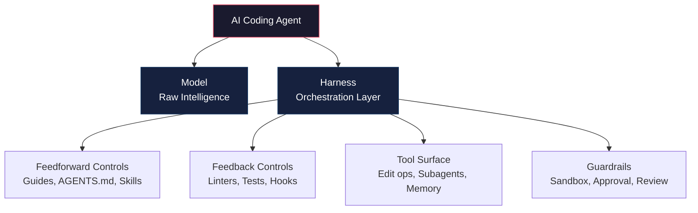
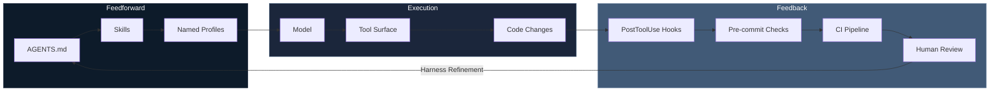
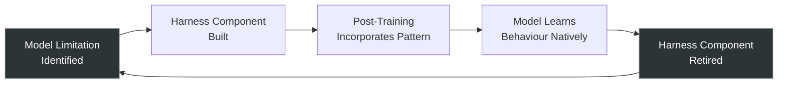

# The Harness Hypothesis: Why Co-Developing Model and Tooling Under One Team Produces Better Agents


---

In February 2026, OpenAI published an internal case study that should have made every engineering leader reconsider their AI team structure. A three-person team, growing to seven over five months, shipped one million lines of production code and 1,500 merged pull requests — with zero human-written source code [^1]. The secret was not a better model. It was a better *harness*.

The term "harness engineering" — the craft of building the scaffolding, constraints, and feedback loops around an AI coding agent — has since become the defining discipline of 2026 [^2]. But the deeper organisational insight remains underexplored: the teams that build the model and the harness together, as a single co-designed product, consistently outperform those that treat them as separate concerns.

This is the Harness Hypothesis.

## Agent = Model + Harness

Martin Fowler's influential framework formalises the relationship: an agent is the combination of a model and its harness [^3]. The model provides raw intelligence. The harness — tool orchestration, verification loops, context management, guardrails, and observability — makes that intelligence useful. Neither component delivers value alone.

The empirical evidence is striking. On Terminal-Bench 2.0, harness-only improvements delivered gains exceeding typical model-generation improvements: up to 10× on coding benchmarks and +13.7 percentage points on Terminal-Bench 2.0 itself [^4]. The Endor Labs benchmark demonstrated the point even more starkly: GPT-5.5 scored 61.5% on functionality in its native Codex harness, but 87.2% when run through Cursor's harness — a 26-point jump from the runtime environment alone [^5].



## Why Co-Design Matters: The Wire Contract Problem

Nicolas Bustamante's "Model-Harness Fit" research articulates the core problem: **models are not portable across harnesses** [^6]. Post-training embeds tool surfaces, schemas, memory rituals, and citation contracts into a model's instinct set. The wire format is part of the model.

Consider the concrete divergences between Codex CLI and Claude Code:

| Concern | Codex CLI | Claude Code |
|---------|-----------|-------------|
| Edit operations | Patch format | String replacement |
| Subagent dispatch | Eight typed verbs | Single `Agent` tool |
| Memory writes | Deferred batch processing | Live writes |
| Citation tags | Structured `<oai-mem-citation>` XML | None |
| System prompt | Section-headed skeleton | `# auto memory` header |

Each of these differences represents a *training distribution contract* [^6]. When a Codex-trained model emits `<oai-mem-citation>` XML, the harness parses it to update usage counts and trigger memory decay. Run that same model on Claude Code — which does not parse the tag — and the XML leaks into user-facing output whilst memory silently degrades because citations never increment.

This is not a bug. It is a structural consequence of treating model and harness as independent products.

## The Organisational Evidence

The Information reported in June 2026 that Codex outperforms ChatGPT at agentic tasks precisely because the Codex team builds the model and the harness together, whilst ChatGPT's model and product teams operate separately [^7]. OpenAI's approximately 40-person Codex team operates with unusually high autonomy, speed, and trust — a structure that enables tight model-harness iteration cycles [^1].

The pattern repeats across the industry:

- **Anthropic** ships Claude Code as the canonical Claude harness, with post-training and runtime co-designed as a single product [^5]. Claude Code's 26 lifecycle hook events, subagent architecture, and SKILL.md format are all artefacts of this co-design.
- **Cursor** maintains per-model prompting and tool surfaces for OpenAI and Anthropic model families, achieving a 25-position ranking jump on benchmarks through harness changes alone [^6].
- **GitHub Copilot CLI** uses a JSON-RPC supervisor where the model runs inside a subprocess, emitting events for external routing — a distinct wire contract that the model learns during training [^6].

The organisations that separate "model team" from "product team" consistently underperform those that fuse them.

## Five Layers of a Production Harness

The emerging consensus identifies five layers that a production-grade harness must address [^3][^4]:

### 1. Feedforward Controls (Guides)

Anticipatory mechanisms that steer agent behaviour *before* action. In Codex CLI, this is AGENTS.md — ideally under 100 lines, functioning as a table of contents rather than an encyclopedia [^8]. The principle: if something is not in context at runtime, it does not exist for the agent.

```toml
# codex.toml — feedforward via model selection
[profile.review]
model = "o3"
approval_policy = "writes"

[profile.scaffold]
model = "gpt-5.6-terra"
approval_policy = "full-auto"
```

### 2. Feedback Controls (Sensors)

Observational mechanisms triggering self-correction *after* the agent acts. The speed hierarchy matters: PostToolUse Hook (milliseconds) > pre-commit (seconds) > CI (minutes) > human review (hours) [^8]. Push checks to the fastest viable layer.

```bash
# PostToolUse hook — Rust-based linters for speed
# Oxlint + Biome are 50-100x faster than ESLint + Prettier
codex hooks add post-tool-use "oxlint --fix && biome check --write"
```

### 3. Tool Orchestration

The tool surface defines the agent's action vocabulary. Codex CLI's typed protocols — patch-based edits, eight subagent dispatch verbs, structured memory — form a contract that the model learns during post-training [^6]. Changing any element invalidates learned behaviours.

### 4. Guardrails and Governance

Sandbox enforcement (Landlock on Linux, Seatbelt on macOS), approval policies (`suggest`, `auto-edit`, `writes`, `full-auto`), and Guardian auto-review form the safety boundary [^8]. These are not optional additions — they are load-bearing harness components.

### 5. Observability

Chrome DevTools Protocol integration enables agents to take screenshots and query performance metrics. Thresholds become mechanically enforced (e.g., 800ms service startup requirement) rather than subjectively reviewed [^1].



## The Architecture Drift Problem

OpenAI's pilot solved one of the hardest harness problems: preventing architecture drift at scale. Custom linters enforced a strict layered dependency flow — Types → Config → Repo → Service → Runtime → UI — with inline fix instructions [^1]. Background agents continuously scanned for principle violations and submitted refactoring PRs automatically.

This matters because 65% of enterprise AI failures trace back to harness defects: context drift, schema misalignment, and state degradation [^4]. The model is rarely the bottleneck. The harness is.

For Codex CLI users, the equivalent is structural testing in AGENTS.md combined with PostToolUse hooks:

```markdown
<!-- AGENTS.md — Architecture constraints -->
## Architecture Rules
- Services MUST NOT import from UI layer
- Repository layer MUST NOT call external APIs directly
- All new modules MUST include structural tests
- Run `make arch-check` before any PR
```

## The Deletion Principle

Perhaps the most counterintuitive insight from OpenAI's experiment: "The best harness components are designed to be deleted" [^1]. Infrastructure compensates for temporary model limitations. As models improve, harness components become dead weight.

Bustamante documents this explicitly: Rajasekaran's context-reset machinery built for Sonnet 4.5 became unnecessary overhead on Opus 4.6 [^6]. The discipline of *retiring* dead scaffolding is as important as building it.

This creates a lifecycle that co-design teams navigate naturally but separated teams struggle with:



When model and harness teams sit together, this cycle runs in weeks. When they are separated, the harness accumulates dead components indefinitely because nobody knows which scaffolding the model has outgrown.

## Practical Implications for Codex CLI Users

The Harness Hypothesis has immediate consequences for how you configure Codex CLI:

**1. Treat AGENTS.md as a living contract, not documentation.** Keep it under 100 lines. Point to structured `docs/` directories for detail. Update it when the harness changes, not when you remember [^8].

**2. Push enforcement to the fastest layer.** Rust-based tools (Oxlint, Biome, Ruff) fit PostToolUse hooks at 50–100× the speed of Node.js-based equivalents [^8]. If a check takes minutes, it belongs in CI, not in the agent loop.

**3. Use named profiles as harness presets.** Different tasks need different harness configurations. A code review profile (`approval_policy = "writes"`, model = `o3`) is a fundamentally different harness from a scaffolding profile (`approval_policy = "full-auto"`, model = `gpt-5.6-terra`).

**4. Audit for dead scaffolding.** If you wrote an AGENTS.md rule six months ago to work around a model limitation, check whether the current model handles it natively. Dead rules consume context tokens and can conflict with improved model behaviours.

**5. Stay within your model's wire contract.** Switching models mid-conversation breaks the training distribution contract. The new model reads tool calls from a vocabulary it was not trained to emit [^6]. Spawn subagents with different models instead.

## The Strategic View

The Harness Hypothesis is ultimately an organisational design principle: **the tightly-coupled model-harness pair, co-designed through post-training, is the unit of analysis** [^6]. Not the model. Not the harness. The pair.

For engineering leaders evaluating AI coding tools in 2026, this means the question is not "which model is smartest?" but "which team has the tightest model-harness feedback loop?" By that measure, OpenAI's Codex team and Anthropic's Claude Code team — both shipping model and harness as unified products — represent the state of the art.

For individual developers, the implication is equally clear: the harness *you* build around your agent — your AGENTS.md, your hooks, your profiles, your architectural fitness functions — is where the marginal returns are highest. The model will improve on its own schedule. The harness improves on yours.

---

## Citations

[^1]: SaaSCity, "Harness Engineering: How OpenAI Used Codex to Ship 1 Million Lines Without Writing a Single One," 2026. [https://saascity.io/blog/harness-engineering-codex-agent-first-openai-2026](https://saascity.io/blog/harness-engineering-codex-agent-first-openai-2026)

[^2]: InfoQ, "OpenAI Introduces Harness Engineering: Codex Agents Power Large-Scale Software Development," February 2026. [https://www.infoq.com/news/2026/02/openai-harness-engineering-codex/](https://www.infoq.com/news/2026/02/openai-harness-engineering-codex/)

[^3]: Martin Fowler, "Harness Engineering for Coding Agents," 2026. [https://martinfowler.com/articles/harness-engineering.html](https://martinfowler.com/articles/harness-engineering.html)

[^4]: Hands-On Architects, "The Harness Model — AI Engineering Maturity Matrix, Q1 2026," 2026. [https://handsonarchitects.com/blog/2026/the-harness-model-ai-engineering-maturity-matrix/](https://handsonarchitects.com/blog/2026/the-harness-model-ai-engineering-maturity-matrix/)

[^5]: Composio, "Claude Code vs Codex: What I Learned After 100+ Hours With Both," 2026. [https://composio.dev/content/claude-code-vs-openai-codex](https://composio.dev/content/claude-code-vs-openai-codex)

[^6]: Nicolas Bustamante, "Model-Harness Fit," 2026. [https://nicolasbustamante.com/blog/model-harness-fit](https://nicolasbustamante.com/blog/model-harness-fit)

[^7]: The Information, "Why OpenAI is Combining Codex & ChatGPT," June 2026. [https://www.youtube.com/watch?v=ptgi7sL15BM](https://www.youtube.com/watch?v=ptgi7sL15BM)

[^8]: Sakasegawa, "Harness Engineering Best Practices for Claude Code / Codex Users," 2026. [https://nyosegawa.com/en/posts/harness-engineering-best-practices-2026/](https://nyosegawa.com/en/posts/harness-engineering-best-practices-2026/)
