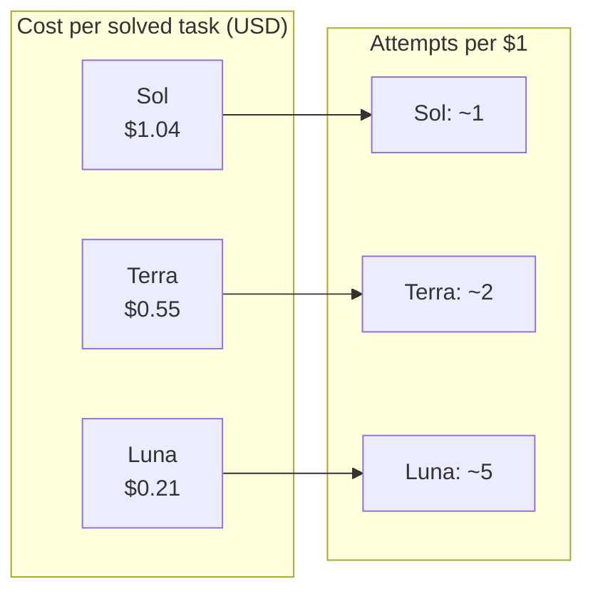
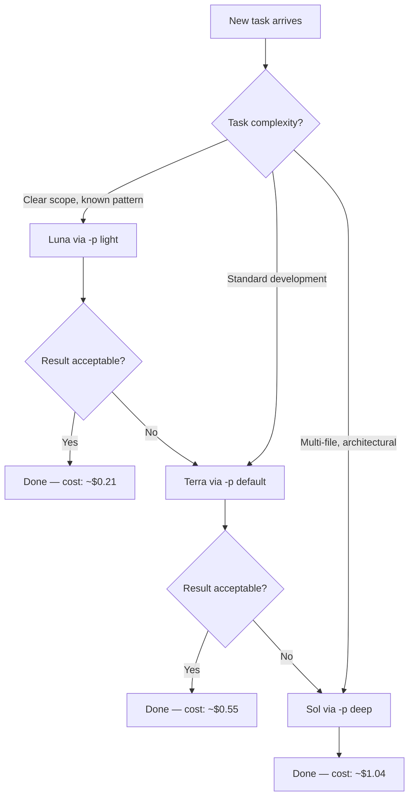

# The Light-Tier Sweet Spot: When Luna at 10x Speed Beats Sol at 10x Cost


---

GPT-5.6 shipped to general availability on 9 July 2026 with three tiers: Sol (\$5/\$30 per 1M input/output tokens), Terra (\$2.50/\$15), and Luna (\$1/\$6) [^1]. The instinct is to reach for Sol — the flagship — and stay there. That instinct is expensive and, for most Codex CLI workflows, wrong.

Luna costs roughly 80% less per solved task than Sol [^2]. On Terminal-Bench 2.1, the benchmark most relevant to CLI agent work, Luna scores 84.7% against Sol's 88.8% [^3]. That 4.1-point gap disappears entirely when you factor in what matters for iterative development: cost per revision cycle, not score per single attempt.

This article explores when to use each tier, how to wire tiered model selection into Codex CLI workflows, and why the cheapest model that clears the quality bar is almost always the right first choice.

## The Cost-Per-Task Illusion

Benchmark leaderboards report accuracy per attempt. Developers work in revision loops. The distinction matters.

Artificial Analysis measured cost per solved task across the GPT-5.6 family: Sol at \$1.04, Terra at \$0.55, Luna at \$0.21 [^2]. Luna delivers roughly 24 benchmark points per estimated API dollar, compared with 4.5 for Claude Opus 4.8 and 3.2 for Claude Fable 5 [^3]. That is not a marginal difference — it is an order-of-magnitude efficiency gap.

But cost per task is itself a partial picture. In practice, a developer using Luna can run five attempts for the price of one Sol attempt. If even one of those five succeeds, Luna wins on total spend. For well-scoped tasks — the kind that dominate daily work — first-attempt success rates are high enough that Luna rarely needs all five.



## Where Luna Excels

Luna's strengths map directly to the tasks that consume the bulk of a senior developer's Codex CLI sessions:

- **Boilerplate generation**: Test scaffolds, CRUD endpoints, migration files. These are well-defined, pattern-heavy, and rarely need deep reasoning.
- **Docstring and comment generation**: Bulk documentation across a module. Volume matters; nuance does not.
- **Code formatting and linting fixes**: Mechanical transformations where correctness is binary.
- **Classification and extraction**: Parsing logs, summarising error messages, tagging issues.
- **Subagent delegation**: When a primary agent dispatches narrow subtasks, Luna handles the volume whilst Sol handles the orchestration [^4].

The common thread: tasks with clear success criteria and low ambiguity. When you know what "done" looks like before the agent starts, Luna is the rational default.

## Where Luna Falls Apart

Luna's 41.3% score on MRCR (multi-document context recall) against Sol's 91.5% reveals a genuine architectural limitation, not just a benchmark gap [^5]. Long-context reasoning — synthesising information across large codebases, tracing dependencies through deeply nested module graphs, understanding the full implications of a cross-cutting refactor — requires the heavier tiers.

Avoid Luna for:

- **Architectural decisions** spanning multiple modules or services
- **Security reviews** where missing a subtle vulnerability has outsized consequences
- **Complex multi-file refactors** requiring coherent changes across dozens of files
- **Long-horizon agentic workflows** where the agent must maintain context over extended chains of tool calls

Sol's 88.8% Terminal-Bench score and 62.6% OSWorld score reflect genuine multi-step planning capability that Luna simply does not have [^5].

## Terra: The Awkward Middle

Terra occupies an interesting position. At \$2.50/\$15 per 1M tokens, it delivers GPT-5.5-class performance at half the cost [^5]. On most benchmarks, it sits within 2-3 points of Sol — close enough that the quality difference is invisible in practice. On Agents' Last Exam, Terra scores 50.4 against Sol's 53.6 [^5].

The awkwardness: Luna and Sol consistently occupy the Pareto frontier ahead of Terra [^2]. Each offers either greater intelligence at equal cost or equivalent performance at lower expense. Terra is the sensible default for developers who want one model and refuse to think about it further. But developers willing to route tasks get better economics from a Luna-plus-Sol combination.

## Wiring Tiered Selection into Codex CLI

Codex CLI's named profiles make tiered model selection a single flag. Create three profile files alongside your `~/.codex/config.toml` [^6]:

```toml
# ~/.codex/light.config.toml
model = "gpt-5.6-luna"
model_reasoning_effort = "medium"
```

```toml
# ~/.codex/default.config.toml
model = "gpt-5.6-terra"
model_reasoning_effort = "high"
```

```toml
# ~/.codex/deep.config.toml
model = "gpt-5.6-sol"
model_reasoning_effort = "xhigh"
```

Switch between them at invocation:

```bash
# Bulk docstrings — Luna is perfect
codex -p light "Add docstrings to all exported functions in src/utils/"

# Feature implementation — Terra as the workhorse
codex -p default "Implement the pagination API for /api/v2/users"

# Architecture review — Sol earns its keep
codex -p deep "Review the event sourcing migration plan in docs/rfc-042.md"
```

For mid-session switches when a task turns out harder than expected, the `/model` command opens a picker without losing context [^6].



## The Escalation Pattern

The most cost-effective workflow is not choosing the right tier upfront — it is starting cheap and escalating only when needed. This mirrors how experienced developers already work: try the quick approach first, reach for heavier tools only when it fails.

In practice, this means:

1. **Start every task with Luna** unless you already know it requires deep reasoning
2. **Inspect the output** — if it solves the problem, you have saved 80% of the cost
3. **Escalate to Terra** if Luna's output is structurally correct but lacks nuance
4. **Escalate to Sol** only for genuine complexity — security review, architectural refactoring, multi-system integration

This pattern compounds dramatically over a working day. A developer running 40-50 Codex tasks daily (not unusual for heavy agent users [^7]) saves roughly \$30-40 per day by defaulting to Luna instead of Sol. Over a month, that is \$600-800 — enough to fund additional Pro-tier seats or simply reduce the team's AI tooling budget.

## Reasoning Effort: The Other Lever

Model tier is not the only cost control. Codex CLI exposes `model_reasoning_effort` from `minimal` to `xhigh` [^6]. Combining tier and effort creates a two-dimensional optimisation space:

| Task Type | Tier | Effort | Approximate Cost |
|-----------|------|--------|-----------------|
| Formatting fixes | Luna | minimal | Very low |
| Test generation | Luna | medium | Low |
| Feature implementation | Terra | high | Medium |
| Architecture review | Sol | xhigh | High |

The combination of Luna at `minimal` effort is near-instant and nearly free — ideal for mechanical transformations that a linter would handle if one existed for the specific convention.

## Rollout Token Budgets

Codex CLI 0.144.0 introduced configurable rollout token budgets that track usage across agent threads, provide remaining-budget reminders, and abort turns when exhausted [^8]. Combined with tiered model selection, budgets create a natural cost ceiling:

```toml
# In config.toml or a named profile
[budget]
daily_limit = 500000  # tokens
warning_threshold = 0.8
```

Set generous budgets for Luna profiles and tighter ones for Sol. The budget system prevents runaway Sol sessions from consuming a disproportionate share of the monthly allocation.

## When "Good Enough" Is Better Than "Perfect"

The deeper insight behind tiered model selection is not about cost — it is about iteration speed. Luna responds faster than Sol. In an iterative workflow where the developer reviews output and provides feedback, faster responses mean tighter feedback loops. Tighter feedback loops mean more iterations per hour. More iterations mean better final output, even if each individual iteration is lower quality.

This is the same principle that makes rapid prototyping more effective than upfront design for many software problems. The cheap, fast first draft — even a mediocre one — gives you something concrete to react to. Sol's carefully reasoned first attempt may be objectively better, but by the time it arrives, you could have run three Luna iterations and converged on something equally good through feedback.

The light tier is not a compromise. For the majority of daily development tasks, it is the optimal strategy.

## Citations

[^1]: OpenAI, "GPT-5.6: Frontier intelligence that scales with your ambition," openai.com, 9 July 2026. [https://openai.com/index/gpt-5-6/](https://openai.com/index/gpt-5-6/)

[^2]: Artificial Analysis, "GPT-5.6 benchmarks across Intelligence, Speed and Cost," artificialanalysis.ai, July 2026. [https://artificialanalysis.ai/articles/gpt-5-6-has-landed](https://artificialanalysis.ai/articles/gpt-5-6-has-landed)

[^3]: AI Reiter, "GPT-5.6 Luna: Pricing, Benchmarks & When to Use It," aireiter.com, July 2026. [https://aireiter.com/blog/gpt-5-6-luna](https://aireiter.com/blog/gpt-5-6-luna)

[^4]: Codex Knowledge Base, "GPT-5.6 Sol, Terra, and Luna: What OpenAI's Three-Tier Model Family Means for Codex CLI Workflows," codex.danielvaughan.com, 1 July 2026. [https://codex.danielvaughan.com/2026/07/01/gpt-5-6-sol-terra-luna-codex-cli-model-selection-tiered-reasoning-cache-breakpoints/](https://codex.danielvaughan.com/2026/07/01/gpt-5-6-sol-terra-luna-codex-cli-model-selection-tiered-reasoning-cache-breakpoints/)

[^5]: Vellum, "GPT-5.6 Sol vs Terra vs Luna: Which Tier Should You Actually Use?," vellum.ai, July 2026. [https://www.vellum.ai/blog/gpt-5-6-benchmarks-explained](https://www.vellum.ai/blog/gpt-5-6-benchmarks-explained)

[^6]: OpenAI, "Configuration Reference — Codex CLI," developers.openai.com, July 2026. [https://developers.openai.com/codex/config-reference](https://developers.openai.com/codex/config-reference)

[^7]: Nate B Jones, "Codex: Your First Personal AI Agent Delegation Loop," YouTube, 12 June 2026. Referenced via Codex Knowledge Base article-ideas.md — 860M tokens/day usage data.

[^8]: OpenAI, "Codex Changelog — v0.144.0," developers.openai.com, 9 July 2026. [https://developers.openai.com/codex/changelog](https://developers.openai.com/codex/changelog)
