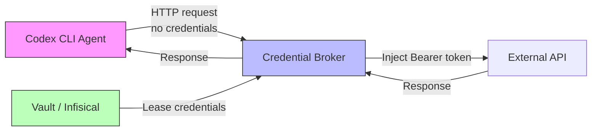
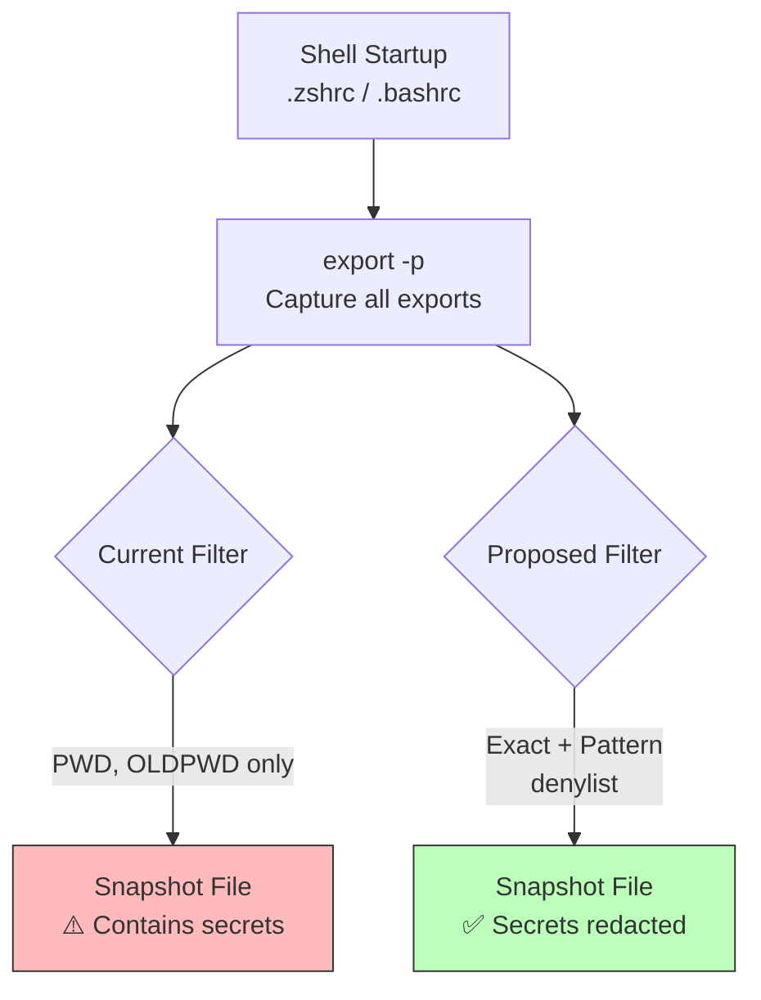

# The Shell Snapshot Blind Spot: Why Codex CLI Persists Your API Keys in Plaintext — and How to Defend Against It Today


---

Every time Codex CLI starts a session, it captures a snapshot of your shell environment so that subsequent commands inherit your aliases, functions, and exports. The mechanism is elegant: source your `.zshrc` or `.bashrc`, serialise the exports to a plaintext `.sh` file under `$CODEX_HOME/shell_snapshots/`, and replay that state into every subprocess the agent spawns.[^1] The problem is that the current denylist — the filter that decides which variables *not* to persist — contains exactly two entries: `PWD` and `OLDPWD`.[^2]

Everything else goes to disk. Your `OPENAI_API_KEY`. Your `AWS_SECRET_ACCESS_KEY`. Your `GH_TOKEN`. Your `DATABASE_URL`. All of them, in plaintext, readable by any process with access to `~/.codex/`.

## The Vulnerability in Detail

GitHub Issue #30971, opened on 3 July 2026, first documented the problem.[^3] A follow-up issue, #32327, opened on 11 July 2026, provided a concrete patch demonstrating how minimal the fix would be.[^2] The vulnerable code sits in `codex-rs/core/src/shell_snapshot.rs`:

```rust
const EXCLUDED_EXPORT_VARS: &[&str] = &["PWD", "OLDPWD"];
```

That constant is the entire defence. When Codex runs `export -p` during snapshot creation, every variable whose name does not match `PWD` or `OLDPWD` is written to a file. On a typical developer workstation, this captures dozens of credential-bearing variables.[^2]

The attack surface is straightforward: any process with read access to `$CODEX_HOME` — including the agent itself, MCP servers, plugins, or malware — can harvest credentials from snapshot files without needing to intercept live API calls.[^3]

### The macOS Credential-Helper Wrinkle

On macOS, the problem compounds. When `.zshrc` contains credential-helper invocations such as `op read` (1Password CLI) or `aws sso login`, the snapshot-creation process sources the startup file and can trigger biometric authentication prompts unexpectedly.[^3] Developers report Touch ID dialogs appearing during what should be a silent agent startup — a UX disruption that hints at the deeper issue: Codex is executing credential-acquisition code paths it has no business touching.

## Why This Matters More Than You Think

### The Scale of Credential Sprawl

GitGuardian's State of Secrets Sprawl 2026 report found 28.65 million new hardcoded secrets in public GitHub commits during 2025, a 34% year-on-year increase.[^4] AI-assisted commits leak secrets at approximately 3.2%, roughly double the baseline rate.[^4] AI service credentials specifically — keys for OpenAI, Anthropic, Cohere, and similar providers — surged 81%, with 1,275,105 leaked credentials detected in 2025 alone.[^5]

Shell snapshots add a new vector to this sprawl. Even developers who diligently avoid committing `.env` files may not realise that their agent's local state directory contains the same secrets in plaintext. Backup systems, cloud sync tools, and disk forensics tools all become credential-harvesting surfaces.

### Codex CLI Is Not Alone

The problem extends across the AI coding agent ecosystem. Claude Code persists file contents — including `.env` files the agent reads — into `~/.claude/projects/<slug>/*.jsonl` in plaintext.[^6] A cross-session credential leakage bug in Claude Code (Issue #72274) demonstrated production database credentials appearing in sessions belonging to unrelated users.[^7] Netwrix research documented how Claude Code, Copilot, Cursor, Cline, and Continue.dev all store OAuth tokens and API keys in plaintext on disk.[^6]

The common pattern: **agents treat credentials as ordinary context**, because to a language model, an API key is just another string.

## The Defence Stack You Can Deploy Today

Codex CLI's existing `shell_environment_policy` provides the primary defence — but it only protects subprocess execution, not snapshot creation. Here is a layered approach that covers both gaps.

### Layer 1: Tighten `shell_environment_policy`

The `shell_environment_policy` table in `~/.codex/config.toml` controls what environment variables reach agent-spawned subprocesses.[^8] Even with the snapshot vulnerability, this policy prevents the agent from *using* persisted credentials at runtime.

```toml
[shell_environment_policy]
inherit = "core"  # Only PATH, HOME, TERM inherited

exclude = [
  "AWS_*",
  "AZURE_*",
  "GCP_*",
  "GOOGLE_*",
  "DOCKER_*",
  "NPM_TOKEN",
  "PYPI_*",
  "*PASSWORD*",
  "*CREDENTIAL*",
  "OP_SESSION*",
  "PGPASSWORD",
  "DATABASE_URL",
  "REDIS_URL",
]
```

The `inherit = "core"` baseline strips everything except `PATH`, `HOME`, and `TERM`. Even without that, Codex applies an automatic filter that strips variables containing `KEY`, `SECRET`, or `TOKEN` (case-insensitive).[^8] The explicit `exclude` array adds coverage for cloud provider variables and database connection strings that don't match the automatic patterns.

The processing pipeline evaluates strictly in order: parent shell environment → inherit mode → default excludes → exclude patterns → include_only whitelist → set overrides → final subprocess environment.[^8]

### Layer 2: Restrict `$CODEX_HOME` Permissions

Until the snapshot denylist is fixed upstream, restrict filesystem access to the snapshot directory:

```bash
chmod 700 ~/.codex
chmod 600 ~/.codex/shell_snapshots/*
```

This prevents other users and processes running under different UIDs from reading snapshot files. It does not protect against the agent itself or MCP servers running as the same user.

### Layer 3: CI/CD — Start From Nothing

For `codex exec` in CI/CD pipelines, use `inherit = "none"` and explicitly set only the variables the agent needs:[^8]

```toml
[shell_environment_policy]
inherit = "none"

[shell_environment_policy.set]
PATH = "/usr/local/bin:/usr/bin:/bin"
HOME = "/home/runner"
CI = "true"
```

Starting from `none` means no credentials leak even if the CI runner has injected secrets into the environment.[^8] Any variable the agent requires must be explicitly declared, creating an auditable allowlist.

### Layer 4: External Secret Injection

For production workflows, use a credential broker that never exposes secrets to the agent process. Infisical Agent Vault intercepts outbound HTTP requests and injects credentials at the network layer — the agent sees the API response but never holds the key.[^9] HashiCorp Vault Agent with auto-auth follows a similar pattern.



### Layer 5: Fleet Governance via `requirements.toml`

Enterprise administrators can enforce minimum `shell_environment_policy` settings across all developer machines using `requirements.toml`:[^10]

```toml
[shell_environment_policy]
inherit = "core"  # Enforced minimum — developers cannot weaken to "all"
```

This prevents individual developers from accidentally or deliberately weakening the policy to `inherit = "all"`, which would expose all environment variables to agent subprocesses.

## The Proposed Fix

The community-contributed patch for Issue #32327 introduces three changes:[^2]

1. **Exact denylist** for known credential variable names (`OPENAI_API_KEY`, `AWS_SECRET_ACCESS_KEY`, `GH_TOKEN`, `PGPASSWORD`, `DATABASE_URL`, `OP_SESSION`).
2. **Pattern-based denylist** catching custom naming conventions (`*_TOKEN`, `*_SECRET`, `*_PASSWORD`, `*_API_KEY`).
3. **Consistent filtering** across all shell generators (bash, zsh, sh, PowerShell) with regression tests.

Non-sensitive variables like `PATH`, `HOME`, and `AWS_REGION` remain available for shell replay functionality.[^2] The fix aligns snapshot creation with the same patterns already used by `shell_environment_policy`'s automatic filter — the gap was simply that these two systems were designed independently and never shared a filtering layer.



## What Senior Developers Should Do Now

1. **Audit your snapshots** — run `grep -i 'key\|secret\|token\|password' ~/.codex/shell_snapshots/*` and rotate any credentials you find.
2. **Set `inherit = "core"`** in your `config.toml` immediately — this is the single highest-impact mitigation.
3. **Add explicit excludes** for your organisation's credential naming conventions.
4. **In CI/CD**, always use `inherit = "none"` with an explicit allowlist.
5. **Watch Issue #30971** for the upstream fix — once merged, the snapshot and subprocess filtering will share a unified denylist.

The shell snapshot credential persistence issue is not a dramatic zero-day. It is the kind of quiet, unsexy vulnerability that persists precisely because it sits in a convenience feature nobody thinks to audit. The fix is straightforward — both the upstream patch and the `config.toml` mitigations — but only if you know to look.

---

## Citations

[^1]: [Codex CLI Shell Environment Policy — Controlling What Your Agent's Subprocesses Can See](https://codex.danielvaughan.com/2026/04/28/codex-cli-shell-environment-policy-subprocess-secrets-defence/), Codex Knowledge Base, 28 April 2026.

[^2]: [security: shell snapshots persist secret env vars (PWD/OLDPWD-only denylist) — Issue #32327](https://github.com/openai/codex/issues/32327), openai/codex, 11 July 2026.

[^3]: [Shell snapshots can trigger credential prompts and persist secret env vars in plaintext — Issue #30971](https://github.com/openai/codex/issues/30971), openai/codex, 3 July 2026.

[^4]: [The State of Secrets Sprawl 2026](https://www.gitguardian.com/state-of-secrets-sprawl-report-2026), GitGuardian, 2026.

[^5]: [AI Is Fuelling Secrets Sprawl — GitGuardian Reports an 81% Surge of AI-Service Leaks](https://blog.gitguardian.com/the-state-of-secrets-sprawl-2026-pr/), GitGuardian Blog, 2026.

[^6]: [Your AI coding assistant is leaking secrets](https://netwrix.com/en/resources/blog/ai-coding-assistant-credential-storage-risks/), Netwrix, 2026.

[^7]: [Cross-session credential leakage: production database modified on unauthorised host — Issue #72274](https://github.com/anthropics/claude-code/issues/72274), anthropics/claude-code, 2026.

[^8]: [Advanced Configuration — Codex CLI](https://developers.openai.com/codex/config-advanced), OpenAI, 2026.

[^9]: [Codex CLI Secrets Defence: Preventing .env Leakage with shell_environment_policy, agent-env, and Infisical Agent Vault](https://codex.danielvaughan.com/2026/05/10/codex-cli-secrets-defence-env-leakage-agent-vault-runtime-injection/), Codex Knowledge Base, 10 May 2026.

[^10]: [Codex CLI Configuration Complete Guide: Hierarchy, Profiles, and Trust](https://codex.danielvaughan.com/2026/04/16/codex-cli-configuration-complete-guide-hierarchy-profiles-trust/), Codex Knowledge Base, 16 April 2026.
