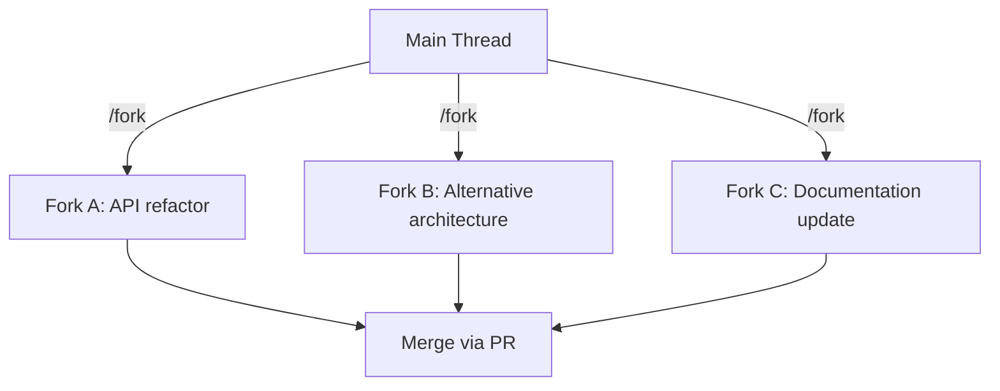
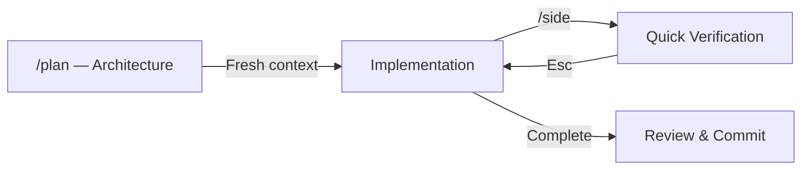

# The Three Parallel-Work Primitives in Codex CLI: /agent, /fork, and /side


---

Experienced developers do not think in single threads. At any given moment you might be mid-refactor, wondering about an API signature, and sketching an alternative architecture — all for the same feature. Until recently, AI coding agents forced you back into a single conversation, burning context on tangential questions and losing focus on the main task.

Codex CLI now ships three distinct primitives for parallel work: `/side` for ephemeral detours, `/fork` for persistent branches, and `/agent` for switching between active threads[^1]. Each maps to a different concurrency pattern developers already use instinctively. Understanding when to reach for each — and when to combine them — is the difference between a focused session and a context-polluted mess.

## The Primitives at a Glance

| Primitive | Persistence | Isolation Level | File Edits Allowed | Typical Token Cost |
|-----------|------------|-----------------|--------------------|--------------------|
| `/side`   | Ephemeral — vanishes on close | Read-only snapshot of parent | No | 500–2,000 tokens |
| `/fork`   | Persistent — own session file | Full context separation | Yes | Full history (prompt-cached) |
| `/agent`  | N/A — thread switcher | Switches between existing threads | Depends on target thread | Zero (navigation only) |

## `/side` — The Quick Aside

`/side` (aliased as `/btw`) creates an in-memory fork that inherits the current conversation as read-only reference[^1]. The parent agent continues running in the background. When you close the side conversation with `Esc`, you return to the parent thread exactly where you left off.

The design is deliberately restrictive. Only four slash commands are available inside a `/side` conversation: `/copy`, `/diff`, `/mention`, and `/status`[^2]. File edits and workspace modifications are blocked. This is not a limitation — it is a safety mechanism preventing accidental interference while the main agent is mid-task.

### When to Use `/side`

- Checking an API signature or language syntax without derailing a refactor
- Quick calculations or format conversions
- Verifying a dependency version before the agent installs it
- Asking "what does this error mean?" during a `codex exec` run[^1]

The key insight: if your question will take fewer than three messages and does not need to modify files, `/side` is always the right choice. Reaching for `/fork` in these situations wastes context and creates unnecessary session files.

## `/fork` — The Persistent Branch

`/fork` clones the current conversation into a new thread with a fresh ID, leaving the original transcript untouched[^1]. The forked session is persisted to disk and can be resumed later via `/resume`. All slash commands are available, and file modifications are permitted.



You can also fork from an earlier point in the conversation rather than the latest turn — navigate backwards through messages with `Esc`, then press `Enter` to create the fork from that specific point[^2]. This is invaluable when a conversation took a wrong turn three messages ago and you want to branch from the last known good state.

### The Worktree Imperative

Running parallel forks on the same files without worktree isolation causes merge conflicts and file corruption[^3]. This is the single most common mistake developers make with `/fork`. The pattern should always be:

```bash
# Create isolated worktrees for each fork
git worktree add ../myapp-api -b feat/api-refactor
git worktree add ../myapp-docs -b chore/update-docs

# Start Codex in each worktree
cd ../myapp-api && codex "Refactor the REST endpoints per spec"
cd ../myapp-docs && codex "Update API documentation"
```

The Codex desktop app handles this automatically — when you create a thread in "Worktree" mode, it provisions the worktree behind the scenes[^4]. The CLI does not yet have a `--worktree` flag in stable release (tracked in GitHub issue #12862[^5]), so manual setup remains necessary.

### When to Use `/fork`

- Exploring two competing architectural approaches in parallel
- Creating a checkpoint before destructive operations
- Splitting a large feature into bounded subagent work streams
- Any task requiring file modifications in a separate context

## `/agent` — The Thread Switcher

`/agent` is the navigation primitive that ties the system together. It switches your terminal between active subagent threads[^1], enabling the side-by-side comparison workflows that make `/fork` genuinely useful rather than just a way to create orphaned sessions.

In practice, `/agent` becomes the control plane for multi-threaded work. After forking two or three approaches, you use `/agent` to inspect progress, compare outputs, and decide which thread to pursue.

## The Subagent Layer Beneath

These three slash commands operate atop Codex CLI's subagent infrastructure, which adds a deeper layer of programmatic parallel work[^6]. The subagent system:

- Spawns specialised agents in parallel, each in its own isolated environment (typically a git worktree created automatically by the subagent runtime)
- Ships three built-in agent types: `default`, `worker`, and `explorer`[^6]
- Controls concurrency via `agents.max_threads` (default: 6) and nesting depth via `agents.max_depth` (default: 1)[^6]
- Is optimised for read-heavy tasks — exploration, test running, log analysis, and summarisation

```toml
# config.toml — subagent concurrency limits
[agents]
max_threads = 8
max_depth = 2
```

The distinction matters: `/fork` and `/side` are *interactive* primitives for the developer at the keyboard. Subagents are *programmatic* primitives that the agent itself spawns. You can combine both — fork a conversation, then let the agent in that fork spawn its own subagents for parallel exploration.

## Composition Patterns

### Plan → Fresh-Implement → Side-Verify

The most effective three-phase workflow keeps each stage context-optimised[^2]:

1. **Plan** using `/plan` mode — thorough architecture discussion, file reading, dependency analysis
2. **Fresh implementation** — when prompted, start implementation in a fresh context (planning tokens dropped entirely, reclaiming 30–50% of the context window)
3. **Side-verify** — use `/side` for quick verification questions without polluting implementation context



### Parallel Exploration with Merge

For genuinely uncertain design decisions, fork two or three approaches and let them run concurrently[^3]:

```bash
# Terminal 1: Main thread, orchestrator role
codex "Review the feature spec and identify the two best approaches"

# Terminal 2: Fork A (after /fork in terminal 1)
cd ../myapp-approach-a && codex "Implement using event sourcing"

# Terminal 3: Fork B
cd ../myapp-approach-b && codex "Implement using CQRS with projections"
```

Use `/agent` in the main thread to inspect each fork's progress. When one approach wins, merge its branch and remove the other worktree.

### The Interrupt Pattern

When the agent is mid-way through a multi-file refactor and you need to check something[^1]:

1. Press `/side`
2. Ask your question
3. Press `Esc` — the agent continues uninterrupted

This is particularly valuable during `codex exec` operations where interrupting the main thread would reset progress.

## How This Compares to Claude Code

Claude Code takes a different approach to the same problem[^7]. Its parallelism primitives include:

- **Foreground subagents** that block the main conversation until complete
- **Background subagents** that run concurrently, auto-denying any tool call that would otherwise prompt for approval
- **Agent teams** for tasks with non-linear interdependencies
- **Dynamic workflows** (new in 2026) — JavaScript scripts that orchestrate subagents at scale while keeping the main session responsive

The philosophical difference is instructive. Codex CLI gives the *developer* explicit control over threading via slash commands — you decide when to fork, when to side-step, and when to switch. Claude Code gives the *agent* more autonomy over its own parallelism, with the developer primarily controlling permissions and approval policies[^7].

Neither model is strictly superior. Codex's approach maps more naturally to how developers already think about work — branches, quick asides, and task switching. Claude Code's approach scales better for large autonomous tasks where you want the agent to figure out its own concurrency strategy.

## Anti-Patterns to Avoid

**Over-forking for minor questions.** If the question takes fewer than three messages and needs no file edits, use `/side`. Creating a full fork for "what's the syntax for a partial index?" wastes tokens and creates session clutter[^2].

**Parallel forks without worktree isolation.** This will corrupt files. Always pair `/fork` with `git worktree add` when both forks modify the same codebase[^3].

**Carrying bloated planning context into implementation.** After a lengthy `/plan` session, accept the fresh-context prompt. Your plan is documented; the implementation does not need the planning history consuming context window[^2].

**Letting side conversations metastasise.** If a `/side` conversation grows beyond three or four exchanges, it should have been a `/fork`. Close it, fork properly, and give the new thread the space it needs.

## Configuration

The parallel-work primitives require Codex CLI v0.122.0 or later for `/side`[^1]. No additional configuration is needed in the TUI. Custom clients using the JSON-RPC protocol can set `ephemeral: true` on the `thread/fork` endpoint to replicate `/side` behaviour programmatically[^2].

For subagent concurrency, configure limits in your project's `config.toml`:

```toml
[agents]
max_threads = 6    # Maximum concurrent subagent threads
max_depth = 1      # Maximum subagent nesting depth
```

## The Developer Concurrency Model

These three primitives — `/side` for interrupts, `/fork` for branches, `/agent` for switching — mirror how experienced developers already manage parallel work mentally. The contribution of Codex CLI is not inventing new concurrency patterns but making existing developer instincts executable within an agent session.

The most productive Codex CLI users treat these commands as fundamental workflow tools, not advanced features. Once you internalise the decision tree — ephemeral or persistent? Read-only or read-write? — parallel work with an AI agent starts to feel as natural as opening a new terminal tab.

## Citations

[^1]: [Codex CLI Conversation Branching: /side, /fork, and Plan Mode Workflows](https://codex.danielvaughan.com/2026/04/21/codex-cli-conversation-branching-side-fork-plan-mode-workflows/) — Codex Knowledge Base, April 2026
[^2]: [Codex Slash Commands: Complete CLI Reference (2026)](https://www.explainx.ai/blog/codex-slash-commands-complete-reference-guide-2026) — ExplainX, 2026
[^3]: [Worktree-Based Parallel Development with Codex CLI](https://codex.danielvaughan.com/2026/03/26/codex-cli-worktree-parallel-development/) — Codex Knowledge Base, March 2026
[^4]: [Codex App Worktrees Explained: How Parallel Agents Avoid Git Conflicts](https://www.verdent.ai/guides/codex-app-worktrees-explained) — Verdent Guides, 2026
[^5]: [CLI: add --worktree and --tmux flags for one-command isolated sessions · Issue #12862](https://github.com/openai/codex/issues/12862) — GitHub, 2026
[^6]: [Subagents — ChatGPT Learn](https://developers.openai.com/codex/subagents) — OpenAI Developers, 2026
[^7]: [Claude Code Agents: Background Agents & Parallel Tasks](https://claudefa.st/blog/guide/agents/async-workflows) — ClaudeFast, 2026
