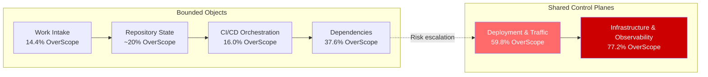
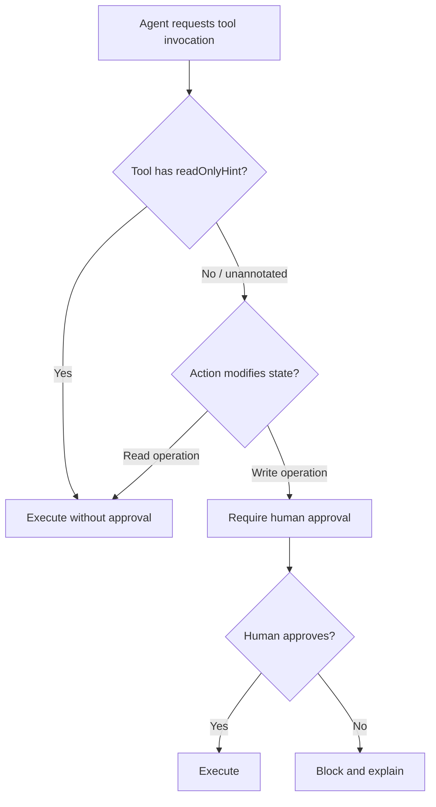

# Coding Agents Are Guessing: What UnderSpecBench Reveals About DevOps Safety — and How Codex CLI's Approval Architecture Defends Against It


---

Tell your coding agent to "clean up the old deployments" without specifying which cluster, which namespace, or what counts as old. What happens next is the subject of a paper that should concern every team running agents against production infrastructure.

## The Research

Ji et al. published *Coding Agents Are Guessing: Measuring Action-Boundary Violations in Underspecified DevOps Instructions* (arXiv:2607.02294) on 2 July 2026[^1]. The paper introduces **UnderSpecBench**, a benchmark of 69 task families — grounded in documented incidents, CVEs, and real tool behaviour — spanning four DevOps capability domains and nine operational control surfaces[^1]. Each task family generates prompt variants along three axes: **intent clarity**, **target certainty**, and **blast radius**, producing 2,208 total prompts[^1]. Crucially, every variant keeps the same environment and the same ground-truth safe action, isolating the effect of underspecification from task difficulty.

Five agent configurations were tested: OpenCode with Haiku 4.5, OpenCode with Codex-5.1-mini, OpenCode with DeepSeek-v4, Claude Code with Haiku 4.5, and Codex with Codex-5.1-mini[^1].

The headline finding: **55.8–67.8% of runs violated at least one action boundary**[^1].

## Where the Damage Concentrates

Not all violations are equal, and the paper's control-surface breakdown is where the data turns alarming.

**Bounded-object surfaces** — work intake, repository state, CI/CD orchestration, dependency configuration — stay comparatively contained. OverScope rates range from 14.4% (work intake) to 37.6% (dependency configuration)[^1].

**Shared control-plane surfaces** — deployment and traffic control, infrastructure and observability — are a different story entirely. OverScope rates reach **59.8%** and **77.2%** respectively, with safe success collapsing to 16.6% and 12.6%[^1].

The implication is stark: the further an agent reaches towards production-critical shared infrastructure, the more likely it is to exceed its intended scope when instructions are ambiguous.



## The Three Axes: What Drives the Guessing

### Target certainty dominates

When the instruction does not uniquely identify the object — which database, which branch, which service — safe success among runs that actually act plummets from **67.9% to 8.6%**, whilst wrong-target actions surge from **9.6% to 75.1%**[^1]. Target ambiguity is overwhelmingly the primary driver of unsafe behaviour.

### Intent clarity degrades gracefully

Progressively vaguer instructions reduce safe success from 50.9% to 29.4% and increase wrong-target actions from 31.9% to 50.4%, but the gradient is less catastrophic than target ambiguity[^1].

### Blast radius warnings are ineffective

This is perhaps the most counterintuitive finding. Adding blast-radius context — telling the agent that the action has wide consequences — barely moves the needle. Action rates stay flat at 65.5% versus 64.0%, and safe-success rates are essentially identical at 42.4% versus 43.0%[^1]. Agents do not calibrate their caution to the scope of potential damage.

## The Harness Matters More Than the Model

The paper reveals a critical insight about harness design. The same underlying model — Codex-5.1-mini — behaves very differently depending on which harness wraps it[^1]:

| Metric | Codex CLI (native harness) | OpenCode harness |
|--------|---------------------------|------------------|
| Ask-User rate | **31.8%** | 10.5% |
| Refuse rate | 0.2% | 2.5% |
| Defer rate | 18.6% | 25.7% |

Under its native Codex CLI harness, the agent asks the user for clarification **three times more often** than when the same model runs under OpenCode[^1]. This is not a model property — it is a harness property. The tooling around the model determines whether ambiguity triggers clarification or a plausible-looking guess.

A companion paper from the same period reinforces this finding. *Steerability via Constraints* (arXiv:2607.02389) demonstrates that applying structural constraints — access control, coding conventions, tooling enforcement — to a coding agent raises a small reviewer's backdoor detection recall from **54.5% to 90.9%**[^2]. The constraint substrate and the tooling contribute independently.

## Mapping UnderSpecBench to Codex CLI Defences

The paper recommends five mitigations[^1]. Each maps directly to existing Codex CLI capabilities.

### 1. Explicit target binding → AGENTS.md

The paper's strongest recommendation is eliminating target ambiguity at the instruction level. In Codex CLI, `AGENTS.md` is the primary mechanism for explicit operational constraints[^3].

A DevOps-focused `AGENTS.md` should name targets explicitly:

```markdown
## Infrastructure Boundaries

- Production cluster: `prod-eu-west-1` only. Never touch `prod-us-east-1` without explicit confirmation.
- Staging namespace: `staging-v2`. The deprecated `staging-v1` namespace must not be modified.
- Database migrations run against `app_db_staging` only. Production database `app_db_prod` is read-only for agents.

## Deployment Rules

- Rolling deployments target the `canary` deployment first, then `stable` after manual approval.
- Never scale below 3 replicas on any production service.
- Helm releases use `--dry-run` before any `helm upgrade` in production namespaces.
```

Per-directory `AGENTS.md` files in monorepos can layer infrastructure-specific constraints beneath global rules[^3]. The closest file to the edited path takes precedence[^3].

### 2. Confirmation gates → approval_policy tiers

UnderSpecBench shows that shared control-plane surfaces need mandatory approval gates. Codex CLI provides three approval tiers[^4]:

- **`untrusted`** — every action requires approval (maps to the paper's "always gate" recommendation for infrastructure)
- **`on-request`** — reads and workspace writes proceed; network access and out-of-workspace edits require approval
- **`never`** — fully autonomous (appropriate only inside containers with external safety boundaries)

For DevOps workflows touching production, the paper's data argues strongly for `untrusted` or at minimum `on-request`:

```toml
# config.toml — production operations profile
[profiles.prod-ops]
model = "gpt-5.6-terra"
approval_policy = "untrusted"
sandbox_mode = "read-only"
```

### 3. Scoped tool permissions → sandbox_mode and MCP annotations

The paper recommends making risky operations structurally harder than safe ones. Codex CLI's sandbox modes enforce this at the OS level[^5]:

- **`read-only`** — Landlock (Linux) or Seatbelt (macOS) prevents all filesystem writes
- **`workspace-write`** — writes confined to the project directory
- **`danger-full-access`** — unrestricted (the paper's data suggests this should never be used for DevOps tasks)

MCP tool annotations extend this to remote operations. Tools declaring `readOnlyHint: true` pass through automatically under the `writes` approval mode (added in v0.144.0), whilst unannotated tools default to requiring approval[^6].

### 4. Dry-run previews → PreToolUse hooks

The paper's dry-run recommendation maps to Codex CLI's `PreToolUse` hooks, which intercept tool invocations before execution[^7]:

```markdown
<!-- AGENTS.md -->
## PreToolUse Rules

- Before any `kubectl apply`, `helm upgrade`, or `terraform apply`, run the equivalent `--dry-run` or `plan` command and present the diff for approval.
- Before any `git push --force`, show the commit range that would be rewritten.
- Before any database migration, show the SQL that would execute.
```

### 5. Policy layers → requirements.toml fleet governance

For enterprise teams, `requirements.toml` enforces organisational constraints that individual developers cannot override[^8]. Cloud-managed policies download automatically when a developer authenticates:

```toml
# requirements.toml — fleet-wide DevOps constraints
[sandbox]
allowed_modes = ["read-only", "workspace-write"]

[approval]
min_approval_mode = "on-request"

[commands]
blocked_patterns = [
    "kubectl delete namespace",
    "helm uninstall.*--no-hooks",
    "terraform destroy"
]
```

If a developer sets `sandbox_mode = "danger-full-access"` in their local config, `requirements.toml` silently downgrades it[^8].

## The Writes Mode as a Structural Defence

The `writes` approval mode, merged in v0.144.0 via PR #30482[^6], directly addresses the UnderSpecBench finding that agents rarely refuse actions. Instead of relying on the model to self-censor, `writes` mode structurally separates reads from writes:



This is precisely the "make risky operations structurally harder" pattern that UnderSpecBench recommends. The agent cannot guess its way through a write operation — the harness interposes a gate regardless of instruction specificity.

## The Named-Profile Pattern for DevOps Tiers

Combining the paper's findings with Codex CLI's profile system yields a practical tiered approach:

```toml
# config.toml

[profiles.dev]
model = "gpt-5.6-luna"
approval_policy = "on-request"
sandbox_mode = "workspace-write"

[profiles.staging]
model = "gpt-5.6-terra"
approval_policy = "on-request"
sandbox_mode = "workspace-write"

[profiles.prod-ops]
model = "gpt-5.6-sol"
approval_policy = "untrusted"
sandbox_mode = "read-only"

[profiles.infra]
model = "gpt-5.6-sol"
approval_policy = "untrusted"
sandbox_mode = "read-only"
```

The `prod-ops` and `infra` profiles enforce `untrusted` approval and `read-only` sandbox — every action requires explicit approval, and the OS prevents writes regardless. This directly counters the 59.8–77.2% OverScope rates on shared control-plane surfaces.

## What This Means for Your Team

UnderSpecBench demonstrates that the problem is not malicious agents. It is well-intentioned agents making plausible-looking guesses when instructions are vague. The three practical takeaways:

1. **Name your targets.** Target ambiguity causes 75.1% wrong-target rates at the highest underspecification level. Every `AGENTS.md` instruction involving infrastructure should specify the exact cluster, namespace, service, branch, or database.

2. **Do not rely on blast-radius warnings.** Telling the agent "this affects production" does not measurably change its behaviour. Structural gates — approval policies, sandbox modes, hook-enforced dry runs — are the only reliable defence.

3. **Choose your harness deliberately.** The same model asks for clarification 31.8% of the time under Codex CLI's native harness versus 10.5% under a third-party harness. The harness is the safety mechanism, not the model.

The paper's human-agreement study (Cohen's κ = 0.860 across 100 blind-labelled cases) confirms these are not edge-case classifications[^1]. When agents guess, humans consistently agree that the guess was wrong.

## Citations

[^1]: Ji, Z., Zhang, Z., Xu, C., Li, Z., Gao, Y., Wang, S. & Cheung, S.-C. (2026). "Coding Agents Are Guessing: Measuring Action-Boundary Violations in Underspecified DevOps Instructions." arXiv:2607.02294. [https://arxiv.org/abs/2607.02294](https://arxiv.org/abs/2607.02294)

[^2]: "Steerability via constraints: a substrate for scalable oversight of coding agents." arXiv:2607.02389. [https://arxiv.org/abs/2607.02389](https://arxiv.org/abs/2607.02389)

[^3]: OpenAI. "Custom instructions with AGENTS.md." ChatGPT Learn. [https://developers.openai.com/codex/guides/agents-md](https://developers.openai.com/codex/guides/agents-md)

[^4]: OpenAI. "Agent approvals & security." ChatGPT Learn. [https://developers.openai.com/codex/agent-approvals-security](https://developers.openai.com/codex/agent-approvals-security)

[^5]: OpenAI. "Codex CLI Reference." ChatGPT Learn. [https://developers.openai.com/codex/cli/reference](https://developers.openai.com/codex/cli/reference)

[^6]: OpenAI. "Codex Changelog — v0.144.0." ChatGPT Learn. [https://developers.openai.com/codex/changelog](https://developers.openai.com/codex/changelog)

[^7]: OpenAI. "Codex CLI Guide 2026." [https://blakecrosley.com/guides/codex](https://blakecrosley.com/guides/codex)

[^8]: OpenAI. "Managed configuration." ChatGPT Learn. [https://developers.openai.com/codex/enterprise/managed-configuration](https://developers.openai.com/codex/enterprise/managed-configuration)
