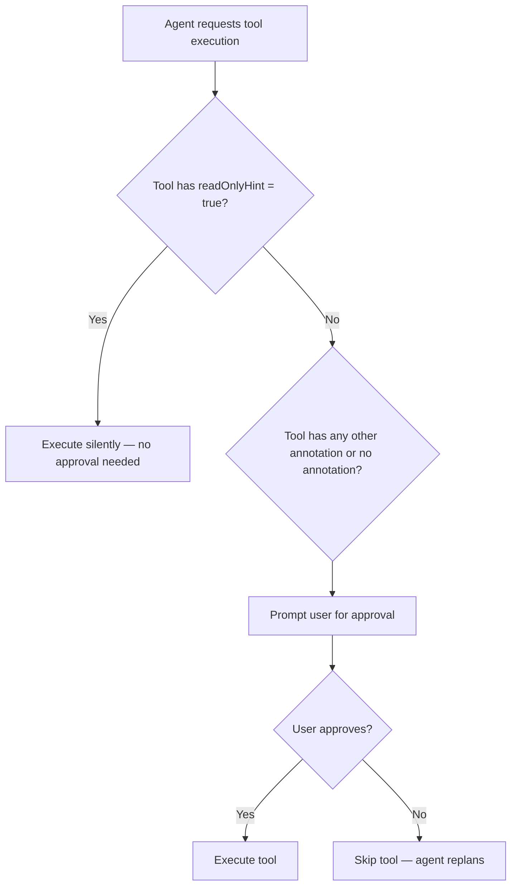
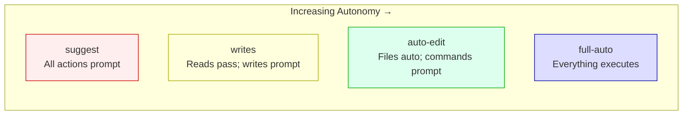

# The Writes Mode Permission Primitive: How Codex CLI Finally Solved the Read-Write Approval Gap


---

## The Problem Space

Every developer who has used Codex CLI for more than a week encounters the same friction: the existing approval modes force an awkward binary choice. In `suggest` mode, the agent interrupts you for *everything* — reading a file, listing a directory, querying a database. In `auto-edit` mode, you grant blanket permission for all file modifications whilst still gating shell commands. Neither maps cleanly onto the principle of least privilege.

The real-world consequence is predictable. Teams running code review workflows — where the agent needs to read dozens of files, trace dependencies, and query type information — end up in `auto-edit` or even `full-auto` simply to avoid the constant approval interruptions for read-only operations[^1]. They accept more write risk than necessary because the permission model lacked granularity.

On 7 July 2026, OpenAI merged PR #30482[^2], introducing a fourth approval mode: **writes**. It is, arguably, the most important permission primitive shipped since Codex CLI's initial sandbox architecture.

## How Writes Mode Works

The writes mode operates on a single principle: **declared read-only tools execute without interruption; everything else prompts**.



Three design decisions make this mode distinct from its predecessors:

1. **Annotation-driven gating**: The mode consumes MCP tool annotations[^3] — specifically `readOnlyHint` — to classify operations. Tools explicitly marked as read-only by their server skip the approval prompt entirely.

2. **Pessimistic default for unannotated tools**: If a tool lacks annotations (common with older MCP servers), it is treated as a potential write operation and prompts accordingly. This is a deliberate "fail-closed" design.

3. **No persistent approval memory**: Unlike `auto-edit`, the writes mode prevents session-level or persistent approval choices. If you approve a write tool once, the *next* invocation of that same tool still prompts[^4]. This prevents a single approval from cascading into unchecked write access across an entire session.

## Configuration

The writes mode integrates into Codex CLI's existing two-axis configuration model: approval policy governs *when to ask*, sandbox mode governs *what the agent can touch*.

### CLI flag

```bash
codex --approval-mode writes "Refactor the payment module"
```

### Config file (`~/.codex/config.toml`)

```toml
approval_mode = "writes"
sandbox_mode  = "workspace-write"
```

### Named profile for code review

```toml
# ~/.codex/review.config.toml
approval_mode = "writes"
sandbox_mode  = "read-only"

[sandbox_read_only]
network_access = false
```

Invoke with:

```bash
codex --profile review "Review this PR for security issues"
```

This profile combination — writes mode with a read-only sandbox — creates a belt-and-braces configuration. The sandbox technically prevents writes at the kernel level, whilst the approval mode ensures the agent never *attempts* writes without explicit consent[^5].

## The MCP Tool Annotations Connection

The writes mode's effectiveness depends entirely on MCP servers correctly annotating their tools. The `ToolAnnotations` interface, shipped in the MCP spec revision of March 2025[^3], provides four boolean hints:

| Hint | Meaning | Default |
|------|---------|---------|
| `readOnlyHint` | Tool does not modify its environment | `false` |
| `destructiveHint` | Modifications are destructive (not additive) | `true` |
| `idempotentHint` | Safe to call repeatedly with same args | `false` |
| `openWorldHint` | Interacts with external entities | `true` |

In writes mode, only `readOnlyHint` is consumed for the approval decision. A well-annotated MCP server might declare:

```json
{
  "name": "search_codebase",
  "annotations": {
    "readOnlyHint": true,
    "openWorldHint": false
  }
}
```

This tool executes silently in writes mode. Conversely:

```json
{
  "name": "apply_patch",
  "annotations": {
    "readOnlyHint": false,
    "destructiveHint": true
  }
}
```

This tool always prompts.

### The trust caveat

MCP annotations are **hints, not guarantees**[^6]. A malicious or buggy server could declare a destructive tool as read-only. The writes mode does not verify annotation truthfulness — it trusts the server's declaration. This means the mode is only as secure as your MCP server vetting process. Enterprise deployments should combine writes mode with:

- A curated MCP server allowlist in `config.toml`
- The `approvals_reviewer = "auto_review"` setting for automated risk assessment[^5]
- Sandbox-level enforcement as the hard security boundary

## Where Writes Mode Fits in the Approval Spectrum



The writes mode occupies the gap between `suggest` (too interruptive for read-heavy workflows) and `auto-edit` (too permissive for security-conscious environments). Its sweet spot is workflows that are **read-dominant with occasional, deliberate writes**:

- **Code review and audit**: Read dozens of files, trace call graphs, query types — then produce a review comment (the single write operation)
- **Dependency analysis**: Traverse `node_modules`, read lock files, check versions — then update `package.json` (approved write)
- **Architecture exploration**: Map service boundaries, read configs, query APIs — then create a design document (approved write)
- **Security scanning**: Read source, check patterns, query CVE databases — then create an issue (approved write)

## Enterprise Implications

The writes mode addresses a specific enterprise governance requirement: **audit-trail granularity**. When every write operation requires explicit approval, the approval log becomes a complete record of every mutation the agent performed — and crucially, every mutation a human sanctioned.

Combined with named profiles, organisations can enforce writes mode as the minimum baseline:

```toml
# requirements.toml (fleet-wide, MDM-distributed)
[requirements]
min_approval_mode = "writes"
```

This prevents individual developers from dropping to `full-auto` without an administrator override, whilst still allowing the upgrade to `suggest` for particularly sensitive repositories[^7].

## Practical Considerations

**Performance impact**: Negligible. The annotation check is a local comparison against the tool's metadata — no network round-trip required.

**Compatibility**: Works with all MCP servers. Unannotated tools simply default to prompting, which is the safe behaviour. You lose the read-pass optimisation but gain nothing worse than `suggest` mode.

**Session flow**: Expect 60–80% fewer approval interruptions compared to `suggest` mode in typical development workflows, based on the observation that most agent tool calls during code exploration are reads[^1].

**Limitation**: The mode cannot distinguish between *benign* writes (creating a temporary scratch file) and *consequential* writes (modifying production configuration). All writes are treated equally. For finer-grained control, combine with the granular approval policy object:

```toml
approval_policy = { granular = {
  sandbox_approval = true,
  rules = true,
  mcp_elicitations = true,
  request_permissions = false
} }
```

## The Broader Pattern

The writes mode represents a philosophical shift in how Codex CLI thinks about agent permissions. Rather than categorising actions by *mechanism* (file edit vs shell command vs MCP tool), it categorises them by *intent* (read vs write). This is the same distinction that underpins Unix file permissions, database transaction isolation levels, and RESTful API design — the separation of queries from commands.

It suggests a direction for the broader agentic tooling ecosystem: permission models that consume semantic metadata about tool behaviour rather than relying on syntactic classification of the action type. As MCP adoption grows and tool annotation quality improves, expect more hosts to build approval logic around these hints rather than hard-coded command allowlists.

---

## Citations

[^1]: OpenAI, "Agent Approvals & Security," ChatGPT Learn Documentation, 2026. [https://learn.chatgpt.com/docs/agent-approvals-security](https://learn.chatgpt.com/docs/agent-approvals-security)

[^2]: zamoshchin-openai, "[codex-rs] Add writes app approval mode," Pull Request #30482, openai/codex, merged 7 July 2026. [https://github.com/openai/codex/pull/30482](https://github.com/openai/codex/pull/30482)

[^3]: Model Context Protocol, "Tool Annotations as Risk Vocabulary: What Hints Can and Can't Do," MCP Blog, 16 March 2026. [https://blog.modelcontextprotocol.io/posts/2026-03-16-tool-annotations/](https://blog.modelcontextprotocol.io/posts/2026-03-16-tool-annotations/)

[^4]: Releasebot, "Codex Updates by OpenAI — July 2026." [https://releasebot.io/updates/openai/codex](https://releasebot.io/updates/openai/codex)

[^5]: OpenAI, "Configuration Reference," ChatGPT Learn Documentation, 2026. [https://developers.openai.com/codex/config-reference](https://developers.openai.com/codex/config-reference)

[^6]: Stacklok, "Tool annotations are becoming the risk vocabulary for agentic systems," 2026. [https://stacklok.com/blog/tool-annotations-are-becoming-the-risk-vocabulary-for-agentic-systems-that-matters-more-than-it-might-seem/](https://stacklok.com/blog/tool-annotations-are-becoming-the-risk-vocabulary-for-agentic-systems-that-matters-more-than-it-might-seem/)

[^7]: Digital Applied, "Codex CLI Deep Dive: Config, Profiles, Sandbox 2026." [https://www.digitalapplied.com/blog/codex-cli-deep-dive-config-profiles-sandbox-2026](https://www.digitalapplied.com/blog/codex-cli-deep-dive-config-profiles-sandbox-2026)
