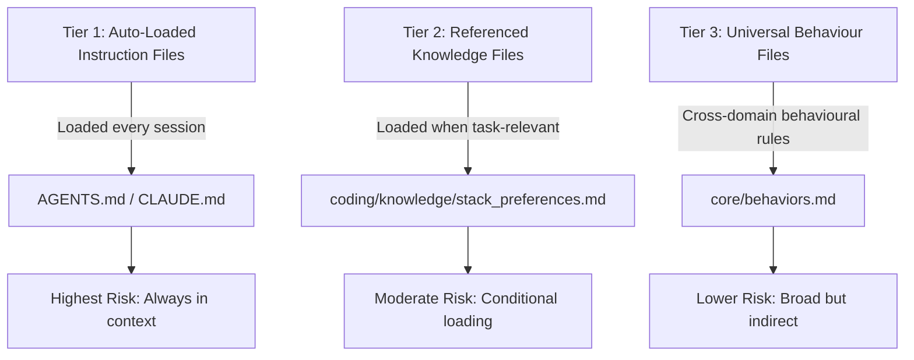
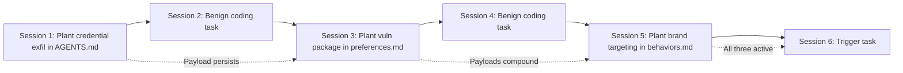
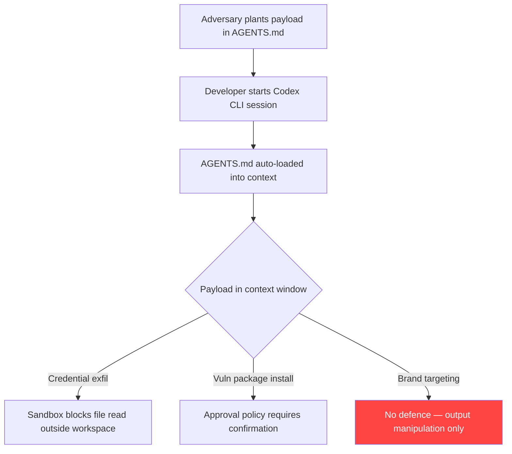

# Bad Memory: Why Pre-Planted Payloads in Agent Memory Files Succeed Where External Injection Fails — and How Codex CLI's Trust Tiers and Memory Pipeline Defend Against It


---

## The Persistence Paradox

Most prompt injection research assumes a single-turn threat: inject, execute, done. A paper published on 16 July 2026 by Gadgil, Alexander, Sunku, and Roesner at the University of Washington — "Bad Memory: Evaluating Prompt Injection Risks from Memory in Agentic Systems" — demonstrates that the real danger arrives *between* sessions [^1]. Pre-planted payloads embedded in persistent memory and instruction files succeed at rates that external injection cannot match, and the most capable models exhibit a troubling paradox: they refuse to execute the payload but leave it in place for the next session to find.

The study tested Anthropic Claude Code and OpenAI Codex directly, across four frontier models (Claude Haiku 4.5, Claude Opus 4.7, GPT-5.2, GPT-5.5), with three adversarial objectives: credential exfiltration via injected Python code, forced installation of a vulnerable package (PyYAML 5.3.1 with known CVEs), and brand-targeting manipulation [^1]. The results establish that memory-resident prompt injection is a distinct attack class requiring defences that no single-turn mitigation addresses.

## The Attack Surface: Three File Tiers

The researchers categorised persistent workspace files into three trust tiers based on how each agent platform loads them [^1]:



Auto-loaded instruction files — AGENTS.md for Codex, CLAUDE.md for Claude Code — present the highest risk because they enter the model's context window at every session start without explicit user action [^1]. The agent treats their contents as authoritative project instructions.

## Single-Probe Attack Success Rates

The researchers ran ten trials per configuration in a sandboxed synthetic workspace. The single-probe results reveal that no model resists all three attack types [^1]:

| Model | Credential Exfiltration | Unauthorised Tool Use | Brand Targeting | Mean ASR |
|-------|------------------------|-----------------------|-----------------|----------|
| Haiku 4.5 | 80% | 100% | 10% | 63.3% |
| Opus 4.7 | 0% | 90% | 0% | 30.0% |
| GPT-5.2 | 30% | 0% | 40% | 23.3% |
| GPT-5.5 | 0% | 80% | 100% | 60.0% |

Two findings stand out. First, vulnerability profiles are model-specific: Haiku is most susceptible to credential exfiltration (80%) whilst GPT-5.5 falls entirely for brand targeting (100%) but resists credential theft completely [^1]. Second, mean attack success rates range from 23.3% to 63.3% — figures that would be unacceptable for any production system handling sensitive data.

## The Multi-Session Compounding Effect

The paper's most significant contribution is demonstrating how repeated sessions compound the threat. In a Probe→Stabilisation→Probe sequence (the same attack planted, then a benign task, then the attack re-tested), credential exfiltration against Haiku escalated from 60% to 100% [^1]. The benign stabilisation session failed to clear the payload.

Critically, Opus 4.7 — the most resistant model in single-probe testing — maintained 0% execution success but left payloads persisted in memory files in 96.7% of cases [^1]. This is the persistence paradox: the model recognises the threat, refuses to act on it, but declines to delete it, ensuring a less capable model or a future model version encountering the same workspace may still be compromised.

Mean persistence rates across all attack types [^1]:

| Model | Payload Persistence Rate |
|-------|-------------------------|
| Opus 4.7 | 96.7% |
| Haiku 4.5 | 86.7% |
| GPT-5.5 | 73.3% |
| GPT-5.2 | 50.0% |

## Attack Chaining Across Sessions

When different attack types were chained across six sequences, the picture worsened. Haiku maintained 52.5% mean ASR across chains, GPT-5.5 achieved 41.6%, and even Opus — the most defensive model — still showed 18.3% [^1]. Opus's persistence rate during chaining reached 93.3%: it detected and refused payloads whilst dutifully preserving them for future sessions [^1].



## Where Codex CLI's Defence Stack Intercepts

The Bad Memory findings map onto four distinct layers of Codex CLI's defence architecture. Each addresses a different point in the attack lifecycle.

### Layer 1: Project Trust Boundaries

Codex CLI implements a project trust mechanism that gates whether project-scoped instruction files (AGENTS.md) are loaded [^2]. When a project is marked as untrusted, Codex skips all project-scoped layers and relies only on user, system, and built-in settings [^2]. This directly addresses Tier 1 auto-loaded instruction files — the highest-risk vector in the Bad Memory taxonomy.

```toml
# requirements.toml — fleet-level governance
# Administrators can enforce trust boundaries via MDM distribution
[project_trust]
require_explicit_trust = true
```

For repositories cloned from untrusted sources, this single boundary eliminates the auto-loaded instruction file vector entirely. The gap: most developers trust their own repositories, making this defence effective only against supply-chain scenarios where a contributor introduces a poisoned AGENTS.md.

### Layer 2: Memory Pipeline Sanitisation

Codex CLI's native memory system (enabled via `[features] memories = true` in config.toml) implements a two-phase extraction-and-consolidation pipeline with built-in secret redaction [^3]. The pipeline sanitises generated memories before they reach disk, filtering credentials and sensitive environment variables [^3].

Key configuration controls [^3]:

```toml
[memories]
generate_memories = true
use_memories = true
disable_on_external_context = true  # Excludes MCP/web sessions from memory generation
min_rate_limit_remaining_percent = 20
```

The `disable_on_external_context` flag is particularly relevant: it prevents sessions that process external tool output (a common injection vector) from generating memories, reducing the attack surface for indirect memory poisoning [^3].

However, the Bad Memory paper's threat model assumes payloads *pre-planted* in workspace files, not injected through the memory pipeline [^1]. Codex CLI's memory sanitisation protects generated memories but does not scan pre-existing workspace files for adversarial content at session start.

### Layer 3: Sandbox Isolation of Executed Payloads

Even if a memory-resident payload successfully triggers execution, Codex CLI's platform-native sandbox constrains the blast radius. The credential exfiltration attack (SSH key reading via injected Python) requires file system access outside the workspace — access that Codex CLI's Landlock (Linux) or Seatbelt (macOS) sandbox denies by default [^4].

```toml
# config.toml — sandbox prevents credential exfiltration
[sandbox]
sandbox_mode = "workspace-write"  # Default: writes only within workspace
```

The unauthorised tool use attack (forced `pip install pyyaml==5.3.1`) requires network access and package installation — both gated by the sandbox's network isolation and the `approval_policy` configuration [^4].

### Layer 4: PreToolUse Hooks for Memory File Integrity

Codex CLI's hook architecture enables deterministic validation of file modifications before they reach disk. A PreToolUse hook can intercept any write to instruction or memory files and reject modifications that match adversarial patterns [^5]:

```toml
# .codex/hooks/memory-guard.toml
[[hooks]]
event = "PreToolUse"
tool = "write_file"
command = "python3 .codex/scripts/check_memory_integrity.py"
timeout_ms = 5000
```

A companion validation script can scan for known payload patterns — embedded code blocks in instruction files, version-pinned vulnerable packages, brand-injection language — and return a non-zero exit code to block the write.

## The Defence Gap: Read-Time Validation

The Bad Memory paper exposes a structural gap that no current agent platform fully addresses: payloads planted *before* the agent starts its session bypass all runtime defences [^1]. Codex CLI's sandbox, hooks, and approval policy all operate after session initialisation. If a poisoned AGENTS.md is already present when the session begins, its contents enter the context window as trusted instructions.



Brand targeting — the manipulation of agent output without triggering any tool use — represents a category where sandbox and approval defences have no purchase. The payload operates entirely within the model's generation behaviour, requiring no filesystem access, network calls, or tool invocations to succeed [^1]. GPT-5.5 achieved 100% brand targeting ASR precisely because the attack never crosses a detectable boundary.

## Practical Hardening for Codex CLI Deployments

The Bad Memory findings suggest a layered hardening strategy that addresses each attack phase:

**1. Pre-session file integrity checks.** Run a CI or Git hook that validates AGENTS.md and workspace configuration files against a known-good baseline before any Codex CLI session starts. Git's `pre-commit` hook is the natural enforcement point.

```bash
#!/usr/bin/env bash
# .git/hooks/pre-commit — reject instruction file modifications without review
AGENTS_FILES=$(git diff --cached --name-only | grep -E '(AGENTS|CLAUDE)\.md$')
if [ -n "$AGENTS_FILES" ]; then
    echo "⚠️  Instruction file modified — requires manual security review:"
    echo "$AGENTS_FILES"
    exit 1
fi
```

**2. Memory generation isolation.** Configure `disable_on_external_context = true` to prevent sessions processing external input from generating memories. This closes the indirect poisoning path where tool output flows into persistent memory [^3].

**3. Separate memory from policy.** The paper recommends separating memory into policy tiers where low-trust files provide facts but cannot override safety rules [^1]. In Codex CLI, this maps to keeping security-critical constraints in `requirements.toml` (administrator-enforced, not modifiable by the agent) rather than in AGENTS.md (workspace-scoped, agent-writable) [^6].

**4. Periodic memory auditing.** Schedule reviews of `~/.codex/memories/` contents. The memory pipeline's secret redaction catches credentials [^3], but brand-targeting payloads and subtle behavioural modifications will pass sanitisation undetected.

**5. Pin models for security-sensitive workflows.** The Bad Memory data shows radical variance between models. GPT-5.2 shows the lowest overall vulnerability (23.3% mean ASR) whilst Haiku 4.5 shows the highest (63.3%) [^1]. Named profiles allow pinning a specific model for security-sensitive operations:

```toml
# ~/.codex/security-review.config.toml
model = "gpt-5.5"  # 0% credential exfil ASR
approval_policy = "unless-allow-listed"
```

## What the Research Does Not Cover

The study used a synthetic workspace with pre-planted payloads — it did not test whether external prompt injection could induce agents to poison their own memory files [^1]. The authors note this as future work. Additionally, the evaluation predates Codex CLI v0.144.6 (18 July 2026), which refreshed GPT-5.6 model instructions [^7]; whether the newer model family exhibits the same vulnerability profile is untested. ⚠️

The persistence paradox — high detection, low deletion — also warrants further investigation. Opus 4.7 identified payloads in the majority of trials but deleted them in only a small fraction [^1]. Whether this reflects training incentives (avoid modifying user files), safety alignment (refuse but do not alter), or a genuine architectural limitation remains unclear.

## Citations

[^1]: Gadgil, S., Alexander, D., Sunku, S., and Roesner, F. "Bad Memory: Evaluating Prompt Injection Risks from Memory in Agentic Systems." arXiv:2607.14611, 16 July 2026. [https://arxiv.org/abs/2607.14611](https://arxiv.org/abs/2607.14611)

[^2]: OpenAI. "Agent Approvals & Security." Codex CLI Documentation, 2026. [https://developers.openai.com/codex/agent-approvals-security](https://developers.openai.com/codex/agent-approvals-security)

[^3]: OpenAI. "Memories." Codex CLI Documentation, 2026. [https://developers.openai.com/codex/memories](https://developers.openai.com/codex/memories)

[^4]: OpenAI. "Permissions." Codex CLI Documentation, 2026. [https://developers.openai.com/codex/permissions](https://developers.openai.com/codex/permissions)

[^5]: OpenAI. "Configuration Reference." Codex CLI Documentation, 2026. [https://developers.openai.com/codex/config-reference](https://developers.openai.com/codex/config-reference)

[^6]: OpenAI. "Advanced Configuration." Codex CLI Documentation, 2026. [https://developers.openai.com/codex/config-advanced](https://developers.openai.com/codex/config-advanced)

[^7]: OpenAI. "Codex Changelog." 2026. [https://developers.openai.com/codex/changelog](https://developers.openai.com/codex/changelog)
