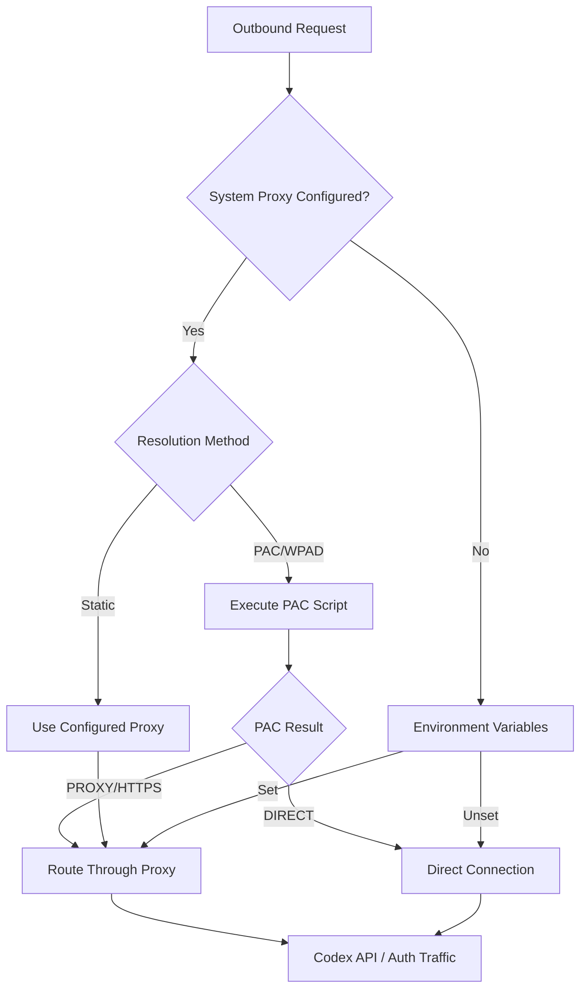
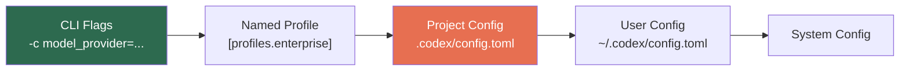
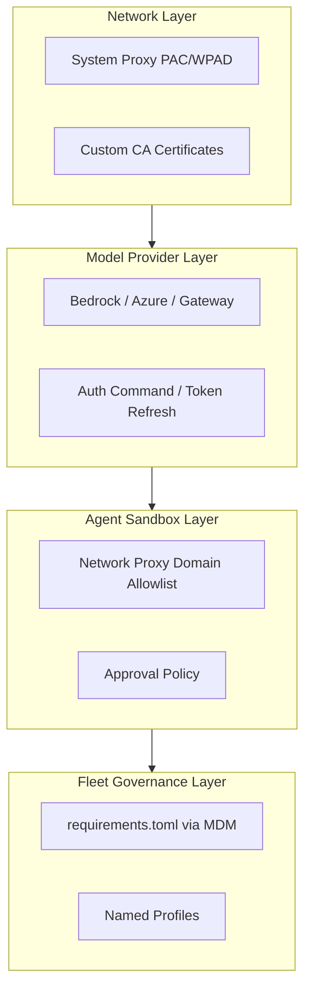

# Behind the Corporate Firewall: How Codex CLI Conquered PAC, WPAD, and Multi-Provider Model Routing


---

AI coding agents work brilliantly on a developer's home Wi-Fi. Getting them through a corporate network — with intercepting proxies, PAC scripts, WPAD auto-discovery, custom certificate authorities, and compliance requirements routing traffic through approved cloud providers — is another matter entirely. Until recently, Codex CLI was no exception: enterprise teams either punched holes in their firewall or gave up.

Version 0.143.0, released on 8 July 2026, changed that[^1]. Codex now routes both authentication and Responses API traffic through macOS and Windows system proxies, including PAC and WPAD autoconfiguration. Combined with its mature `model_provider` system for routing inference through Amazon Bedrock, Azure OpenAI, or custom gateways, Codex CLI is now deployable on locked-down corporate networks without bespoke workarounds.

This article walks through the full enterprise network configuration stack: system proxy resolution, sandboxed network policy, multi-provider model routing, and fleet governance via `requirements.toml`.

## The Corporate Network Problem

Enterprise networks rarely let desktop applications reach the open internet directly. Traffic flows through HTTP proxies configured via one of three mechanisms[^2]:

1. **Static proxy** — a fixed `proxy.corp.example.com:8080` address set in system preferences
2. **PAC (Proxy Auto-Config)** — a JavaScript file that returns per-URL routing decisions (`DIRECT`, `PROXY`, or `HTTPS`)
3. **WPAD (Web Proxy Auto-Discovery Protocol)** — DNS or DHCP-based auto-discovery of the PAC file URL

Before v0.143.0, Codex CLI respected the standard `HTTPS_PROXY` and `HTTP_PROXY` environment variables but ignored system-level proxy settings entirely. That meant PAC- and WPAD-managed networks — the majority of large enterprises — required manual environment variable configuration per shell session, often with different values for authentication endpoints versus API traffic.

## System Proxy Resolution: How It Works

The implementation landed across two stacked pull requests[^3][^4], one per platform:

### macOS

The macOS resolver uses Apple's native `SystemConfiguration` framework and `CFNetworkCopyProxiesForURL` to determine the correct proxy for each request URL[^4]. PAC scripts execute inside a bounded Core Foundation run loop with a five-second timeout, preventing hung PAC servers from blocking the agent.

### Windows

The Windows resolver calls `WinHttpGetIEProxyConfigForCurrentUser` to read WinHTTP/IE proxy settings, then applies them through a fallback chain[^3]:

1. Explicit PAC URL
2. WPAD auto-detection
3. Static proxy configuration
4. Bypass rules (including `<local>`, wildcard suffixes, and port qualifiers)



### Shared Design Decisions

Both implementations share several deliberate constraints:

- **Disabled by default** — the `respect_system_proxy` feature flag must be explicitly enabled, preserving existing behaviour for non-enterprise users[^3]
- **URL-specific cache keys** — proxy resolution results are cached using SHA-256 hashes of the request URL, preventing retention of raw URLs or query strings[^4]
- **Unsupported schemes fail loudly** — SOCKS and other unsupported proxy types return an `UnsupportedProxyScheme` error rather than silently falling back, ensuring administrators know when configuration changes are needed[^3]
- **First candidate only** — only the first supported proxy candidate from a PAC response is attempted; subsequent options are not retried after connection failures[^4]

## Sandboxed Network Proxy: The Agent's Own Firewall

Separate from system proxy resolution, Codex CLI provides a sandboxed network proxy that controls what the *agent itself* can access. This is configured under `features.network_proxy` in `config.toml`[^5]:

```toml
[features.network_proxy]
enabled = true
proxy_url = "http://127.0.0.1:3128"
allow_upstream_proxy = true

[features.network_proxy.domains]
"api.openai.com" = "allow"
"*.corp.example.com" = "allow"
"*" = "deny"
```

Key settings include:

| Key | Default | Purpose |
|-----|---------|---------|
| `proxy_url` | `http://127.0.0.1:3128` | HTTP listener for sandboxed traffic |
| `socks_url` | `http://127.0.0.1:8081` | SOCKS5 listener |
| `domains` | — | Per-domain allow/deny map |
| `allow_upstream_proxy` | `true` | Chain through upstream proxy from environment |
| `allow_local_binding` | `false` | Permit broader local/private-network access |

The sandboxed proxy and the system proxy serve complementary roles. The system proxy routes traffic through the corporate network infrastructure; the sandboxed proxy restricts *which* destinations the agent can reach, even if the corporate proxy would permit them.

## Multi-Provider Model Routing

Enterprise teams often cannot — or choose not to — send inference traffic directly to `api.openai.com`. Data residency requirements, existing cloud contracts, or compliance policies may mandate routing through Amazon Bedrock, Azure OpenAI, or an internal gateway[^6].

Codex CLI's `model_provider` system handles this with per-provider blocks in `config.toml`[^5]:

### Amazon Bedrock

```toml
model_provider = "amazon-bedrock"
model = "openai.gpt-5.6-terra"

[model_providers.amazon-bedrock]
name = "Amazon Bedrock"

[model_providers.amazon-bedrock.aws]
region = "us-east-1"
```

Codex reads AWS credentials from the standard credential chain (`AWS_ACCESS_KEY_ID`/`AWS_SECRET_ACCESS_KEY`, instance profiles, or SSO)[^7]. GPT-5.6 Sol, Terra, and Luna are all available on Bedrock with first-class support for `max` reasoning effort as of v0.143.0[^1].

### Azure OpenAI

Azure uses deployment names rather than model identifiers, and versions its API through a query parameter[^6]:

```toml
model_provider = "azure"
model = "codex-gpt56-terra"

[model_providers.azure]
name = "Azure OpenAI"
base_url = "https://myorg.openai.azure.com/openai/deployments"
env_key = "AZURE_OPENAI_API_KEY"
wire_api = "responses"

[model_providers.azure.query_params]
api-version = "2026-06-01-preview"
```

### Command-Backed Authentication

For organisations using short-lived tokens from a vault or identity provider, the `auth` block executes an external command to fetch bearer tokens[^5]:

```toml
[model_providers.corp-gateway.auth]
command = "/usr/local/bin/fetch-codex-token"
args = ["--audience", "codex"]
timeout_ms = 5000
refresh_interval_ms = 300000
```

Codex proactively refreshes the token at the configured interval, avoiding mid-session authentication failures during long-running agent tasks.

### Provider Precedence

Configuration resolves through a strict chain: CLI flags override named profile values, which override project-level `.codex/config.toml`, which override user-level `~/.codex/config.toml`, which override system-level configuration[^5]. Critically, **project-scoped configuration cannot override provider authentication or base URLs** — those must be set at user level or above, preventing repository-level supply chain attacks from redirecting API traffic[^6].



Project-scoped config (highlighted in red) cannot set `base_url` or `env_key` — a deliberate security boundary.

## Fleet Governance with requirements.toml

Enterprise teams managing hundreds of developer machines need policy enforcement beyond individual `config.toml` files. The `requirements.toml` mechanism provides fleet-wide governance[^8]:

```toml
# Deployed via MDM or configuration management
[requirements]
model_provider = "amazon-bedrock"
min_approval_mode = "writes"

[requirements.features.network_proxy]
enabled = true

[requirements.features.network_proxy.domains]
"*.corp.example.com" = "allow"
"api.openai.com" = "deny"
```

This ensures that no developer can bypass the corporate model provider or disable the network sandbox, regardless of their local configuration.

## Putting It All Together: Enterprise Deployment Checklist

A complete enterprise Codex CLI deployment requires coordination across four layers:



### Step-by-step configuration

1. **Enable system proxy resolution** — ensure the `respect_system_proxy` feature is enabled in the build or configuration your MDM deploys
2. **Configure the model provider** — set `model_provider` and the corresponding provider block in the user-level `config.toml`, or enforce it via `requirements.toml`
3. **Set up the network sandbox** — define domain allowlists that match your corporate DNS and cloud provider endpoints
4. **Deploy requirements.toml** — use your MDM or configuration management tool to push fleet-wide policy
5. **Create named profiles** — define profiles like `[profiles.secure]` for production work with stricter approval policies and `[profiles.dev]` for local experimentation
6. **Run `codex doctor`** — as of recent releases, this command reports richer environment, Git, terminal, app-server, and thread inventory diagnostics, making it the first-line support tool for enterprise deployment issues[^9]

## What's Still Missing

The system proxy implementation is solid but has known limitations. Only the first proxy candidate from a PAC response is attempted[^4] — failover to secondary proxies is not yet supported. SOCKS proxy support through system proxy resolution remains unavailable on both platforms[^3]. And the `respect_system_proxy` feature flag is still disabled by default, meaning enterprise deployments must explicitly opt in during build or configuration.

Custom CA certificate configuration for Codex's own API traffic is not yet exposed as a top-level config.toml key, though the OpenTelemetry exporter block supports TLS certificate paths[^5]. Teams needing custom CAs for API traffic currently rely on system-level trust store configuration.

## Conclusion

Version 0.143.0 marked the point where Codex CLI went from "works on developer Wi-Fi" to "deployable on locked-down corporate networks." The combination of platform-native system proxy resolution, fine-grained network sandboxing, multi-provider model routing, and fleet governance via `requirements.toml` gives enterprise teams the controls they need without sacrificing the agent's capabilities.

For teams evaluating AI coding agents, this infrastructure maturity matters as much as benchmark scores. An agent that cannot traverse your corporate firewall is an agent that cannot ship.

## Citations

[^1]: OpenAI, "Codex CLI v0.143.0 Release Notes," GitHub, June 2026. [https://github.com/openai/codex/releases/tag/rust-v0.143.0](https://github.com/openai/codex/releases/tag/rust-v0.143.0)

[^2]: IETF, "Web Proxy Auto-Discovery Protocol," Internet Engineering Task Force. Referenced for PAC/WPAD protocol descriptions.

[^3]: canvrno-oai, "PAC 3 - Add Windows system proxy resolver," Pull Request #26708, openai/codex, GitHub, merged June 22, 2026. [https://github.com/openai/codex/pull/26708](https://github.com/openai/codex/pull/26708)

[^4]: canvrno-oai, "PAC 4 - Add macOS system proxy resolver," Pull Request #26709, openai/codex, GitHub, merged June 23, 2026. [https://github.com/openai/codex/pull/26709](https://github.com/openai/codex/pull/26709)

[^5]: OpenAI, "Configuration Reference," ChatGPT Learn / Codex Documentation, 2026. [https://learn.chatgpt.com/docs/config-file/config-reference](https://learn.chatgpt.com/docs/config-file/config-reference)

[^6]: OpenAI, "Advanced Configuration," ChatGPT Learn / Codex Documentation, 2026. [https://learn.chatgpt.com/docs/config-file/config-advanced](https://learn.chatgpt.com/docs/config-file/config-advanced)

[^7]: AWS, "How to run Codex with GPT-5.6 on Amazon Bedrock," DEV Community, 2026. [https://dev.to/aws/how-to-run-codex-with-gpt-56-on-amazon-bedrock-12f4](https://dev.to/aws/how-to-run-codex-with-gpt-56-on-amazon-bedrock-12f4)

[^8]: OpenAI, "Codex CLI Enterprise Deployment," referenced from configuration reference and fleet governance documentation.

[^9]: OpenAI, "Codex CLI Changelog — July 2026," codex doctor diagnostics improvements. [https://www.gradually.ai/en/changelogs/codex-cli/](https://www.gradually.ai/en/changelogs/codex-cli/)
