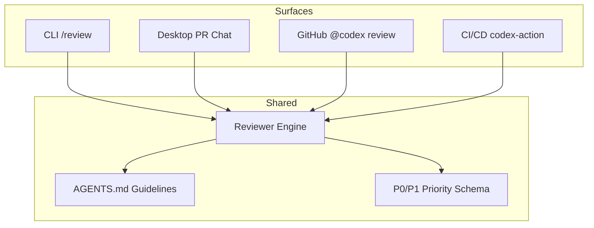
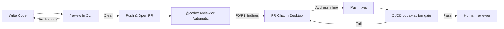

# Four Surfaces, One Reviewer: How Codex Unifies Code Review Across CLI, Desktop, GitHub, and CI/CD


---

Code review tooling has historically been bolted onto one surface at a time — a linter in CI, a bot on pull requests, a keyboard shortcut in the IDE. Codex has taken a different approach. As of the 26.707 ChatGPT Desktop release on 9 July 2026 [^1], the platform now provides a coherent review experience across four distinct surfaces: the terminal `/review` command, the desktop PR Chat pane, the GitHub cloud `@codex review` trigger, and the `codex-action` CI/CD integration. Each surface addresses a different stage of the development lifecycle, yet all share the same reviewer engine, the same `AGENTS.md` guidelines, and the same priority schema.

This article maps those four surfaces, explains how they interconnect, and shows the configuration that makes them useful in practice.

## The Four Review Surfaces



Each surface targets a specific moment in the commit-to-merge pipeline:

| Surface | Trigger | Scope | When to use |
|---------|---------|-------|-------------|
| CLI `/review` | Manual — type `/review` in terminal | Local diff, staged changes, specific commit, or branch delta | Before you commit |
| Desktop PR Chat | Automatic when on a PR branch with GitHub access | Full PR diff with reviewer comments | During interactive review |
| GitHub Cloud | `@codex review` comment or automatic on PR open | Full PR diff | Asynchronous review after push |
| CI/CD | `codex-action` in GitHub Actions workflow | PR diff in pipeline context | Automated gate before merge |

### 1. CLI `/review` — The Pre-Commit Gate

The `/review` command in the terminal is the earliest review surface. It runs as a read-only sub-turn — it never writes to your working tree [^2]. When you type `/review`, Codex presents four preset scopes:

- **Review against a base branch** — compares the current branch with a selected base
- **Review uncommitted changes** — analyses the working tree
- **Review a commit** — examines a specific changeset
- **Custom review instructions** — focuses on criteria you specify

Findings appear as a separate turn in the transcript, so you can track review iterations within the same conversation [^2]. This makes `/review` particularly useful as a sanity check before `git commit` — catching issues while context is fresh and the cost of correction is lowest.

### 2. Desktop PR Chat — The Interactive Review Pane

PR Chat, shipped in the 26.707 ChatGPT Desktop release [^1], brings GitHub pull request context directly into the desktop app sidebar. When your project is checked out on the PR branch and Codex has GitHub access (via the integration settings or an active `gh` session), the sidebar displays:

- Reviewer comments alongside the diff
- Changed files with inline annotations
- The ability to accept, reject, or edit proposed patches without leaving the app [^3]

The key advantage over a web-based review is conversational context. You can point Codex at a specific inline comment and ask it to address the issue in the current thread. Because comments are line-specific, the agent responds more precisely than it would to a general instruction like "fix the review feedback" [^3].

After leaving inline comments, a follow-up message such as "Address the inline comments and keep the scope minimal" triggers Codex to work through them systematically [^3].

### 3. GitHub Cloud — The Asynchronous Reviewer

For pull requests already on GitHub, commenting `@codex review` triggers a cloud-based review. Codex reacts with 👀, creates a cloud task, reads the entire PR including dependencies and tests, and posts a standard GitHub code review with inline comments [^4].

If you want every PR reviewed without manual triggers, turn on **Automatic reviews** in your Codex settings. Codex will post a review whenever someone opens a new PR, without needing the `@codex review` comment [^4].

On GitHub, Codex limits findings to P0 and P1 severity only [^4], keeping review noise low:

- **P0** — Blocking: security regressions, auth bypass, data loss
- **P1** — Needs fixing: performance problems, concurrency bugs, logging sensitive data

After Codex posts findings, you can request fixes directly: `@codex fix the P1 issue`. This initiates a cloud chat session with PR context, and Codex pushes corrections when permissions allow [^4].

### 4. CI/CD — The Automated Gate

The `codex-action` GitHub Action integrates Codex review into your pipeline [^5]. This surface operates identically to the cloud reviewer but runs as part of your CI workflow, making it suitable as a merge gate. Combined with branch protection rules, it ensures every PR receives at least one automated review pass before human reviewers see it.

## The Shared Configuration Layer

All four surfaces share three configuration mechanisms that keep reviews consistent regardless of where they run.

### AGENTS.md Review Guidelines

Codex searches your repository for `AGENTS.md` files and follows any `## Review guidelines` section it finds [^4]. The closest `AGENTS.md` to each changed file wins, enabling hierarchical rule sets:

```markdown
<!-- Root AGENTS.md -->
## Review guidelines
- Never log PII.
- Verify that authentication middleware wraps every route.

<!-- packages/payments/AGENTS.md -->
## Review guidelines
- All monetary calculations must use decimal types, never floating point.
- Stripe webhook handlers must verify signatures before processing.
```

Keep guidelines focused — one or two targeted risks per file. Broad guidelines like "write clean code" produce generic findings; specific constraints like "auth bypass" and "PII logging" produce actionable ones [^4].

### The `review_model` Override

The `review_model` key in `config.toml` decouples your review model from your session model [^6]. This matters because review benefits from higher reasoning effort — you want thoroughness, not speed:

```toml
# ~/.codex/config.toml
model = "gpt-5.6-terra"           # fast session default
review_model = "gpt-5.6-sol"     # thorough review override
```

This configuration applies to both the CLI `/review` command and the desktop review pane. The GitHub cloud reviewer and CI/CD surface use the model configured in your Codex cloud settings.

### Named Profiles for Deep Review

Named profiles let you create a dedicated review configuration that ramps up reasoning effort for security-sensitive or architecture-critical reviews [^6]:

```toml
# ~/.codex/config.toml
[profile.deep-review]
model = "gpt-5.6-sol"
model_reasoning_effort = "xhigh"
approval_policy = "never"
```

Invoke with `codex --profile deep-review`, then run `/review`. The `xhigh` reasoning effort instructs the model to spend substantially more compute per finding — appropriate for security audits and cross-cutting correctness analysis, but too slow for routine commit reviews [^6].

## The Review Pane's Git Awareness

The desktop review pane reflects the state of your Git repository, not just what Codex edited [^7]. It displays:

- **Unstaged** — working tree modifications
- **Staged** — changes in the index
- **Commit** — specific commit changesets
- **Branch** — full branch delta against base
- **Last turn** — only what the assistant changed in the most recent interaction

This distinction matters because it means you can review your own manual changes through the same interface, not just agent-generated code. The review pane requires a Git repository — non-Git projects receive a prompt to initialise one first [^7].

## The Structured Findings Schema

Across all surfaces, review findings follow a consistent JSON schema [^2] that includes:

| Field | Purpose |
|-------|---------|
| `title` | One-line summary of the finding |
| `body` | Detailed explanation with context |
| `confidence_score` | Model's confidence in the finding (0–1) |
| `priority` | 0–3, where 0 is blocking and 3 is informational |
| `code_location` | File path, line range, and function context |

The priority mapping to P0–P3 aligns with the GitHub surface's P0/P1 filter — on GitHub, priorities 2 and 3 are suppressed to reduce noise. On the CLI and desktop surfaces, all priorities are shown, giving you full visibility during local development.

## Practical Workflow: Layered Review

The four surfaces compose naturally into a layered review pipeline:



1. **Before commit** — `/review` in the terminal catches issues while you still have full context. Fix locally; re-run `/review` until clean.
2. **After push** — GitHub cloud review or automatic reviews catch issues visible only in the full PR context (cross-file dependencies, test coverage gaps).
3. **During iteration** — PR Chat in the desktop app lets you work through reviewer feedback conversationally, with the agent addressing inline comments precisely.
4. **Before merge** — the CI/CD gate ensures nothing slips through, providing an auditable review record in the pipeline logs.

Each layer catches different classes of issues. The CLI catches local mistakes cheaply. The cloud reviewer sees the full repository context. PR Chat adds human-agent collaboration. The CI/CD gate provides the compliance record.

## What This Means for Teams

The unified review architecture shifts code review from a single bottleneck (the human reviewer staring at a PR diff on GitHub) to a distributed, multi-stage process. Several implications follow:

**Review model economics.** The `review_model` override means teams can use a cost-effective model like Terra for interactive sessions while routing reviews through Sol for thoroughness [^6]. The cost of a Sol-powered review on a typical PR is a fraction of the cost of a senior engineer's review time.

**AGENTS.md as institutional knowledge.** Review guidelines in `AGENTS.md` encode team-specific standards that every surface respects [^4]. This is institutional knowledge that survives team member turnover and applies consistently whether the review runs in a developer's terminal or in CI.

**The P0/P1 filter as noise control.** By restricting GitHub-surface findings to P0 and P1, Codex avoids the "boy who cried wolf" problem that plagues over-eager automated reviewers [^4]. Lower-priority findings remain available on the CLI and desktop surfaces where developers have more context to evaluate them.

**PR Chat as the review conversation.** The PR Chat pane in the desktop app [^1] represents a shift in how developers interact with review feedback. Instead of context-switching between a GitHub PR page and an editor, the review conversation happens alongside the code, with the agent available to explain findings, suggest fixes, and iterate on solutions.

## Conclusion

Codex's four-surface review architecture is less about any single feature — `/review`, PR Chat, `@codex review`, or `codex-action` — and more about the consistency between them. The same reviewer engine, the same `AGENTS.md` guidelines, and the same priority schema operate regardless of where you trigger a review. The `review_model` override and named profiles give you control over the cost-thoroughness trade-off. And the layered workflow means issues are caught early and cheaply, with each subsequent surface providing additional context and coverage.

The practical takeaway: configure your `review_model`, write focused `AGENTS.md` review guidelines, and use all four surfaces. The cost of an automated review pass is measured in tokens; the cost of a missed P0 in production is measured in something considerably more expensive.

---

## Citations

[^1]: OpenAI, "Codex joins the ChatGPT desktop app 26.707," *Codex Changelog*, 17 July 2026. [https://developers.openai.com/codex/changelog](https://developers.openai.com/codex/changelog)

[^2]: OpenAI, "Code review — ChatGPT Learn," *OpenAI Developer Documentation*, 2026. [https://learn.chatgpt.com/docs/code-review](https://learn.chatgpt.com/docs/code-review)

[^3]: OpenAI, "Review GitHub pull requests — ChatGPT Use Cases," *OpenAI Developer Documentation*, 2026. [https://developers.openai.com/codex/use-cases/github-code-reviews](https://developers.openai.com/codex/use-cases/github-code-reviews)

[^4]: OpenAI, "Codex code review in GitHub — ChatGPT Learn," *OpenAI Developer Documentation*, 2026. [https://learn.chatgpt.com/docs/third-party/github](https://learn.chatgpt.com/docs/third-party/github)

[^5]: OpenAI, "codex-action — GitHub Actions for Codex," *GitHub*, 2026. [https://github.com/openai/codex-action](https://github.com/openai/codex-action)

[^6]: OpenAI, "Advanced Configuration — ChatGPT Learn," *OpenAI Developer Documentation*, 2026. [https://learn.chatgpt.com/docs/config-file/config-advanced](https://learn.chatgpt.com/docs/config-file/config-advanced)

[^7]: OpenAI, "Code review — ChatGPT Learn (App surface)," *OpenAI Developer Documentation*, 2026. [https://learn.chatgpt.com/docs/code-review?surface=app](https://learn.chatgpt.com/docs/code-review?surface=app)
