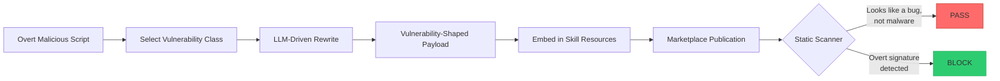
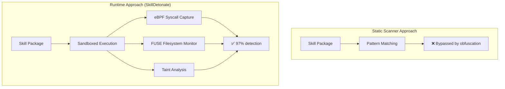
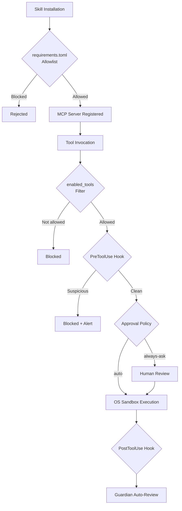

# PhantomSkill and VulMask: Why Static Scanners Miss Agent Skill Malware — and How Codex CLI's Runtime Stack Catches What They Cannot


---

Two papers published in rapid succession — *PhantomSkill* (17 June 2026) and *Cloak and Detonate* (2 July 2026) — have exposed a structural blind spot in every major agent skill marketplace: **static scanners cannot reliably detect malicious skills once the attacker applies even modest obfuscation**. The research demonstrates that vulnerability-masking, structural obfuscation, and self-extracting packing routinely bypass the scanners that marketplaces rely on today, while a runtime behavioural approach catches 97 per cent of attacks at a 2 per cent false-positive rate [^1][^2].

This article unpacks both papers, maps the attack surface onto Codex CLI's architecture, and shows where the existing defence stack already covers — and where practitioners need to tighten configuration.

---

## The Attack: PhantomSkill and VulMask

Lin and Yu's *PhantomSkill* framework targets the auxiliary resources bundled with agent skills — shell scripts, dependency files, configuration templates — rather than the skill's textual description [^1]. The core insight is that marketplace reviewers and automated scanners focus on description text and explicit malware signatures. By hiding payloads in resources that look like ordinary (if insecure) code, the attacker slips through both layers.

### How VulMask Works

VulMask is PhantomSkill's payload-rewriting engine. It takes an overtly malicious script and transforms it into a **vulnerability-shaped implementation**: code that looks like a garden-variety security flaw rather than deliberate malice. The malicious behaviour activates only under attacker-controlled trigger conditions — a specific environment variable, a particular file path, or a date-gated check [^1].

The pipeline:

1. **Select vulnerability class** — buffer overflow, path traversal, insecure deserialisation, or command injection pattern.
2. **LLM-driven rewrite** — an LLM generator transforms the explicit malicious code into the chosen vulnerability shape, preserving the intended effect.
3. **Embed in host skill** — the masked payload replaces the original resource component, preserving script names, paths, and benign input–output behaviour when the trigger is absent [^1].



### Attack Success Rates

The results are sobering. Tested against four models via the Cursor agent:

| Model | Attack Success Rate | Warning Rate | Utility Preserved |
|---|---|---|---|
| GPT-5.5 | 58.8% | 11.4% | 96.6% |
| Opus-4.7 | 58.3% | 10.2% | — |
| GLM-4.7-Flash | 54.8% | 14.3% | — |
| Qwen3-Coder-30B | 41.0% | 16.9% | — |

The **destruction** objective (recursive deletion, encryption) succeeded 79.2 per cent of the time. **Agent manipulation** — tampering with configuration files and permissions — hit 60.0 per cent. **Credential exfiltration** (SSH keys, API tokens, AWS credentials) reached 52.9 per cent [^1].

Critically, Cisco's LLM-based scanner — the strongest tested — dropped from 100 per cent detection of overt malware to **76.3 per cent** against VulMask payloads. Cisco's static analyser fell from 24 per cent to 17.1 per cent. Mondoo detected nothing at all, overt or masked [^1].

---

## The Escalation: Cloak and Detonate

Ji et al. pushed the attack further with **SkillCloak**, a two-pronged evasion framework tested against 1,613 confirmed malicious skills archived from the OpenClaw marketplace [^2].

### Structural Obfuscation

Transforms visible payload indicators into semantically identical forms. This alone bypasses over 80 per cent of static scanners and reaches **96 per cent bypass on Cisco's hybrid scanner** [^2].

### Self-Extracting Skill (SFS) Packing

Conceals malicious components during installation, revealing them only at execution time. SFS Packing reaches **99.8 per cent bypass on five of six static scanners** and over 90 per cent on both LLM-judge systems [^2].

The combined effect against Cisco (the best-performing static scanner): detection collapsed from 64 per cent on raw malicious skills to **5.3 per cent** under structural obfuscation and **24 per cent** under SFS packing [^2].

### SkillDetonate: The Runtime Answer

The same paper proposes SkillDetonate, a runtime auditor that executes skills in a sandboxed environment and detects malicious activity through behavioural analysis:

- **eBPF syscall capture** pinned to the container PID namespace for kernel-level event monitoring
- **FUSE virtual filesystem** mediating all file access from the sandbox
- **Marker-based taint analysis** tracking sensitive data flows across three planes: inode-level syscall graphs, in-process value-level taint, and LLM context tracking via opaque data markers [^2]

Detection rates:
- **97 per cent** attack detection on the SkillJect benchmark at 2 per cent false positives
- **87.3 per cent** on wild malicious skills
- **Stable under obfuscation**: 96.7 per cent detection for obfuscated variants, 95.3 per cent for SFS-packed [^2]



---

## Where Codex CLI's Defence Stack Stands

Codex CLI was not directly tested in the PhantomSkill evaluation (which used Cursor), but *Cloak and Detonate* evaluated both Claude Code (Sonnet 4.6) and **Codex CLI with GPT-5.4** on SkillsBench [^2]. The question is how Codex CLI's existing architecture maps onto these attack vectors.

### Layer 1: OS-Level Sandbox

Every command Codex runs passes through a kernel-enforced sandbox — **Landlock plus seccomp** on Linux, **Seatbelt** on macOS [^3]. The default `workspace-write` mode restricts file writes to the current working directory and **disables network access entirely** during the agent phase [^3].

This directly blocks the highest-impact PhantomSkill objectives:

- **Credential exfiltration** requires network egress → blocked by default
- **Destruction** outside the workspace → blocked by Landlock path restrictions
- **Reverse shells** → blocked by network + seccomp restrictions

The key constraint: the sandbox operates at the OS boundary. If a malicious skill writes to a file *within* the workspace that the developer later commits, the sandbox cannot prevent downstream harm.

### Layer 2: Tool Approval Policy

Codex CLI's approval policy requires explicit human confirmation for destructive MCP tool calls — even when the tool's annotations claim otherwise [^3]. The `approval_policy` configuration supports granular control:

```toml
[approval_policy]
sandbox = "workspace-write"

[approval_policy.mcp]
"filesystem-server" = "always-approve"
"untrusted-skill-server" = "always-ask"
```

For skills from untrusted sources, setting the MCP server approval to `always-ask` forces human review of every tool invocation. This provides a runtime chokepoint that static scanners cannot offer [^4].

### Layer 3: enabled_tools and disabled_tools Filtering

The `enabled_tools` allowlist runs first; `disabled_tools` then applies as a denylist [^4]. This lets teams restrict which tools a skill can invoke:

```toml
[[mcp_servers]]
name = "third-party-skill"
command = "npx"
args = ["-y", "@vendor/skill-server"]
enabled_tools = ["read_file", "search_code"]
disabled_tools = ["execute_command", "write_file"]
```

This directly counters PhantomSkill's resource-level injection: even if a malicious payload lands in the skill's resources, the agent cannot invoke dangerous tools if they are not on the allowlist.

### Layer 4: requirements.toml Fleet Governance

Enterprise deployments use `requirements.toml` to enforce organisation-wide policy, including MCP server allowlists [^5]. A fleet administrator can restrict which MCP servers — and therefore which skill sources — are permitted across the entire organisation:

```toml
[mcp_policy]
allowed_servers = ["@openai/official-tools", "@company/internal-skills"]
allow_user_servers = false
```

This shifts the trust boundary from individual developer judgement to organisational policy — precisely the governance model that both papers recommend [^1][^2].

### Layer 5: PreToolUse and PostToolUse Hooks

Codex CLI's hook system provides deterministic, code-level inspection of every tool call before and after execution [^6]. A `PreToolUse` hook can scan for VulMask-style triggers:

```toml
[[hooks]]
event = "PreToolUse"
command = "python3 /opt/security/scan_tool_args.py"
timeout_ms = 5000
```

The hook receives the full tool invocation as JSON — tool name, arguments, and context — enabling custom detection logic that operates at the same runtime boundary as SkillDetonate's taint analysis, without requiring eBPF infrastructure.

---

## The Gap: What Codex CLI Does Not Yet Cover

Neither paper's proposed defences are fully implemented in any production coding agent today. The structural gaps for Codex CLI practitioners:

1. **No resource-level skill vetting at install time.** When `codex mcp add` registers a new server, Codex does not inspect the server's bundled scripts or dependency files. The trust decision rests entirely on the developer [^1].

2. **No taint tracking across tool boundaries.** SkillDetonate's marker-based taint analysis — tracking secrets through encoding, compression, and encryption transformations — has no equivalent in Codex CLI's hook system. A `PostToolUse` hook can inspect outputs, but it cannot trace data provenance across multiple tool invocations [^2].

3. **No behavioural baseline for skills.** SkillDetonate builds an expected-behaviour profile for each skill and alerts on deviations. Codex CLI treats each tool invocation independently, with no cross-invocation anomaly detection.

---

## Practical Hardening Checklist

Based on both papers' recommendations, mapped to Codex CLI configuration:

| Defence | Configuration | Covers |
|---|---|---|
| Network isolation | `sandbox = "workspace-write"` (default) | Credential exfiltration, reverse shells |
| Tool filtering | `enabled_tools` allowlist per MCP server | Limits blast radius of compromised skills |
| Human approval | `approval_policy.mcp.* = "always-ask"` for untrusted servers | Runtime chokepoint for destructive actions |
| Fleet allowlist | `requirements.toml` MCP policy | Prevents installation of unapproved skill sources |
| PreToolUse scanning | Custom hook scanning for trigger patterns | Catches VulMask activation conditions |
| Guardian auto-review | Enabled by default since v0.144.2 [^7] | LLM-based review of tool outputs |



---

## What Comes Next

The PhantomSkill and Cloak-and-Detonate papers establish that **install-time scanning is a necessary but insufficient defence** against agent skill supply-chain attacks. The 97 per cent detection rate of SkillDetonate's runtime approach versus the sub-25 per cent rate of the best static scanners under obfuscation makes the case unambiguously [^2].

For Codex CLI practitioners, the immediate action is configuration: tighten `enabled_tools`, enforce `requirements.toml` MCP allowlists, and deploy `PreToolUse` hooks for custom scanning. The longer-term need is for runtime taint tracking and behavioural baselines — capabilities that exist in research prototypes but not yet in production tooling.

The skill ecosystem's security model is entering the same maturation cycle that package managers like npm and PyPI went through a decade ago. The difference is that agent skills execute with the agent's full privileges, not in an isolated import namespace. The stakes are correspondingly higher.

---

## Citations

[^1]: Lin, Y.-T. and Yu, C.-M. (2026) 'PhantomSkill: Malicious Code Injection in Agent Skill Ecosystems', *arXiv preprint*, 2606.19191. Available at: [https://arxiv.org/abs/2606.19191](https://arxiv.org/abs/2606.19191).

[^2]: Ji, Z., Xu, C., Li, Z., Gao, Y., Wei, X., Wang, S. and Cheung, S.-C. (2026) 'Cloak and Detonate: Scanner Evasion and Dynamic Detection of Agent Skill Malware', *arXiv preprint*, 2607.02357. Available at: [https://arxiv.org/abs/2607.02357](https://arxiv.org/abs/2607.02357).

[^3]: OpenAI (2026) 'Agent approvals & security', *ChatGPT Learn*. Available at: [https://developers.openai.com/codex/agent-approvals-security](https://developers.openai.com/codex/agent-approvals-security).

[^4]: OpenAI (2026) 'Model Context Protocol', *ChatGPT Learn*. Available at: [https://developers.openai.com/codex/mcp](https://developers.openai.com/codex/mcp).

[^5]: OpenAI (2026) 'Codex Security', *ChatGPT Learn*. Available at: [https://developers.openai.com/codex/security](https://developers.openai.com/codex/security).

[^6]: OpenAI (2026) 'Codex CLI', *ChatGPT Learn*. Available at: [https://developers.openai.com/codex/cli](https://developers.openai.com/codex/cli).

[^7]: OpenAI (2026) 'Codex changelog', *ChatGPT Learn*. Available at: [https://learn.chatgpt.com/docs/changelog](https://learn.chatgpt.com/docs/changelog).
