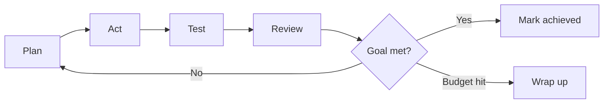
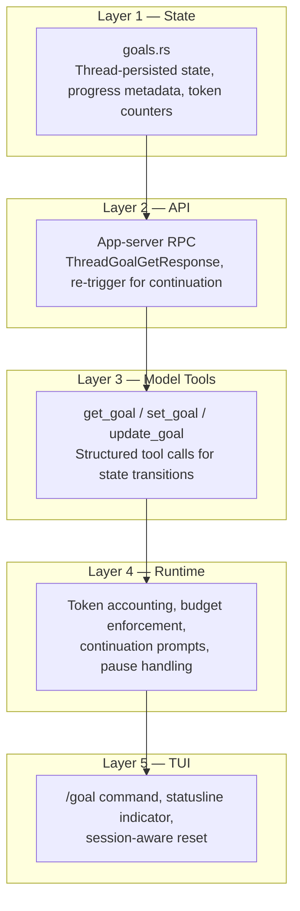

# Goal Mode: How Codex CLI Turns a Single Objective into Hours of Autonomous Work


---

Every coding agent can follow instructions for a single turn. The harder problem — and the one that separates a fancy autocomplete from a genuine autonomous colleague — is sustaining coherent work across hundreds of turns, surviving process restarts, and knowing when to stop. Codex CLI's `/goal` command addresses exactly this. Shipped experimentally in v0.128.0 [^1], promoted to default-on in v0.133.0 [^2], and refined through v0.145.0 [^3], goal mode transforms the agent from a stateless responder into a persistent executor that plans, acts, tests, observes, and iterates until the objective is met or the token budget runs dry.

This article dissects the architecture, lifecycle, configuration, and practical failure modes of goal mode as it stands in July 2026.

## The Ralph Loop

The execution pattern underpinning goal mode is colloquially known as the *Ralph loop* — a term popularised by early adopters who ran unattended sessions overnight [^4]. The agent cycles through five phases:



Unlike a simple retry loop, each iteration is informed by the cumulative context of prior turns. The agent decomposes the objective into testable deliverables during the *Plan* phase (steered by an internal `continuation.md` prompt template [^1]), executes file writes and shell commands during *Act*, validates results in *Test*, and self-assesses in *Review* before deciding whether to continue, escalate, or declare completion.

## Lifecycle States

Goal state transitions are enforced through structured `update_goal` tool calls — not free-text output — giving the runtime deterministic control over the lifecycle [^1]:

| State | Meaning |
|-------|---------|
| `pursuing` | Active work; the agent is cycling through the Ralph loop |
| `paused` | Suspended by the user or by `--resume` semantics; context preserved |
| `achieved` | The agent has self-assessed the objective as met |
| `unmet` | Blocked by an external constraint the agent cannot resolve |
| `budget_limited` | Token allocation exhausted; wrap-up steering injected |

Since v0.133.0, paused goals remain paused after `codex --resume` unless the user explicitly opts back in [^2]. This prevents accidental reactivation of expensive long-running goals when resuming a session for unrelated work.

## Slash Commands

The TUI surface is deliberately minimal:

```bash
/goal "Migrate from Pydantic v1 to v2 and ensure all tests pass"
/goal              # View current objective and status
/goal pause        # Suspend; preserve audit context
/goal resume       # Reactivate from preserved state
/goal clear        # Delete the goal; revert to single-turn mode
```

All state mutations flow through the app-server's JSON-RPC endpoints (`thread/goal/set`, `thread/goal/get`, `thread/goal/clear`), with `thread/goal/updated` and `thread/goal/cleared` notifications keeping the TUI in sync [^1].

## Configuration

### Enabling Goal Mode

Since v0.133.0, goals are enabled by default [^2]. On older versions, enable explicitly in `~/.codex/config.toml`:

```toml
[features]
goals = true
```

A terminal restart is required after toggling the flag. On versions between v0.129.0 and v0.132.x, goals can also be enabled from the `/experimental` picker in the TUI [^5].

### Token Budgets

Token budgets are advisory — they trigger wrap-up steering rather than hard-killing the session. When the budget is hit, the runtime injects a `budget_limit.md` prompt template carrying token-state variables, and the agent produces a progress summary before stopping [^1].

Recommended budget ranges by task scope:

| Scope | Budget |
|-------|--------|
| Small single-module fix | 100k–500k tokens |
| Medium multi-file refactor | 500k–2M tokens |
| Large migration or upgrade | 2M–10M tokens |

⚠️ There is currently no hard billing-level cap per goal. Plan-level spending limits on your ChatGPT subscription provide only secondary protection [^6]. Monitor costs actively during multi-hour runs.

## Internal Architecture

Goal mode was built across a five-layer PR series [^7]:



The constrained tool surface is a deliberate design choice. The model can read the goal (`get_goal`), create one when none exists (`create_goal`), and update status with mandatory reasoning (`update_goal`). It cannot pause, resume, clear, or adjust budgets — those controls remain exclusively with the user [^1].

## Cross-Session Persistence

Goal state is persisted in the thread store via the app-server API layer. This means:

- Closing the terminal does not kill the goal.
- `codex --resume` restores the goal in its last known state.
- Rebooting the machine and resuming later continues from where the agent left off.

This is a meaningful architectural difference from Claude Code, which operates within single active sessions and has no native equivalent to `/goal pause` or `/goal resume` [^8]. Codex CLI's persistence model makes it viable for multi-day objectives — the kind of work where you start a migration on Monday, review progress Tuesday morning, and clear the goal on Wednesday.

## Practical Patterns

### The Overnight Refactor

The canonical use case. Define a well-scoped goal before leaving for the evening:

```bash
/goal "Convert all JavaScript files in src/ to TypeScript, add strict type annotations, and ensure npm test passes with zero errors"
```

Set a budget ceiling proportional to the codebase size, ensure your sandbox policy is in `suggest` or `auto-edit` mode for the relevant paths, and let the Ralph loop iterate overnight. Andrew Chen's 14-hour device driver session demonstrated that this pattern can sustain over 1,000 sequential tool calls without intervention [^4].

### Meta-Prompting for Goal Definition

Vague objectives are the primary failure mode. "Make this codebase better" will produce confident drift through unrelated files for hours [^4]. The recommended pattern is to use a separate model (or even a different Codex session) to generate a candidate `/goal` prompt with:

1. A specific, verifiable output state
2. Clear terminal-state detection criteria
3. Bounded scope
4. Success criteria the agent can autonomously validate

### Multi-Agent Goals

With Multi-Agent V2 stabilised in v0.145.0 [^3], goal mode composes with sub-agents. A parent goal can spawn parallel workers, each pursuing a sub-objective, with the parent agent coordinating completion across threads. Configurable sub-agent models and reasoning levels allow cost-aware delegation — use a cheaper model for boilerplate migration sub-tasks and reserve the primary model for architectural decisions.

## Known Limitations

1. **Mid-turn compaction drift** (Issue #19910): continuation prompts may be dropped after context compaction in long sessions, causing the agent to lose sight of the original objective [^1].

2. **No real-time dashboard**: monitoring a 14-hour run means periodically checking the TUI or relying on `action-required` terminal title changes [^4]. There is no web dashboard or push notification system.

3. **Budget is advisory only**: a sufficiently fast model can overshoot the budget before the wrap-up template is injected. Always set plan-level spending limits as a safety net.

4. **Authentication constraint**: goal mode requires ChatGPT subscription authentication via `codex login`. API keys alone cannot enable `/goal` because persistent goal storage is tied to the subscription system's thread infrastructure [^6].

5. **No goal-level audit trail**: while the thread history captures every tool call, there is no dedicated goal-progress log that summarises what was attempted versus what succeeded across turns.

## When Not to Use Goal Mode

Goal mode is not a substitute for clear thinking. If you cannot articulate verifiable acceptance criteria, the agent cannot either. Exploratory coding, prototyping, and design-phase work are better served by interactive single-turn sessions where the human provides course correction at each step.

Similarly, security-sensitive operations — anything involving credentials, production databases, or infrastructure changes — should not be left to an unsupervised multi-hour loop regardless of sandbox configuration.

## Version Timeline

| Version | Date | Goals Change |
|---------|------|-------------|
| v0.122.0-alpha | April 2026 | Initial goal state plumbing behind feature flag [^7] |
| v0.128.0 | 30 April 2026 | `/goal` command shipped experimentally [^1] |
| v0.129.0 | May 2026 | Discoverable from `/experimental` picker; paused goals stay paused on resume [^5] |
| v0.133.0 | June 2026 | Enabled by default; dedicated storage; progress tracking across turns [^2] |
| v0.145.0 | 21 July 2026 | Multi-day duration output; clearer validation; Multi-Agent V2 composition [^3] |

## Conclusion

Goal mode represents a genuine architectural shift in how coding agents relate to time. By persisting objectives across sessions, enforcing lifecycle state transitions through structured tool calls, and wrapping budget exhaustion in graceful degradation rather than hard failure, Codex CLI has built the plumbing for autonomous work that lasts hours or days rather than minutes. The Ralph loop is not magic — it is a well-instrumented iteration cycle with a persistent state machine underneath.

The feature is still maturing: compaction drift, missing dashboards, and advisory-only budgets are real limitations. But for well-scoped, verifiable objectives — migrations, test suite expansion, large-scale refactoring — goal mode already delivers on the promise of "set it and come back tomorrow."

## Citations

[^1]: Codex CLI /goal: Persisted Long-Horizon Workflows with Pause, Resume, and Token Budgets — Codex Knowledge Base, May 2026. [https://codex.danielvaughan.com/2026/05/07/codex-cli-goal-command-persisted-long-horizon-workflows-pause-resume-budget/](https://codex.danielvaughan.com/2026/05/07/codex-cli-goal-command-persisted-long-horizon-workflows-pause-resume-budget/)

[^2]: Codex CLI v0.133.0 Release — Goals enabled by default, dedicated storage, progress tracking. [https://x.com/CodexReleases/status/2057504874191822981](https://x.com/CodexReleases/status/2057504874191822981)

[^3]: Codex CLI v0.145.0 Release Notes — GitHub Releases. [https://github.com/openai/codex/releases](https://github.com/openai/codex/releases)

[^4]: Codex /goal: OpenAI's 'Ralph Loop' Feature That Ran a Device Driver Project for 14 Hours Without Stopping — MindStudio. [https://www.mindstudio.ai/blog/codex-goal-ralph-loop-14-hour-autonomous-task](https://www.mindstudio.ai/blog/codex-goal-ralph-loop-14-hour-autonomous-task)

[^5]: Codex /goal: What It Does, How to Use It, and Why It May Be Missing — LaoZhang AI Blog. [https://blog.laozhang.ai/en/posts/codex-goal](https://blog.laozhang.ai/en/posts/codex-goal)

[^6]: In-depth Analysis of Codex Goal Mode: 5 Steps to Enable Autonomous Tasks — Apiyi.com. [https://help.apiyi.com/en/codex-goal-mode-autonomous-task-guide-en.html](https://help.apiyi.com/en/codex-goal-mode-autonomous-task-guide-en.html)

[^7]: Goal Mode: Persistent Objectives with Token Budgets and Autonomous Continuation — Codex Knowledge Base, April 2026. [https://codex.danielvaughan.com/2026/04/16/codex-cli-goal-mode-persistent-objectives-token-budgets/](https://codex.danielvaughan.com/2026/04/16/codex-cli-goal-mode-persistent-objectives-token-budgets/)

[^8]: OpenAI Just Added /goal to Codex CLI: How It Compares to Claude Code Agents — DevToolPicks. [https://devtoolpicks.com/blog/codex-goal-command-vs-claude-code-agents-2026](https://devtoolpicks.com/blog/codex-goal-command-vs-claude-code-agents-2026)
