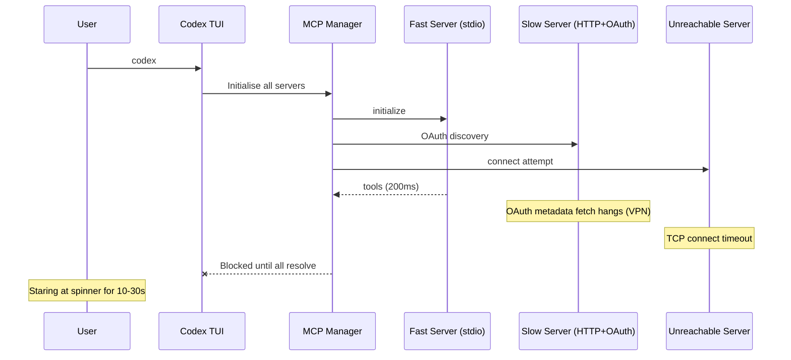
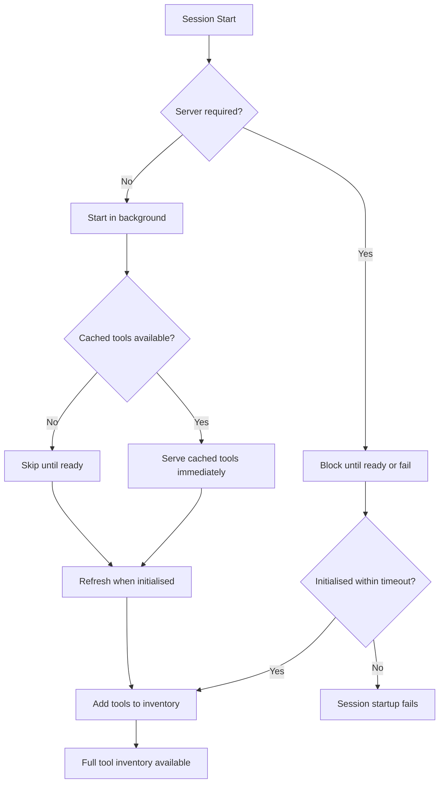

# The MCP Cold-Start Problem: How Codex CLI v0.145 Stopped Optional Servers from Holding Your Session Hostage


---

Every developer who has configured more than two MCP servers in Codex CLI has experienced the same ritual: type `codex`, wait, stare at "Starting MCP servers (2/5)…", wonder whether the VPN dropped, consider killing the process, and eventually land in a session twenty seconds later. The MCP cold-start problem has been one of the most persistent quality-of-life complaints since MCP support shipped, generating at least five significant GitHub issues between March and July 2026[^1][^2][^3][^4][^5]. With v0.145.0, released on 21 July 2026[^6], OpenAI shipped a set of reliability fixes that fundamentally change how Codex manages MCP server lifecycles at startup.

## Why MCP Servers Block Startup

To understand the fix, you first need to understand the architectural decision that created the problem. Codex CLI's agent loop requires a **global tool inventory** before it can construct the first turn's system prompt. Every registered MCP server contributes tools to this inventory. The original design treated MCP initialisation as a prerequisite — the TUI would not render a prompt, and slash commands would remain unavailable, until every configured server had either completed initialisation or timed out[^2].

This is fine when you have one local stdio server that boots in 200 ms. It becomes painful when you have six servers, some behind OAuth, some fetching npm packages via `npx -y`, and one behind a corporate VPN that may or may not be connected.



A documented case showed six configured servers each requiring 1.78–5.03 seconds to initialise concurrently, exposing 156+ tools while still blocking the first user interaction[^2]. Users with previously authenticated OAuth servers discovered an even worse behaviour: the `startup_timeout_sec` parameter only covered the MCP `initialize` handshake, not the pre-initialise OAuth metadata discovery that Codex performs when saved tokens exist[^3].

## The Five-PR Fix in v0.145.0

The v0.145.0 release addressed MCP startup reliability through five pull requests: #32229, #32781, #32825, #33184, and #33297[^6]. Together, they implement three key architectural changes.

### 1. Non-Blocking Tool Listing

The `McpConnectionManager::list_all_tools()` method previously waited on every pending MCP client. The fix modifies `listed_tools()` to skip clients that are still initialising and have no cached startup tools[^1]. Cached tools from previous sessions remain available immediately; the full tool list refreshes once all servers complete initialisation.

This means the TUI renders immediately, the first turn can proceed with whatever tools are already available, and slow servers contribute their tools to the inventory as they come online — without blocking the conversation.

### 2. OAuth Timeout Coverage

The `startup_timeout_sec` parameter now covers the complete startup path, including OAuth metadata discovery[^3]. Previously, when Codex detected saved OAuth credentials, it issued a `GET /.well-known/oauth-authorization-server/mcp` request *before* the `initialize` message — and this request was not subject to any timeout. If the OAuth provider was unreachable (common when toggling VPN), the session would hang indefinitely despite a configured `startup_timeout_sec = 3`.

The fix wraps the entire pre-initialise OAuth bootstrap in the same timeout envelope as the `initialize` handshake, with actionable error reporting when the timeout fires.

### 3. Serialised OAuth Refreshes and Tool Catalog Reuse

When multiple HTTP-based MCP servers share the same OAuth provider, simultaneous token refresh operations could create race conditions — multiple concurrent refresh requests hitting the same token endpoint, some receiving stale tokens. The fix serialises OAuth refresh operations per provider and reuses the refreshed token across all servers sharing that provider[^6].

Tool catalogs are now cached and reused across reconnections when the server's tool list has not changed, eliminating redundant `tools/list` round-trips on session resume.

## Configuration for Production MCP Setups

These fixes change best practice for MCP configuration. Here is a production-ready pattern for a mixed server fleet:

```toml
# ~/.codex/config.toml

# Critical server — blocks startup if unavailable
[mcp_servers.postgres]
command = "npx"
args = ["-y", "@modelcontextprotocol/server-postgres"]
env = { DATABASE_URL = "postgresql://localhost:5432/mydb" }
startup_timeout_sec = 15
required = true

# OAuth server behind VPN — now gracefully degrades
[mcp_servers.gitlab]
url = "https://gitlab.corp.example.com/mcp"
auth = "oauth"
startup_timeout_sec = 5
required = false
tool_timeout_sec = 120

# Fast local server — no special handling needed
[mcp_servers.filesystem]
command = "npx"
args = ["-y", "@modelcontextprotocol/server-filesystem", "/workspace"]
startup_timeout_sec = 10
```

### Key Configuration Decisions

**`required = true` vs `required = false`**: The `required` flag determines whether a server failure blocks the session entirely[^7]. Set it to `true` only for servers whose tools are genuinely essential — a database server for a database-heavy workflow, for example. Leave it `false` (the default) for supplementary servers like documentation providers or analytics tools.

**`startup_timeout_sec` tuning**: The default remains 10 seconds[^7]. For `npx -y` servers that download packages on first run, 15–30 seconds is prudent for the initial launch; subsequent starts use the npm cache and complete in under two seconds. For OAuth servers behind unreliable networks, keep this low (3–5 seconds) and set `required = false` so the session starts immediately.

**`tool_timeout_sec` awareness**: This was increased from 120 to 300 seconds in June 2026 via PR #28234[^8], reflecting the reality that many MCP tool calls involve slow API operations. Override per-server when you know a tool is either consistently fast or consistently slow.

## Diagnosing MCP Startup Issues

When MCP servers misbehave at startup, `codex doctor` provides a baseline diagnostic[^9], but for deeper inspection, enable trace logging:

```bash
RUST_LOG='codex_rmcp_client=trace,codex_mcp=trace' codex
```

This reveals the exact request sequence during startup — whether OAuth metadata discovery fires, how long each phase takes, and whether tool catalog caching is being used. Look for these patterns:

- **`GET /.well-known/oauth-authorization-server/mcp` followed by stall**: OAuth provider unreachable. The v0.145 timeout fix should now terminate this within `startup_timeout_sec`.
- **`initialize` succeeds but `tools/list` is slow**: Large tool catalogs. Consider using `enabled_tools` to restrict the visible set.
- **Repeated `tools/list` on resume**: Tool catalog caching not activating — check that the server is not changing its tool list between connections.



## The Broader Pattern: MCP as Eventually Consistent

The v0.145 changes represent a philosophical shift in how Codex treats MCP servers. The previous model — eager, blocking, all-or-nothing — mirrored a synchronous dependency injection pattern. The new model is closer to eventual consistency: the tool inventory starts with whatever is immediately available and converges to the full set as servers come online.

This matters beyond startup performance. As MCP server counts grow (enterprise configurations commonly reach 8–12 servers[^4]), and as more servers adopt OAuth and HTTP transports rather than simple stdio, the non-blocking model becomes essential. A single unreachable server should never prevent a developer from working with the other seven.

The pattern also aligns with the `required` flag's original intent. When `required = false` (the default), the server is genuinely optional — its absence degrades capability but does not prevent work. The v0.145 fixes make the runtime behaviour match that semantic contract.

## What Remains

The fixes in v0.145 address the most painful cold-start scenarios, but the MCP startup story is not yet complete. ⚠️ Community proposals for bounded startup concurrency — limiting the number of concurrent server initialisations to reduce resource contention — have not yet been implemented[^2]. ⚠️ There is also no built-in mechanism for prioritising server startup order, which would allow critical servers to initialise before optional ones rather than relying on concurrent initialisation of all servers.

For now, the combination of `required = true/false`, appropriate `startup_timeout_sec` values, and the new non-blocking tool listing gives developers the control they need to keep MCP-heavy configurations responsive.

## Citations

[^1]: [GitHub Issue #29321 — MCP startup should not block tool listing or thread startup](https://github.com/openai/codex/issues/29321)
[^2]: [GitHub Issue #21318 — Codex CLI: MCP startup/tool discovery can block first turn when many MCP servers are configured](https://github.com/openai/codex/issues/21318)
[^3]: [GitHub Issue #22072 — MCP startup_timeout_sec does not cover pre-initialize OAuth bootstrap with saved tokens](https://github.com/openai/codex/issues/22072)
[^4]: [GitHub Issue #28556 — Codex startup takes very long both in app and CLI](https://github.com/openai/codex/issues/28556)
[^5]: [GitHub Issue #24397 — Bug: Codex startup blocks on MCP/App connector initialization, causing very slow launches](https://github.com/openai/codex/issues/24397)
[^6]: [Codex CLI v0.145.0 Release Notes — GitHub Releases](https://github.com/openai/codex/releases/tag/rust-v0.145.0)
[^7]: [OpenAI Codex CLI Configuration Reference — MCP Server Parameters](https://learn.chatgpt.com/docs/config-file/config-reference)
[^8]: [GitHub PR #28234 — Increase default tool timeout to 300 seconds](https://github.com/openai/codex/pull/28234)
[^9]: [OpenAI Codex CLI Documentation — Model Context Protocol](https://learn.chatgpt.com/docs/extend/mcp?surface=cli)
