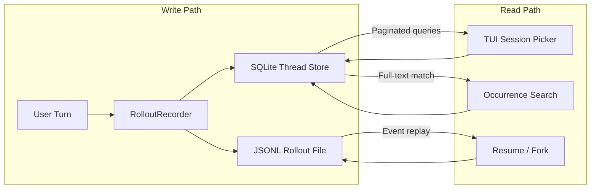
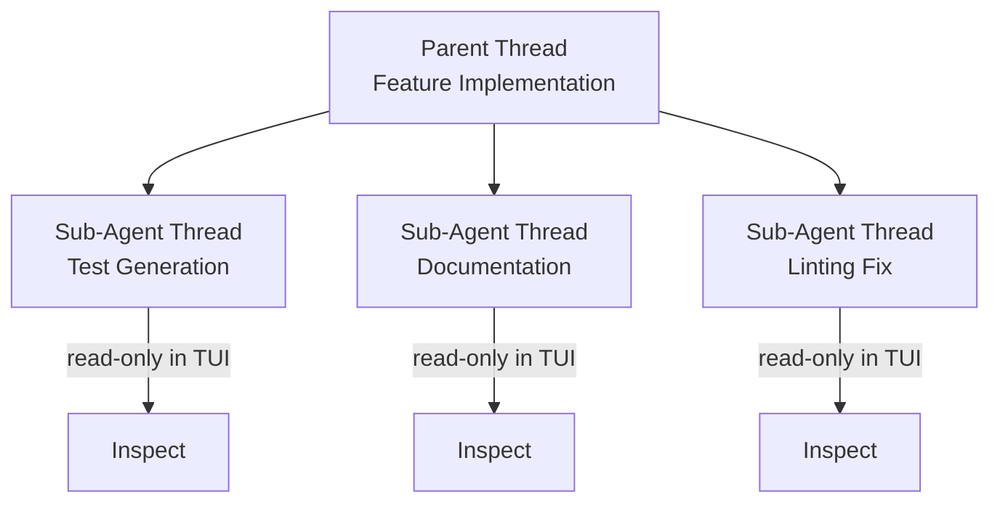
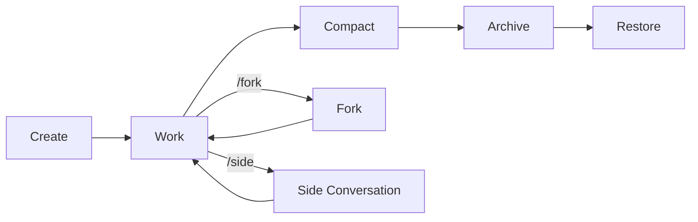

# Paginated Thread History: How Codex CLI Finally Made Session Resume Scale


---

Session management in AI coding agents has long been a bottleneck disguised as a feature. Every agent persists conversations, but few handle what happens when a developer accumulates hundreds of threads across weeks of work on multiple repositories. Codex CLI v0.145.0, released on 21 July 2026, shipped **experimental paginated thread history** — a ground-up rearchitecture of how sessions are stored, indexed, searched, and resumed [^1]. This article examines the technical decisions behind the feature and how to configure it for production workflows.

## The Problem with Flat Session Storage

Prior to v0.145.0, Codex CLI stored sessions as individual JSONL rollout files under `~/.codex/sessions/YYYY/MM/DD/`, with filenames like `rollout-2026-07-23T09-15-42-abc123.jsonl` [^2]. Each file contained the full conversation transcript: prompts, model responses, tool calls, tool results, and timestamps. A SQLite state database (`state_5.sqlite`) maintained a `ThreadMetadata` index for fast lookup of model usage, token counts, and git context [^3].

This worked adequately for individual sessions but degraded as usage scaled. The session picker (`/resume` in the TUI or `codex resume` from the terminal) loaded all thread metadata into memory. Developers with hundreds of threads experienced noticeable lag in the picker, and searching for a specific conversation required either remembering when it happened or scanning filenames manually.

GitHub Issue #21196 documented a related pain point: resumed-thread errors caused by missing rollout JSONL files when the SQLite index referenced threads whose backing files had been moved or cleaned up [^4]. The storage layer's two-source-of-truth design — SQLite for metadata, JSONL for content — created a fragile coupling.

## The v0.145.0 Architecture

The paginated thread history feature addresses these problems through several coordinated changes across PRs #32234, #33364, #33907, #34085, #34229, and #34386 [^1].

### SQLite as Primary Store

The headline change is materialising paginated thread history directly in SQLite (PR #32234) [^1]. Rather than treating the database purely as a metadata index over JSONL files, thread content is now queryable from the database itself. This enables:

- **Paginated listing** — the TUI fetches threads in batches rather than loading all metadata at once
- **Efficient count queries** — thread counts and token summaries without scanning the filesystem
- **Atomic metadata updates** — thread names, memory associations, and git context update transactionally

The JSONL rollout files remain the append-only source of truth for full replay. The `RolloutRecorder` continues writing `RolloutItem` variants (`EventMsg`, `ResponseItem`, `SessionMeta`) to JSONL, whilst the `LocalThreadStore` now synchronises a richer subset into SQLite for query purposes [^3].



### Copy-on-Write History Snapshots

PR #34390 introduced copy-on-write storage for history snapshots [^1]. When a thread is forked, the system no longer duplicates the entire JSONL file. Instead, the new thread references the parent's rollout up to the fork point and maintains its own append-only log from there. The `thread_spawn_edges` table in SQLite tracks parent-child lineage, enabling `list_thread_spawn_children` and `list_thread_spawn_descendants` for navigating fork trees [^3].

This is particularly relevant for developers who use `/fork` extensively to explore alternative approaches without losing the original conversation path.

### Reverse JSONL Scanning

PR #32246 added reverse scanning capability for session indexing [^1]. When rebuilding the SQLite index (for example, after a database corruption or migration), the system can scan JSONL files from the end rather than parsing every event from the start. Since session metadata is typically written at the beginning of the file and the most recent state is at the end, reverse scanning enables faster index reconstruction for large rollout files.

## Occurrence Search

The most immediately useful addition for daily workflows is occurrence search (PR #33907) [^1]. Previously, finding a specific conversation required either the `/resume` picker (which showed threads by date and working directory) or external tooling like `jq` over raw JSONL files.

Paginated thread history adds a search interface within the TUI that queries the SQLite store for matching content across all threads. The search supports bounded batch lookups — results are returned incrementally rather than blocking until all threads have been scanned [^1].

From the terminal, threads remain accessible via the standard session directory:

```bash
# List recent threads with their persisted names
codex resume

# Continue the most recent session from current directory
codex continue

# Continue a specific session by ID
codex continue <thread-id>

# Fork from the most recent session
codex fork --last
```

## Persisted Thread Names

PR #34229 added persistent thread naming [^1]. Threads can now be given human-readable names that survive process restarts and appear in the session picker. This replaces the previous pattern of identifying threads solely by timestamp and working directory.

Named threads make the session picker considerably more navigable when managing long-running feature branches or multi-day refactoring efforts.

## Sub-Agent Thread Preservation

The paginated history system integrates with Multi-Agent V2, which also stabilised in v0.145.0 [^1]. PR #34386 ensures that sub-agent threads are preserved in the paginated history alongside parent threads [^1]. Parent-owned sub-agent threads appear as read-only in the TUI (PR #33841), preventing accidental modification of a sub-agent's completed work whilst still allowing inspection [^1].

This matters for debugging multi-agent workflows. When a sub-agent produces an unexpected result, developers can now navigate directly to the sub-agent's thread, inspect its full conversation history, and understand exactly what the model saw and decided.



## Memory Consolidation

PR #34386 also brought memory consolidation support to paginated threads [^1]. Codex CLI's memories feature extracts key learnings from sessions and carries them forward to future conversations. With paginated history, memory extraction now operates over the SQLite store rather than re-parsing JSONL files, and imported memories from external agents (Cursor, Claude Code) via `/import` are tagged with scope and provenance metadata (PR #33444) [^5].

The memory consolidation pipeline preserves the distinction between project-scoped memories (relevant to a specific repository) and global memories (applicable across all sessions).

## History Modes and Migration

The system supports two history modes: `Legacy` and `Paginated`. The `canonical_history_mode_from_rollout_items` function ensures that resumed or forked sessions respect the mode established in the original rollout's `SessionMeta` [^3]. Sessions created before v0.145.0 continue to use the legacy path, whilst new sessions default to paginated mode.

PR #34085 added legacy view compatibility, ensuring that older sessions remain navigable through the new TUI without requiring migration [^1]. The `codex doctor` command now includes a thread inventory check that handles compressed rollouts and validates consistency between JSONL files and SQLite state [^1].

## Configuration Considerations

### Rollout Lineage

PR #34407 added rollout lineage resolution, enabling the system to trace a thread's history through forks and compactions [^1]. Ordinals added to paginated rollout records (PR #32332) provide deterministic ordering even when multiple events share the same timestamp [^1].

### Working Directory Persistence

Resumed sessions now remember the working directory from the original session rather than defaulting to the current directory [^1]. This prevents a common source of confusion where resuming a session from a different terminal location would cause tool calls to operate on the wrong directory.

### Security Note

⚠️ If Memories is disabled for security reasons — recommended when sessions touch untrusted repositories — memory consolidation from paginated history is also disabled. Review your Memories toggle before relying on cross-session context.

## The Session Lifecycle in v0.145.0

With paginated thread history, the Codex CLI session lifecycle now encompasses six stages:



Each stage is backed by the dual JSONL + SQLite storage layer, with the paginated history ensuring that navigation remains responsive regardless of the total number of accumulated threads.

## What This Means in Practice

The paginated thread history is marked experimental, but the architectural foundations — SQLite materialisation, copy-on-write forking, occurrence search — solve real scaling problems that affect any developer using Codex CLI as their primary coding agent across multiple projects.

The combination of persistent thread names, sub-agent thread inspection, and occurrence search transforms session management from a timestamp-guessing exercise into a navigable knowledge base of past development decisions. For teams running Codex CLI at scale, the paginated history also reduces the risk of the SQLite/JSONL consistency issues documented in earlier versions [^4].

---

## Citations

[^1]: [Release 0.145.0 · openai/codex — GitHub](https://github.com/openai/codex/releases/tag/rust-v0.145.0) — v0.145.0 release notes, 21 July 2026
[^2]: [Codex CLI Resume, Continue, and Save Chat Explained — Verdent Guides](https://www.verdent.ai/guides/codex-cli-resume-continue-save-chat) — session storage paths and resume commands
[^3]: [Session Resumption and Forking — DeepWiki openai/codex](https://deepwiki.com/openai/codex/4.4-session-resumption-and-forking) — architecture of RolloutRecorder, LocalThreadStore, SQLite schema
[^4]: [Data loss: resumed-thread errors due missing rollout JSONL files — GitHub Issue #21196](https://github.com/openai/codex/issues/21196) — pre-paginated storage consistency bug
[^5]: [Codex CLI Changelog — ChatGPT Learn](https://learn.chatgpt.com/docs/changelog) — /import expansion, external agent memory migration
