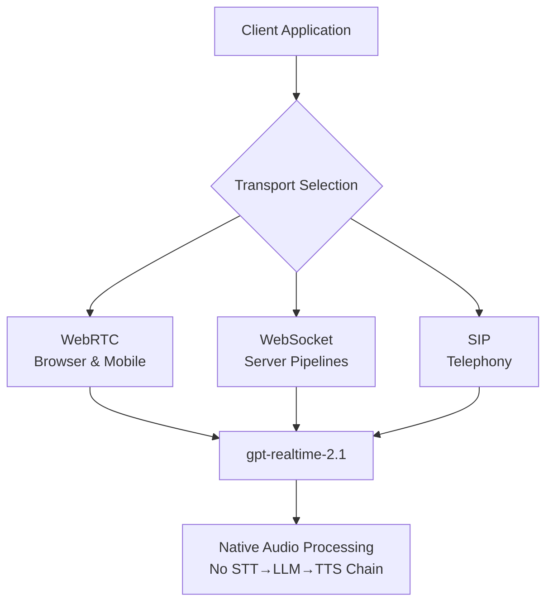
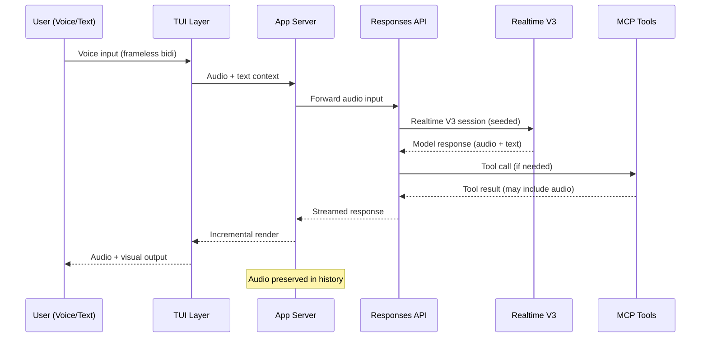

# From WebRTC V2 to Realtime V3: How Codex CLI's Audio Architecture Grew Up in v0.145.0


---

When Codex CLI v0.105.0 shipped native voice input in February 2026, it was little more than a push-to-talk transcription pipe bolted onto the agentic loop. Five months and forty releases later, v0.145.0 (21 July 2026) landed **Realtime V3 streaming** — a fundamentally different audio subsystem that treats voice as a first-class modality alongside text, images, and tool outputs[^1]. This article traces the architectural journey, examines the seven PRs that made V3 possible, and shows how to configure the new stack for daily development.

## The V2 Baseline

Codex CLI's second-generation voice system, shipped around v0.121.0, adopted WebRTC as its transport layer[^2]. The architecture was a three-layer sandwich:

1. **TUI audio capture** — microphone access via the terminal, typically through PortAudio or platform-native APIs.
2. **App-server session manager** — a local process managing the WebRTC peer connection, ICE negotiation, and session lifecycle.
3. **OpenAI Realtime API endpoint** — the remote `gpt-realtime-2` model processing audio natively without intermediate STT→LLM→TTS chaining[^3].

V2 worked, but it had sharp edges. Audio was ephemeral: once a voice turn was processed, the raw audio vanished from conversation history. Tool outputs were text-only — if the model called a tool during a voice session, the result came back as rendered text, breaking the conversational flow. And the session had to be established separately from the standard Responses API pipeline, meaning voice and text workflows diverged at the transport layer.

## What Changed in Realtime V3

The v0.145.0 release notes list "audio inputs and realtime V3 streaming" as a headline feature[^1]. Seven pull requests tell the full story:

| PR | Title | What It Does |
|---|---|---|
| #33261 | Add Frameless Bidi support for realtime conversations | Enables bidirectional audio streaming without fixed frame boundaries[^4] |
| #33856 | Stream realtime V3 Codex handoff output | Pipes V3 session output through the existing streaming renderer[^4] |
| #33923 | Add audio variants to user input protocols | Extends input message types to carry audio alongside text[^4] |
| #33932 | Forward audio inputs to the Responses API | Routes audio directly through the Responses API path, not just Realtime[^4] |
| #34067 | Seed realtime V3 sessions with initial text items | Bootstraps voice sessions with prior conversation context[^4] |
| #34080 | Add audio output support to dynamic tools and code mode | Tools and code execution can now return audio, not just text[^4] |
| #34385 | Preserve audio across history and tool outputs | Audio persists in conversation history for replay and context[^4] |

### Frameless Bidirectional Streaming

The most architecturally significant change is **frameless bidi** (PR #33261). V2's WebRTC transport operated on fixed audio frames — discrete chunks of audio data sent at regular intervals. Frameless bidi removes this constraint, allowing audio to flow as a continuous stream in both directions simultaneously[^4]. The practical effect is lower latency and more natural turn-taking, because the system no longer waits for frame boundaries to process speech.

### Audio as a First-Class Input Type

PR #33923 and #33932 together solve a fundamental limitation. Previously, voice input was handled exclusively by the Realtime API endpoint. Now, audio inputs can be forwarded directly to the **Responses API** — the same endpoint that handles text completions, tool calls, and structured outputs[^4]. This unification means a single conversation can mix text prompts, voice instructions, image attachments, and tool results without switching transport layers.

### Persistent Audio History

Perhaps the most user-visible change: PR #34385 ensures audio data persists across conversation history and tool outputs[^4]. In V2, if you asked a question by voice, the model processed it but the audio itself was discarded from the conversation state. In V3, audio turns are preserved, enabling:

- **Replay** — review what you actually said, not just the transcription.
- **Context continuity** — the model retains audio context when reasoning about follow-up turns.
- **Tool output integration** — tool results can carry audio data back into the conversation.

### Session Seeding with Text Context

PR #34067 addresses the cold-start problem[^4]. V2 voice sessions started fresh — if you had been working in text mode for twenty turns and then switched to voice, the Realtime session had no knowledge of prior context. V3 sessions can now be seeded with initial text items from the existing conversation, meaning the model understands what you have been working on when you start speaking.

## The Underlying Platform: OpenAI Realtime API in July 2026

Codex CLI's V3 builds on OpenAI's generally available Realtime API, which now supports three transport methods[^5]:



The primary model is **gpt-realtime-2.1**, which supports reasoning with configurable `reasoning.effort` (OpenAI recommends starting at `low` for voice agents)[^5]. Specialised variants include **gpt-realtime-translate** for live speech translation and **gpt-realtime-whisper** for real-time transcription with controllable latency[^5].

The GA release requires migration from beta integrations: the `OpenAI-Beta` header is gone, replaced by ephemeral client credentials via `POST /v1/realtime/client_secrets`[^5].

A significant latency improvement also landed in July 2026: OpenAI reported p95 latency reductions of at least 25% across Realtime voice models through improved caching[^6].

## Configuration

Voice configuration in Codex CLI lives under the `[realtime]` TOML table in `~/.codex/config.toml`[^2]:

```toml
[realtime]
type = "conversational"    # or "transcription" for dictation mode
voice = "alloy"            # voice selection for TTS output
reasoning_effort = "low"   # low | medium | high — latency vs quality

[realtime.v3]
frameless_bidi = true      # enable frameless bidirectional streaming
seed_with_history = true   # bootstrap voice sessions with text context
preserve_audio = true      # retain audio in conversation history
```

For transcription-only workflows — dictating task descriptions or commit messages — switch to `type = "transcription"`, which uses the Whisper-based pipeline without engaging the full conversational model[^2].

### Named Profiles for Voice Workflows

Named profiles let you maintain separate voice configurations:

```toml
[profiles.voice-review]
model = "gpt-5.6-terra"
reasoning_effort = "medium"

[profiles.voice-review.realtime]
type = "conversational"
voice = "echo"
```

Activate with `codex --profile voice-review` to enter a voice-optimised review session with a mid-tier model and medium reasoning effort.

## Architecture: How V3 Fits the Agentic Loop

The key architectural insight in V3 is that **audio is no longer a separate subsystem** — it is woven into the standard agentic loop:



The unification with the Responses API (PR #33932) is what makes this work[^4]. Rather than maintaining two parallel conversation states — one for text via the Responses API and one for voice via a dedicated Realtime connection — V3 routes everything through a single conversational pipeline. The Realtime V3 session acts as a specialised renderer within that pipeline, handling audio encoding and streaming, whilst the Responses API manages the broader conversation state including tool calls, structured outputs, and history.

## Audio in Tools and Code Mode

PR #34080 adds audio output support to **dynamic tools and code mode**[^4]. This means:

- An MCP tool can return audio data as part of its result (for example, a text-to-speech tool generating a pronunciation guide).
- Code execution output can include audio artifacts.
- The model can reference audio tool outputs in subsequent reasoning.

This is still early — ⚠️ the practical MCP ecosystem for audio-returning tools is nascent — but the plumbing is in place for tools that process, generate, or analyse audio.

## Performance Considerations

The v0.145.0 release also shipped significant **streaming performance improvements** that directly benefit voice workflows[^1]:

- **Incremental Markdown rendering** (PR #34045) — streamed output renders progressively rather than re-drawing the full buffer.
- **Reduced TUI redraws** (PR #34049) — redundant screen updates during streaming are eliminated.
- **Bounded command output** (PR #34359) — long command outputs are capped in the TUI to prevent rendering stalls.

These changes address a real problem: in V2, long voice sessions with interleaved tool calls could cause the TUI to lag as the conversation history grew. The incremental rendering pipeline in V3 keeps the interface responsive regardless of session length.

## V2 vs V3: What Changed

| Aspect | V2 (WebRTC) | V3 (Realtime V3) |
|---|---|---|
| Transport | Fixed-frame WebRTC | Frameless bidirectional streaming |
| API integration | Separate Realtime endpoint | Unified with Responses API |
| Audio history | Ephemeral — discarded after processing | Persistent — preserved across turns |
| Session context | Cold start — no prior conversation | Seeded with existing text history |
| Tool outputs | Text-only | Audio + text |
| Rendering | Full buffer redraw | Incremental streaming |

## What This Means for Your Workflow

V3 makes voice a viable **primary input modality** for agentic coding sessions, rather than an occasional convenience. The session seeding means you can start a text-based debugging session, switch to voice when you want to think aloud through an approach, and switch back to text for precise code edits — all within a single continuous conversation.

The persistent audio history also has implications for **team workflows**: if you are running Codex Remote (now GA as of June 2026[^7]) and directing work from a mobile device, the audio context travels with the session. A colleague picking up where you left off can replay your voice reasoning, not just read the transcription.

## What Is Still Missing

A few gaps remain — ⚠️ these are observations, not confirmed roadmap items:

- **Multi-agent audio routing**: V3 audio works within a single agent thread. Sub-agents spawned via the stabilised multi-agent V2 system do not inherit audio sessions.
- **Audio in AGENTS.md**: There is no mechanism to include audio instructions or constraints in project configuration files.
- **Offline audio**: All audio processing requires a live connection to the Realtime API. There is no local fallback.

## Citations

[^1]: OpenAI, "Codex CLI 0.145.0 Release Notes," GitHub Releases, 21 July 2026. [https://github.com/openai/codex/releases/tag/rust-v0.145.0](https://github.com/openai/codex/releases/tag/rust-v0.145.0)

[^2]: Daniel Vaughan, "Codex CLI Realtime Sessions: Voice Pair Programming, Transcription Mode, and the [realtime] Config," Codex Knowledge Base, 31 March 2026. [https://codex.danielvaughan.com/2026/03/31/codex-cli-realtime-sessions-voice-transcription/](https://codex.danielvaughan.com/2026/03/31/codex-cli-realtime-sessions-voice-transcription/)

[^3]: webrtcHacks, "How OpenAI does WebRTC in the new gpt-realtime," 2026. [https://webrtchacks.com/how-openai-does-webrtc-in-the-new-gpt-realtime/](https://webrtchacks.com/how-openai-does-webrtc-in-the-new-gpt-realtime/)

[^4]: OpenAI, Codex CLI v0.145.0 Release — PRs #33261, #33856, #33923, #33932, #34067, #34080, #34385, GitHub, July 2026. [https://github.com/openai/codex/releases/tag/rust-v0.145.0](https://github.com/openai/codex/releases/tag/rust-v0.145.0)

[^5]: OpenAI, "Realtime API Guide," OpenAI Developer Documentation, July 2026. [https://developers.openai.com/api/docs/guides/realtime](https://developers.openai.com/api/docs/guides/realtime)

[^6]: OpenAI, "GPT-Realtime-2.1-mini: Reasoning at Mini Price," July 2026. [https://explainx.ai/blog/openai-gpt-realtime-2-1-mini-reasoning-tool-use-api-2026](https://explainx.ai/blog/openai-gpt-realtime-2-1-mini-reasoning-tool-use-api-2026)

[^7]: ChatForest, "Codex Remote Goes GA: Phone-Directed Agents and DigitalOcean Cloud Workspaces," June 2026. [https://chatforest.com/builders-log/openai-codex-remote-ga-digitalocean-droplet-qr-pairing-phone-control-builder-guide/](https://chatforest.com/builders-log/openai-codex-remote-ga-digitalocean-droplet-qr-pairing-phone-control-builder-guide/)
