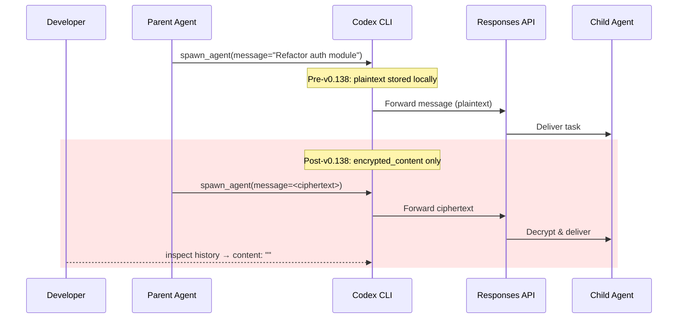
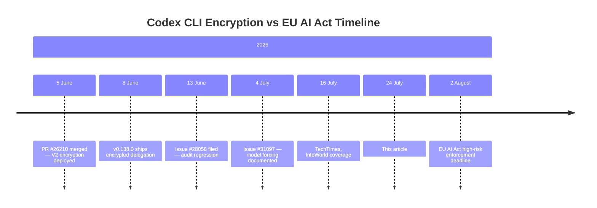
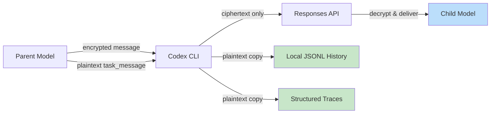

# The Encrypted Delegation Problem: Why Codex CLI's Multi-Agent V2 Hides What Your Sub-Agents Were Told — and What It Means for Enterprise Audit Trails


---

When OpenAI merged PR #26210 on 5 June 2026, Codex CLI gained a security feature that simultaneously created a governance hole [^1]. The pull request encrypted the `message` parameter passed between parent and child agents in Multi-Agent V2, storing only `InterAgentCommunication.encrypted_content` and leaving the plaintext `content` field empty [^2]. The receiving model's instructions are decrypted server-side by the Responses API — not on the developer's machine. The practical consequence: you can no longer answer the question *"what did the parent agent tell the sub-agent to do?"* from local history, traces, or rollout records.

This article examines the technical mechanism, the enterprise compliance implications — particularly with the EU AI Act's high-risk oversight deadline nine days away — and the concrete workarounds available today.

## How Multi-Agent V2 Delegation Works

Codex CLI's Multi-Agent V2 provides three inter-agent communication tools: `spawn_agent`, `send_message`, and `followup_task` [^2]. Prior to v0.138.0, these tools passed delegation text in plaintext through the `InterAgentCommunication` object. A developer could inspect local JSONL rollout history and see exactly what task was assigned, what context was forwarded, and what instructions the child received.



After PR #26210, the flow changed. The model returns an already-encrypted `message` parameter. Codex CLI forwards only the ciphertext. The `InterAgentCommunication` object stores `encrypted_content` with the payload but leaves `content` as an empty string [^2]. Decryption happens exclusively within OpenAI's infrastructure when the Responses API delivers the message to the child model [^3].

This is not end-to-end encryption in the conventional sense. OpenAI can read the instructions. The party excluded is the developer examining local artefacts [^4].

## The Model Forcing Problem

The encryption issue compounds with a configuration override problem documented in GitHub Issue #31097 [^5]. GPT-5.6 Sol and Terra — the two highest-tier models — are hard-coded to Multi-Agent V2 in the distributed model catalogue. Setting `multi_agent_v2 = false` in `config.toml` has no effect: the `model_info.multi_agent_version` metadata takes precedence over user configuration [^5].

The smaller GPT-5.6 Luna continues to use Multi-Agent V1, where delegation text remains plaintext and inspectable [^4]. This creates a paradox: the models most likely to be used for complex, multi-agent orchestration in production are precisely the ones that deny local audit access.

```toml
# config.toml — this setting is ignored for Sol and Terra
[model]
multi_agent_v2 = false  # Has no effect; model catalog overrides

# Workaround: custom model catalog override (from Issue #31097)
# Create ~/.codex/model_catalog.json with multi_agent_version = "v1"
```

Issue #27331 documents a related failure mode: enabling `multi_agent_v2` on certain account types triggered `spawn_agent encrypted-tools 400` errors on every turn, suggesting the encryption infrastructure was deployed before all account configurations could handle it [^6].

## What Disappears from the Audit Trail

The practical impact extends across four debugging and compliance surfaces:

1. **Rollout history** — The JSONL files that record each turn no longer contain readable delegation text. Post-mortem analysis of "why did the sub-agent do X?" becomes impossible without server-side logs you cannot access [^2].

2. **Trace reduction** — Structured traces used for performance analysis and token accounting lose the delegation context that explains *why* child threads were spawned [^2].

3. **Parent-side TUI** — The terminal interface shows child agent paths but not the readable task text that was assigned [^7].

4. **Custom agent profiles** — Issue #31097 documents that documented agent parameters (`model`, `reasoning_effort`, `sandbox_mode`) configured in `~/.codex/agents/` become inaccessible under forced V2, removing another governance surface [^5].

## The Enterprise Compliance Context

The timing is significant. The EU AI Act's Article 14 requires that high-risk AI systems be designed to allow humans to "properly understand the system's capabilities and limitations" and "be able to correctly interpret the high-risk AI system's output" [^8]. Article 12 mandates automatic logging capabilities that enable traceability [^9]. Full enforcement for high-risk systems activates on 2 August 2026 — nine days from this article's publication [^10].



Pareekh Jain of Pareekh Consulting observed that hidden instructions "reduce observability in multi-agent systems. Developers can no longer see whether failures stemmed from incorrect task delegation, poor orchestration, or model reasoning" [^3]. For regulated industries — banking, healthcare, critical infrastructure — the inability to produce a complete delegation audit trail is not merely inconvenient. It may constitute a compliance gap.

Enterprise AI agent governance frameworks in 2026 increasingly require that audit trails answer four questions: *Who authorised this? What context did the agent have? What did it decide? Was that consistent with policy?* [^11] Multi-Agent V2's encrypted delegation breaks the second and third questions for any locally-audited system.

## The Remizov Proposal: Encrypted Delivery, Plaintext Audit

Ignat Remizov, CTO at payment service Zolvat, filed GitHub Issue #28058 on 13 June 2026 with a detailed counter-proposal [^7]. The core insight is that encrypted delivery and local auditability are not mutually exclusive. His approach separates the concerns:

1. **Keep the encrypted `message` field** for model-to-model delivery — the child agent receives only ciphertext, decrypted server-side.
2. **Add a required plaintext companion field** (`task_message` for `spawn_agent`; consistently-named audit fields for `send_message` and `followup_task`) that persists in local history and traces.
3. **Reject empty plaintext values** at handler boundaries — ensuring the audit copy is always populated.
4. **Enforce an 8 KiB combined payload limit** per communication to bound storage costs.



Remizov's fork includes six commits demonstrating a configurable delivery policy with three modes: `encrypted` (current behaviour), `encrypted-with-audit` (encrypted delivery plus plaintext local copy), and `plaintext` (V1 behaviour) [^7]. The fork also implements multi-line task/response previews, parent-side task propagation, child history projection, and durable inter-agent transcript delivery.

OpenAI's response, per InfoWorld: the protocol "remains under development" [^3]. No timeline for addressing the audit regression has been provided as of 24 July 2026.

## How Claude Code Handles the Same Problem

The contrast with Claude Code is instructive. Anthropic's agent exposes sub-agent delegation through several mechanisms:

- A `--verbose-agents` flag outputs each delegation event, including the child agent spawned, the role assigned, and the task fragment received [^12].
- The flat message history serves as a complete audit trail — every decision, tool call, and result persists in sequence [^12].
- `SubagentStop` hooks fire when a sub-agent finishes, with `hookSpecificOutput.additionalContext` available to extend the turn with audit-trail context [^12].

This is not to claim Claude Code's approach is without trade-offs. Its sub-agent architecture uses separate context windows, which means delegation summaries may lose nuance. But the fundamental difference is that delegation *intent* remains locally inspectable.

## Practical Workarounds Today

Until OpenAI addresses Issue #28058, developers working with Multi-Agent V2 have several options:

### 1. Force V1 via Custom Model Catalogue

As suggested in Issue #31097 [^5], create a custom model catalogue that overrides `multi_agent_version` to `v1` for specific models:

```bash
# Create override catalogue
mkdir -p ~/.codex
cat > ~/.codex/model_catalog.json << 'EOF'
{
  "gpt-5.6-sol": {
    "multi_agent_version": "v1"
  },
  "gpt-5.6-terra": {
    "multi_agent_version": "v1"
  }
}
EOF
```

⚠️ This workaround may break if OpenAI deprecates V1 or if V2-only features are required.

### 2. Use Luna for Auditable Multi-Agent Work

GPT-5.6 Luna retains V1 plaintext delegation [^4]. For tasks where the audit trail matters more than peak reasoning capability, routing multi-agent workflows through Luna preserves local inspectability.

```toml
# config.toml — auditable multi-agent profile
[profiles.auditable]
model = "gpt-5.6-luna"
# Luna uses V1 with plaintext delegation
```

### 3. PreToolUse Hooks for Delegation Logging

Codex CLI's hook system can intercept `spawn_agent` calls before they execute. While the `message` field will contain ciphertext, the `task_name` and other unencrypted parameters can be logged:

```bash
#!/bin/bash
# .codex/hooks/pre-tool-use.sh
# Log delegation metadata (task_name is unencrypted)
if [ "$TOOL_NAME" = "spawn_agent" ]; then
    echo "[AUDIT] $(date -Iseconds) spawn_agent: task=$TASK_NAME" >> .codex/delegation.log
fi
```

### 4. AGENTS.md Delegation Constraints

Structure your `AGENTS.md` to require the parent agent to log delegation intent *before* spawning sub-agents:

```markdown
## Multi-Agent Rules

Before spawning any sub-agent:
1. Write a one-line delegation summary to `.codex/delegation-intent.md`
2. Include: task description, expected output, and scope boundaries
3. Only then call spawn_agent
```

This is a prompt-level mitigation — the model may not always comply — but it creates a parallel audit trail in the file system that the sandbox preserves.

## The Deeper Question: Who Owns the Audit Trail?

The encrypted delegation debate surfaces a fundamental tension in the architecture of AI coding agents. When orchestration moves from local to server-side, who controls the record of what happened?

Codex CLI's model — where the CLI is an open-source Rust binary but the intelligence runs on OpenAI's Responses API — means the audit trail naturally splits. Tool execution traces, file modifications, and shell commands remain local and inspectable. But the *reasoning* about what to delegate and why now lives exclusively in OpenAI's infrastructure.

For individual developers, this may be acceptable. For enterprises deploying multi-agent coding workflows in regulated environments — with the EU AI Act deadline now days away — the gap between "open-source client" and "opaque server-side orchestration" needs closing.

Remizov's encrypted-with-audit proposal offers a pragmatic middle path. Whether OpenAI adopts it, or something like it, will signal how seriously the platform treats enterprise governance as a first-class requirement rather than a post-hoc concern.

---

## Citations

[^1]: [Encrypt multi-agent v2 message payloads — PR #26210, openai/codex](https://github.com/openai/codex/pull/26210) — Merged 5 June 2026.
[^2]: [Regression: encrypted MultiAgentV2 messages remove readable task audit trail — Issue #28058, openai/codex](https://github.com/openai/codex/issues/28058) — Filed 13 June 2026 by Ignat Remizov.
[^3]: [Codex Multi-Agent V2 update raises developer concerns over agent transparency — InfoWorld](https://www.infoworld.com/article/4197328/codex-multi-agent-v2-update-raises-developer-concerns-over-agent-transparency.html) — July 2026.
[^4]: [OpenAI Codex Encrypts Agent Instructions, Stripping Developers of Audit Access — TechTimes](https://www.techtimes.com/articles/320784/20260716/openai-codex-encrypts-agent-instructions-stripping-developers-audit-access.htm) — 16 July 2026.
[^5]: [GPT-5.5 forces MultiAgentV2 despite disable and hides documented custom-agent controls — Issue #31097, openai/codex](https://github.com/openai/codex/issues/31097) — Filed 4 July 2026.
[^6]: [0.137.0: multi_agent_v2 enabled in config.toml breaks every turn with spawn_agent encrypted-tools 400 — Issue #27331, openai/codex](https://github.com/openai/codex/issues/27331)
[^7]: [Issue #28058 — Detailed proposal and fork implementation by Ignat Remizov](https://github.com/openai/codex/issues/28058) — Includes six demonstration commits with configurable delivery policy.
[^8]: [Article 14: Human Oversight — EU Artificial Intelligence Act](https://artificialintelligenceact.eu/article/14/)
[^9]: [EU AI Act Articles 12 & 13: Decision Traceability & Audit Compliance](https://aigovernancedesk.com/eu-ai-act-articles-12-13-decision-traceability/) — 2026.
[^10]: [EU AI Act Compliance 2026: What High-risk AI Systems Must Do Now — Salt Security](https://salt.security/eu-ai-act-compliance) — Enforcement deadline 2 August 2026.
[^11]: [AI Agent Governance and Compliance in 2026 — Zylos Research](https://zylos.ai/research/2026-05-01-ai-agent-governance-compliance-2026/)
[^12]: [Claude Code Subagents: A 2026 Practical Guide — Tembo.io](https://www.tembo.io/blog/claude-code-subagents) — Covers `--verbose-agents`, flat history audit trail, and SubagentStop hooks.
