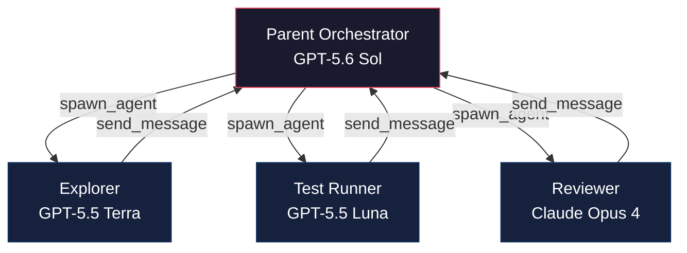
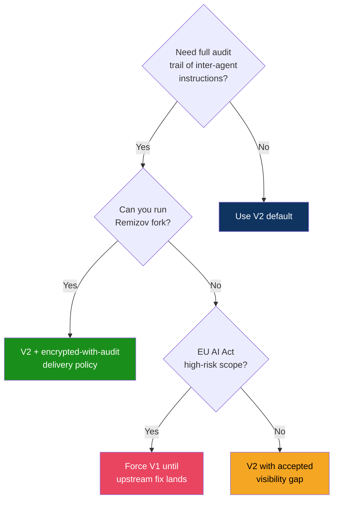
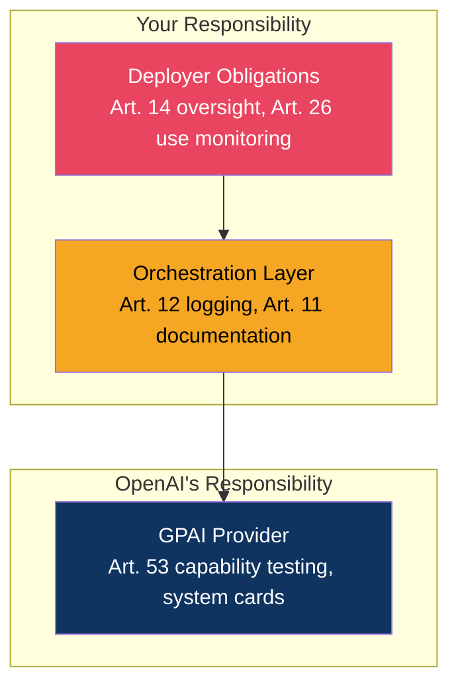

# The Multi-Agent V2 Governance Playbook: From Encrypted Delegation to Fleet Cost Control


---

Multi-Agent V2 shipped in Codex CLI v0.137.0 on 4 June 2026 and has since become the default orchestration protocol for GPT-5.5 and GPT-5.6 Sol sessions [^1]. The architecture is powerful — per-thread runtime routing, parallel sub-agent spawning, structured inter-agent messaging — but it arrived with governance gaps that enterprise teams are only now closing. Encrypted delegation hides what sub-agents were told [^2]. The hidden spawn schema prevents model overrides [^3]. Uniform Sol spawning has produced six-figure token incidents [^4].

This article synthesises the three governance surfaces — **transparency**, **cost control**, and **compliance** — into a unified framework. It draws on the encrypted delegation audit gap (PR #26210), the sub-agent model routing schema (Issues #31814 and #32031), and the EU AI Act's high-risk provisions enforceable from 2 August 2026 [^5].

## The V2 Architecture in Thirty Seconds

Multi-Agent V2 replaces V1's opaque thread IDs with path-based addressing and three structured messaging tools: `spawn_agent`, `send_message`, and `followup_task` [^1]. Each spawned sub-agent can carry its own model and provider choice rather than inheriting the parent's configuration [^6].



The critical governance implication: routing decisions now happen per-request rather than per-session, so each sub-agent thread generates independent ledger entries tracking model, provider, latency, and token consumption [^6].

## Pillar 1: Transparency — Fixing the Encrypted Delegation Gap

### The Problem

PR #26210, merged on 5 June 2026, introduced encrypted inter-agent communication as the default for V2 [^2]. The `InterAgentCommunication.encrypted_content` field is populated; the plaintext `content` field is left empty. The practical consequence: operators cannot inspect what instructions a parent agent passed to its sub-agents.

Issue #28058, raised by Ignat Remizov on 13 June 2026, documented the audit regression explicitly [^2]. Issue #31097, reported on 4 July 2026, confirmed that GPT-5.5 and Sol force V2 regardless of configuration overrides [^4].

### The Decision: V1 vs V2

Use this decision tree when choosing your multi-agent protocol version:



### Practical Mitigations

**Option A — Remizov fork.** Six commits implementing an `encrypted-with-audit` delivery policy that retains encrypted transport but logs plaintext to a local audit store [^2]. Not merged upstream as of v0.145.0.

**Option B — Force V1.** Add to your `config.toml`:

```toml
[features]
multi_agent_version = 1
```

⚠️ Note: Issue #31097 reports that GPT-5.5 and Sol override this setting server-side [^4]. Test thoroughly before relying on this in production.

**Option C — Gateway-level logging.** Route traffic through an AI gateway (Bifrost, LiteLLM, Portkey) that captures request and response payloads before encryption [^7]. This is currently the most reliable approach for enterprise audit trails.

## Pillar 2: Cost Control — Taming Uniform Sol Spawning

### The Problem

By default, `hide_spawn_agent_metadata` is set to `true` in V2 [^3]. Despite its innocuous name, this setting removes `model`, `reasoning_effort`, `agent_type`, and `service_tier` from the model-visible `spawn_agent` schema. The result: the orchestrator cannot specify a cheaper model for sub-agents, so every sub-agent inherits the parent's model.

A Sol orchestrator spawning six parallel sub-agents — all running Sol — produced a 380.9 million token session documented in Issue #31814 [^4]. At current pricing, that is roughly \$2,500 for a single task.

### The Fix: Three-Tier Model Layout

Expose the spawn schema and pin sub-agent models explicitly:

```toml
[agents]
enabled = true
default_subagent_model = "gpt-5.5-terra"
default_subagent_reasoning_effort = "medium"
max_concurrent_threads_per_session = 4

[features.multi_agent_v2]
enabled = true
hide_spawn_agent_metadata = false
tool_namespace = "agents"
```

Define purpose-built agent roles with model pinning:

```toml
[agents.explorer]
description = "Codebase navigation and search — fast, cheap"
config_file = "./agents/explorer.toml"

[agents.reviewer]
description = "Code review and security analysis — thorough"
config_file = "./agents/reviewer.toml"

[agents.runner]
description = "Test execution and result summarisation"
config_file = "./agents/runner.toml"
```

Each agent config file pins its model and reasoning effort:

```toml
# agents/explorer.toml
model = "gpt-5.5-luna"
reasoning_effort = "low"

# agents/reviewer.toml
model = "gpt-5.5-terra"
reasoning_effort = "high"

# agents/runner.toml
model = "gpt-5.5-luna"
reasoning_effort = "low"
```

### Cost Comparison

The three-tier layout dramatically reduces costs for typical orchestration sessions:

| Scenario | Token Cost (approx.) | Duration |
|----------|---------------------|----------|
| 6× Sol sub-agents (default) | \$12–25 per task | Fast |
| 3-tier Sol/Terra/Luna | \$2–5 per task | Comparable |
| Single Sol, no sub-agents | \$0.65–2.35 per task | Slower |

### Fleet Cost Dashboard

For teams running multiple developers, track cost attribution using the V2 `parent_thread_id` field exposed on spawned agents [^6]. Each sub-agent request generates independent ledger entries, enabling per-developer and per-role cost breakdowns through your gateway's analytics.

```toml
# Named profile for cost-conscious daily work
[profiles.daily]
model = "gpt-5.5-terra"

[profiles.daily.agents]
default_subagent_model = "gpt-5.5-luna"
default_subagent_reasoning_effort = "low"
max_concurrent_threads_per_session = 2

# Named profile for complex refactoring
[profiles.heavy]
model = "gpt-5.6-sol"

[profiles.heavy.agents]
default_subagent_model = "gpt-5.5-terra"
default_subagent_reasoning_effort = "medium"
max_concurrent_threads_per_session = 6
```

Switch profiles on launch: `codex --profile daily` or `codex --profile heavy`.

## Pillar 3: EU AI Act Compliance

The high-risk provisions of the EU AI Act become enforceable on 2 August 2026 [^5]. Most standard coding assistance falls outside Annex III high-risk classification, but multi-agent systems used for worker evaluation, task allocation, or safety-critical code generation may trigger full obligations [^8].

### Relevant Articles

| Article | Requirement | Multi-Agent V2 Implication |
|---------|-------------|---------------------------|
| Art. 11 | Technical documentation, 10-year retention | Document agent topology, model versions, config per deployment |
| Art. 12 | Automatic logging, 6-month minimum retention | Encrypted delegation breaks this without gateway logging |
| Art. 14 | Human oversight — ability to intervene or halt | `approval_policy = "on-request"` satisfies intervention requirement |
| Art. 50 | Transparency for AI-generated content | Pending Commission guidance for code generation |

### Compliance Checklist

1. **Classify your use case** against Annex III high-risk domains before 2 August 2026
2. **Enable gateway-level logging** — do not rely on V2's encrypted transport for audit compliance
3. **Set approval policy** to `on-request` or `writes` for high-risk deployments:

```toml
approval_policy = "on-request"

[auto_review]
policy = "Reject any tool call that modifies production infrastructure"
```

4. **Document agent topology** — record which models, reasoning efforts, and roles are configured per project
5. **Retain logs for 6+ months** — Article 12 mandates automatic recording with minimum retention [^8]
6. **Implement kill-switch** — Article 14 requires the ability to halt the system; `Ctrl+C` in interactive mode or the `/interrupt` command satisfies this for CLI sessions

### Responsibility Layers

Recitals 99 and 100 address multi-agent architectures explicitly: compliance at the GPAI provider level does not discharge the orchestration layer's obligations [^9]. In practical terms:



## Putting It All Together: The Governance Config

A complete governance-ready `config.toml` combining all three pillars:

```toml
# Governance-ready multi-agent V2 configuration
# Codex CLI v0.145.0+

model = "gpt-5.6-sol"
approval_policy = "on-request"

[agents]
enabled = true
default_subagent_model = "gpt-5.5-terra"
default_subagent_reasoning_effort = "medium"
max_concurrent_threads_per_session = 4
interrupt_message = true

[features.multi_agent_v2]
enabled = true
hide_spawn_agent_metadata = false
tool_namespace = "agents"

[auto_review]
policy = """
Reject tool calls that:
- Modify production infrastructure
- Access credentials or secrets
- Execute destructive operations without explicit user approval
"""

[agents.explorer]
description = "Codebase search and navigation"
config_file = "./agents/explorer.toml"

[agents.reviewer]
description = "Security review and code analysis"
config_file = "./agents/reviewer.toml"

[agents.runner]
description = "Test execution and summarisation"
config_file = "./agents/runner.toml"
```

## What Remains Unresolved

Three governance gaps remain open as of v0.145.0 (21 July 2026):

1. **Server-side V2 forcing** — GPT-5.5 and Sol sessions force V2 regardless of `multi_agent_version = 1` in config (Issue #31097) [^4]
2. **No upstream audit delivery policy** — Remizov's encrypted-with-audit fork has not been merged; encrypted delegation remains opaque by default [^2]
3. **ChatGPT auth complication** — ChatGPT-authenticated sessions handle sub-agent model overrides differently from API-authenticated sessions, creating inconsistent governance behaviour [^4]

Until these are resolved, gateway-level logging remains the most reliable path to enterprise-grade governance for Multi-Agent V2 deployments.

---

## Citations

[^1]: OpenAI, "Codex CLI v0.137.0 Release Notes — Multi-Agent Orchestration v2," GitHub Releases, 4 June 2026. [https://github.com/openai/codex/releases](https://github.com/openai/codex/releases)

[^2]: "The Encrypted Delegation Problem: Why Codex CLI's Multi-Agent V2 Hides What Your Sub-Agents Were Told," Codex Knowledge Base, 24 July 2026. [https://codex.danielvaughan.com/2026/07/24/codex-cli-multi-agent-v2-encrypted-delegation-auditability-gap-enterprise-compliance/](https://codex.danielvaughan.com)

[^3]: "Sub-Agent Model Routing in Multi-Agent V2," Codex Knowledge Base, 24 July 2026. [https://codex.danielvaughan.com/2026/07/24/codex-cli-sub-agent-model-routing-multi-agent-v2-hidden-schema-cost-control-configuration/](https://codex.danielvaughan.com)

[^4]: "GPT-5.6 Sol cannot specify subagent models, forcing all subagents to also be Sol instances," GitHub Issue #31814, openai/codex. [https://github.com/openai/codex/issues/31814](https://github.com/openai/codex/issues/31814)

[^5]: "The 2026 EU AI Act and AI-Generated Code: What Changes for Dev Teams," Augment Code, 2026. [https://www.augmentcode.com/guides/eu-ai-act-2026](https://www.augmentcode.com/guides/eu-ai-act-2026)

[^6]: "OpenAI Codex Multi-Agent v2 Per-Thread Runtime Routing: What Operators Need to Know," TheRouter.ai, 2026. [https://therouter.ai/news/openai-codex-multi-agent-v2-per-thread-runtime-routing/](https://therouter.ai/news/openai-codex-multi-agent-v2-per-thread-runtime-routing/)

[^7]: "OpenAI Codex in 2026: Workflows, Governance, and Multi-Provider Routing," Maxim AI, 2026. [https://www.getmaxim.ai/articles/openai-codex-in-2026-workflows-governance-and-multi-provider-routing/](https://www.getmaxim.ai/articles/openai-codex-in-2026-workflows-governance-and-multi-provider-routing/)

[^8]: "EU AI Act Compliance for AI Agents," AgentWorks, 2026. [https://agent-works.ai/insights/eu-ai-act-compliance-for-ai-agents](https://agent-works.ai/insights/eu-ai-act-compliance-for-ai-agents)

[^9]: "AI Agents Under EU Law," arXiv:2604.04604, April 2026. [https://arxiv.org/abs/2604.04604](https://arxiv.org/abs/2604.04604)
