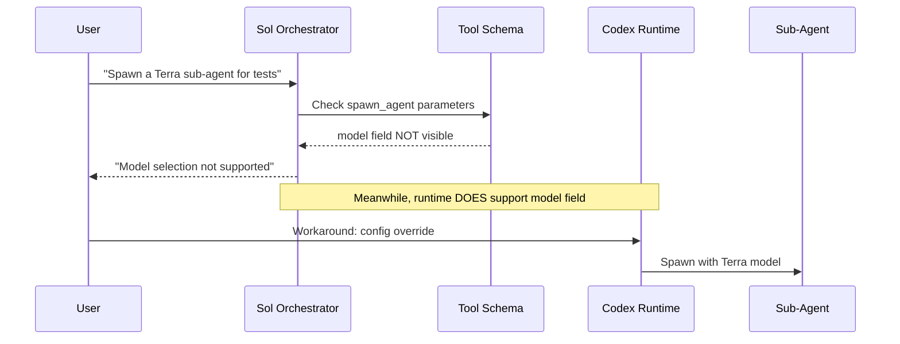
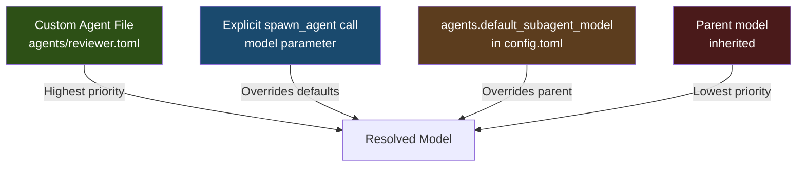

# Sub-Agent Model Routing in Multi-Agent V2: Why Your Sol Orchestrator Spawns Seven Copies of Itself — and How to Fix It


---

Codex CLI's Multi-Agent V2 architecture promises a clean division of labour: a heavyweight orchestrator breaks a problem into subtasks, spawns lighter sub-agents to handle each one, and merges the results. In theory, you run GPT-5.6 Sol for planning and GPT-5.6 Terra or Luna for execution, optimising both quality and cost.

In practice, if you have not touched your configuration, every sub-agent inherits the parent's model. One community member documented a Sol/high root that spawned seven Sol/high descendants, consuming **380.9 million tokens** in a single session — children forced to replay growing context while locked to the most expensive tier [^1]. This is not a bug in the traditional sense. It is a configuration default that silently strips the model-selection controls from the spawn interface.

This article explains the mechanism, the fix, and the configuration patterns that prevent it from happening again.

## The Hidden Schema Problem

Multi-Agent V2 introduced a configuration key called `hide_spawn_agent_metadata`. When set to `true` — which is the default — it removes four fields from the `spawn_agent` tool schema visible to the model [^2]:

- `model`
- `reasoning_effort`
- `agent_type`
- `service_tier`

The runtime still parses and applies these fields if they are present. But because the model never sees them in its tool definition, it cannot use them. When you ask your Sol orchestrator to "spawn a Terra sub-agent for this task", it confidently replies that model selection is not supported [^3]. It is wrong — but it has no way to know that.



This creates a compounding cost problem. Without explicit model routing, the orchestrator spawns sub-agents that inherit its own model and reasoning effort. Each sub-agent then operates at the same cost tier as the parent, consuming tokens at the Sol rate for tasks that would be perfectly served by Terra or Luna [^4].

## The Fork Behaviour Trap

A second default compounds the problem. When `fork_turns` is omitted from a `spawn_agent` call, V2 defaults to full-history forking. This means the sub-agent receives the parent's entire conversation history — and full-history forks explicitly reject override parameters including `model` [^5].

In V1, an omitted `fork_turns` with a model override would spawn a fresh agent. V2 changed this to an error, breaking the natural call pattern that developers had relied on.

The combined effect of these two defaults is:

1. The model cannot discover the model-override fields (hidden schema)
2. Even if the fields are manually injected, the default fork behaviour rejects them

## The Configuration Fix

The fix requires two keys in your `config.toml`. The location depends on scope:

| Scope | Path |
|-------|------|
| User-wide | `~/.codex/config.toml` |
| Project | `.codex/config.toml` (trusted projects only) |
| Profile | `~/.codex/<profile>.config.toml` |

```toml
[features]
multi_agent_v2 = true

[features.multi_agent_v2]
hide_spawn_agent_metadata = false
```

Setting `hide_spawn_agent_metadata` to `false` re-exposes the `model`, `reasoning_effort`, `agent_type`, and `service_tier` fields in the `spawn_agent` tool schema [^6]. The model can then see and use them.

⚠️ **Note:** As of v0.145.0, this configuration is recognised but labelled "under development" [^7]. Treat it as a supported workaround rather than a permanent API contract.

### Setting Default Sub-Agent Models

For consistent routing without per-spawn overrides, use the `[agents]` section:

```toml
[agents]
enabled = true
default_subagent_model = "gpt-5.6-terra"
default_subagent_reasoning_effort = "medium"
max_concurrent_threads_per_session = 4
```

This establishes Terra at medium reasoning as the baseline for all spawned agents. The orchestrator (Sol) retains its own model setting from the top-level `model` key [^8].

### Model Precedence Rules

Codex resolves sub-agent model selection through a strict precedence chain [^9]:



1. **Custom agent file** — if a `.codex/agents/<name>.toml` sets `model`, that wins
2. **Explicit spawn value** — the model passed directly in the `spawn_agent` call
3. **`agents.default_subagent_model`** — the configured default
4. **Parent's model** — inherited if nothing else is set

## Custom Agent Roles with Model Pinning

For teams that need repeatable, role-specific configurations, custom agent TOML files provide the most explicit control. Create a file at `.codex/agents/reviewer.toml`:

```toml
model = "gpt-5.6-terra"
model_reasoning_effort = "high"
sandbox_mode = "read-only"

[mcp_servers.sonarqube]
command = "npx"
args = ["-y", "@anthropic-ai/sonarqube-mcp"]
```

Then reference it in your project's `config.toml`:

```toml
[agents.reviewer]
description = "Code review specialist with SonarQube integration"
config_file = ".codex/agents/reviewer.toml"
```

The orchestrator can now spawn this role by name, and it will always use Terra at high reasoning effort regardless of the parent's model [^10].

### A Practical Three-Tier Layout

A cost-effective multi-agent setup for a typical development workflow:

```toml
# Root config.toml
model = "gpt-5.6-sol"
model_reasoning_effort = "high"

[agents]
default_subagent_model = "gpt-5.6-terra"
default_subagent_reasoning_effort = "medium"
max_concurrent_threads_per_session = 6

[agents.scout]
description = "Fast file discovery and codebase navigation"
config_file = ".codex/agents/scout.toml"

[agents.implementer]
description = "Feature implementation and code generation"
config_file = ".codex/agents/implementer.toml"

[agents.reviewer]
description = "Code review and test validation"
config_file = ".codex/agents/reviewer.toml"
```

With corresponding agent files:

```toml
# .codex/agents/scout.toml
model = "gpt-5.6-luna"
model_reasoning_effort = "low"
sandbox_mode = "read-only"
```

```toml
# .codex/agents/implementer.toml
model = "gpt-5.6-terra"
model_reasoning_effort = "medium"
```

```toml
# .codex/agents/reviewer.toml
model = "gpt-5.6-terra"
model_reasoning_effort = "high"
sandbox_mode = "read-only"
```

This routes Sol's token budget to planning and coordination, Terra to implementation and review, and Luna to fast read-only reconnaissance — a pattern that can reduce sub-agent token costs by 60–80% compared to uniform Sol spawning [^11].

## The ChatGPT Auth Complication

If you authenticate through ChatGPT rather than an API key, an additional constraint applies. The ChatGPT backend treats `collaboration.spawn_agent` as a reserved function and rejects schema deviations from the expected shape [^3]. This means local configuration changes to expose the hidden fields may be ignored by the backend.

The workaround for ChatGPT-authenticated users is to rely on `agents.default_subagent_model` in `config.toml` and custom agent files rather than per-spawn model overrides. The backend respects the configured defaults even when it rejects schema modifications [^12].

## Verification

After making configuration changes, verify the fix is active:

```bash
# Check your Codex version supports the configuration
codex --version
# Should be v0.144.0 or later

# Start a session and check the spawn_agent tool schema
# In the Codex TUI, the spawn_agent tool should now show
# model and reasoning_effort as optional parameters
```

You can also verify sub-agent model assignment by examining the thread list during a multi-agent session. Each sub-agent thread displays its assigned model in the `/threads` view [^13].

## What Should Change Upstream

The community consensus across Issues #31814, #32031, and #22250 is clear: `hide_spawn_agent_metadata` should default to `false` [^1] [^3] [^5]. The current default actively misleads both users and the model itself about the system's capabilities. The proposed patch (tested with 89 passing multi-agent tests) would restore V1 parity while preserving the option to hide metadata for deployments that genuinely need it [^3].

Until that lands, the configuration patterns in this article are the most reliable way to control sub-agent model routing in Multi-Agent V2.

---

## Citations

[^1]: GitHub Issue #31814 — "GPT-5.6 Sol cannot specify subagent models, forcing all subagents to also be Sol instances." [https://github.com/openai/codex/issues/31814](https://github.com/openai/codex/issues/31814)

[^2]: Codex CLI Configuration Reference — `agents` table and `hide_spawn_agent_metadata` key. [https://learn.chatgpt.com/docs/config-file/config-reference](https://learn.chatgpt.com/docs/config-file/config-reference)

[^3]: GitHub Issue #32031 — "Critical UX regression: multi-agent v2 spawn_agent hides model overrides and rejects the default call shape." [https://github.com/openai/codex/issues/32031](https://github.com/openai/codex/issues/32031)

[^4]: OpenAI Codex pricing — Sol, Terra, and Luna model tiers with differentiated token costs. [https://openai.com/pricing](https://openai.com/pricing)

[^5]: GitHub Issue #20077 — "MultiAgentV2 spawn_agent defaults to full-history fork, rejecting agent_type/model overrides." [https://github.com/openai/codex/issues/20077](https://github.com/openai/codex/issues/20077)

[^6]: Vikas Kapadiya — "Codex Subagent Models with multi_agent_v2." [https://kapadiya.net/blog/codex-subagent-model-config/](https://kapadiya.net/blog/codex-subagent-model-config/)

[^7]: Codex CLI v0.145.0 Release Notes — multi-agent V2 stabilisation with configurable sub-agent models. [https://github.com/openai/codex/releases/tag/rust-v0.145.0](https://github.com/openai/codex/releases/tag/rust-v0.145.0)

[^8]: Codex CLI Subagents documentation — model precedence and default_subagent_model. [https://learn.chatgpt.com/docs/agent-configuration/subagents](https://learn.chatgpt.com/docs/agent-configuration/subagents)

[^9]: Codex CLI Configuration Reference — model resolution precedence chain. [https://learn.chatgpt.com/docs/config-file/config-reference](https://learn.chatgpt.com/docs/config-file/config-reference)

[^10]: Codex CLI Custom Agent Definitions — building specialised subagents with TOML configuration. [https://codex.danielvaughan.com/2026/04/27/codex-cli-custom-agent-definitions-toml-specialised-subagents/](https://codex.danielvaughan.com/2026/04/27/codex-cli-custom-agent-definitions-toml-specialised-subagents/)

[^11]: OpenAI Community Forum — "Codex CLI can no longer spawn subagents with specific models or reasoning." [https://community.openai.com/t/codex-cli-can-no-longer-spawn-subagents-with-specific-models-or-reasoning/1386290](https://community.openai.com/t/codex-cli-can-no-longer-spawn-subagents-with-specific-models-or-reasoning/1386290)

[^12]: GitHub Issue #31097 — "GPT-5.5 forces MultiAgentV2 despite disable and hides documented custom-agent controls." [https://github.com/openai/codex/issues/31097](https://github.com/openai/codex/issues/31097)

[^13]: Codex CLI Sample Configuration — agents section with default_subagent_model. [https://developers.openai.com/codex/config-sample](https://developers.openai.com/codex/config-sample)
