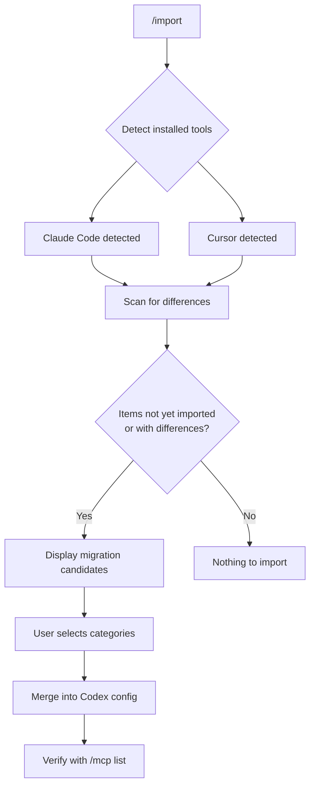
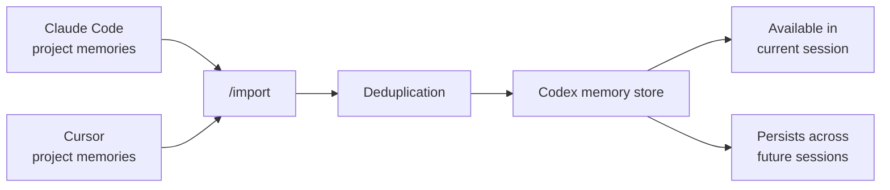

# The /import Expansion in v0.145: How Codex CLI Now Swallows Cursor and Claude Code Whole


---

When Codex CLI first shipped its `/import` command in v0.140.0, it could pull in Claude Code settings, skills, and session history [^1]. Useful, but limited — Cursor users were left to translate their configurations by hand, and project-scoped memories vanished in transit. With v0.145.0 (21 July 2026), `/import` expanded to cover both Cursor and Claude Code across six migration surfaces: settings, MCP servers, plugins, sessions, commands, and project-scoped memories [^2]. This article dissects the expanded command, maps the twelve configuration surfaces that matter, and offers concrete recipes for teams switching tools without losing their operational investment.

## What Changed in v0.145.0

The original `/import` (v0.140.0) handled Claude Code only. Four PRs in the v0.145.0 release (#31672, #33411, #33426, #33444) broadened the scope [^2]:

| Capability | v0.140 | v0.145 |
|---|---|---|
| Source tools | Claude Code only | Claude Code + Cursor |
| Settings migration | `settings.json` → `config.toml` | Plus Cursor's `settings.json` and workspace config |
| MCP servers | Claude Code format | Both JSON dialects (Claude Code, Cursor/VS Code) |
| Plugins | Claude Code marketplace | Both ecosystems |
| Sessions | Last 50 JSONL items, 30-day window | Same, plus Cursor session metadata |
| Slash commands | Claude Code custom commands | Both tool's command definitions |
| Project-scoped memories | Not supported | Full import with deduplication |

Project-scoped memories are the headline addition. Claude Code and Cursor both accumulate per-project context — learned preferences, naming conventions, architectural decisions — that previously died when you switched tools [^3]. v0.145 now migrates these into Codex CLI's memory store, preserving the agent's learned understanding of your codebase.

## How /import Works

The `/import` command is a TUI slash command, not a CLI subcommand. It runs only inside an embedded local TUI session — remote sessions and app-server daemon connections are excluded [^1].



The detection logic is selective: only items that Codex determines to be "not yet imported" or "has differences" are displayed [^1]. If you have already configured an MCP server with the same name, it will not appear as a candidate. Existing Codex settings are preserved — new values are merged additively rather than overwriting [^1].

## The Twelve Configuration Surfaces

Drawing on community migration guides and the official changelog, twelve distinct configuration surfaces affect a tool switch [^4]. They fall into three categories:

### Transfers Cleanly (5 Surfaces)

**1. Instruction files.** `CLAUDE.md` content maps directly to `AGENTS.md`. Codex rewrites Claude-specific terminology but preserves operational rules [^5].

**2. MCP servers.** The server definitions are structurally identical — command, arguments, environment variables. Only the container format changes: JSON to TOML, camelCase to snake_case [^6].

Cursor's `~/.cursor/mcp.json`:

```json
{
  "mcpServers": {
    "memory": {
      "command": "npx",
      "args": ["-y", "@modelcontextprotocol/server-memory"]
    }
  }
}
```

Becomes Codex's `~/.codex/config.toml`:

```toml
[mcp_servers.memory]
command = "npx"
args = ["-y", "@modelcontextprotocol/server-memory"]
```

**3. Skills.** Both tools follow the shared Agent Skills convention with `SKILL.md` files. These transfer directly [^4].

**4. Slash commands.** Reusable prompt-based commands migrate with minor re-authoring for Codex's command syntax.

**5. Custom endpoints.** API keys and endpoint URLs carry over into Codex's `model_providers` table [^4].

### Reshapes Required (4 Surfaces)

**6. Subagents.** Claude Code stores subagent definitions in `.claude/agents/*.md` (Markdown). Codex uses `.codex/agents/*.toml` with structured `name`, `description`, and `developer_instructions` keys [^4]:

```toml
# .codex/agents/reviewer.toml
name = "reviewer"
description = "Code review specialist"
developer_instructions = """
Review changes for correctness, style consistency,
and potential security issues. Flag but do not fix.
"""
```

**7. Settings.** Claude Code's `settings.json` maps to Codex's `config.toml` plus the profiles structure. The `/import` command primarily converts `env` and `sandbox.enabled` values [^1]. Other settings need manual mapping.

**8. Hooks.** Claude Code's hook events (`PreToolUse`, `PostToolUse`, `SessionStart`, `Stop`, `PreCompact`, `PostCompact`) convert from JSON arrays to `[[hooks.*]]` TOML arrays [^4]. Synchronous command hooks transfer; async handlers and conditional groups are skipped [^1].

**9. Permissions.** Claude Code's per-command permission allowlist becomes Codex's coarser sandbox tiers (`workspace-write`, `read-only`) and `approval_policy` settings [^4]. Fine-grained permissions need manual redesign using Codex's permission profiles.

### Breaks (3 Surfaces)

**10. ConfigChange hook.** No Codex event equivalent exists. Teams relying on this for dynamic reconfiguration need an alternative approach [^4].

**11. Output styles.** Codex does not model this feature. Custom formatting preferences from Claude Code are lost [^4].

**12. Non-OpenAI models.** Vanilla Codex authenticates against OpenAI only. If your Claude Code setup used Anthropic models directly, you need a custom `model_provider` gateway pointing to an OpenAI-compatible proxy [^4]:

```toml
[model_providers.anthropic-gateway]
base_url = "https://your-gateway.example.com/v1"
api_key_env = "ANTHROPIC_GATEWAY_KEY"
```

## Cursor-Specific Migration Notes

Cursor migration introduces wrinkles that Claude Code users will not encounter. Cursor stores MCP configuration in two locations — user-level (`~/.cursor/mcp.json`) and workspace-level (`.vscode/mcp.json`) — and the workspace-level config takes precedence [^6]. The `/import` command scans both, but project-level overrides need verifying after import.

For Cursor users with Streamable HTTP MCP servers (rather than stdio), an additional step is required. Codex's MCP transport expects stdio by default, so HTTP servers need the `mcp-proxy` bridge [^6]:

```bash
pip install mcp-proxy
```

```toml
[mcp_servers.web-search]
command = "mcp-proxy"
args = [
  "--transport=streamablehttp",
  "https://api.example.com/mcp/search"
]
env = { "AUTHORIZATION" = "Bearer ${WEB_SEARCH_KEY}" }
```

After import, verify connectivity:

```bash
codex mcp list
```

A `Tools: (none)` result indicates authentication or connection failure [^6]. Check environment variable expansion and ensure any required API keys are set in your shell environment.

## Project-Scoped Memories

The most significant v0.145 addition is memory migration. Both Cursor and Claude Code accumulate project-scoped memories — the agent's learned understanding of your codebase conventions, preferred patterns, and past decisions [^3]. Previously, switching tools meant the new agent started from zero context.

The `/import` command now reads these memories and writes them into Codex CLI's memory store with deduplication. If a memory already exists with equivalent content, it is skipped rather than duplicated. The imported memories become available immediately in the current session and persist across future sessions [^2].



⚠️ Memory fidelity is not guaranteed. Memories that reference tool-specific features (e.g., Claude Code's `TodoWrite` tracking or Cursor's composer history) may not map meaningfully to Codex's operational model. Review imported memories with `/memories list` after import.

## Practical Migration Workflow

For teams managing a migration, this sequence minimises disruption:

```bash
# 1. Ensure you're on v0.145.0+
codex --version

# 2. Start a fresh Codex TUI session in your project root
cd /path/to/project
codex

# 3. Run /import — select all applicable categories
/import

# 4. Verify MCP servers connected
codex mcp list

# 5. Check imported memories
/memories list

# 6. Validate AGENTS.md was created correctly
cat AGENTS.md

# 7. Run codex doctor to confirm environment health
codex doctor
```

For multi-repository teams, repeat the process in each project root. Project-scoped memories and instructions are per-directory; global settings (MCP servers, plugins, model configuration) need importing only once from `~/.codex/config.toml`.

## Limitations

Several constraints remain in the v0.145 implementation:

- **No remote session support.** The `/import` command requires a local embedded TUI session. Remote sessions and app-server daemon connections cannot run imports [^1].
- **Session history cap.** Only the most recent 50 session items updated within the past 30 days are imported [^1]. Older history is not migrated.
- **Web-only sessions excluded.** Chat history from claude.ai or Cursor's web interface cannot be imported — only local session data [^1].
- **Hook fidelity.** Claude Code's richer hook model (conditional groups, async handlers) has no Codex equivalent. Complex hook chains need manual redesign [^4].
- **One-directional.** There is no `/export` command. Migration is into Codex, not out of it.

## What This Means for the Agent Wars

The expanded `/import` is a deliberate competitive move. By lowering the switching cost from Cursor and Claude Code to near zero, OpenAI removes the strongest lock-in mechanism those tools possess: accumulated configuration and context [^7]. For teams evaluating coding agents, the practical advice is straightforward: invest in portable formats (SKILL.md, standard MCP server definitions, AGENTS.md-style instruction files) regardless of which tool you use today. The agents are converging on shared conventions, and the tools that make migration easiest will win the next round of adoption.

---

## Citations

[^1]: "I tried importing Claude Code's settings and chat history using /import added in Codex CLI 0.140.0," DevelopersIO (Classmethod), 2026. [https://dev.classmethod.jp/en/articles/codex-cli-import-from-claude-code/](https://dev.classmethod.jp/en/articles/codex-cli-import-from-claude-code/)

[^2]: "Release 0.145.0," OpenAI Codex GitHub Releases, 21 July 2026. [https://github.com/openai/codex/releases/tag/rust-v0.145.0](https://github.com/openai/codex/releases/tag/rust-v0.145.0)

[^3]: "Cross-Tool Agent Memory: MemPalace, Built-In Memory, and the Portability Problem," Codex Knowledge Base (danielvaughan.com), 2026. [https://codex.danielvaughan.com/2026/04/17/cross-tool-agent-memory-mempalace-portability/](https://codex.danielvaughan.com/2026/04/17/cross-tool-agent-memory-mempalace-portability/)

[^4]: "Migrate Claude Code to Codex (2026): 12 Configs, 1 Dead End," ofox.ai, 2026. [https://ofox.ai/blog/migrate-claude-code-to-codex-2026/](https://ofox.ai/blog/migrate-claude-code-to-codex-2026/)

[^5]: "The Codex CLI Agent Migration System: Importing Sessions, Skills, and Configuration from Claude Code and Other Agents," Codex Knowledge Base (danielvaughan.com), 2026. [https://codex.danielvaughan.com/2026/05/13/codex-cli-agent-migration-system-import-claude-code-sessions-skills-config/](https://codex.danielvaughan.com/2026/05/13/codex-cli-agent-migration-system-import-claude-code-sessions-skills-config/)

[^6]: "How to Migrate MCP Servers from Cursor to Codex," Mehmet Baykar, 2026. [https://mehmetbaykar.com/posts/how-to-migrate-mcp-servers-from-cursor-to-codex/](https://mehmetbaykar.com/posts/how-to-migrate-mcp-servers-from-cursor-to-codex/)

[^7]: "Codex Updates by OpenAI — July 2026," Releasebot, 2026. [https://releasebot.io/updates/openai/codex](https://releasebot.io/updates/openai/codex)
