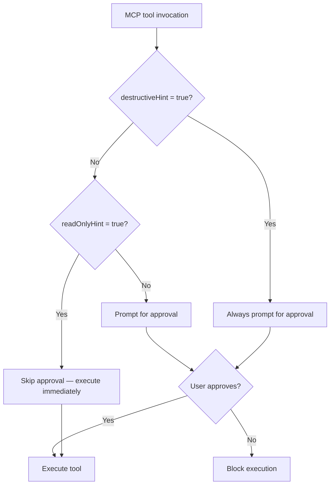
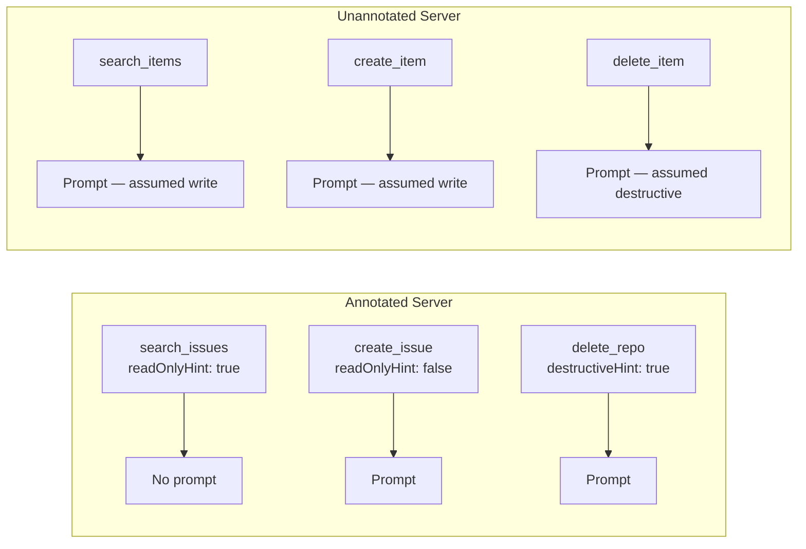

# The Writes Mode: How Codex CLI's Newest Approval Tier Uses MCP Annotations to Let Reads Fly and Gate Writes


---

Until v0.144.0, Codex CLI's app-tool approval system offered two positions: interrupt everything (`prompt`) or interrupt only risk-hinted actions (`auto`). If you ran MCP servers that mixed search endpoints with mutation endpoints — a database connector, say, or a project-management integration — you either lived with constant approval popups for harmless reads, or you silenced approvals for writes you genuinely wanted to review.

The `writes` app-approval mode, merged in PR #30482 on 7 July 2026 [^1], eliminates that trade-off. It reads the MCP tool annotation `readOnlyHint` and uses it as a runtime gate: tools that declare themselves read-only execute without interruption; everything else triggers an approval prompt. This article examines how the mode works, how it fits into Codex CLI's two-layer security model, and how to configure it for daily use.

## The Problem: All-or-Nothing App Trust

Codex CLI's security architecture separates *capability* (what the sandbox permits) from *consent* (when the agent must ask) [^2]. The sandbox layer — Landlock on Linux, Seatbelt on macOS, restricted tokens on Windows — enforces hard boundaries at the kernel level [^3]. The approval layer determines how often a human sees a prompt.

For shell commands and file edits, this model works well: `workspace-write` plus `on-request` gives you frictionless local development with guardrails. But MCP tools operate at a higher abstraction. A single MCP server might expose `search_issues` (read-only), `create_issue` (write), and `delete_repository` (destructive). The previous `auto` and `prompt` modes treated all of these uniformly within a server, forcing users to choose between workflow speed and write oversight.

## How the Writes Mode Works

The `writes` mode slots into the `AppToolApproval` enum alongside `auto` and `prompt` [^1]. Its decision logic is straightforward:



Three rules govern the behaviour:

1. **Destructive annotations override everything.** If a tool sets `destructiveHint = true`, approval is mandatory regardless of other hints [^4]. This prevents a tool from declaring itself simultaneously read-only and destructive to bypass the gate.

2. **Read-only tools skip approval.** When `readOnlyHint = true` and no destructive annotation is present, the tool executes without prompting [^1].

3. **Unannotated tools are treated as writes.** The conservative default means that MCP servers that haven't adopted annotations still trigger approval prompts, preserving safety for legacy integrations.

A fourth, subtler rule: the `writes` mode **disables session and persistent approval choices** [^1]. In `auto` mode, approving a tool once can suppress future prompts for the same tool within a session. In `writes` mode, every write-capable invocation prompts afresh. This prevents a single "yes" from becoming a blanket pass for subsequent mutations.

## MCP Tool Annotations: The Risk Vocabulary

The `writes` mode relies on the MCP specification's tool annotation system, introduced in the 2025-03-26 revision [^5]. Four boolean properties form the risk vocabulary:

| Annotation | Default | Meaning |
|---|---|---|
| `readOnlyHint` | `false` | Tool does not modify its environment |
| `destructiveHint` | `true` | Tool may perform irreversible changes |
| `idempotentHint` | `false` | Repeated calls produce the same result |
| `openWorldHint` | `true` | Tool interacts with systems beyond its host |

The defaults are deliberately conservative [^5]. An unannotated tool is assumed destructive and externally reaching, which means Codex CLI treats it as requiring approval. This design choice pushes MCP server authors to declare annotations explicitly — unlocking better approval ergonomics for their users.

For server authors, marking read-only tools is trivial. In a FastMCP-style Python server:

```python
@server.tool(
    name="search_issues",
    annotations={
        "readOnlyHint": True,
        "destructiveHint": False,
        "openWorldHint": True,
    }
)
async def search_issues(query: str) -> list[dict]:
    """Search project issues by keyword."""
    return await issue_tracker.search(query)
```

And in a TypeScript MCP server:

```typescript
server.tool({
  name: "search_issues",
  annotations: {
    readOnlyHint: true,
    destructiveHint: false,
    openWorldHint: true,
  },
  handler: async ({ query }) => issueTracker.search(query),
});
```

## Configuring the Writes Mode

The `writes` mode applies to app and connector tools — the MCP integrations configured in your `config.toml` or via the app server. It is distinct from the top-level `approval_policy`, which governs shell commands and file operations.

### Per-App Configuration

```toml
[apps._default]
default_tools_approval_mode = "writes"
```

This sets `writes` as the default for all connected apps [^1]. Individual apps can override:

```toml
[apps.github]
default_tools_approval_mode = "auto"    # trust GitHub tools fully

[apps.database]
default_tools_approval_mode = "writes"  # gate database mutations
```

### Combining with Approval Policy and Sandbox

The `writes` mode complements — not replaces — the two-layer security model. A sensible daily-driver configuration pairs it with workspace-write sandboxing and on-request shell approvals:

```toml
# Shell and file operations
sandbox_mode = "workspace-write"
approval_policy = "on-request"

# App/MCP tool operations
[apps._default]
default_tools_approval_mode = "writes"
```

This gives you:

- **Shell commands**: execute freely within the workspace; prompt when reaching outside it
- **File edits**: allowed within the workspace boundary without prompting
- **MCP reads** (search, list, query): execute without prompting
- **MCP writes** (create, update, delete): prompt every time

### CI/CD Considerations

In non-interactive pipelines, `writes` mode is inappropriate — there's nobody to approve. Use `auto` or `never` with appropriate sandbox constraints instead:

```toml
# CI/CD: automated, sandboxed
sandbox_mode = "workspace-write"
approval_policy = "never"

[apps._default]
default_tools_approval_mode = "auto"
```

## The Annotation Gap: What Happens When Servers Don't Declare Hints

The `writes` mode's effectiveness depends on MCP servers shipping accurate annotations. As of July 2026, adoption is growing but uneven. The MCP community has filed five Specification Enhancement Proposals for new annotation types [^5], signalling active development, but many community servers still ship without any annotations at all.

When a tool lacks annotations, Codex CLI falls back to the specification defaults: `destructiveHint = true`, `readOnlyHint = false` [^5]. In `writes` mode, this means the tool triggers an approval prompt — the safe default.



The practical takeaway: if you maintain MCP servers used with Codex CLI, adding annotations is the single highest-leverage improvement you can make to your users' approval experience. It costs minutes to implement and eliminates dozens of unnecessary prompts per session.

## Writes Mode vs. Guardian Auto-Review

For teams running `approvals_reviewer = "auto_review"`, the `writes` mode stacks cleanly. Guardian auto-review evaluates approval requests for data exfiltration, credential probing, and destructive actions [^6]. With `writes` mode active, Guardian only sees write-capable tool invocations — read-only tools never reach the reviewer queue. This reduces Guardian's workload and speeds up sessions where most MCP interactions are reads.

## When to Use Each Mode

| Mode | Read-only tools | Write tools | Unannotated tools | Best for |
|---|---|---|---|---|
| `auto` | Execute | Execute (unless risk-hinted) | Execute | Trusted servers, CI/CD |
| `writes` | Execute | Prompt | Prompt | Mixed read/write servers |
| `prompt` | Prompt | Prompt | Prompt | Maximum oversight |

The `writes` mode occupies the sweet spot for developers who connect MCP servers that expose both query and mutation endpoints — database connectors, issue trackers, deployment tools, cloud consoles. You get the speed of unrestricted reads with the safety of gated writes.

## Practical Recommendations

1. **Adopt `writes` as your default app-approval mode.** It's the most balanced option for interactive development with MCP integrations.

2. **Annotate your MCP servers.** If you maintain servers, mark every read-only tool with `readOnlyHint: true` and `destructiveHint: false`. The investment is minimal; the approval-friction reduction is significant.

3. **Pair with workspace-write sandboxing.** The `writes` mode gates MCP mutations, while `workspace-write` gates filesystem and network access. Together, they provide comprehensive coverage without excessive prompting.

4. **Don't use `writes` in CI/CD.** Non-interactive pipelines need `auto` or `never`. The `writes` mode will block waiting for a human that isn't there.

5. **Watch the annotation gap.** When a new MCP server produces unexpected approval prompts, check whether it ships tool annotations. Missing annotations default to write-assumed behaviour.

## Citations

[^1]: zamoshchin-openai, "[codex-rs] Add writes app approval mode," GitHub Pull Request #30482, openai/codex, merged 7 July 2026. [https://github.com/openai/codex/pull/30482](https://github.com/openai/codex/pull/30482)

[^2]: OpenAI, "Agent approvals & security," Codex CLI Documentation, 2026. [https://learn.chatgpt.com/docs/agent-approvals-security](https://learn.chatgpt.com/docs/agent-approvals-security)

[^3]: Blake Crosley, "Codex CLI Guide 2026: Setup, Sandbox, AGENTS.md & MCP," 2026. [https://blakecrosley.com/guides/codex](https://blakecrosley.com/guides/codex)

[^4]: OpenAI, "Agent approvals & security — destructive annotation handling," Codex CLI Documentation, 2026. [https://learn.chatgpt.com/docs/agent-approvals-security](https://learn.chatgpt.com/docs/agent-approvals-security)

[^5]: Model Context Protocol Blog, "Tool Annotations as Risk Vocabulary: What Hints Can and Can't Do," 16 March 2026. [https://blog.modelcontextprotocol.io/posts/2026-03-16-tool-annotations/](https://blog.modelcontextprotocol.io/posts/2026-03-16-tool-annotations/)

[^6]: Daniel Vaughan, "Codex CLI Guardian Approval: Configuring Auto-Review Policies," Codex Knowledge Base, 20 April 2026. [https://codex.danielvaughan.com/2026/04/20/codex-cli-guardian-approval-configuring-auto-review-policies/](https://codex.danielvaughan.com/2026/04/20/codex-cli-guardian-approval-configuring-auto-review-policies/)
