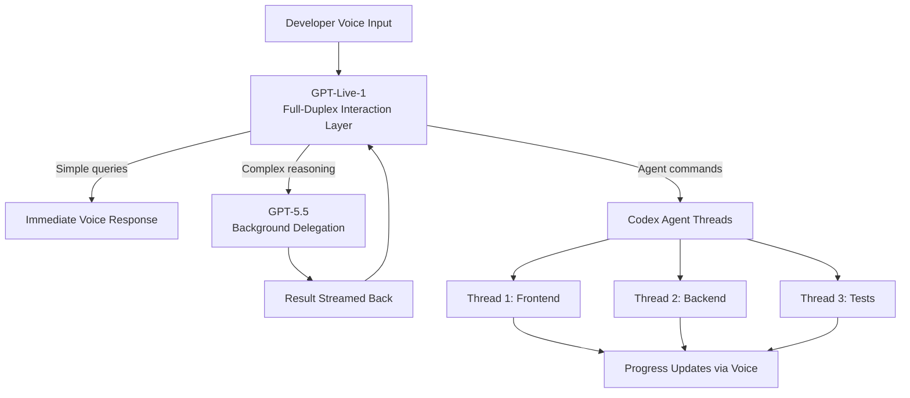
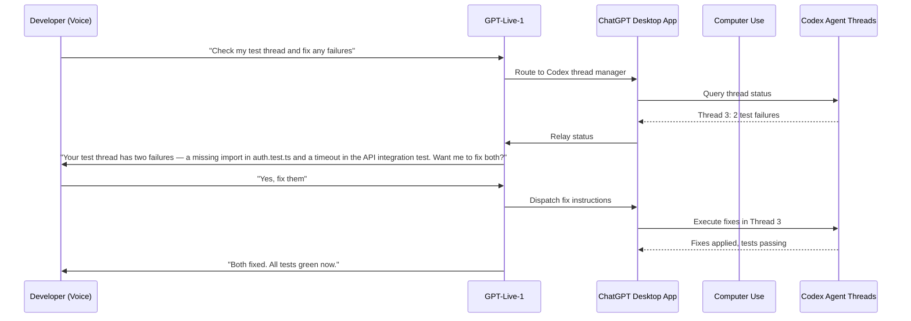

# Hands-Free Agent Orchestration: How GPT-Live Brings Full-Duplex Voice Control to Codex on the Desktop

---

On 23 July 2026, OpenAI began rolling out ChatGPT Voice on the desktop app — macOS and Windows — powered by GPT-Live[^1]. The headline capability: you can now control your computer and direct multiple agents running in ChatGPT Work or Codex using nothing but your voice[^2]. This is not a dictation feature. It is a full-duplex conversational layer that listens, speaks, and coordinates agent work simultaneously. For developers who have spent the past six months learning to orchestrate multi-agent coding sessions through text, voice changes the control plane entirely.

## What GPT-Live Actually Is

GPT-Live launched on 8 July 2026 as a replacement for Advanced Voice Mode[^3]. The architectural shift is fundamental. Advanced Voice Mode was half-duplex — rigid turn-taking where one side spoke while the other waited. GPT-Live is **full-duplex**: it processes input and output simultaneously, producing natural conversational cues ("mhmm", "yeah") while you speak and handing complex reasoning tasks to GPT-5.5 in the background without audible gaps[^4].

The system is a two-layer design:

1. **Interaction layer** — GPT-Live-1 (or GPT-Live-1 mini), a voice-native model optimised for real-time conversational flow.
2. **Delegation layer** — GPT-5.5 running asynchronously, handling web searches, deep reasoning, and multi-step analysis while the voice layer keeps the conversation alive[^4].

This decoupling is deliberate. Rather than building a monolithic voice model that tries to be both conversationally fluid and deeply intelligent, OpenAI split the problem so either layer can be upgraded independently[^4].

## Voice Meets Multi-Agent Coordination

The desktop integration is not merely "voice chat in a new window." It connects GPT-Live to the full Codex agent stack — Computer Use, local files, plugins, Git operations, and critically, multi-agent thread management[^5].

### Starting and Steering Threads by Voice

From a single voice conversation, you can[^6]:

- **Start separate threads** for longer tasks ("Start a new Codex thread to refactor the authentication module")
- **Check existing threads** ("What's the status of my backend thread?")
- **Send follow-up instructions** ("Tell the frontend thread to switch from Tailwind to vanilla CSS")
- **Summarise progress** ("What are the current blockers across all my active threads?")

Each spoken instruction maps to the same underlying Codex primitives that text commands use — the voice layer is a control surface, not a separate execution engine.

### Screen Context Integration

On macOS, voice mode combines with Appshots. When screen context is enabled, ChatGPT Voice can take an appshot of your frontmost window — capturing both the visible screenshot and accessible text via macOS Accessibility APIs, including content scrolled out of view[^6][^7]. This means you can say "Look at this error" while staring at a terminal, and the voice layer receives both your spoken context and the structured content of the window.

## The Developer Workflow Shift

The practical impact is a move from **sequential interaction** to **ambient orchestration**. Consider a typical multi-agent session before voice:

1. Type a prompt to start a frontend thread.
2. Switch context, type a prompt for the backend thread.
3. Alt-tab to check thread one's progress, read the output.
4. Type corrections.
5. Repeat.

With voice, the same workflow becomes conversational:

> "Start a frontend thread using the design mockup in Figma. While that's running, create a backend thread to build the API endpoints from the OpenAPI spec in the project root. Let me know when either hits a blocker."

You continue writing code, reviewing a PR, or drinking your coffee. GPT-Live interrupts when something needs your attention — a failing test, an approval request, a design question — and you respond without leaving your current context.

VentureBeat described this as ushering in "hands-free software development," noting that developers can "orchestrate multi-threaded coding jobs, review pull requests, and debug applications using natural voice commands"[^8].

## Architecture: How Voice Commands Reach Agents

The desktop voice integration builds on several existing Codex subsystems:

The voice layer sits above the existing agent infrastructure. It does not bypass sandbox permissions, approval flows, or the writes-mode gating introduced in v0.144.0[^9]. If an agent action requires approval, GPT-Live asks you verbally rather than silently proceeding.

## Activation and Configuration

### Getting Started

Voice mode is available to Plus, Pro, Business, Edu, and Enterprise subscribers on macOS and Windows[^1]. Activation requires:

1. Open ChatGPT desktop app.
2. Select **Start new voice chat** before sending a message, or use the configured hotkey[^6].
3. Grant microphone access on first use.

### Hotkey Configuration

A custom hotkey can be set via **Settings → Voice → Voice chat hotkey**[^6]. This allows launching voice mode from any context without switching to the ChatGPT window first.

### Constraints

- Only one voice chat operates at a time across the entire app[^6].
- Voice conversations consume a separate usage allowance measured in rolling five-hour windows, distinct from Codex token budgets[^6].
- The 60-second Appshots thread-routing rule applies: consecutive appshots within 60 seconds of prior thread interaction join that thread automatically[^7].

## Codex CLI: Where Does Voice Stand?

The CLI side of the house took its own path. Codex CLI v0.145.0 (21 July 2026) shipped **Realtime V3 streaming** with audio inputs and tool outputs supporting common local formats[^10]. This is the lower-level audio subsystem — WebRTC-based, running in the terminal — distinct from the desktop GPT-Live integration.

The CLI can resume threads containing voice content but cannot currently generate new appshots[^7]. For developers who work exclusively in the terminal, the CLI's Realtime V3 provides direct voice interaction with the agentic loop, whilst the desktop GPT-Live layer offers the higher-level orchestration surface.

| Capability | Codex CLI (Realtime V3) | Codex Desktop (GPT-Live) |
|---|---|---|
| Voice input | Push-to-talk / streaming | Full-duplex, always listening |
| Multi-agent coordination | Text-based thread management | Voice-directed thread control |
| Screen context | N/A | Appshots + Accessibility APIs |
| Background reasoning | Direct model calls | GPT-5.5 delegation |
| Computer Use integration | Limited | Full |
| Platform | macOS, Linux, Windows | macOS, Windows |

## The Competitive Landscape

No other major coding agent has shipped voice interaction at this level in 2026[^11]. The landscape as of late July:

- **Claude Code** — terminal-only, text-based. No voice mode. Anthropic's focus remains on deep autonomous reasoning and 1M-token context windows rather than interaction modality[^11].
- **GitHub Copilot** — IDE extension with text chat. Voice is not part of the Copilot CLI or agent surface[^11].
- **Cursor** — chat sidebar, image attachments, background agents with video logs. No voice interaction[^12].
- **Google Gemini Code Assist** — text prompts only[^11].

OpenAI frames voice as a "competitive advantage" in a crowded market[^13]. The strategic logic is straightforward: if voice makes multi-agent orchestration materially easier, developers who adopt it become more productive on the Codex platform specifically — increasing switching costs through workflow habit rather than data lock-in.

## What This Means for Enterprise

The enterprise angle is significant. Codex now has over 10 million weekly active users across Codex and ChatGPT Work, up from 5 million when the products merged on 9 July 2026[^13]. Voice control lowers the barrier to agent adoption for developers who find text-based multi-agent orchestration cognitively expensive.

For enterprise deployments on Business and Enterprise plans, voice also introduces new considerations:

- **Ambient listening** — full-duplex mode means the microphone is active during the session. Organisations with strict audio-recording policies will need to evaluate this against their data-handling agreements.
- **Approval flows by voice** — when agents request permission to execute destructive operations, verbal approval replaces the click-to-confirm pattern. This is faster but harder to audit than a timestamped button press. ⚠️ It is unclear whether voice approvals are logged with the same fidelity as text-based ones.
- **Usage budgets** — voice conversations consume a separate five-hour rolling allowance[^6]. Teams running heavy voice sessions may find this limit constraining, particularly during extended pair-programming or debugging marathons.

## Looking Ahead

GPT-Live on the desktop is the first step in what appears to be a broader ambient-computing strategy. OpenAI has confirmed the same voice technology powers a forthcoming in-home speaker device[^13]. The pattern is clear: voice becomes the universal control surface, and specific agent capabilities (coding, work, browsing) are plugged in beneath it.

For developers, the immediate question is whether voice-directed agent orchestration is genuinely more efficient than text, or merely more accessible. The answer likely depends on the task. Checking thread status, redirecting agents, and approving actions — high-frequency, low-complexity interactions — are natural fits for voice. Writing detailed technical specifications or crafting precise regex patterns will remain text territory.

The developers who benefit most will be those who treat voice as a **complementary control plane** rather than a replacement: text for precision, voice for orchestration, and the full-duplex architecture ensuring neither blocks the other.

---

## Citations

[^1]: OpenAI (@OpenAI), "ChatGPT Voice is now in the desktop app," X/Twitter, 23 July 2026. [https://x.com/OpenAI/status/2080378182469857576](https://x.com/OpenAI/status/2080378182469857576)

[^2]: OpenAI Developer Community, "ChatGPT Voice is now in the desktop app," 23 July 2026. [https://community.openai.com/t/chatgpt-voice-is-now-in-the-desktop-app/1388031](https://community.openai.com/t/chatgpt-voice-is-now-in-the-desktop-app/1388031)

[^3]: MarkTechPost, "OpenAI Releases GPT-Live and GPT-Live-1 mini: Full-Duplex Voice Models That Delegate Deeper Reasoning to GPT-5.5," 8 July 2026. [https://www.marktechpost.com/2026/07/08/openai-releases-gpt-live-and-gpt-live-1-mini-full-duplex-voice-models-that-delegate-deeper-reasoning-to-gpt-5-5/](https://www.marktechpost.com/2026/07/08/openai-releases-gpt-live-and-gpt-live-1-mini-full-duplex-voice-models-that-delegate-deeper-reasoning-to-gpt-5-5/)

[^4]: BuildFastWithAI, "GPT-Live Review: OpenAI's Full-Duplex Voice Model Explained (July 2026)." [https://www.buildfastwithai.com/blogs/gpt-live-review-openai-voice-model-july-2026](https://www.buildfastwithai.com/blogs/gpt-live-review-openai-voice-model-july-2026)

[^5]: 9to5Mac, "OpenAI updating ChatGPT desktop app with GPT Voice for talking through work," 23 July 2026. [https://9to5mac.com/2026/07/23/openai-updating-chatgpt-desktop-app-with-gpt-voice-for-talking-through-work/](https://9to5mac.com/2026/07/23/openai-updating-chatgpt-desktop-app-with-gpt-voice-for-talking-through-work/)

[^6]: OpenAI Developers, "ChatGPT Voice," ChatGPT Learn documentation. [https://learn.chatgpt.com/docs/features/voice](https://learn.chatgpt.com/docs/features/voice)

[^7]: Kingy AI, "Appshots: Inside OpenAI Codex's New Command-Command Trick for macOS," 2026. [https://kingy.ai/news/appshots-inside-openai-codexs-new-command-command-trick-for-macos/](https://kingy.ai/news/appshots-inside-openai-codexs-new-command-command-trick-for-macos/)

[^8]: VentureBeat, "Agentic coding goes hands-free as OpenAI brings GPT-Live's full duplex voice control to Codex and ChatGPT on the desktop," July 2026. [https://venturebeat.com/orchestration/agentic-coding-goes-hands-free-as-openai-brings-gpt-lives-full-duplex-voice-control-to-codex-and-chatgpt-on-the-desktop](https://venturebeat.com/orchestration/agentic-coding-goes-hands-free-as-openai-brings-gpt-lives-full-duplex-voice-control-to-codex-and-chatgpt-on-the-desktop)

[^9]: OpenAI, Codex CLI v0.144.0 release notes, "writes app-approval mode," 9 July 2026. [https://github.com/openai/codex/releases](https://github.com/openai/codex/releases)

[^10]: OpenAI, Codex CLI v0.145.0 release notes, 21 July 2026. [https://github.com/openai/codex/releases/tag/rust-v0.145.0](https://github.com/openai/codex/releases/tag/rust-v0.145.0)

[^11]: DevToolLab, "Best CLI AI Coding Agents in 2026." [https://devtoollab.com/blog/top-cli-ai-coding-agents](https://devtoollab.com/blog/top-cli-ai-coding-agents)

[^12]: Cursor Community Forum, "Screenshot-based UI annotations that feed into chat context," 2026. [https://forum.cursor.com/t/screenshot-based-ui-annotations-that-feed-into-chat-context-antigravity-style/143548](https://forum.cursor.com/t/screenshot-based-ui-annotations-that-feed-into-chat-context-antigravity-style/143548)

[^13]: Fortune, "OpenAI debuts ChatGPT Voice, bringing its most advanced voice capabilities to the ChatGPT desktop app," 23 July 2026. [https://fortune.com/2026/07/23/openai-launches-chatgpt-voice-desktop-programming/](https://fortune.com/2026/07/23/openai-launches-chatgpt-voice-desktop-programming/)
